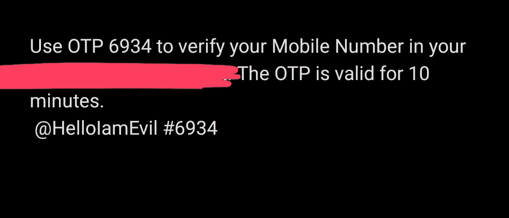

# 我是如何从 target 发送短信并获得他们的动态口令的。

> 原文：<https://infosecwriteups.com/how-i-was-able-to-send-sms-from-target-and-get-their-otp-6252bcc2ac9d?source=collection_archive---------0----------------------->

嘿，各位黑客和臭虫猎人们，

同样，我不能透露目标的名字。所以目标被称为 target.com。

我注册了，去了账号设置。在那里我看到手机号码需要验证。

我以为我可以绕过 OTP 验证。但是我不能绕过验证。但是对 OTP 发送功能的 post 请求有些不切实际。因为在 post 请求中，一个参数直接反映在 sms 中

> 内容-处置:形式-数据；name= "域名"
> 
> 子目标在
> ———8631 . 486868686667

所以，我想，如果我改变这个，并重新发送，我把它改为议会！！！它反映了。

因此，现在我将更改内容以进入 evil.com 的动态口令，这导致了获取动态口令的网络钓鱼攻击。

感谢您阅读这篇文章！！

请关注我，获取更多关于寻找 bug 的文章

在 Instagram 上关注我:[https://www.instagram.com/ram_0x_infosec/](https://www.instagram.com/ram_0x_infosec/)

在 Linkedin 上联系我:[https://www.linkedin.com/in/ram0xinfosec/](https://www.linkedin.com/in/ram0xinfosec/)