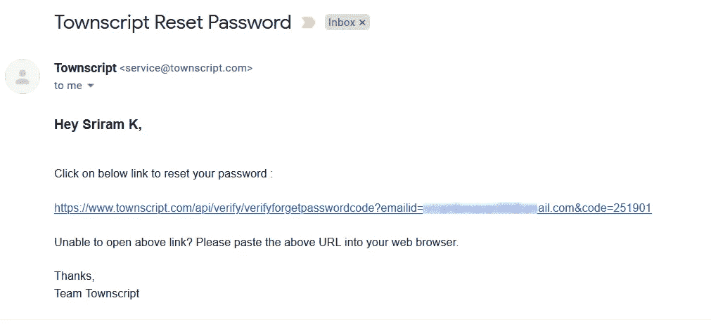
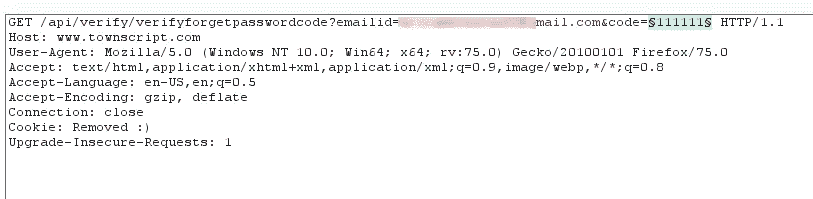
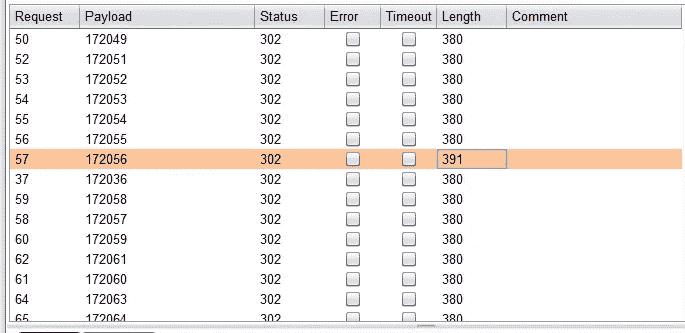
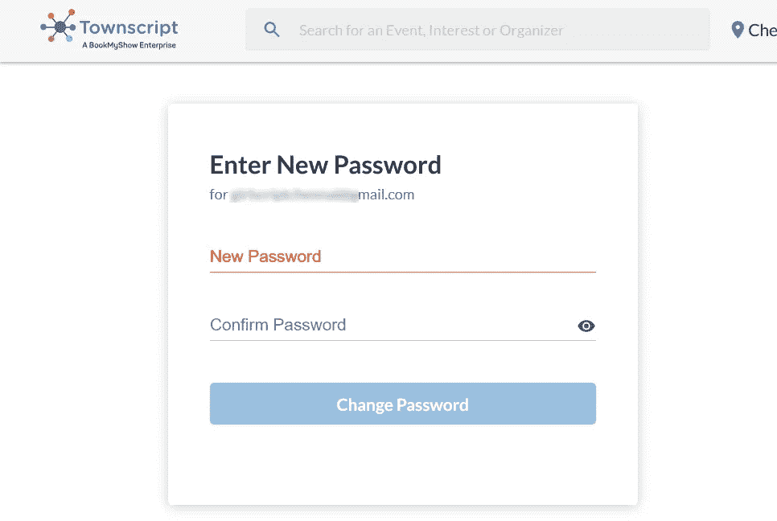
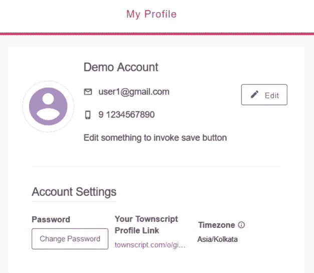
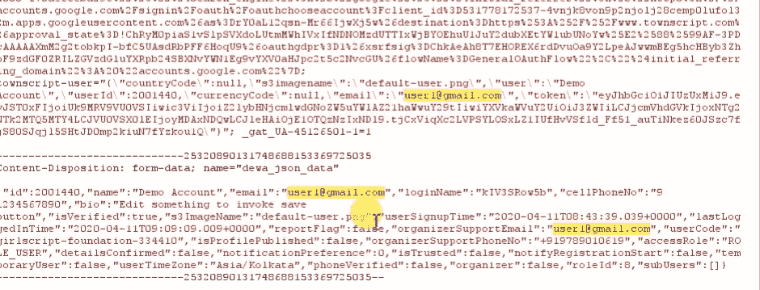
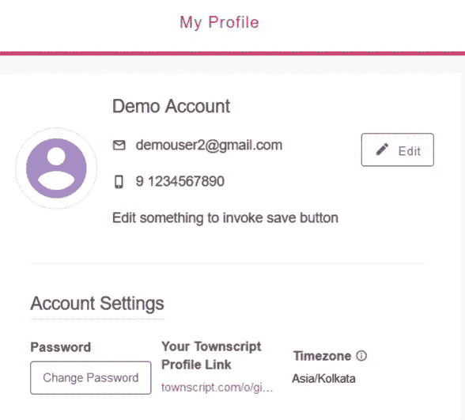

# 我是如何从一个票务门户网站窃取数百万数据和金钱的。

> 原文：<https://infosecwriteups.com/how-i-was-able-to-steal-millions-of-data-and-money-from-a-ticketing-portal-65036cb9f8d2?source=collection_archive---------0----------------------->

Townscript

*不熟悉 townscript 的人，这是一个为活动经理提供在线售票的售票平台，在 27 个国家运营，于 2017 年被 BookMyShow 收购* [*。*](https://www.livemint.com/Companies/3DyBjWWN6o5Ciqnpq2eUVK/Bookmyshow-picks-up-75-stake-in-Townscript.html)

我们计划在印度各地举办名为 [Letshack](https://www.instagram.com/letshack_foundation/) 的黑客训练营，所以我们决定在网上出售活动门票。我们正在快速销售我们的活动门票，突然之间，我无法访问我用来登录 townscript 的邮件 ID，而且我几乎忘记了我的密码。已经有超过 500 人注册了我们的活动“ [Letshack](https://instagram.com/letshack_foundation) ”，该活动预计将在几周内举行，但我无法获得参与者的姓名、邮件 ID 和电话号码。但我从未放弃。因此，我注册了一个新帐户，并决定就此问题向 townscript help 发送一封邮件。

后来我决定为什么我不能进入应用程序来访问我的帐户，我接下来做的是…

绘画作品。

首先，我尝试了 SQL 注入，因此我可以向 townscript 官员报告这一情况，以引起他们对我的注意，并尽快取回我的帐户。我很无聊，所以我决定去简单的…

简单！！！

所以我试着登录页面和注册页面，检查是否有任何可能让我进入的漏洞。后来我去了忘记密码的页面，发现那里没有速率限制，以后可以用来轰炸别人的邮件…哈哈哈；)

再次，我开始分析我在新邮件 ID 上收到的忘记密码的邮件。这个人太简单了，就像下面这样。

Townscript 重置密码邮件

> https://www . townscript . com/API/verify/verifyelestopasswordcode？email id = user @ Gmail . com & code = XXXXXX

发送的链接非常简单，它有两个参数，后跟一个很长的 URL，即 *emailid* 和*代码。*我开始觉得有些蹊跷，于是我用我没有权限的旧邮件 id 替换了 *emailid* 参数，但是没有用。不，等等，我们有另一个参数*代码*，它有一个六位数。

嗯…有意思…

我决定对*代码*参数❤.进行强力操作我点燃了我的 burpsuite，捕获了链接请求，并将请求转发给入侵者。

请求发送给入侵者。

经过长时间的等待，我决定不带任何信心地分析结果。当我检查状态代码时，所有的请求都是 302，被重定向到 404 未找到页面。我真的放弃了。但是我见过很多人检查响应长度。所以，我决定过滤长度，我震惊地发现一个请求的长度比其他的都长。

入侵结果

我将响应转发给了浏览器。我意识到，我可以通过强制使用 code 参数为我的新帐户设置一个新密码。哇哦。！！

密码重置页面

我在我的旧帐户上使用了同样的方法，通过请求一个我无法访问的帐户的忘记的密码，我成功地通过强制使用*代码*参数接管了我自己的帐户，最重要的是，我能够访问我的参与者数据…感觉像一个完全的黑客，接管自己的帐户难道不是一种乐趣吗？

表示目的！

我走向仪表板，更改我的邮件 ID。**但是 townscript 有其他想法来摧毁我:(**

我无法更改帐户上的邮件，这意味着即使你成功接管了某人的帐户，你也无法更改邮件 ID 并完全接管帐户。帐户的所有者可以通过简单地请求新的密码重置链接来更改密码。

邮件更改前的帐户

但我有其他想法，我前往设置并做了一些更改，以再次保存配置文件，并决定通过拦截它们来分析请求。

通过请求发送的邮件 ID。

通过请求我发现邮件 ID 也被发送了，我试着用一个新的改变我的邮件 ID 并转发了请求。令我惊讶的是，我还可以通过拦截请求来更改邮件 ID。Ewwww 错误的实现。

邮件 ID 已更改。

尽管该应用程序不允许我更改我的邮件 id，但我能够拦截请求并更改我的邮件 ID，这使得帐户所有者无法在他的旧邮件 ID 上请求忘记的密码。很明显，通过这种方法，我可以侵入任何人在 Townscript 上的帐户，我只需要找到用户的邮件 ID。我称之为完全接管账户。参考视频，如果你没得到，视频[链接这里](https://www.youtube.com/watch?v=sJ2xtI2WLe8&t)

# 吸取教训！

花一些时间分析密码重置邮件，尝试用可能的编码方法解码字符&即使你接管了一些组织的帐户，他们也不允许你更改邮件 ID，这可能会影响你的奖金。因此，尝试通过拦截请求来更改邮件 ID 的方法。

# 时间线:

【2019 年 8 月:向 townscript 报告问题。

【2019 年 9 月:与关系人关联。

【2019 年 11 月:由 townscript 首席技术人员通过电话确认。只有一句谢谢。:)

【2019 年 12 月:决定向上写。

【2020 年 4 月:写完发表！！

# 检查我最近写的！！

 [## 印度最大的视频分享网站 OTP Bypass。

### 我已经很久没有发表任何文章了，我会继续发表一些关于我最近最好的发现。

medium.com](https://medium.com/bugbountywriteup/otp-bypass-on-indias-biggest-video-sharing-site-e94587c1aa89) 

如果你喜欢这个，写下来鼓掌👏(50X)，那我们来连线:

**推特:**https://twitter.com/sriramoffcl

**insta gram:**[https://instagram.com/sriram_offcl](https://instagram.com/sriram_offcl)

**领英:**[https://www.linkedin.com/in/sriramkesavan](https://www.linkedin.com/in/sriramkesavan)

[**邮箱:**](https://medium.com/@sriram_offcl/paypal.me/sri123)sriramkesavan98@gmail.com |**捐款:**[https://paypal.me/sri123](https://paypal.me/sri123)

**和平** ✌️ **！！！**

*关注* [*Infosec 报道*](https://medium.com/bugbountywriteup) *获取更多此类精彩报道。*

 [## 信息安全报道

### 收集了世界上最好的黑客的文章，主题从 bug 奖金和 CTF 到 vulnhub…

medium.com](https://medium.com/bugbountywriteup)