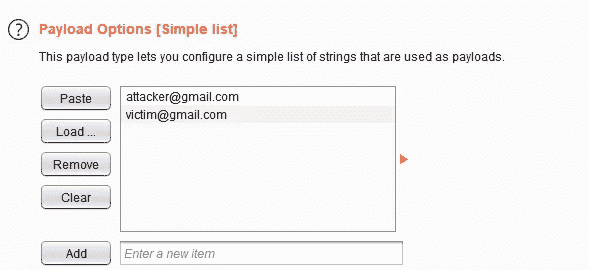
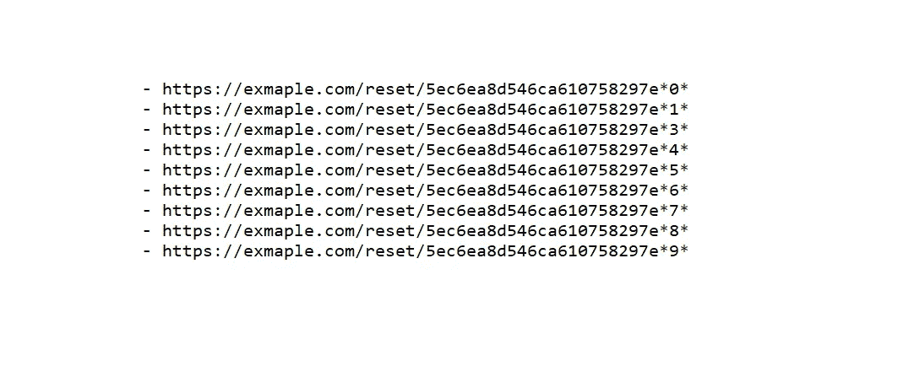

# 我如何能够通过密码重置功能接管任何帐户。

> 原文：<https://infosecwriteups.com/how-i-was-able-to-take-over-any-account-via-the-password-reset-functionality-ef1659f8b481?source=collection_archive---------1----------------------->

嘿，这是我的第一篇文章，我将谈谈我在 5 月份的一个漏洞披露项目中发现的一个帐户接管事件。让我们假设****是目标既然程序不允许公开披露。****

*当我开始寻找一个新目标时，我做的第一件事就是浏览整个应用程序以了解它(它做什么，主要功能，使用的技术..)，之后，我测试了密码重置功能。*

## *我如何测试密码重置功能中的错误:*

*   *我在发送请求时更换了主机。*
*   *我寻找令牌作为回应。*
*   *篡改 id/电子邮件参数(如果有)(如果没有，添加它们)。*
*   *我收集了大量的代币，并通过问这样的问题来分析它们:*
*   *能解码吗？*
*   *这很残忍吗？*
*   *这是可以预测的吗？*
*   *令牌的哪一部分保持不变？*

*因此，当在 target.com 上测试密码重置功能时，前 3 个测试失败没有主机头注入，没有令牌泄漏，也没有 ID/电子邮件参数。然而，在收集了大约 8 个令牌后，我发现令牌中有 2 个部分保持不变，另外 2 个部分每次都会改变。*

**

*绿色:保持不变/橙色:每次都变*

*虽然每次变化的部分比静态部分小，但我仍然不能暴力破解令牌，因为橙色部分包含字母/数字，它们是随机的。所以我保存了令牌，做了一些笔记，然后开始测试其他功能。*

*3-5 天后，当我阅读笔记时，我想再试一次。于是，我打开了[https://target.com](https://target.com)，创建了另一个账户，手动发送了两个重置密码的请求(一个给我的第一个账户，一个给我的第二个账户)。拿到代币，把它们复制/粘贴到我的大写字母上，令我惊讶的是，代币只有最后 3 个字符不同。*

**

*似乎请求之间的持续时间越短，令牌越相似。*

****你可能会问，为什么我第一次收集代币时，得到了 5 个不同的字符。这是因为我一次发送一个请求，保存令牌并再次重复。****

*现在我们有 2 个令牌，它们的区别仅在于最后 3 个字符，但它们仍然是随机的。这使得暴力破解变得非常困难。所以，我想如果我用 burp 入侵者发送它们，我可能会得到更好的结果，因为入侵者发送请求比我的手更快:d .我启动 BurpSuite，捕获请求，发送给入侵者:*

*   *有效载荷:我的两个帐户的电子邮件。*
*   *线程:20*
*   *URL 编码:关闭*

**

*入侵者的攻击载荷。*

*现在，在配置了打嗝入侵者后，我发起了攻击，然后我得到了两个令牌，它们的区别仅在于最后一个字符。*

**

*攻击场景:*

*   *对于打嗝入侵者，我发送 2 个密码重置链接，一个给我，一个给受害者。*
*   *密码重置链接是这样的:[https://exmaple.com/reset/5ec6ea8d546ca610758297e*2](https://exmaple.com/reset/5ec6ea8d546ca610758297e|2)**
*   *根据设计，如果我使用无效的令牌访问密码重置链接，应用程序不会显示更改密码的表单。因此，我只需更改最后一个数字，并检查表单是否在那里。*

**

*此外，我发现了一个 API 端点，我可以从这里枚举电子邮件地址，这将使攻击者更容易。*

*最后我报了 bug。尽管它是 VDP，他们还是给了我一笔奖金！*

# *外卖:*

*   *记笔记，这样当你学到新的东西或者有新的想法时，你就可以测试它们。*
*   *总是跳出框框思考，问好问题。*

*我的推特:【https://twitter.com/Fatnass1F1ras *

*非常感谢 [Rajesh Ranjan](https://twitter.com/eh_rajesh) 和 [Ananda Dhakal](https://twitter.com/dhakal_ananda) 检查这篇文章的草稿。*

# *🔈 🔈Infosec Writeups 正在组织其首次虚拟会议和网络活动。如果你对信息安全感兴趣，这是最酷的地方，有 16 个令人难以置信的演讲者和 10 多个小时充满力量的讨论会议。[查看更多详情并在此注册。](https://iwcon.live/)*

* [## IWCon2022 - Infosec 书面报告虚拟会议

### 与世界上最优秀的信息安全专家建立联系。了解网络安全专家如何取得成功。将新技能添加到您的…

iwcon.live](https://iwcon.live/)*