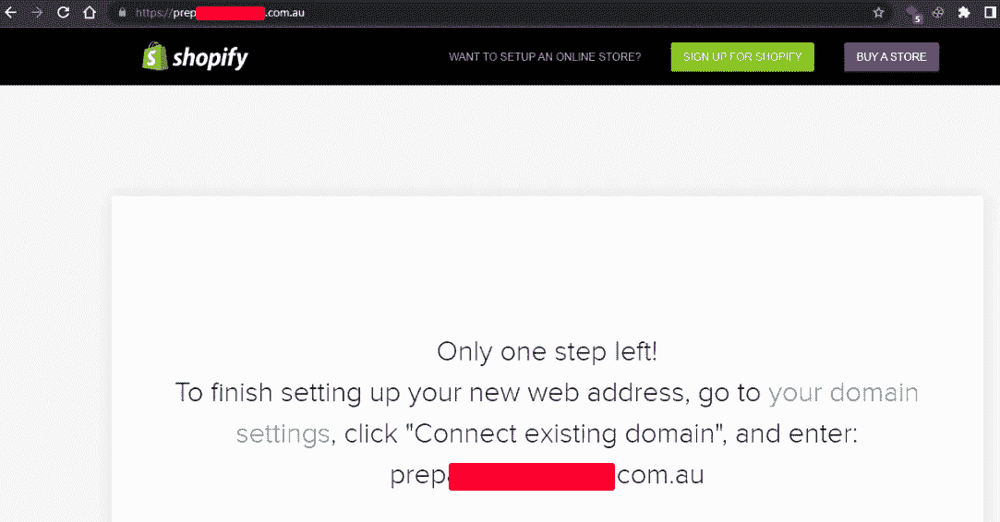
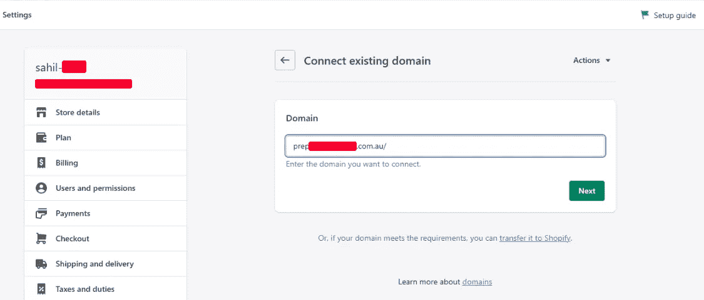
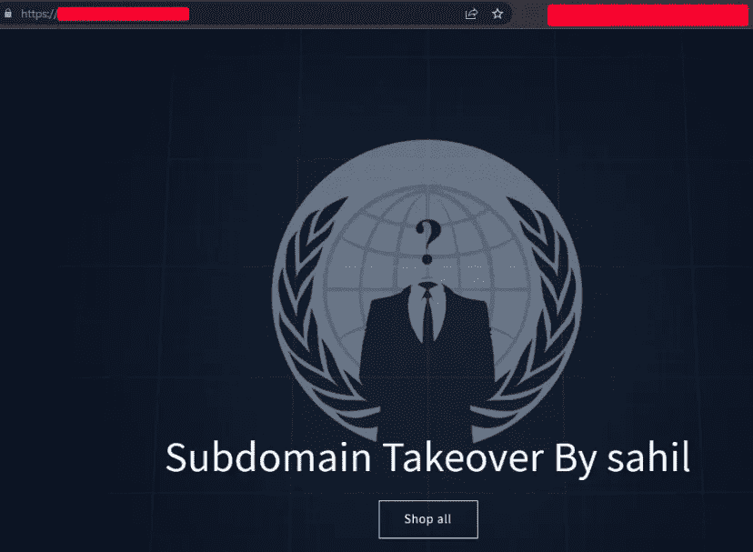

# 我是如何通过 Shopify 接管一个组织的 3 个子域名的？

> 原文：<https://infosecwriteups.com/how-i-was-able-to-takeover-3-shopify-subdomains-of-an-organization-867141854d37?source=collection_archive---------1----------------------->

嘿，伙计们，又有新的报道了🐱‍💻！

在这篇文章中，我将演示一个简单的“通过 Shopify 接管子域”的方法，任何人都可以按照这些步骤来做。在此之前，我甚至没有通过 Shopify 做过子域收购。

这是我的第一篇关于子域接管的文章，在这篇文章中，我可以轻松地声称一个组织有 3 个子域。把我的内容放在上面，把他们的流量重定向到我的网站或任何网站。🐱‍💻

> [子域接管](https://developer.mozilla.org/en-US/docs/Web/Security/Subdomain_takeovers)基本上是指攻击者获得目标域子域的控制权。例如，假设有 example.com 的**和 accounts.example.com 的**的子域。**在这里，我可以控制 accounts.example.com，并在上面放置任何内容，这是 example.com 的资产。**

所以，这是一个拥有超过 500 个子域名的巨大目标。我做了一个脚本，扫描目标(主动和被动)的子域，然后用一些工具扫描接管。所以，我在我的 VPS 上提供了 target.com 进行扫描，然后放了一夜。

第二天，我得到了结果，其中 3 个子域名容易受到子域接管。在这之前我有过很多假阳性，但我不在乎。当我发现脆弱的迹象并深入了解时，我总是精神饱满。我浏览了他们所有人，看到了这个。

图 5:显示该子域易受攻击

在这一点上足够开心了！我很快做了一个 Shopify 帐户，它给你 14 天的试用期来声明任何脆弱的子域，而不需要信用卡，并声明这些子域确实是一次成功的尝试。

图:声称易受攻击的子域是我的

正如我所说，这不仅仅是一个网站。我有三个相同条件的子域。所以，他们也声称。

图 5:连接了所有三个子域名，并将其中两个子域名重定向到我的主站点

我还能够将这些子域名的流量重定向到我最近创建的 Sahil-XX.myshopify.com。我觉得这东西很酷。后来我从办公室回家，改变了网站的内容，就像这样。英雄联盟😂

图:接管成功

希望你喜欢阅读我的内容！下次见。

安静点。！

在推特上和我联系:[https://twitter.com/SahilOj](https://twitter.com/SahilOj)

大声向我的朋友[**Shankar**](https://twitter.com/5hank4r)**致谢，感谢他们在整个收购过程中激励我。英雄联盟😂**