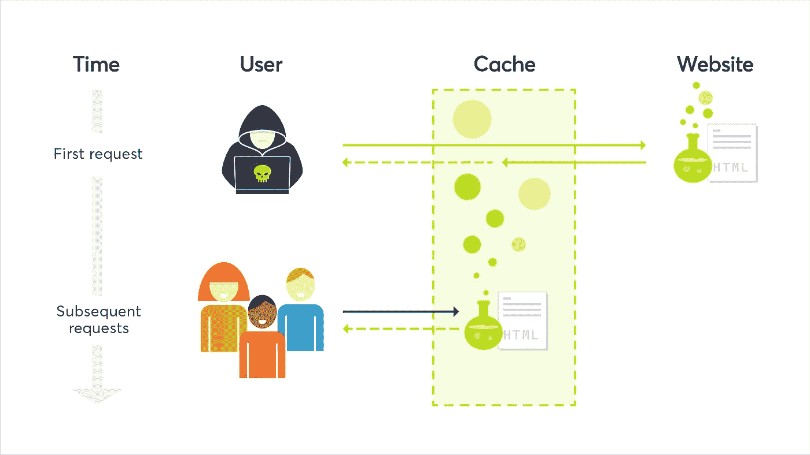
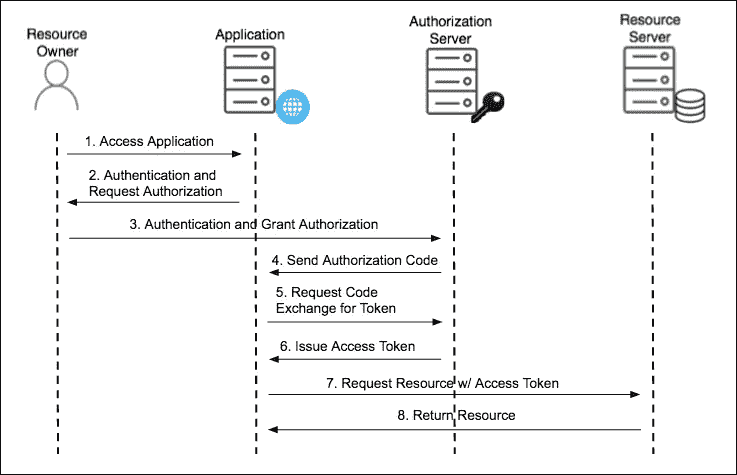

# 我是如何把一个 XSS 变成一个帐户接管

> 原文：<https://infosecwriteups.com/how-i-was-able-to-turn-a-xss-into-a-account-takeover-ae0c478640e7?source=collection_archive---------0----------------------->

首先，这是我在一次 bug 赏金任务中发现的一个漏洞。我会把它分成两部分，或者两个独立的漏洞。第一部分是通过 X 头的网络缓存中毒。这部分允许我用两个头的组合在每个端点上实现 XSS。接下来的部分是 OAuth 流缺陷，它允许我通过一种我称之为 cookie 覆盖的技术，将我之前提供的 XSS 功能用于帐户接管。在我开始解释这个漏洞链之前，我必须说，由于这是一个私人程序，我不能透露它是在哪个网站上被发现的。

Web 缓存中毒:

James Kettle 在 Portswigger 上很好地记录了这个漏洞，这也是我第一次听说它的地方，所以要获得更深入的介绍，我推荐阅读那篇文章。但是，对于快速入门者来说，web 缓存中毒是一个漏洞，它允许攻击者通过将恶意代码注入非键控 HTTP 请求标头来毒害 HTTP 响应。web 缓存基本上是网站通过向用户重播资源而无需多次请求服务器来降低服务器负载的一种方式。它们在 HTTP 请求中寻找特定的键，以确定它们是否已经缓存了资源，如果已经缓存了，那么任何匹配该请求的用户都会得到服务。这些缓存键可以是从 URI 到接受 HTTP 请求头的任何内容。但是，有一些 HTTP 请求头是没有关键字的，根据所实现的代码，可能会将反射输出引入到 HTTP 响应中。一个流行的并且将在本报告中被利用的是 X-Forwarded-Host 报头。该报头可以填充 XSS 有效载荷，并用于将 XSS 有效载荷反映到 HTTP 响应中。在缓存获得这个响应并保存它而没有未加密的头之后，您可以认为缓存中毒了，它会将响应传递给访问该 URL 的每个用户。这是攻击的基础，但这可以用另一个未加密的标题来补充，以增加严重性，这样您就可以毒害网站上每个 URL 的缓存。这个头是 X-Rewrite-Url 头，它基本上重写了被缓存的 URN。假设 HTTP 请求中的 URN 是/home，缓存认为它保存了这个 HTTP 响应。但是如果添加 X-Rewrite-Url 头，它实际上会在/evil 加载恶意的 HTTP 响应。标头通常是未加密的，因此它将为任何请求/home 的用户提供中毒响应。

漏洞链(第 1 部分):

事情是这样的，我找到了一个支持这两种头的站点，并且有一个页面在其中一个页面的 JavaScript 变量中反映了 X-Forwarded-Host 头。使用 X-Forwarded Host 和 X-Rewrite-Url 头的组合，我能够在没有用户交互的情况下在站点的每个页面上获得 XSS。然而，它实际上只缓存了大约 3 分钟。为了提高严重性，我编写了一个脚本来自动中毒，声明我可以每 3 分钟毒害一次主页端点，以感染访问该站点的每个用户。然而，接受报告的团队希望保持中等严重性。这不是我想看到的，所以我去寻找另一种方式来增加严重性。这让我想到了这篇文章的第二部分，由于 Oauth 流程中的一个缺陷导致的帐户接管。

OAuth 流动缺陷:

如果您不熟悉 OAuth，这一节将介绍授权的流程，这就是本例中使用的授权。这个授权有四个主要实体，应用程序、用户、授权服务器和资源提供者。第一步是用户请求访问资源。应用程序或 OAuth 客户端看到这个请求，并将用户重定向到授权服务器。用户向授权服务器验证他们的凭证，如果被批准，则获得访问代码。在这之后，用户被重定向回应用程序，客户端获取这个访问代码。然后，应用程序获取该代码，并通过授权服务器对其进行验证，最后获得一个访问令牌。这个访问令牌用于代表用户从资源提供者检索数据。该站点上的问题是，在代码被发回后，它被一个 url 处理，该 URL 接受 cookie 中的一个值，该值是另一个受信任的 OAuth 回调 URL，并将代码附加到该 URL 末尾的一个哈希片段之后，并将浏览器重定向到该位置。这使得任何更改 cookie 值的人都可以将代码重定向到任意位置。之后，攻击者只需将代码提交给授权服务器，就可以代表目标用户获得访问令牌。

Cookie 覆盖:通常这不是一个问题，因为两个因素，cookie 是 HTTPOnly，第二，cookie 中的 URL 被列入白名单，只允许受信任的站点访问。第二个问题在我的案例中已经解决了，因为缓存中毒 XSS 已经在一个受信任的子域上。第一个问题是必须解决的问题。如何使用 XSS 来更改 HTTPOnly 的 cookie 值？答案是不需要，您可以制作一个看起来像 HTTPOnly cookie 的 cookie，并将 path 参数设置为使用该 cookie 的某个 URN。如果浏览器看到两个同名的 cookie，但其中一个有更具体的路径，当对该路径的 HTTP 请求被请求时，它将优先选择具有特定路径的 cookie。有了这个，我就可以使用 XSS 在中毒子域上创建一个 cookie，这个 cookie 可以在根域下的所有子域上工作，并且它会将特定路径设置为在 cookie 值中启动 URL 的路径。

漏洞链(第 2 部分):

在组装了所有的部分之后，全球中毒 XSS，cookie 覆盖，OAuth 缺陷问题是我如何把这些放在一起，并实际接管帐户。这是我想出的漏洞链。考虑到时间限制，首先我毒死了两个端点。第一个端点具有 XSS 有效负载，并且位于站点的主页上。它将恶意 cookie 写入用户的浏览器，然后将浏览器重定向到 OAuth 流。第二个中毒端点位于不存在的端点上，该端点的 404 响应代码被中毒响应覆盖。此端点处理来自插入 cookie 中的重定向 URL 的回调。该 URL 包含来自 OAuth 流的代码，在收到代码后，有效负载使用另一个 document.location 将代码以查询字符串的形式发送到攻击者的站点。在攻击者站点的端点上，我添加了另一个 document.location。在记录了 URL 和代码之后，将用户的浏览器返回到站点的一个常规页面。整个过程执行大约需要 5 秒钟，避免了时间限制。

结论:

这是在 HackerOne 上报告的，并且严重性被提升到临界。

参考资料:

[https://ports wigger . net/research/practical-we B- cache-poisoning](https://portswigger.net/research/practical-web-cache-poisoning)

*   与我联系:Twitter @Pullerze