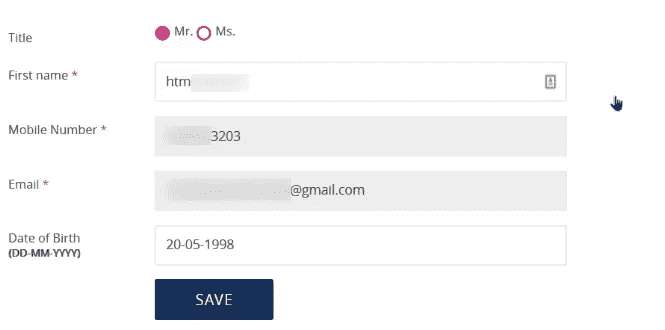
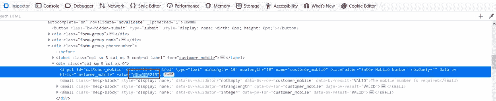

# 监察元素是如何让我得到赏金的

> 原文：<https://infosecwriteups.com/how-inspect-element-got-me-a-bounty-58d3a9946225?source=collection_archive---------0----------------------->

大家好，我最近在一个注册后不允许任何人更改电话号码的应用程序中遇到了一个惊人的旁路来更改我的电话号码。轻松获胜！

# 个案研究

由于这是一个私人程序，所有漏洞的插图将由主机 redact.com 来表示

该应用有一个**注册**页面，用户可以在这里注册一个新的用户名和密码，这样他就可以通过**登录**页面登录该应用。

登记的时候。最后，web 应用程序向电话号码发送一个 OTP 来验证它。到目前为止，一切正常，就像其他应用程序一样。

当打开**我的账户**。它看起来像这样

看起来就像其他账户信息页面一样，没有太多可用的选项，就像你看到的电子邮件地址和手机号码选项默认是禁用的。
然后我开始玩它，我打开 Inspect Element，把手机的值从******3203 改成******3213

点击**保存**，显示更新成功！！

所以要确认一下是不是真的换了我的手机号？我再次重新加载页面，我的手机号码已经被成功地**更改**，它不属于我，我甚至没有验证它。

报道:2019 年 1 月 15 日
回复:2019 年 1 月 18 日
奖励:2019 年 1 月 22 日

**外卖—**

始终尝试检查和更改默认禁用的值，并保存更改，它有可能保持更改状态。

这个博客到此为止。希望你喜欢。

在 [LinkedIn](https://www.linkedin.com/in/adtyasoni) 、 [Twitter](https://twitter.com/hetroublemakr) 上与我联系