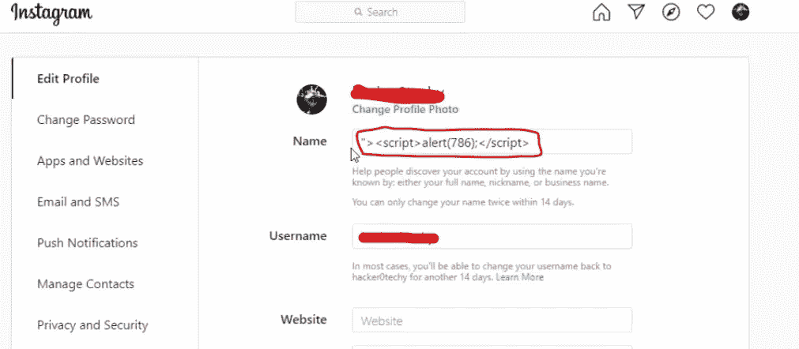
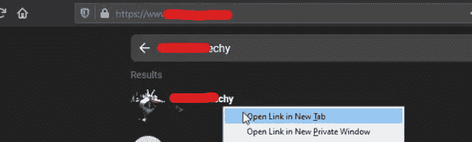
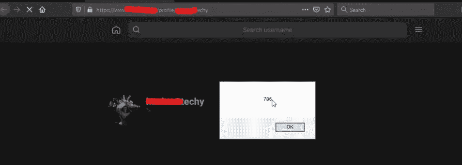

# Instagram 如何帮助我开发 XSS🔥

> 原文：<https://infosecwriteups.com/how-instagram-helped-me-to-exploit-xss-f1772311ad1a?source=collection_archive---------0----------------------->

XSS(跨站点脚本)

AssalamuAlaikum 每个人。我的名字叫法尔汉，又名法尼·马利克，是一名昆虫猎人。所以，我想出了一个有趣的 XSS 虫，我不久前发现的。

# 让我们开始吧

我们开始吧

T he target 没有 bug 赏金计划，我随机登陆了该站点，与支援团队联系后，他们允许我在他们的站点上狩猎。目标很简单，功能也很简单。如果你在输入框中输入任何 Instagram 账户的用户名，那么该网站将获取该账户的个人资料图片，并允许你下载该用户的个人资料图片(显然是公开的个人资料图片)。如果你认为输入字段易受 XSS 攻击，那么你错了，请继续写。

首先，我用 [subfinder](https://github.com/projectdiscovery/subfinder) 枚举了`target.com`的所有子域，然后用 [knockpy](https://github.com/guelfoweb/knock) 枚举了子域强制，然后我使用 [waybackurls](https://github.com/tomnomnom/waybackurls) 获取参数以测试 XSS，然后我使用 [gf](https://github.com/tomnomnom/gf) 获取可能的 XSS 参数。对 URL 排序后，我使用了 [KXSS](https://github.com/Emoe/kxss) 和 [Dalfox](https://github.com/hahwul/dalfox) 。运气不好，我什么都没有。

然后我在用户名字段中输入一个 XSS 有效载荷，什么也没发生。然后我把我的 Instagram 用户名输入到用户名输入框，我就可以下载我的个人资料图片了。

我想让我们尝试一些新的东西，每个人都在输入框中粘贴有效载荷，为什么我要做同样的事情。然后，我在 Instagram 名称字段中输入了一个简单的 XSS 有效载荷。就像下面这样

XSS 有效载荷

然后我复制了我的 Instagram 用户名，粘贴到`“target.com”`的用户名栏，然后右键点击我的个人资料，打开-Link-in-new-tab

在新标签页中打开链接

在新选项卡中打开配置文件后，

XSS

繁荣💥💥💥XSS 出现了。

# 简单的步骤

*   在 Instagram 个人资料的名称字段中输入您的 XSS 有效载荷。
*   现在在`target.com`的用户名栏输入你的 Instagram 用户名
*   现在选择您的个人资料，右键单击并在新标签中打开链接。
*   繁荣💥💥💥XSS

# 学习:-

如果你是一个初学者，不知道 XSS 是什么，请参考下面的链接

*   [https://portswigger.net/web-security/cross-site-scripting](https://portswigger.net/web-security/cross-site-scripting)
*   [https://owasp.org/www-community/attacks/xss/](https://owasp.org/www-community/attacks/xss/)
*   [https://www . acune tix . com/website security/cross-site-scripting/](https://www.acunetix.com/websitesecurity/cross-site-scripting/)
*   【https://www.rapid7.com/fundamentals/cross-site-scripting/ 

您可以在 Portswigger labs 上练习，获得实践经验。

感谢阅读，期待你的掌声。如果你有任何问题，下面是我的 Twitter 和 Instagram 个人资料。你可以随时给我发短信。

*   [https://twitter.com/fanimalikhack](https://twitter.com/fanimalikhack)
*   [https://instagram.com/fanimalikhack](https://instagram.com/fanimalikhack)
*   [https://www.youtube.com/fanimalikhack](https://www.youtube.com/fanimalikhack)

再见:)