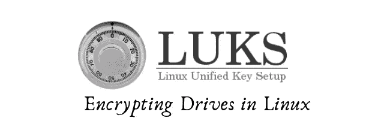
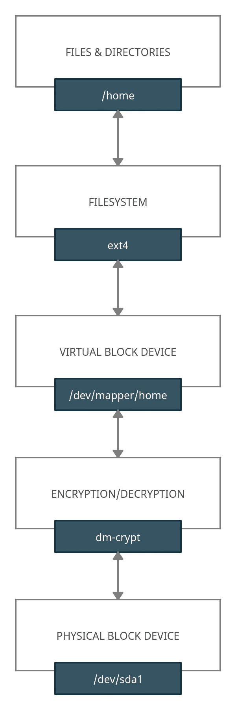
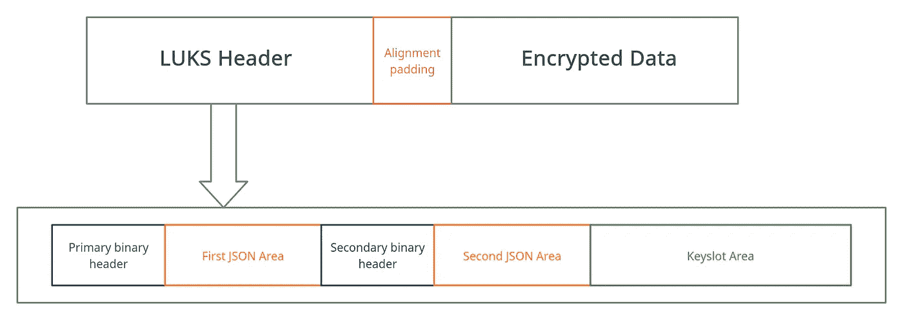

# LUKS 如何在 Linux 中使用全磁盘加密

> 原文：<https://infosecwriteups.com/how-luks-works-with-full-disk-encryption-in-linux-6452ad1a42e8?source=collection_archive---------1----------------------->



# 全磁盘加密

**全磁盘加密**是磁盘级别的加密(顾名思义)，它对用户是透明的，因为它在文件系统层之下运行。基本上，它是一个**块设备加密**，这意味着当从磁盘读取(或写入)块时，内核级的加密模块为我们工作，就像一个翻译器。

> 这种加密不区分敏感信息和非敏感信息，它只是加密所有信息。

虽然**基于文件的加密**必须由开发者(使用库)为每场比赛实现，如果没有正确实现，就无法在其他计算机上工作，但全磁盘加密加密所有内容，并且它是文件系统不可知的(因为你在设备上加密块)，如果你想有一个**加密的 LVM 设置**或分区表，这很有帮助。

全磁盘加密的一个缺点是当系统启动时磁盘是解锁的，而基于文件的加密每次需要使用时都必须解密。
本质上，全磁盘加密仅在系统关闭时保护您，因此万一有人偷走您的笔记本电脑或 pc，您的文件是安全的(嗯，这取决于一些其他因素)。

## dm-crypt 概述

Linux 中默认的标准设备映射器加密是由 Linux 内核中的 **dm-crypt** 提供的，所以如果你想完全控制分区和密钥管理，这是你应该使用的。
DM-crypt 的管理通过 *cryptsetup* 完成: **LUKS** 是 *dm-crypt* 的附加前端，目的是简化所有的加密过程。
下图描述了上面提到的层(文件系统、目录、块设备等)。):



加密层是如何组织的

# LUKS 是如何运作的

**LUKS** ( *Linux 统一密钥设置*)，特别是 LUKS2，在磁盘上的专用区域提供通用密钥存储，能够使用多个密码来解锁存储的密钥。LUKS2 有一种更灵活的存储元数据的方式(在元数据区损坏的情况下提供恢复的冗余信息)。

LUKS 报头为加密设置提供元数据。以下是一些功能:

*   检测报头中的损坏和操纵的校验和机制
*   元数据区域存储为两个副本，以备可能的恢复
*   元数据以 JSON 格式存储。它允许在不修改二进制结构的情况下进行扩展
*   头包含名为*令牌*的对象，它包含从哪里获得解锁密码短语的信息

# 页眉



LUKS 头球解说

LUKS 报头基本上分为三个部分:

*   二进制报头(4096 字节，仅使用 512 字节)
*   JSON 中的元数据
*   键槽区

如上图所示，二进制和 JSON 区域存储了两次，在正常情况下，它们包含相同的值。

二进制头的大小确保它总是只被写入一个扇区(*原子写入*)以防止错误和/或损坏。

## **二进制报头**

二进制报头包含通知系统将要接近 LUKS 设备所需的所有信息。此处保存的信息是基本信息，如标签、表明这是 LUKS 设备的签名、报头大小和元数据校验和(*非常重要！*)。

主报头必须存储在设备的扇区 0 中，第二个报头从第一个 JSON 区域之后的固定偏移位置开始，如下所示:

```
Offset  | JSON
[bytes] | [kB]
---------------
16384   |   12
32768   |   28
65536   |   60
131072  |  124
262144  |  252
524288  |  508
1048576 | 1020
2097152 | 2044
4194304 | 4092
```

## **JSON 区**

JSON 区域在二进制头之后开始，结尾必须与 4096 字节的扇区偏移量对齐，因此 JSON 区域大小为

```
JSON_Area_size = header_size - 4096
```

所以第二个二进制头开始的偏移量(在上表中报告)现在有意义了:JSON size + bin_header_size (4096 字节)必须与偏移量匹配。未使用的空间用零填充。

## 键槽区

密钥槽区域是磁盘上可以为密钥槽中的二进制数据分配的空间，事实上，这里存储了从密钥槽元数据引用的加密密钥。

分配的区域由包含偏移(从设备开始)和大小字段的区域对象在密钥槽中定义，这两个字段都必须有效，否则将被拒绝。

## 对齐填充

**对齐填充符**的目的是将加密数据在块的开始处(块被逐个加密，通常一个块是 512 字节)与正确的偏移对齐，以使 LUKS 正确地与加密扇区一起工作。

# [计]元数据

**LUKS 元数据**允许定义具有特定功能的对象。未被识别的对象被忽略，但仍保留在 JSON 元数据中。

在更新磁盘头之前，实现必须验证 JSON 结构。

LUKS 有一些强制性目标如下:

*   ***配置*** —包含持久报头配置属性
*   ***key slot***——描述加密密钥存储区域的对象
*   ***摘要*** —用于验证解密后的密钥是否正确
*   ***段*** —描述磁盘上包含用户加密数据的区域
*   ***令牌*** —可以选择性地包括附加元数据、到其他系统的绑定

JSON 中的二进制数据以 Base64 编码存储，64 位整数以十进制表示法存储为字符串。

以下是对 LUKS 元数据中的必备对象的深入分析:

## 配置对象

配置对象包含这些字段，这些字段对于 LUKS 设备是全局的:

*   ***json_size*** — JSON 区大小(以字节为单位)，该字段必须等于二进制头
*   ***keyslots_size*** —二进制 keyslot 区大小(以字节为单位)，必须对齐到 4096 字节
*   ***标志*** —带有设备持久标志的字符串对象数组
*   ***需求***—LUKS 设备所需附加功能的字符串对象数组

## 键槽对象

密钥槽对象包含关于存储的密钥、存储二进制密钥槽的区域、加密类型、使用的反取证功能、基于密码的密钥派生功能和相关参数的信息。

每个 keyslot 对象包含:

*   ***类型*** —键槽类型
*   ***key_size*** —存储在 keyslot 中的密钥大小(字节)
*   ***区*** —二进制键槽区中的分配区
*   ***kdf*** — PBKDF
*   ***af*** —反法医。现代系统中未使用(LUKS2)
*   ***优先级*** —是键槽优先级:0 =忽略，1 =正常，2 =高。

## 摘要对象

为了验证解密密钥(来自密钥槽)是否正确，LUKS 使用 digests 对象。这些对象被分配给键槽和段，如果没有分配给段，则摘要用于未绑定的键。

摘要对象包含这些字段:

*   ***型*** —消化型
*   ***键槽*** —分配给摘要的键槽对象名数组
*   ***段*** —分配给摘要的段对象名称的数组
*   ***盐*** —用于消化的二元盐
*   ***摘要*** —二进制摘要数据

## 分段对象

Segment 对象包含磁盘上加密区域的定义。对于正常的 LUKS 设备，只存在一个数据段。

这些是字段:

*   ***型*** —分段型(目前仅使用*地穴*)
*   ***偏置*** —从设备开始到段开始的偏置
*   ***大小*** —段大小(以字节为单位)或*动态*(用于设备的动态调整大小)
*   ***iv _ tweak***-初始化向量的起始偏移
*   ***加密***—*DM-crypt*符号中的分段加密算法
*   *—段的扇区大小(512、1024、2048 或 4096 字节)*
*   ****完整性*** — LUKS2 用户数据完整性保护*
*   ****标志*** —包含段附加信息的字符串对象数组*

## *令牌对象*

*令牌对象是一个对象，它描述了如何获得一个密码来解锁一个特定密钥槽，且可以包含附加的 JSON 元数据。
这些是必填字段:*

*   ****类型*** —定义令牌类型*
*   ****键槽*** —分配给令牌的键槽对象名称数组*

# *LUKS 备份和还原*

## *LUKS 头球备份*

*LUKS 标题备份是有用的，以防你损坏或删除你的标题。如果您出于任何原因直接在磁盘上工作(而不是在设备映射器上),这可以在发生不好的事情时节省您的时间。*

*这将创建一个带有 LUKS 标题的文件:*

```
*sudo cryptsetup luksHeaderBackup /dev/MY_DRIVE --header-backup-file /path/to/backup-file*
```

*您也可以使用 *dd* 命令备份您的 LUKS 标题:*

```
*sudo dd if=/dev/MY_DRIVE of=/path/to/backup-file bs=X count=Y*
```

*用 *dd* 你应该知道你的头的大小，以确保你复制所有的数据。使用 *luksDump* 获取尺寸和偏置信息。*

## *LUKS 标题恢复*

*这是你可能面临的最糟糕的情况之一:你丢失/损坏了你的 LUKS 页眉。如果您有备份副本，您可以从实时操作系统启动来恢复它们，此过程将恢复您的头文件。*

```
*sudo cryptsetup luksHeaderRestore /dev/MY_DRIVE --header-backup-file /path/to/backup-file*
```

*LUKS 会要求确认命令:*

```
*WARNING!
========
Device /dev/MY_DRIVE already contains LUKS2 header. Replacing header will destroy existing keyslots.

Are you sure? (Type uppercase yes):* 
```

# *如何擦除 LUKS 加密硬盘*

*如果你有一个 **LUKS 加密硬盘**，你有两种方法可以擦除它:删除位于加密盘开头的 LUKS 头，或者你可以像擦除标准盘一样擦除整个盘。*

## *删除 LUKS 标题*

*如上所述，标题包含了解锁磁盘的所有信息，没有这些信息(特别是密钥)几乎不可能恢复数据。
所以可能足以擦除表头:*

```
*sudo shred --size=LUKS_HEADER_SIZE /dev/MY_DRIVE*
```

> *如果您有多个分区，请确保您只粉碎 LUKS 分区，而不是整个磁盘或分区表！*

*您也可以使用*密码设置*来擦除您的密钥，如下所示:*

```
*sudo cryptsetup erase */dev/MY_DRIVE**
```

*此外，您可以用 *wipefs* 移除所有 LUKS 割台:*

```
*sudo wipefs -a */dev/MY_DRIVE**
```

## *擦除磁盘*

*擦除磁盘将是最简单的解决方案，但不是最快的。为了继续擦除您的磁盘，您需要从实时操作系统启动。*

*用*粉碎*我们可以擦除我们的磁盘并阻止任何取证数据恢复:*

```
*sudo shred /dev/MY_DRIVE*
```

*同样 *dd* 可用于此目的，输入源应为 urandom/random 或零:*

```
*sudo dd if=/dev/urandom of=/dev/MY_DRIVEORsudo dd if=/dev/zero of=/dev/MY_DRIVE*
```

# *结论*

*在本文中，我们探讨了 LUKS，一个有效的全磁盘加密前端。确保您的 LUKS 配置是安全的(强密码)是很重要的；如果您不需要第一版 LUKS 的明确功能，请使用 LUKS2。*

*我们还看到，擦除 LUKS 分区可能比普通磁盘更容易、更快，这是一个有趣的点，因为目前(2021 年)没有办法恢复加密数据。*

*如果你想了解如何保护你的 **Linux 系统**，而不仅仅是启用**全磁盘加密**，请看这篇文章:*

*[](https://mattiazignale.medium.com/introduction-to-linux-security-hardening-635af8e6e885) [## Linux 安全性和强化简介

### 如何开始强化您 Linux 系统？Linux 安全性介绍

mattiazignale.medium.com](https://mattiazignale.medium.com/introduction-to-linux-security-hardening-635af8e6e885)*