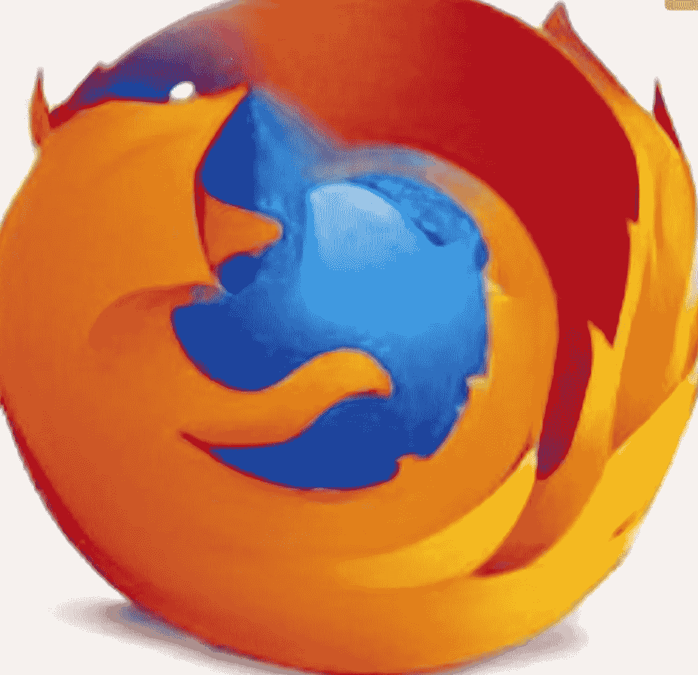
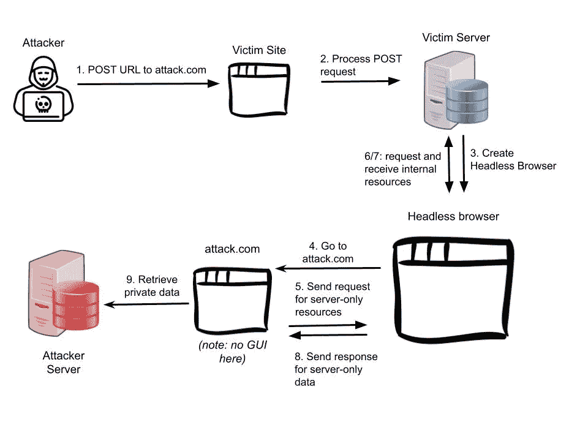

# 恶意黑客如何接管您的无头浏览器:

> 原文：<https://infosecwriteups.com/how-malicious-hackers-can-takeover-your-headless-browser-part-1-bcab9e3a2f9c?source=collection_archive---------0----------------------->

## 检查无头浏览器+服务器端请求伪造(SSRF)

无头浏览器，如[木偶师](https://pptr.dev/)、[硒](https://www.selenium.dev/)和[剧作家](https://playwright.dev/)，对于自动化、测试和网页抓取来说是非常有用的工具。然而，在你的服务器或后端运行一个无头浏览器有被恶意黑客滥用的巨大风险。就像普通浏览器一样，无头浏览器执行代码；他们可以发出 HTTP 请求、呈现内容、访问 URL 等。

DALL-E mini 在提示“无头浏览器”上生成的人工智能图像[https://www.craiyon.com/](https://www.craiyon.com/)

## **问题**

那么，如果用户可以访问运行在您的服务器上的这些无头浏览器，例如通过提供浏览器的 URL，会发生什么呢？在最坏的情况下，你的无头浏览器可能在没有[沙箱](https://www.browserstack.com/guide/what-is-browser-sandboxing#:~:text=Browser%20Sandboxing%20is%20a%20security,a%20container%20or%20virtual%20machine.)的情况下运行。沙箱通常有多层保护，试图将浏览器与其实际运行的机器隔离开来。如果没有沙箱，黑客可能会在浏览器上发出影响服务器的命令。因此，运行带沙盒的无头浏览器是防止这种情况的一个重要防御层。同样重要的是，要确保如果用户可以提供一个 URL，该 URL 需要被[列入白名单](https://www.techtarget.com/whatis/definition/whitelist)。如果无头浏览器可以简单地访问任何 URL，黑客可以创建定制的有效负载来执行服务器端请求伪造(SSRF)。本质上，由于无头浏览器源自服务器，因此它可用于发送恶意请求，绕过典型的服务器身份验证方法。

例如，如果无头浏览器接受任何 URL:

1.  我们可以创建一个恶意站点(即 attacker.com)。我们用`URL=attacker.com`向 victim.com 发出进入请求。
2.  victim.com 将向受害者服务器发送 POST 请求。
3.  受害者服务器将启动一个无头浏览器去 attacker.com。
4.  无头浏览器访问 attacker.com。
5.  attacker.com 发出了一个信息请求，该信息应该只能由服务器访问。
6.  无头浏览器向受害者服务器发送请求。这是 SSRF。
7.  因为无头浏览器源自服务器，所以服务器会批准请求，并将请求的资源发送回无头浏览器。
8.  无头浏览器将此发送回 attacker.com。
9.  attacker.com 现在拥有私人数据，并将其发送回攻击者自己的服务器。信息已被成功窃取。

AbuseHumanDB 挑战中使用的利用方法

来自 Infosec 的报道:Infosec 上每天都会出现很多难以跟上的内容。加入我们的每周简讯，以 5 篇文章、4 个线程、3 个视频、2 个 Github Repos 和工具以及 1 个工作提醒的形式免费获取所有最新的 Infosec 趋势！