# 移动运营商如何因短信恶意软件损失数千美元

> 原文：<https://infosecwriteups.com/how-mobile-operators-should-thousands-of-dollars-because-of-sms-malware-2a4d7ac1e3a2?source=collection_archive---------2----------------------->

# 短信恶意软件分析——由 Josue Martins 撰写

他的文章是关于一种影响了多个移动运营商和用户的 android 恶意软件，它通常出现在用户下载歌曲、游戏和其他内容的盗版网站上。

我已经在 2019 年在巴黎举行的 **GSMA 欺诈和安全小组**会议上展示了我对这种短信恶意软件的发现，这种恶意软件影响了非洲、欧洲和中东的运营商，这种恶意软件的受害者经常在他们的电话号码上留下巨额账单。

> **让我们来分解这段恶意代码……………………**

# 恶意软件文件信息

*文件名:*smart world _-_ WIN _-_ 5001283180632240 _-_。apk

*大小:* 1.76MB

*MD5:*7b 63 ADC 6100 ee 6 c 7b 703 ba 637882 DD 17

*SHA1:*054 e5d 6569 cfdc 631 bb1c 722 cc 91 B2 DD 6 AE 8 e 32 c

*sha 256:*5 db 5b 4 a 563106 e 9 a1 b 7 c 502 e 271 f 40224 bb 40 cdbe 678553 DD 90 fc 0335204 af7e

*App 名称:包名:*contrad interte . preciosas . escasez

# 恶意软件的静态分析

在对 android 操作系统进行移动恶意软件分析时，最好先查看清单文件，因为这有助于识别恶意软件最重要的活动。

## ANDROID 清单文件分析

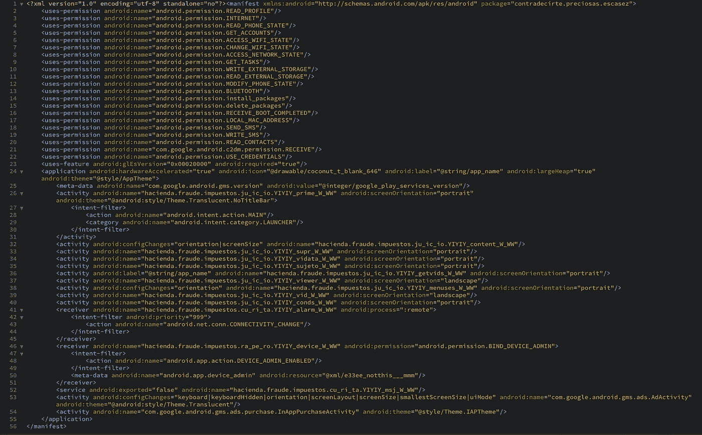

Android 清单文件

## 恶意软件请求以下权限:

**<用途-权限 Android:name = " Android . permission . access _ WIFI _ STATE "/>**

—允许应用程序查看有关 Wi-Fi 状态的信息。

人们可以假设他的恶意软件想要使用互联网连接到服务器来接收来自网络罪犯的命令。

**<uses-permission Android:name = " Android . permission . get _ ACCOUNTS "/>**
—允许应用程序访问手机已知的帐户列表。

**<用途-权限 Android:name = " Android . permission . access _ NETWORK _ STATE "/>**

—允许应用程序查看所有网络的状态。

**<用途-权限 Android:name = " Android . permission . receive _ BOOT _ COMPLETED "/>**

—允许应用程序在系统完成引导后立即自行启动。这可能会使它需要更长的时间来启动手机，并允许应用程序通过始终运行来降低整个手机的速度。

## 以下所有权限都是危险权限，经常被恶意软件使用。

**<用途-权限 Android:name = " Android . permission . read _ PROFILE "/>**

—允许应用程序读取用户的个人资料数据。

**<用途-权限 Android:name = " Android . permission . internet "/>**

—允许应用程序创建网络套接字。

**<用途-权限 Android:name = " Android . permission . read _ PHONE _ STATE "/>**

—允许应用程序访问设备的电话功能。具有此权限的应用程序可以确定此电话的电话号码和序列号、呼叫是否处于活动状态、呼叫所连接的号码等等。

**<用途-权限 Android:name = " Android . permission . change _ WIFI _ STATE "/>**

—允许应用程序连接到 Wi-Fi 接入点或从其断开连接，并对已配置的 Wi-Fi 网络进行更改。

**<用途-权限 Android:name = " Android . permission . get _ TASKS "/>**

—允许应用程序检索有关当前和最近运行的任务的信息。可能允许恶意应用程序发现其他应用程序的私人信息。

**<用途-权限 Android:name = " Android . permission . write _ EXTERNAL _ STORAGE "/>**

—允许应用程序写入 SD 卡。

**<用途-权限 Android:name = " Android . permission . read _ EXTERNAL _ STORAGE "/**>

—允许应用程序读取 SD 卡。

**<用途-权限 Android:name = " Android . permission . modify _ PHONE _ STATE "/>**

—允许应用程序控制设备的电话功能。具有这种权限的应用程序可以在不通知您的情况下切换网络、打开或关闭电话收音机等。

**<用途-权限 Android:name = " Android . permission . bluetooth "/>**

—允许应用程序查看本地蓝牙电话的配置，并与配对的设备建立和接受连接。

**<用途-权限 Android:name = " Android . permission . install _ packages "/>**

—在设备上安装其他应用程序以及来自未知来源的应用程序。

**<用途-权限 Android:name = " Android . permission . delete _ packages "/>**

—删除设备上已安装的应用程序。

**<用途-权限 Android:name = " Android . permission . local _ MAC _ ADDRESS "/>**

—获取设备的 MAC 地址。

**<用途-权限 Android:name = " Android . permission . send _ SMS "/>**

—允许应用程序发送 SMS 消息。恶意应用程序可能会在未经您确认的情况下发送消息，从而使您损失金钱。

**<用途-权限 Android:name = " Android . permission . write _ SMS "/>**

—允许应用程序编写手机或 SIM 卡上存储的短信。恶意应用程序可能会删除您的邮件。

**<用途-权限 Android:name = " Android . permission . read _ CONTACTS "/>**

—允许应用程序读取手机上存储的所有联系人(地址)数据。恶意应用程序可以利用这一点将您的数据发送给其他人。

**<用途-权限 Android:name = " com . Google . Android . c2dm . permission . receive "/>**

—允许攻击者服务器使用 Google cloud messaging for Android 向应用程序发送消息。

**<用途-权限 Android:name = " Android . permission . use _ CREDENTIALS "/>**

—允许应用程序请求身份验证令牌。

只要阅读该恶意软件请求的所有二十多个权限，就可以看到该恶意软件具有多种功能。

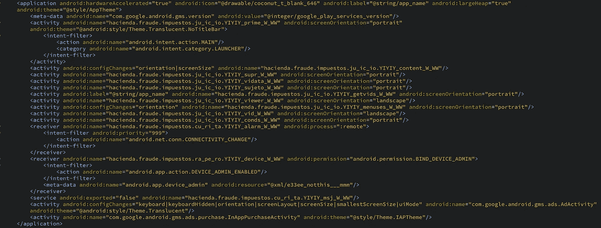

Android 清单文件

我们可以看到，清单文件显示，应用程序将要求成为智能手机的管理员，活动的名称称为“fraude”，fraude 在葡萄牙语和西班牙语中的意思是欺诈。在我看来，恶意软件作者是西班牙的个人或团体。

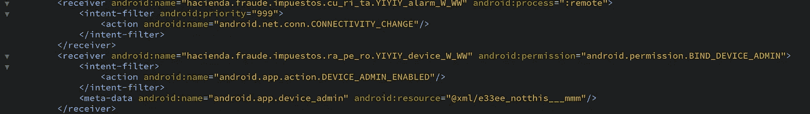

Android 清单

清单文件"***<intent-filter Android:priority = " 999 ">***"上的这段代码用于使服务在安装后以及智能手机重启时以高优先级在后台运行。

## JAVA 文件分析

Java 源代码显示了恶意软件中编码的以下指令。

**提取敏感信息，如:**

*   智能手机运营商
*   智能手机所在的国家
*   设备上运行的 Android 操作系统的版本
*   恶意软件的安装日期。

**恶意软件中编码的附加功能:**

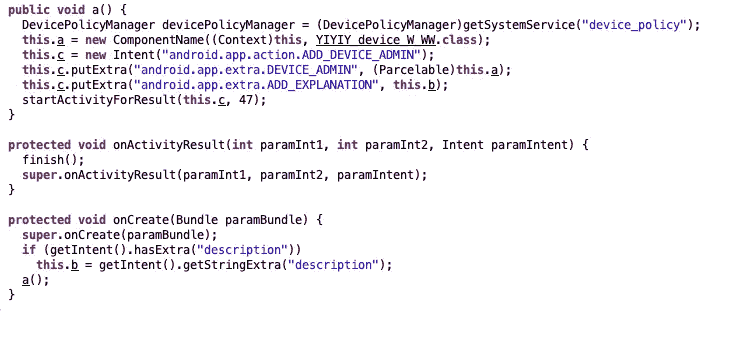

管理员访问请求

向用户呈现娱乐内容，例如移动游戏和成人内容。

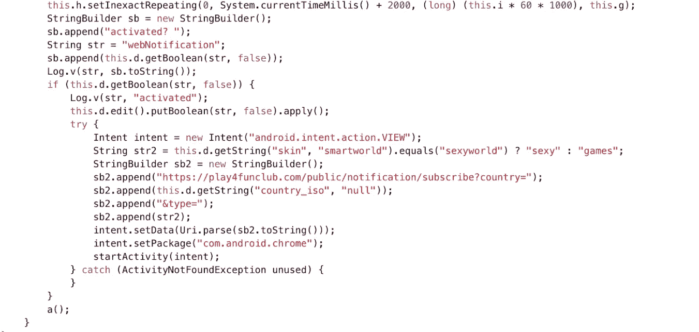

手机游戏、成人内容等娱乐内容。

联系**指挥控制中心**接收**号码发送短信给**。

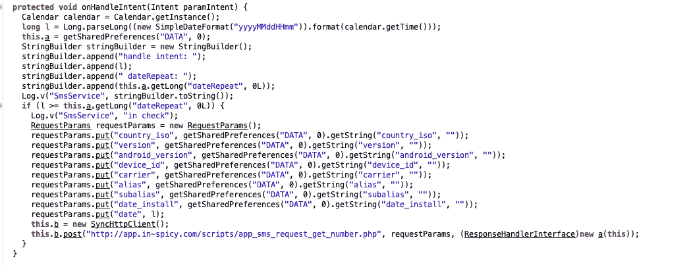

向恶意软件创建者请求信息。

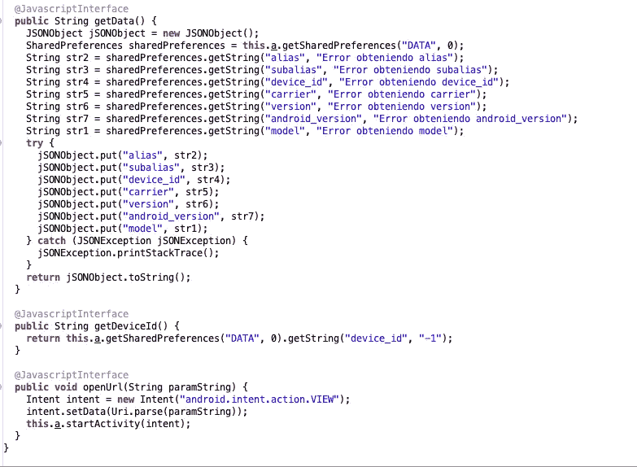

收集智能手机和用户信息

请求重复发送短信的日期，如果有错误或没有。

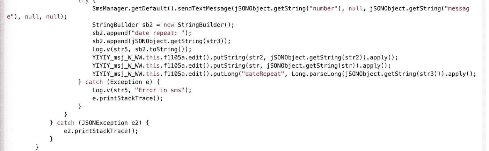

发送短信的重复日期

还允许安装额外的移动应用程序。

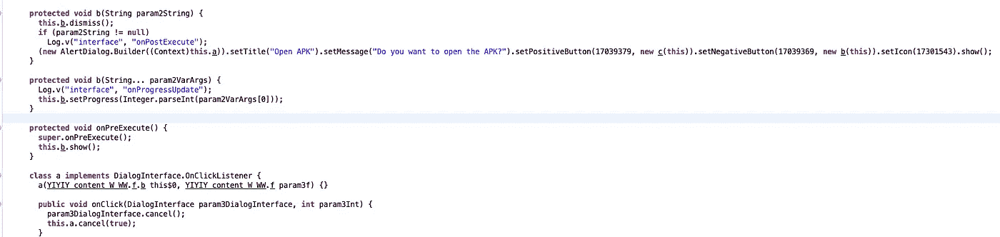

安装 Apk 文件。

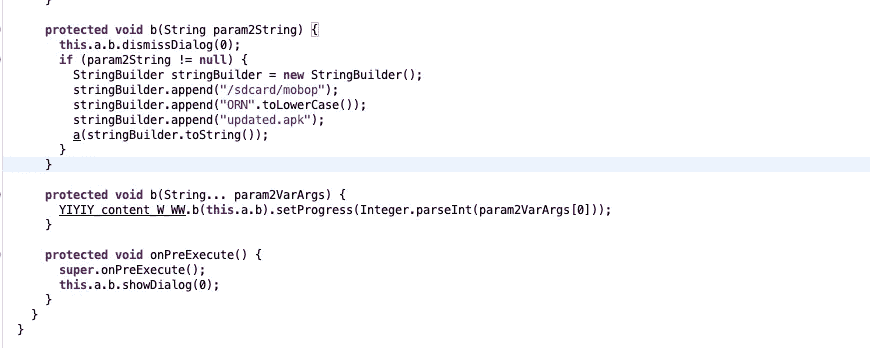

APK 文件的位置

## 恶意软件的动态分析

当进行动态分析时，需要用恶意软件感染测试设备并观察其行为。

**该恶意软件安装在测试智能手机上，安装后会显示以下行为:**

*   隐藏不使用图标，如果你不小心，你会错过主菜单中的恶意软件。

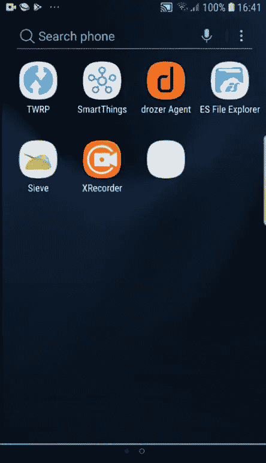

应用程序显示时没有图标

*   向用户呈现娱乐内容，如移动游戏和成人内容，要查看成人内容，必须给应用程序管理权限，这是恶意软件控制设备的时候。

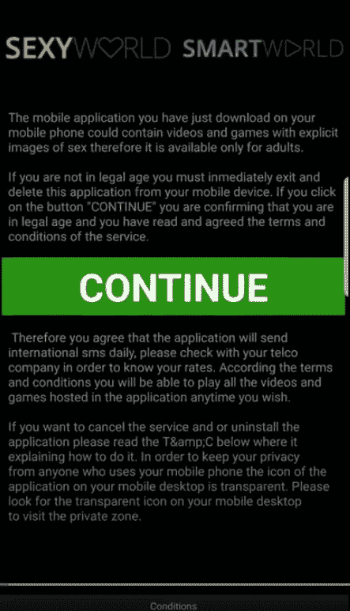

条件

主菜单

*   恶意软件请求智能手机的管理权限。

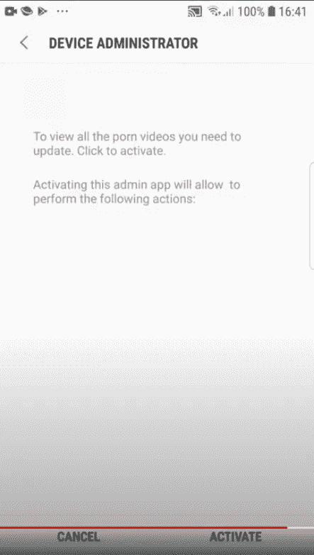

请求管理员许可或访问设备。

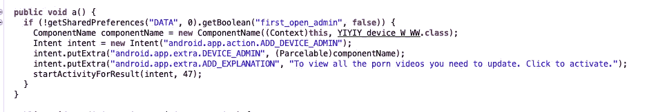

截图背后的源代码

*   收集静态分析中突出显示的敏感信息

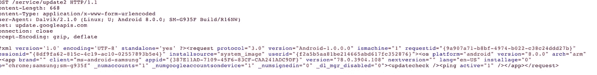

信息采集

*   它通过域“app . in-spirit . com”与命令和控制中心通信，并警告恶意软件已成功安装。它还要求命令和控制中心发送将接收 SMS 的号码，如源代码在静态分析中所示。

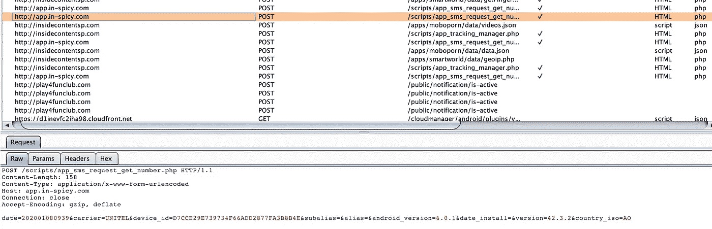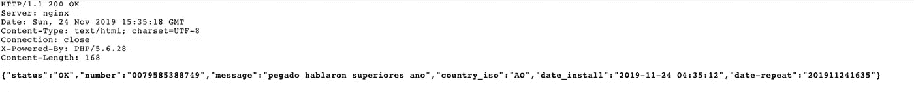

短信内容

**短信发到了号码“ *0079585388749* ”，这个号码一般是高级号码(资费很高的号码)。**

# 恶意软件概述

*   恶意软件通过不使用图标来隐藏，并在后台运行。
*   向用户呈现将被解释为娱乐移动应用的娱乐内容。
*   要求用户允许它作为设备管理员运行，以允许用户查看其他成人内容。
*   一旦被允许以管理员身份运行，它就会提取敏感信息并向高级号码发送短信。
*   恶意软件可以安装额外的软件。

# **结论**

短信恶意软件是一种有趣的软件，网络犯罪分子更经常使用，因为大多数智能手机用户没有安装防病毒软件，他们希望免费访问互联网上的内容。

此外，网络犯罪分子还利用移动恶意软件作为电信欺诈和安全攻击的推动者，因为他们知道移动运营商在移动恶意软件检测和短信欺诈方面没有部署足够的安全防御。

智能手机用户应该非常小心，不应该安装谷歌 Play 或苹果应用商店以外的软件。应尽快在您的网络中封锁上述指挥和控制中心，以避免影响移动运营商声誉的多种类型的电信欺诈。

***PS——不要创建手机恶意软件，因为这是一种犯罪，而且这些内容纯粹是出于教育目的。***