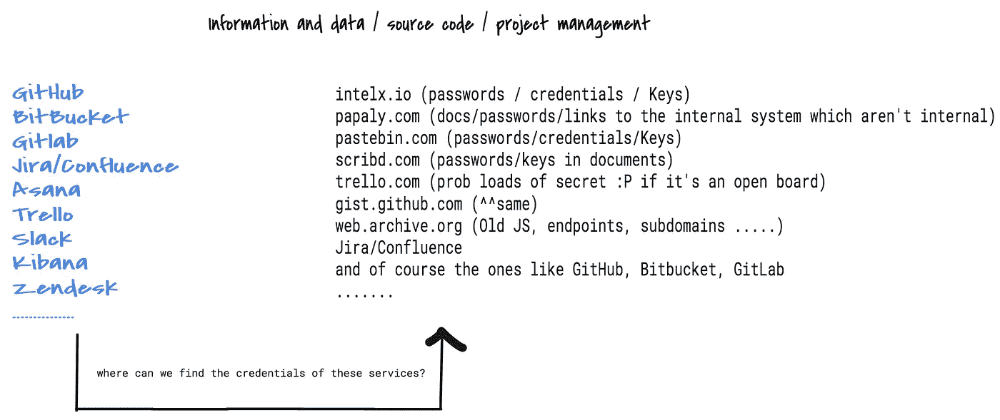
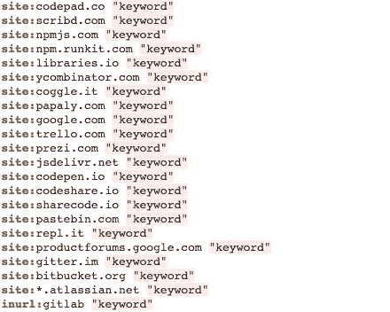

# “侦察”如何帮助三星保护其 SamsungTv、电子商务/电子商店的生产仓库

> 原文：<https://infosecwriteups.com/how-recon-helped-samsung-protect-their-production-repositories-of-samsungtv-ecommerce-estores-4c51d6ec4fdd?source=collection_archive---------1----------------------->

# **简介**

***侦察永无止境！你必须有创造力，想出一种方法来扩展你的研究，提高你的技能。我相信在 bug bounty 程序中找到漏洞可能很容易，但是主要的技巧在于侦察阶段。***

经过深思熟虑后，我想到了几件事，于是我立即决定画一张草图:

这些是常用服务的列表。几乎 99%的公司都使用这些服务，所以我决定尝试一下，看看是否有人在任何地方泄露了这些服务的凭据，我的研究没有受到限制，也没有专注于任何特定的程序，无论是三星还是其他公司。在所有组织(小型、中型或跨国组织)的所有技术/非技术人员工作的基础服务中，我在研究和寻找凭证时坚持研究道德。

# 撞上了🎁

其中， [***帕帕利***](https://papaly.com/) 根据我的观察，似乎是一个有趣的研究课题。

**Papaly 是什么？**

[*Papaly*](https://papaly.com/) 是一个保存和组织链接(“书签”)的工具。书签被组织成称为书板的集合。你可以有任意数量的板子。每个书签都属于棋盘中的一个类别。帕帕利董事会可以是公开的，也可以是私人的。

> 有人提到公共董事会了吗？
> 
> 我已经能闻到将要发生的事情。

`**site:papaly.com bitbucket**`

导致了相当多的公共论坛，在那里人们用证书标记了比特桶实例😲。在查看了每块电路板后，我偶然发现了属于三星工程师的那块。接下来是什么？

> BitBucket 的凭据在公共板上公开，并且没有使用 2FA 启用，这允许访问其生产 BitBucket 实例。不用说，如果它落入坏人之手，情况会更糟。

# **公司的主要收获**

*   安全性是您的责任—在组织级别为您的存储库启用 2FA。
*   避免使用相同的密码，使用密码管理器。
*   快捷方式很花哨，但有风险——不要将密码存储在本地或互联网上。
*   外卖无止境但自觉才是美德！

# **这种方法如何进一步帮助**

使用其他被动来源，我遇到了与不同组织有关的各种服务的凭证，从中我能够接近那些有 Bug 赏金计划的人。

> 什么重要？

分享结果不是，但分享方法是，不是吗？

> 依我看，是的！

关键字可以是任何东西，像“比特桶通行证”、“特雷罗密码”、“asana passwd”、“jira pwd”、“公司机密”、“公司发送密钥”等等…

使用这个，我发现了一些内部流程图，这些流程图在某些情况下是有凭证的。

`site:scribd.com "companyname"`→这是一个公司的 PDF 文件，其中他们的工程师为一个内部研讨会准备了一些东西，其中包含到他们内部仪表板的链接(不是内部的😊).

这都是关于创造性的。 ***侦察不停！***

# **披露时间表【三星】:**

2019 年 6 月 16 日—向三星报告

2019 年 6 月 17 日—报告已分类

2019 年 6 月 19 日—问题已修复

2019 年 6 月 20 日—三星奖励

感谢大家抽出时间阅读。

黑客快乐！

*   [https://twitter.com/prateek_0490](https://twitter.com/prateek_0490)
*   [https://hackerone.com/prateek_0490](https://hackerone.com/prateek_0490)