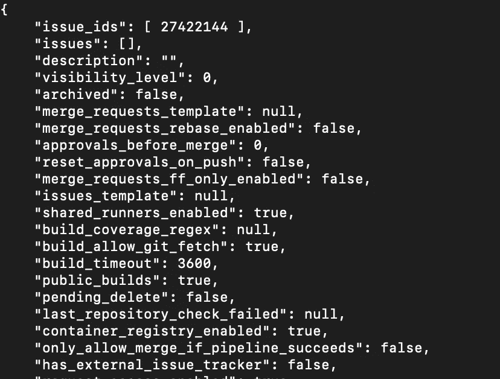

# 一行代码如何从 GitLab 获得 2 万美元的 bug 奖金

> 原文：<https://infosecwriteups.com/how-this-easy-vulnerability-resulted-in-a-20-000-bug-bounty-from-gitlab-d9dc9312c10a?source=collection_archive---------0----------------------->

## 数字标识的隐患

# 摘要

Web 应用程序有如此多不同的对象，通过使用[主键](https://www.techopedia.com/definition/5547/primary-key)能够唯一地识别所有这些对象是很重要的。我们通常认为数字 id 是一个很好的标识符；例如，我们可以为每个用户使用唯一的 10 位数字。然而，使用确定性 id 经常会导致一个常见的漏洞[不安全的直接对象引用(IDOR)](https://portswigger.net/web-security/access-control/idor) 。在这种类型的漏洞中，web 应用程序无法检查攻击者(假设用户 1111)是否应该能够查看/编辑受害者(假设用户 2222)的资源。

通常，这些漏洞并不在极其明显的地方；大多数应用程序都试图考虑 IDORs，你可能无法使用 IDORs 从你的帐户中删除其他用户的帐户。但是，在那些可能被忽略的地方，或者看起来没有必要进行访问检查的地方，可能存在着潜在的危险。当 HackerOne 用户`saltyyolk`发现一个关键的 IDOR bug 时，GitLab 就发生了这种情况，导致了 20，000 美元的 bug 奖金。

人工智能生成的图像“浮点数插图”在 craiyon.com

# **漏洞利用**

> 我将在 HackerOne 查看`saltyyolk`的总结和报告[。请阅读原始摘要进行深入的技术分析。](https://hackerone.com/reports/743953)

[GitLab](https://about.gitlab.com/) 是一个与 GitHub 非常相似的 DevOps 平台，但它更适合企业使用。在 GitLab 中，用户可以创建项目，但是如果用户已经有了一个项目，他们也可以导入一个。

在这个特性中，用户很可能会导入不同 GitLab 项目的导出版本。在这个导出中，有一个提供项目数据的`project.json`文件。在这个`JSON`文件中，有一个名为`issues`的值数组，包含了所有 [GitLab Issues](https://about.gitlab.com/handbook/marketing/project-management-guidelines/issues/) 的 id，这些 id 作为 GitLab 项目规划的重要部分，与项目相关。

在`saltyyoke`的利用中，`issues`数组被留空，而`issue_ids`数组被添加了攻击者想要窃取的问题的 id。因为 id 是数字的，所以理论上可以窃取他们想要的所有问题。*注:* `*saltyyoke*` *创建的原始 PoC 可以在 GitLab* *这里找到* [*。*](https://gitlab.com/gitlab-org/gitlab/-/issues/37286)

saltyyolk 提供的 PoC project.json 文件。来源:GitLab 问题报告

`saltyyolk`还注意到，这种利用不仅限于问题功能，还包括 GitLab 的其他功能，如[电路板](https://docs.gitlab.com/ee/user/project/issue_board.html)、[合并请求](https://docs.gitlab.com/ee/user/project/merge_requests/)等等。这些“[外键](https://www.educative.io/blog/what-is-foreign-key-database)在导入过程中没有被排除，因此影响了最终的导入过程。因此，用户可以通过引用他们的 id 来导入不属于他们的不同问题。

# 为什么这笔赏金值 2 万美元？

本质上，这里的错误是 GitLab 导入过程可以简单地将问题的 id 导入到攻击者新创建的项目中，而不验证这些问题是否属于攻击者。

这严重侵犯了用户的隐私，因为非常敏感的项目信息可能会泄露，例如集群 id 和秘密 CI 密钥。因此，从表面上看，这类似于私人信息被盗，这已经够糟糕了。然而，`saltyyolk`进一步强调，这些窃取的信息可能被用来破坏受害者团队的关键基础设施，例如破坏构建/部署管道或使其他用户无法访问内容。这个 IDOR 的双重影响对 GitLab 来说将是灾难性的，这就是它被给予关键评级以及 20，000 美元奖金的原因。

不，不是吉姆！

再次祝贺`saltyyolk`这个惊人的发现，它可能挽救了数百万数据被盗的用户，以及您应得的 20，000 美元奖金！提醒(也是鼓励)臭虫不必复杂到造成巨大的破坏。

感谢您通读，请在下面留下任何建设性的反馈、建议或问题！如果你喜欢，请考虑在 Medium 上跟随我或者[请我喝杯咖啡](https://www.buymeacoffee.com/robertocyberkid)。在 roberto.cyberkid@gmail.com 联系我，在[推特](https://twitter.com/CyberKidLama)关注我，在 [LinkedIn](https://www.linkedin.com/in/roberto-lama-9a126a123/) 联系我！

*来自 Infosec 的报道:Infosec 上每天都会出现很多难以跟上的内容。* [***加入我们的每周简讯***](https://weekly.infosecwriteups.com/) *以 5 篇文章、4 个线程、3 个视频、2 个 Github Repos 和工具以及 1 个工作提醒的形式免费获取所有最新的 Infosec 趋势！*