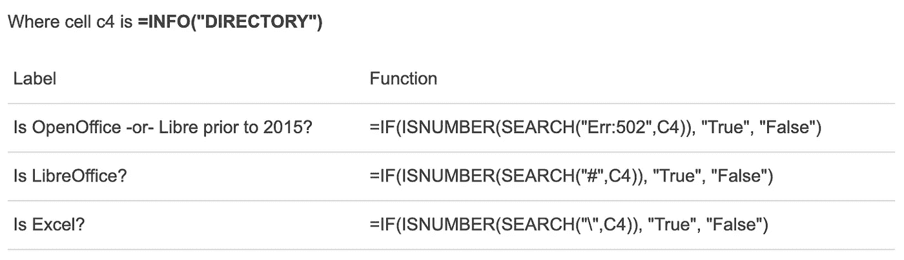
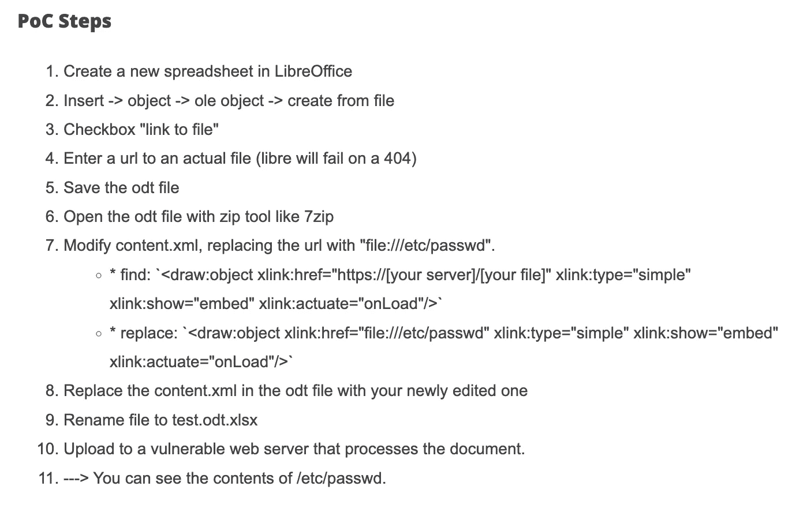
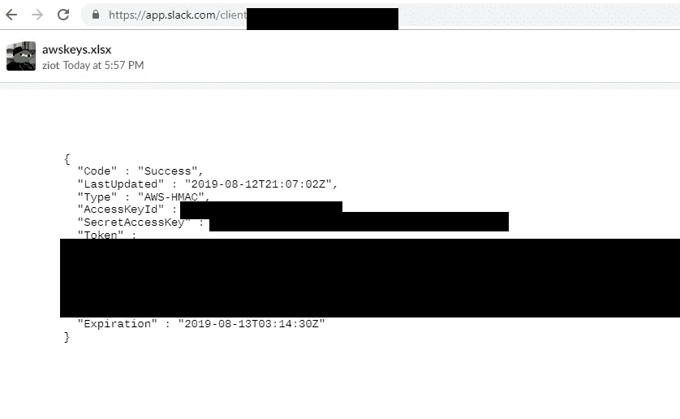

# 这个团队如何意外地发现 SSRF 在松弛暴露 AWS 凭证！4000 美元的昆虫赏金

> 原文：<https://infosecwriteups.com/how-this-team-accidentally-found-a-ssrf-in-slack-exposing-aws-credentials-a-4000-bug-bounty-513be19286e?source=collection_archive---------0----------------------->

## 复杂的库导致隐藏的攻击媒介

对于所有的 bug 赏金猎人来说，这是一个鼓舞人心的故事，讲述了 SSRF 漏洞是如何在 Slack 中被发现的，以及潜在的许多其他 web 应用程序，作者是[布雷特·布尔豪斯](https://twitter.com/bbuerhaus)、[科迪·布罗西厄斯](https://twitter.com/daeken)、[萨姆·埃尔布](https://twitter.com/erbbysam)和[奥利维尔·贝格](https://twitter.com/smiegles)。我将详细介绍他们的详细的“[一个在电子表格文件转换中利用漏洞的故事](https://buer.haus/2019/10/18/a-tale-of-exploitation-in-spreadsheet-file-conversions/)”的一个更加用户友好的版本，并且我提供的所有材料都来自布雷特的写作。我强烈鼓励读者阅读更多的技术细节。

我还将包括 Slack 关于透明性漏洞的消息

> Slack 要感谢研究人员为增加开源工具 LibreOffice 的安全性所做的工作，以及他们对 Slack 负责任的披露。文件共享的安全性对 Slack 及其用户至关重要，我们与研究团队合作，在收到报告的 24 小时内迅速实施了修复。Slack 已经确认，没有客户数据被利用这个 bug 访问。(来源:[Brett buer Haus 公司的电子表格文件转换利用的故事](https://buer.haus/2019/10/18/a-tale-of-exploitation-in-spreadsheet-file-conversions/))

人工智能生成的艺术“松弛与悲伤的脸旁边的插图”由 craiyon.com

# 侦察:电子表格指纹

该团队首先通过执行一项名为[指纹](https://cyware.com/news/what-is-cybersecurity-fingerprinting-de718f94)的网络安全技术进行初步侦察。指纹识别本质上是一个术语，用于收集有关系统的特定信息，以尝试识别程序、服务、操作系统等的类型。正在被那个系统使用。这里有一个[很好的链接](https://securitytrails.com/blog/cybersecurity-fingerprinting)来学习更多关于指纹识别的知识。

在这种情况下，团队希望了解使用什么软件来处理电子表格(即`XLSX`文件)。使用了以下方法:

来自[初始帖子](https://buer.haus/2019/10/18/a-tale-of-exploitation-in-spreadsheet-file-conversions/)的电子表格指纹方法

您可以在您的应用程序中使用它来看看会发生什么！此外，该小组指出，如果返回原始 pdf，其中包含的元数据可以识别用于处理的程序。Excel 是众所周知的微软电子表格处理器。 [LibreOffice](https://www.libreoffice.org/) 是一款免费的电子表格处理器，以前被称为 OpenOffice。

使用这个过程，团队能够识别出 Slack 是一个使用 LibreOffice 的应用程序……纯属意外！该团队最初没有测试 Slack，但通过在 Slack 上共享他们自己的文件，他们意识到 Slack 也在使用 LibreOffice 处理文件。

## LibreOffice 漏洞 1: EPFS 和 PostScript/GhostScript

团队注意到 LibreOffice 处理 [EPFS 文件](https://fileinfo.com/extension/epsf)。这些文件通常会被传递到另一个名为 [PostScript/GhostScript](https://www.ghostscript.com/) 的程序/系统，以便进行解释，并且已经报告了几个与此文件处理有关的漏洞，这些文件处理通常会自动执行。例如，这个 [Github 在处理 EPFS 时，越过了某个 python 库中的一个 RCE 漏洞](https://github.com/farisv/PIL-RCE-Ghostscript-CVE-2018-16509)。

该团队能够开发一个成功的 EPFS 有效载荷([此处链接到代码](https://gist.github.com/ziot/fb96e97baae59e3539ac3cdacbd09430)，具体归功于 [Cody Brocious](https://twitter.com/daeken) )用于[本地文件包含](https://www.acunetix.com/blog/articles/local-file-inclusion-lfi/)。使用这种有效载荷有一些细微差别，这是突出显示的 [Brett 的作品](https://buer.haus/2019/10/18/a-tale-of-exploitation-in-spreadsheet-file-conversions/)使得它每次都不工作。

这个漏洞似乎在一些应用程序上有效，但在 Slack 上无效。然而，这并没有让团队停下脚步。

## LibreOffice 漏洞 2:远程 OLE 对象 xLinking

通过进一步的测试，团队确定 LibreOffice 文档可以嵌入 [OLE 对象](https://en.wikipedia.org/wiki/Object_Linking_and_Embedding)，代表对象链接和嵌入。这些对象允许数据在支持不同文档类型的不同应用程序之间平滑转换。OLE 对象可能极其危险，网络安全和基础设施安全局(CISA)将 OLE 漏洞列为 2016-2019 年间被利用最多的漏洞。

> 根据美国政府的技术分析，恶意网络行为者最常利用微软的对象链接和嵌入(OLE)技术中的漏洞。OLE 允许文档包含来自其他应用程序(如电子表格)的嵌入内容。继 OLE 之后，报道第二多的易受攻击的技术是一个广泛使用的 Web 框架，称为 Apache Struts。(来源: [CISA 十大经常被利用的漏洞](https://www.cisa.gov/uscert/ncas/alerts/aa20-133a))

然后，该团队开发了一个初步的 POC 来利用 OLE。该团队还不得不做一些小的调整(细节可以在 OG 帖子中找到)以完全显示结果。这一招奏效了，成功地泄露了 Slack 中的秘密密钥！

来自[初始博客帖子](https://buer.haus/2019/10/18/a-tale-of-exploitation-in-spreadsheet-file-conversions/)的概念验证

`xlink-href`是如何被开发的，为什么会成功？该团队深入几个自称的“兔子洞”去了解 Python unoconv(通用办公转换器)。在 [PyUNO 桥](https://wiki.openoffice.org/wiki/PyUNO_bridge)中，它主要用于对 LibreOffice 命令进行 API 调用，代码在进行转换时会自动更新外部链接。这实质上是更新不可信的链接，允许黑客恶意更改链接到`//etc/passwd`，然后检索该文件的所有内容。

从[原始帖子](https://buer.haus/2019/10/18/a-tale-of-exploitation-in-spreadsheet-file-conversions/)中成功检索 AWS 密钥

# 这个故事的寓意

## 对于开发人员:

文档解析需要使用外部库，这些库通常很大、很复杂，并且具有许多可能被遗忘或细微差别很大的特性。要小心，因为这些文件中的许多可能是恶意的，有许多不同的攻击媒介。确保尽可能用沙箱保护该文件处理，以避免泄露敏感信息或允许 RCE。

## **对于猎人:**

不要放弃！这个团队经历了他们的开发和有效载荷的多次迭代，他们很可能经历了比他们发表的更多的迭代。当一个在其他应用程序中被证明有效的攻击媒介在 Slack 中失败时，他们会继续攻击其他的攻击媒介，直到获得成功的结果。对我来说，一个关键的见解是，这个团队内部并不满足于简单地利用漏洞，而是致力于研究漏洞的根本原因。我强烈建议阅读[他们的完整原帖](https://buer.haus/2019/10/18/a-tale-of-exploitation-in-spreadsheet-file-conversions/)，因为我获得了很多真知灼见。

整个团队( [Brett Buerhaus](https://twitter.com/bbuerhaus) 、 [Cody Brocious](https://twitter.com/daeken) 、 [Sam Erb](https://twitter.com/erbbysam) 和 [Olivier Beg](https://twitter.com/smiegles) )再次称赞你的出色工作，祝贺你获得 4000 美元奖金。感谢您通读，请在下面留下任何建设性的反馈、建议或问题！如果你喜欢，请考虑在 Medium 上跟随我或者[请我喝杯咖啡](https://www.buymeacoffee.com/robertocyberkid)。在 roberto.cyberkid@gmail.com 联系我，在 twitter 上关注我，在 LinkedIn 上联系我！

*来自 Infosec 的报道:Infosec 上每天都会出现很多难以跟上的内容。* [***加入我们的每周简讯***](https://weekly.infosecwriteups.com/) *以 5 篇文章、4 个线程、3 个视频、2 个 Github Repos 和工具以及 1 个工作提醒的形式免费获取所有最新的 Infosec 趋势！*