# 如何使用 Tenable Nessus 的 Active Directory Starter 扫描模板评估 Active Directory 的漏洞

> 原文：<https://infosecwriteups.com/how-to-assess-active-directory-for-vulnerabilities-using-tenable-nessus-active-directory-starter-74b8bce2218a?source=collection_archive---------1----------------------->

Tenable 的 Nessus 漏洞扫描器是一种广为人知的工具，用于对网络和设备(如工作站、网络设备和服务器)进行漏洞评估。虽然 Tenable 有一个单独的 Active Directory 安全产品 Tenable.ad，但 Nessus(以及他们的企业解决方案 Tenable.io)的一个很少被提及的功能是扫描 Active Directory 配置以发现漏洞。

# 漏洞覆盖率

Nessus 中包含一个名为“Active Directory Starter Scan”的扫描模板。出于某种原因，很难找到关于此模板的详细信息，但是，[根据 Tenable](https://www.tenable.com/blog/new-in-nessus-find-and-fix-these-10-active-directory-misconfigurations) 的一篇博客文章，此扫描对您的 Active Directory 配置运行以下十项检查:

1.  **Kerberos 认证:**域管理员或企业管理员帐户容易受到 Kerberos 认证攻击
2.  **脆弱的 Kerberos 加密**:Kerberos 加密在一个用户帐户上太脆弱，导致潜在的凭证盗窃
3.  **Kerberos 预认证验证:**Kerberos 预认证在一个用户帐户上被禁用，导致潜在的凭据被盗
4.  **不过期的帐户密码:**用户帐户可能永远不会更新其密码。
5.  **不受约束的委派:**不受约束的委派在允许潜在的凭证盗窃的计算机帐户上是允许的
6.  **空会话:**Anonymous 或 Everyone 组是允许空会话攻击的“Pre-Windows 2000 Compatible Access”的一部分
7.  **Kerberos KRBTGT:**Kerberos 主密钥太旧，可能会被用作后门
8.  **危险的信任关系:**在允许跨 AD 域横向移动的信任关系上没有激活任何安全机制
9.  **主要组 ID 完整性:**在用户帐户上发现了使用组 ID 的潜在后门
10.  **空白密码:**用户帐户可以使用空白密码在域上进行身份验证

# 创建凭据

在使用 Nessus 设置 Active Directory Starter 扫描之前，您需要[以 ADSI](https://docs.tenable.com/nessus/Content/Miscellaneous.htm) 的形式向 Nessus 提供域管理员凭证。为此，我建议创建一个服务帐户供 Nessus 使用。

1.  我在 Active Directory 中创建了一个名为“NessusScan”的新用户

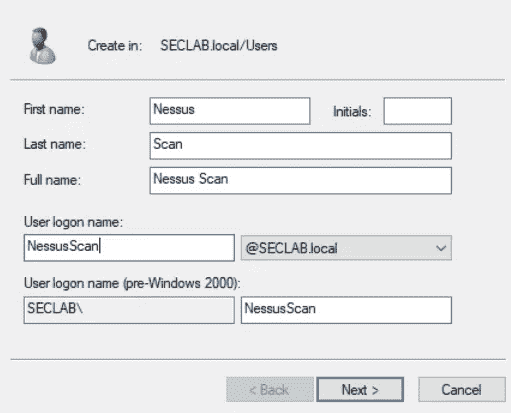

2.将用户帐户添加到“域管理员”组

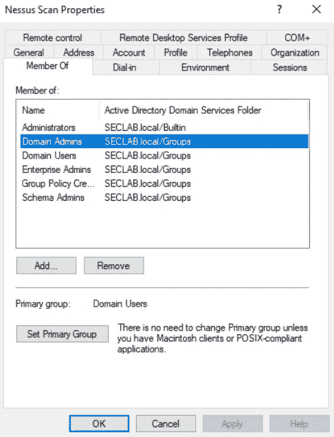

# 配置扫描

1.  如果使用 Nessus，请创建新的扫描

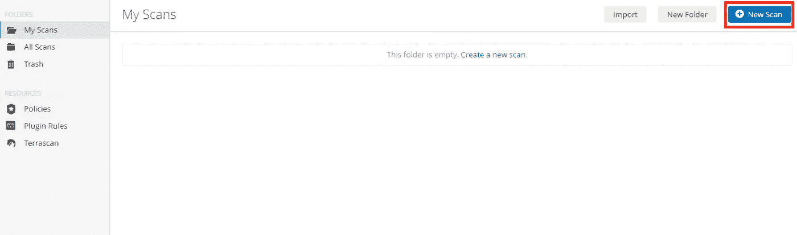

2.选择“Active Directory 启动程序扫描”

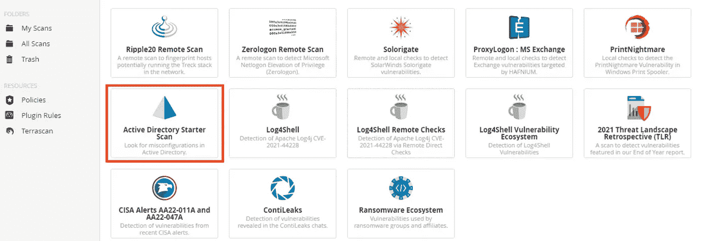

3.在“目标”下，输入域控制器的 IP 地址

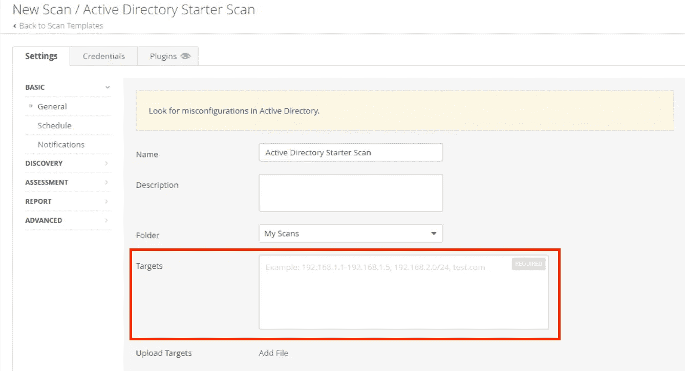

4.在凭据下，选择杂项类别，然后选择 ADSI

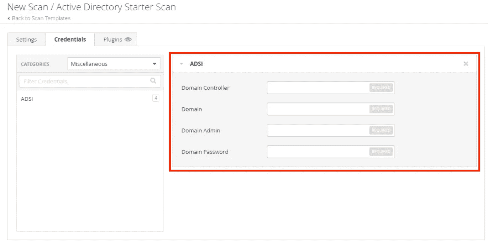

四个必填字段是:

*   **域控制器:【ActiveSync 的域控制器的名称**
*   **域:【ActiveSync 的 NetBIOS 域名**
*   **域管理员:**域管理员的用户名
*   **域密码:**域管理员的密码

对于我的实验室，这看起来如下:

*   *DC 实验室*
*   *SECLAB*
*   *尼斯坎*
*   **密码**

5.保存扫描并单击“启动”，或者在配置期间使用时间表功能

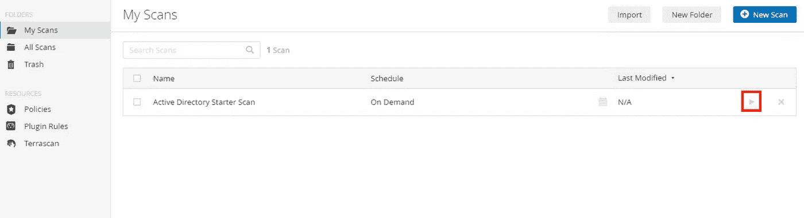

# 结果

将结果导出为 HTML 报告后，我们可以看到两台主机从扫描中返回:作为 IP 的活动目录域控制器和活动目录域控制器配置(在我的例子中，是 DC 实验室)。

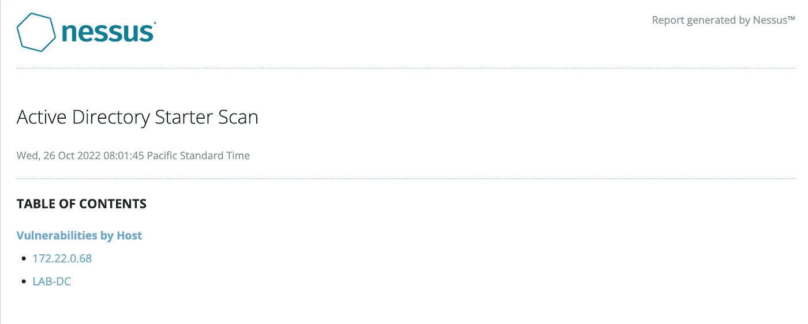

看一下 DC 资产实验室，我们看到了我有目的地引入到我的活动目录安全实验室环境中的各种漏洞。在这种情况下，我们的广告扫描发现了 1 个高严重性漏洞和 3 个中等严重性漏洞。

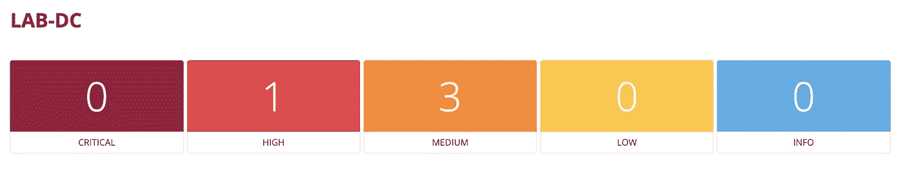

## Kerberoasting

我们发现的高严重性漏洞是 Kerberoasting 认证。这是因为我们有一个或多个与服务主体名称(SPN)相关联的帐户，使得凭证容易受到暴力攻击。

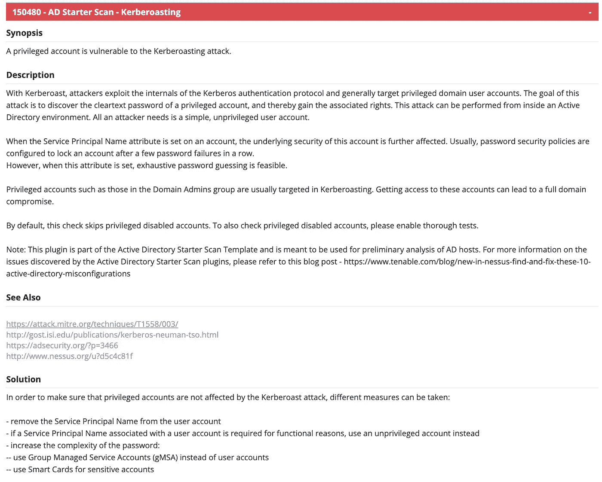

要查看哪些帐户受到影响，我们可以向下滚动到输出部分。

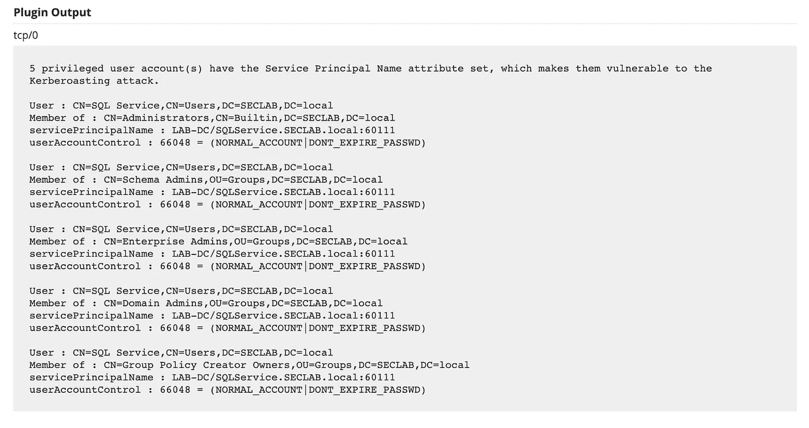

## Kerberos 预认证验证

发现的第一个中等严重性漏洞是(缺失)Kerberos 身份验证前验证。这是创建新用户帐户时默认启用(并且应该启用)的设置，但是也可以将其关闭。

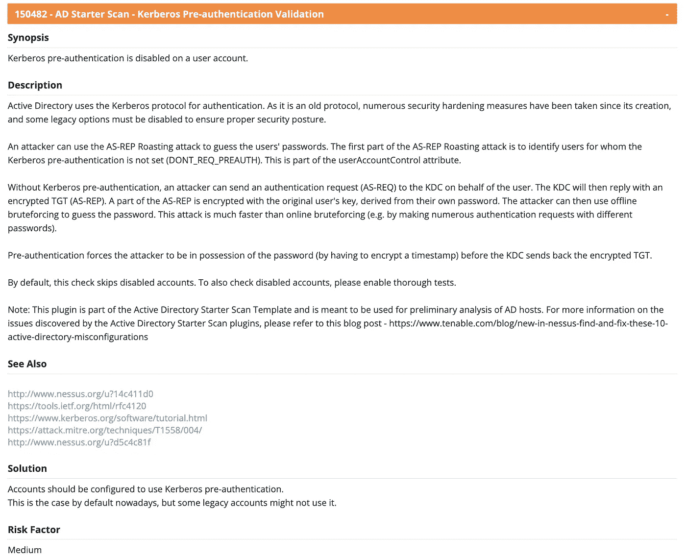

要查看哪些帐户受到影响，我们可以向下滚动到输出部分。

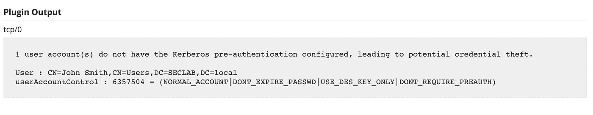

## 不过期的帐户密码

我们发现的第二个中等严重性漏洞是过期帐户密码，这些帐户的密码不会过期，因此可以长时间保持不变。

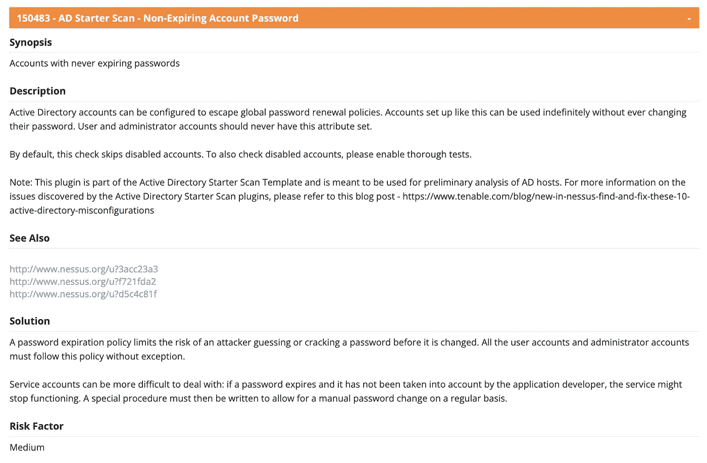

要查看哪些帐户受到影响，我们可以滚动到输出部分。

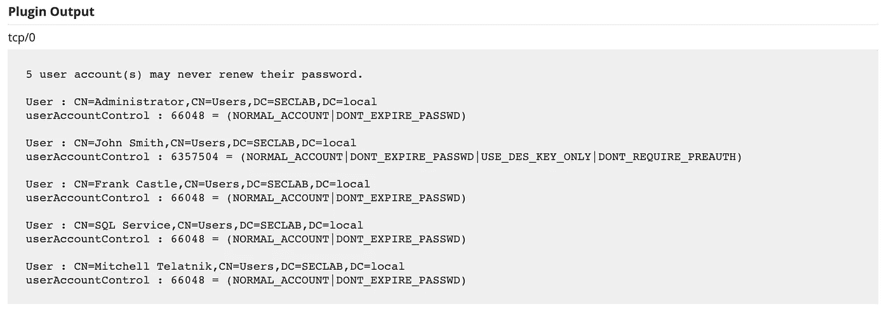

## 弱 Kerberos 加密

我们发现的第三个也是最后一个中等严重性的漏洞是弱 Kerberos 加密。Kerberos 可以配置为使用各种加密方法。仍然可以将帐户配置为使用 DES 加密，这是不安全的。默认情况下，新帐户不会被配置为使用 DES。

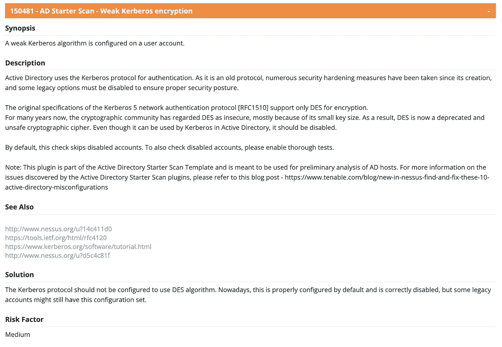

要查看哪些帐户受到影响，我们可以滚动到输出部分。

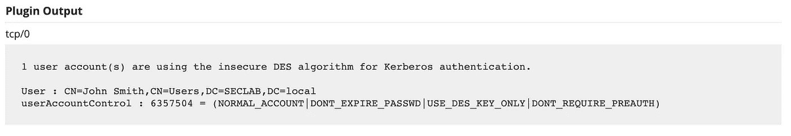

# 结论

Nessus 和 Tenable.io 等其他 Tenable 产品被安全专业人员广泛用于进行漏洞评估。但是，有许多强大的功能，例如审计 Active Directory 配置，但这些功能通常不会被利用。下次如果您需要快速了解活动目录配置的安全问题，请使用 Nessus 扫描仪！

## 来自 Infosec 的报道:Infosec 每天都有很多内容，很难跟上。[加入我们的每周简讯](https://weekly.infosecwriteups.com/)以 5 篇文章、4 条线索、3 个视频、2 个 GitHub Repos 和工具以及 1 个工作提醒的形式免费获取所有最新的 Infosec 趋势！