# 如何屏蔽抖音的 IP

> 原文：<https://infosecwriteups.com/how-to-block-tiktok-ips-e19e9ead8938?source=collection_archive---------0----------------------->

## 在您的防火墙上

# **在过去的两年里，抖音因其受欢迎程度和收集大量用户数据的事实而获得媒体关注，这些数据包括位置、观看的视频、剪贴板、操作系统等等**

只要你控制用户连接到抖音的连接，你就可以尝试在 **DNS** 级别阻止对应用的访问，使用与抖音相关的 IP 和域名的阻止列表

本指南着重于在 **FortiGate 防火墙**上这样做，但是使用流行的路由器[https://amzn.to/3nKMiAm](https://amzn.to/3nKMiAm)和防火墙的方法应该是相似的

# **步骤 1 -获得抖音域名和知识产权**

当用户登录、上传或观看视频时，抖音使用不同的连接域。为了减少这一点，你需要谷歌“阻止抖音域名”

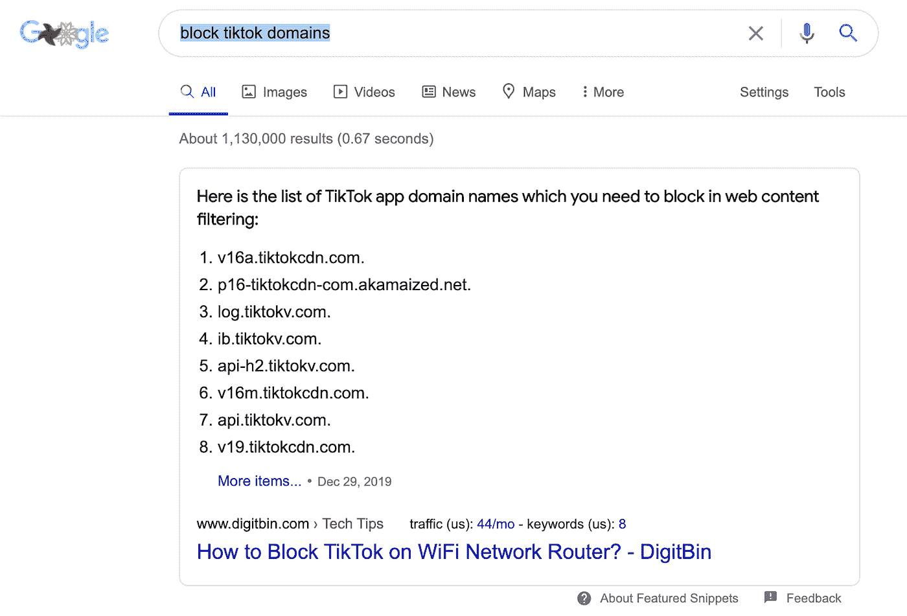

# **第 2 步—复制所有域名并粘贴到一个文本文件中，然后保存它**

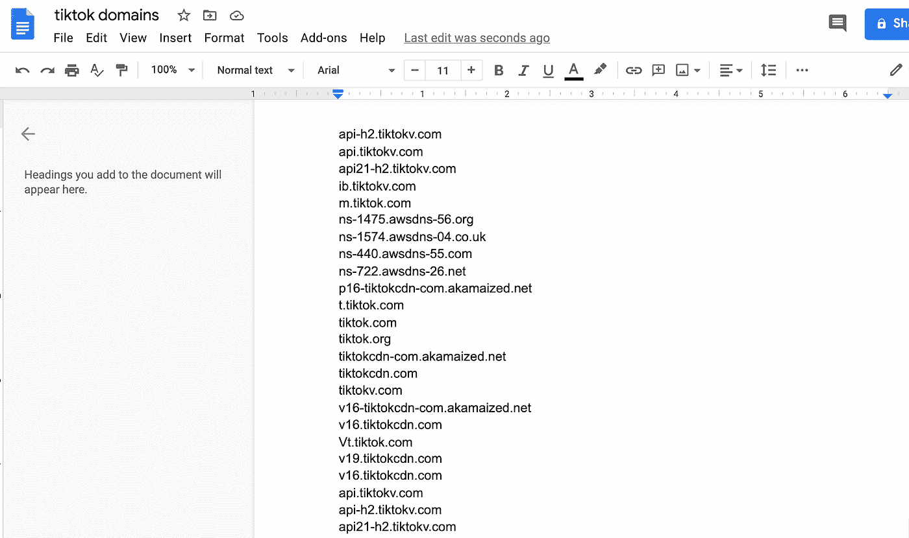

该文件应该是纯文本，每行一个 IP 地址

在我们的 FortiGate 防火墙上，我们将使用外部 IP 阻止列表，在许多其他设备中，您可能需要手动输入该列表，但在这里，我们实际上将我们的文本文件加载到 web 服务器，这样我们可以更轻松地管理该列表，因为我们可能需要添加更多的域

# 步骤 3 —登录您的 FortiGate-security fabric—fabric 连接器。这是我们将连接到抖音 IP 列表的地方

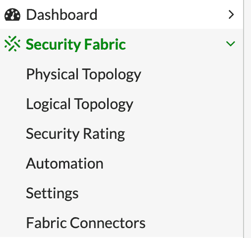

打开后，点击新建，您将看到以下页面

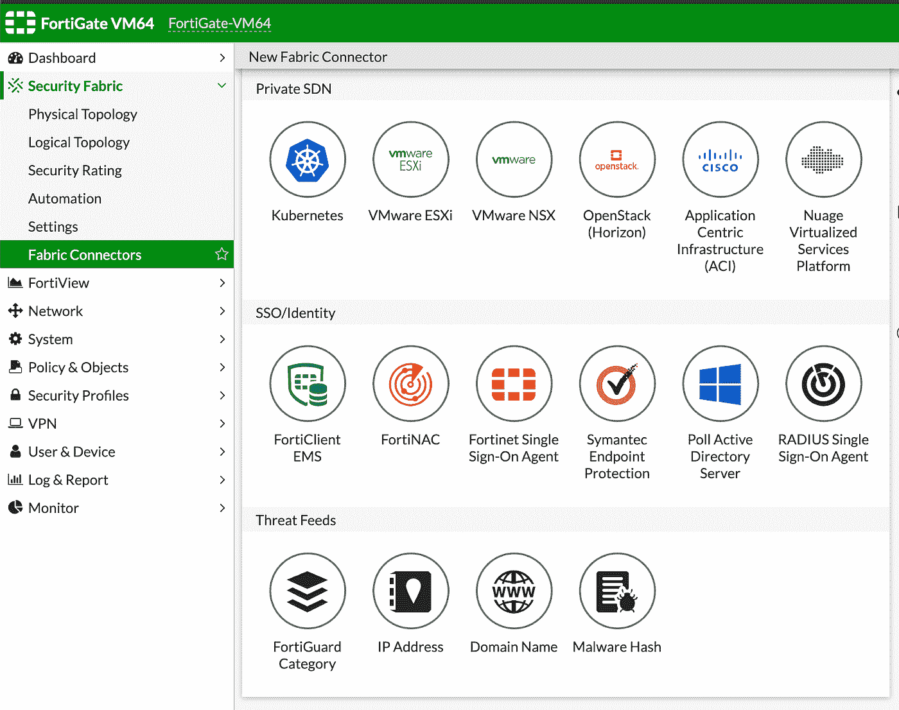

有不同的连接器，但我们将选择页面底部的威胁源连接器，并选择 IP 地址

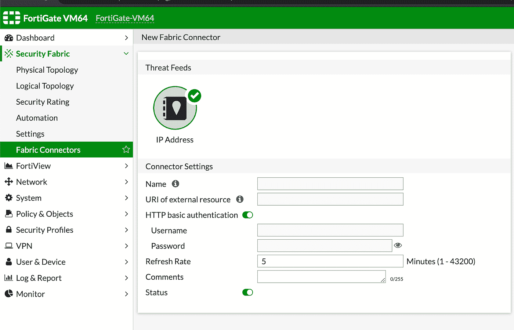

命名威胁源并输入文本路径

保存后，您将看到您的第一个威胁源

# 步骤 4 —让我们转到 DNS 过滤器，它位于“安全配置文件”窗格

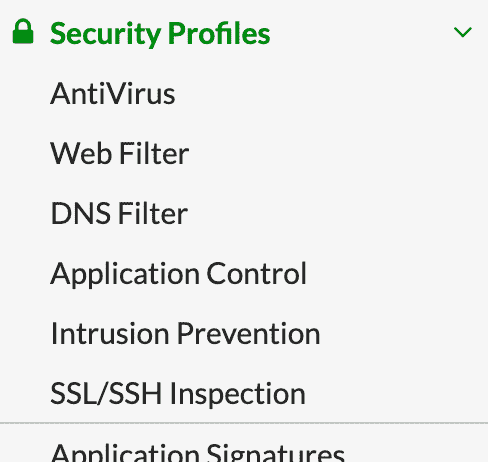

单击并创建一个新的 DNS 过滤器传感器，并将其命名为

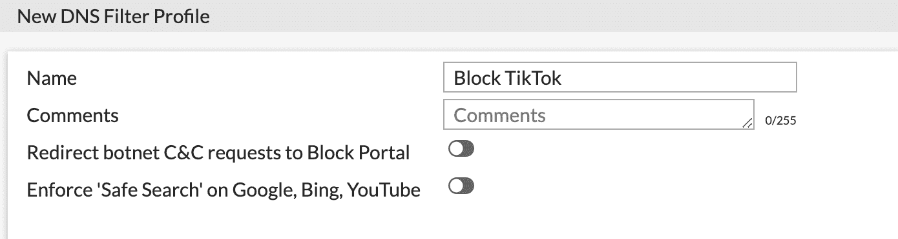

向下滚动到静态域过滤器部分

**启用**

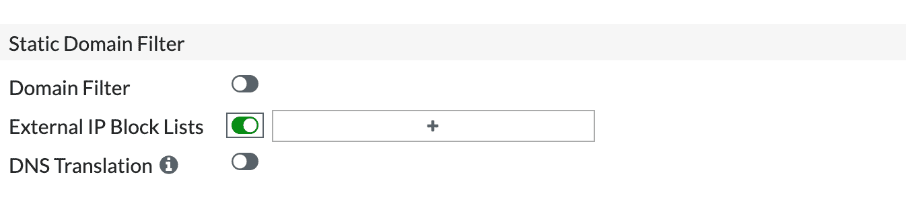

按+号并选择条目，即您的威胁馈送(您之前在结构连接器中创建的那个)

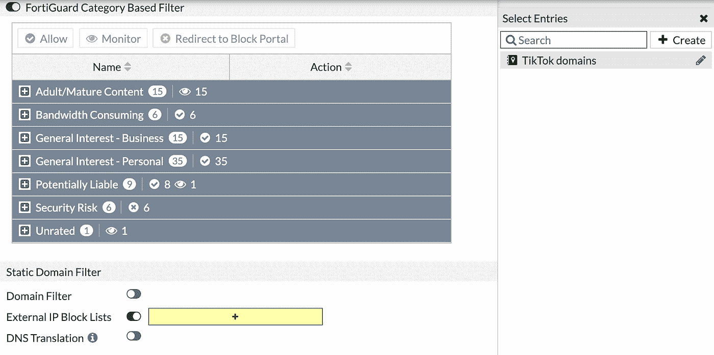

单击确定并保存它

**在您的 DNS 过滤器页面上，您将看到您的新过滤器**

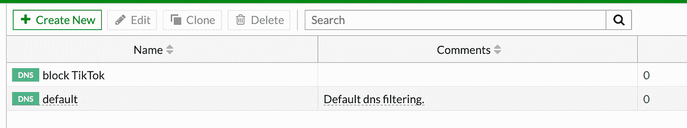

让我们进入最后一部分，将您的 DNS 过滤器应用到您的策略

# 步骤 5 —移至策略和对象 IPV4 策略

点击策略，您想要添加 DNS 过滤器，在我的例子中，它是完全访问策略

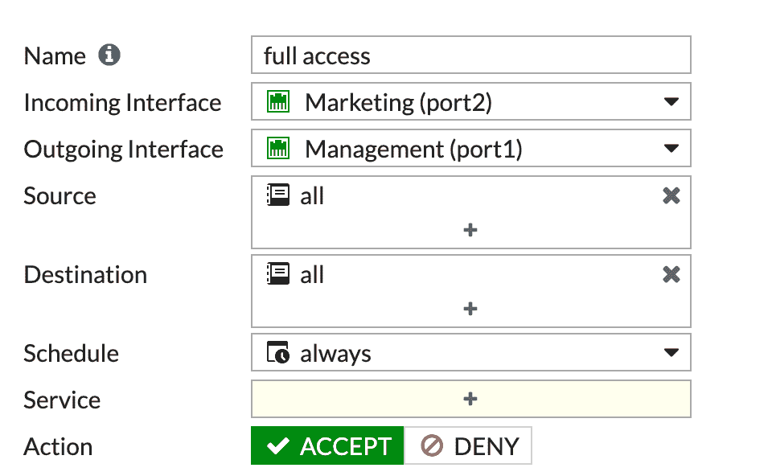

向下滚动到安全性配置文件部分

启用 DNS 过滤器并选择我们的**块抖音过滤器**

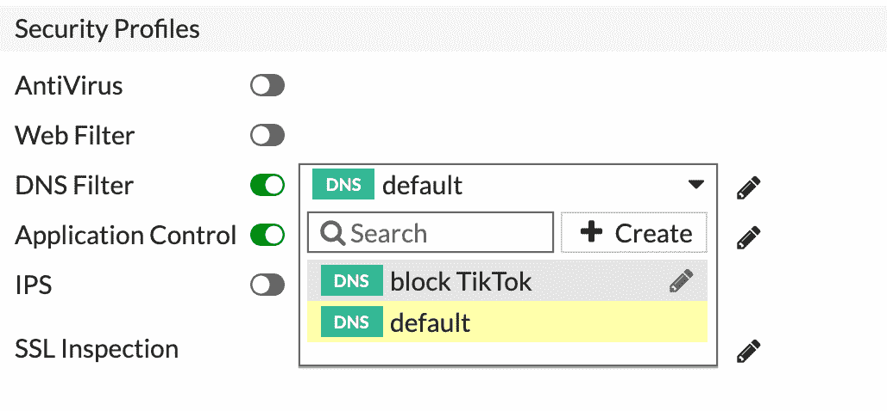

保存您的策略，就大功告成了

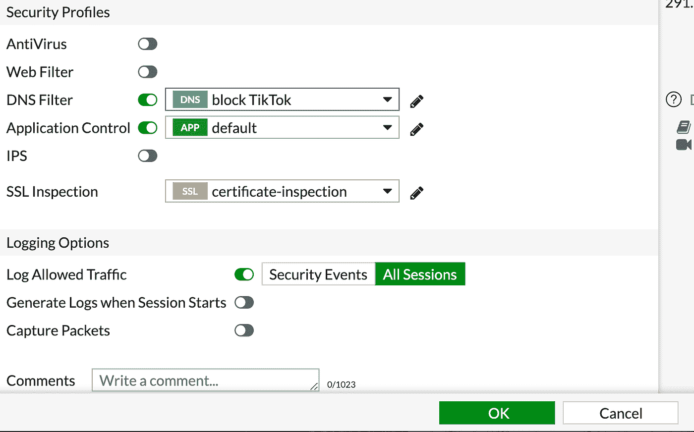

摘自我的《Fortigate 安全袖珍指南》一书，https://www.amazon.com/dp/B08VGRSMWS/ref=sr_1_9?dchild = 1 & keywords = fortigate+book & qid = 1612034823 & Sr = 8-9

我做了一个短片，展示了整个过程

我的 Fortigate 管理手册[https://amzn.to/3brDX1t](https://amzn.to/3brDX1t)

你可以订阅我在 youtube.com/fortitip 的频道或者参加我在 https://www.udemy.com/course/fortigate-admin-crash-course/?[的 FortiGate 课程 referral code = 0 b 534 DCF 7 a6 D8 BD 3417 e](https://www.udemy.com/course/fortigate-admin-crash-course/?referralCode=0B534DCF7A6D8BD3417E)