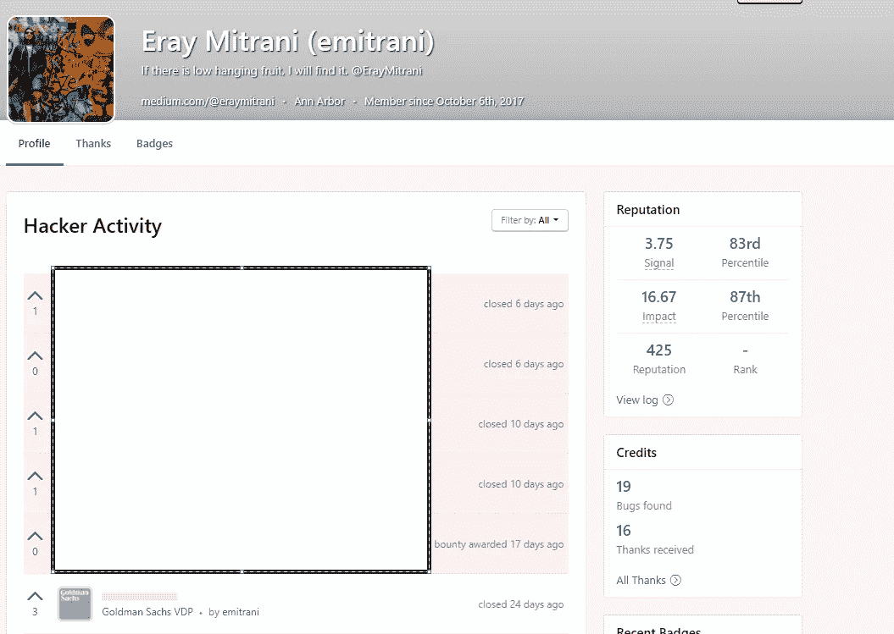

# 如何在没有打嗝 Pro 的情况下高效的蛮力

> 原文：<https://infosecwriteups.com/how-to-brute-force-efficiently-without-burp-pro-1bb2a414a09f?source=collection_archive---------0----------------------->

# Wfuzz 和 T2 宣布他们是天造地设的一对。



在过去的一个月里，我试图将我的侦查游戏与其他黑客区别开来。尽管这些不是革命性的技巧，但我认为它们没有被充分利用。但是，请注意，这些会产生一些噪音，可能会让你被列入 cdn 甚至 ISP 的黑名单，所以不要太疯狂地进行测试。我将要分享的工具应该可以帮助你们解决 CTF 和 bug 奖金的问题。

首先，我告诉自己，在 3 个月前使用 wfuzz 获得第一笔大额奖金后，我会得到[打嗝套件 Pro](https://portswigger.net/burp) 。wfuzz 是一个非常通用的工具，可以用于很多事情。就个人而言，我主要使用它进行内容发现、管理帐户接管和枚举易受 IDOR 攻击的端点。我会试着解释如何使用这个工具，但是我说的任何东西都不能代替[文档](https://wfuzz.readthedocs.io/en/latest/index.html#)，所以我建议你先去读一下。

使用 wfuzz 最简单的方法是快速发现内容。这对 CTF 和臭虫赏金非常有用。首先，我建议将 SecLists 克隆到 wfuzz 目录中。我对那里的单词列表做了一些个人修改，但是在这个例子中，我使用了一个大目录单词列表。


*wfuzz -z 文件，ldir.txt -t 150 — hc 418，404，403，302，301*[*https://vuln.target.com/FUZZ*](https://vuln.target.com/FUZZ)

我将上面的命令分解一下，第一个参数*-*-***z 文件，*-**是指定 wordlist wfuzz 将**-*替换为*-**关键字。 **-t** 代表线程，因此将使用 150 个线程。 ***-hc*** 用于隐藏 http 响应，因此不会显示 418，404，302 个响应，因为我们对内容发现的 200 个响应最感兴趣。

我认为使用 wfuzz 最重要的是知道如何使用-hc -hh -hl 等过滤结果。第一个根据 HTTP 状态代码过滤，第二个根据响应中的字符数过滤，第三个根据响应中返回的行数过滤。根据您要寻找的内容，您可能希望通过不同的方法进行筛选，以获得正确的结果。这是一个真实的世界运行可能看起来像在哪里，我试图找到我或私人资料图片。

```
$ wfuzz -z file,m.txt --hc 404,403 -t 100 https://**REDACTED**.com/avatars/FUZZ/normal_avatar.png
********************************************************
* Wfuzz 2.2.9 - The Web Fuzzer                         *
********************************************************

Target: https://**REDACTED**.com/avatars/FUZZ/normal_avatar.png
Total requests: 75000

==================================================================
ID      Response   Lines      Word         Chars          Payload
==================================================================

022179:  C=200     25 L      143 W         6754 Ch        "**REDACTED**"
039413:  C=200     68 L      341 W        18338 Ch        "**REDACTED**"
055859:  C=200    138 L      813 W        41353 Ch        "**REDACTED**"
063779:  C=200     47 L      212 W         7588 Ch        "**REDACTED**"
069880:  C=200    159 L      775 W        33480 Ch        "**REDACTED**"
072513:  C=200    102 L      485 W        23472 Ch        "**REDACTED**"

Total time: 105.0043
Processed Requests: 75000
Filtered Requests: 74994
Requests/sec.: 714.2557
```

如果你想有效地使用 wfuzz，我还有几个小技巧。

1.  对于 post 请求，将 curl 命令格式化如下:

```
curl 'https://REDACTED/login' -H 'authority: ' -H 'cache-control: max-age=0' ... --data 'csrf_token=5ed1ed15fd8aceadb94e471d4bacc51936b54b28&came_from=%2F&login=admin&password=hunter12' --compressed--------------------------------------------------------------------wfuzz -z file,passwords.txt --hc 403,200 -t 100 -d 'csrf_token=5ed1ed15fd8aceadb94e471d4bacc51936b54b28&came_from=%2F&login=admin&password=FUZZ' -H 'authority: ' -H 'cache-control: max-age=0' ... https://REDACTED/login
```

2.自己生成一些有用的有效载荷添加到单词列表中，例如所有的 5 位数数字等

```
limbo@LimBomber:~/wfuzz/wordlist$ head 20hex.txt
db4fefbc5d617dc676f2
954fdebfdbca06455f9c
0d90baa6da88f989fd21
440f1f5d2ffeb7b33293
c858d853c5446e6c0b5b
cde6016e932cfcd06648
5d2a83523dd9750322a9
8cbdda6b8fdf39319dbd
f2a257a412650c30c162
bc049915fc636afed9ee
limbo@LimBomber:~/wfuzz/wordlist$ head 6rand.txt
22u01L
aAZAH2
oFUk8g
9i6Dpp
u9mY6E
wyxndG
vPncFw
801Uo8
d7RzKd
6SL0RU
limbo@LimBomber:~/wfuzz/wordlist$ head 4dig.txt
1000
1001
1002
1003
1004
1005
1006
1007
1008
1009
limbo@LimBomber:~/wfuzz/wordlist$ cat md.py
import md5
for i in range(10000, 85000):
        m = md5.new()
        m.update(str(i))
        print(m.hexdigest())
```

这就是我现在所知道的，请随意发表评论或在 [Twitter](https://twitter.com/ErayMitrani) 上提问，我会尽力回答。