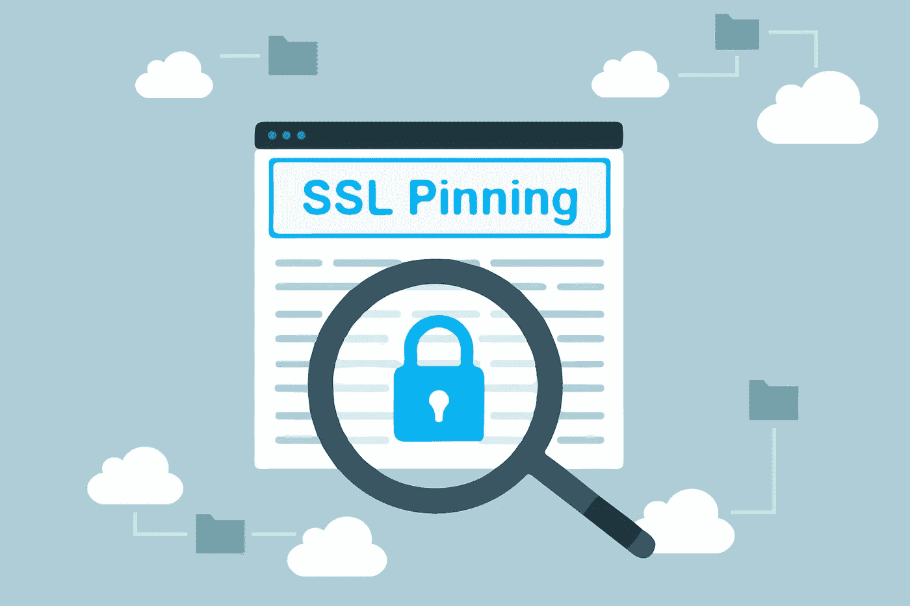
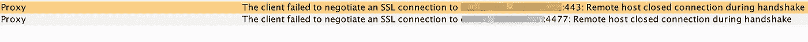
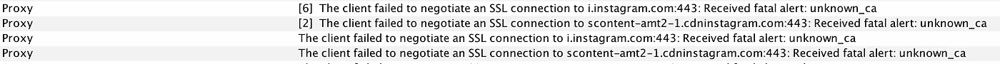
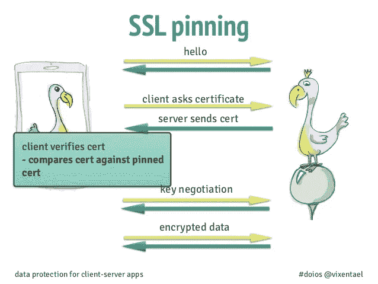
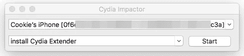
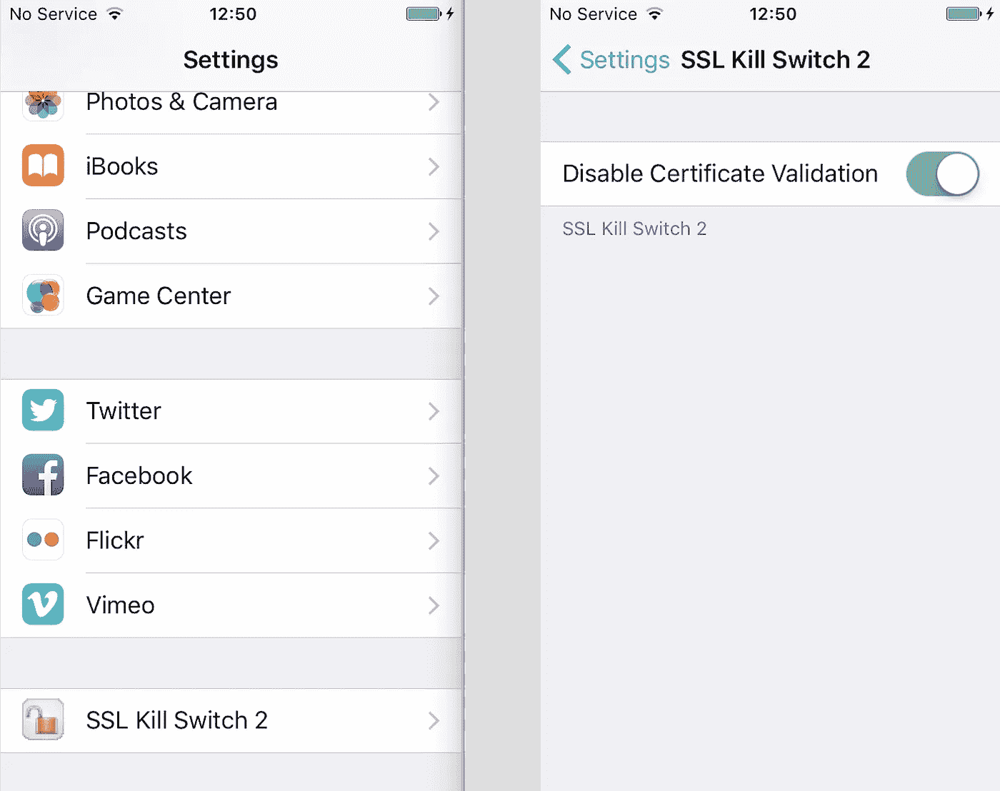

# 如何绕过证书验证(SSL 固定)

> 原文：<https://infosecwriteups.com/how-to-bypass-certificate-validation-ssl-pinning-ef8af8b15c40?source=collection_archive---------1----------------------->

这篇文章将一如既往的“如何……”这是我从上个月学到的。我写这篇文章是为了不忘记一些特别的东西，并与我所有的订户分享。很惊讶这里有这么多追随者。因为我把我学到的东西作为记事本开始写博客。

所以这个技术的想法伴随着这个问题出现在我的脑海里。一旦我测试了一个目标——我用我的打嗝代理看不到任何东西。报警出现在打嗝标签与信息连接被拒绝。握手期间远程主机关闭了连接。或者服务器收到致命警报:unknown_ca

这是应用程序中的 SSL pining 保护，不允许使用您的打嗝代理进行常见的 MITM 攻击。我不是移动方面的专业人士，但我总是检查原生应用(iOS/Android)以扩展我的范围。在本地/移动应用程序中，你总能看到一些有趣的主机，或者应用程序使用的有趣路径。大多数情况下，证书问题出现在关注安全性的大品牌和勇敢的开发者身上(脸书、Instagram、优步、一些银行应用..e.t.c)

下图中情况简要说明

在互联网上，有一些主要的技术可以帮助你使用 SSL pin:

*   **通过反编译 APK 并再次编译来禁用代码中的证书锁定。**

对于 Android，使用 [Dex2jar](https://github.com/pxb1988/dex2jar) 工具可以像这样**sh d2j-dex 2 jar . sh-f your . apk**。但是在这种情况下，不能保证你会在代码中找到正确的位置和正确的修复。例如，在费利佩·利马的那篇文章中，有一些制作的技巧。但正如他所说——这不是一个防弹解决方案，可能不是在所有情况下都有效，这取决于应用程序如何执行锁定或是否执行任何类型的运行时签名检查。

*   **使用手机内部的特殊工具禁用 SSL 锁定功能(** [**SSL 锁定开关**](https://github.com/nabla-c0d3/ssl-kill-switch2) **)**

在这种情况下，你需要让你的 iOS 手机越狱。之后你的手机就不那么安全了。但在我看来，最好是使用特殊的电话，你不使用每天(又名测试设备)。

*   **使用 iOS 版 IPAPatch 工具禁用 SSL Pining**

此处可用[描述该工艺。这种技术允许不越狱你的手机。但是仍然需要一些应用程序 ipa 文件的操作(如果我错了，请纠正我)。](https://github.com/Naituw/IPAPatch)

所以在我的理论中，绕过 ssl 绑定的最佳解决方案是——越狱设备上的 SSL 终止开关。

首先，我们需要为我们的 Iphone 安装 Jailbrake。我用了我的测试设备 iPhone 5s ios 10.3.3。

**以下是准备设备的一些步骤。**

1.  安装 Cydia 安装工具— [撞击器](http://www.cydiaimpactor.com/)
2.  然后我们需要下载越狱——我用的是[这个](https://g0blin.sticktron.net/)(iOS 10.3–10 . 3 . 3 的地精 wip 越狱)

3.拖放越狱文件到撞击器区域。

4.提供 iphone 凭证来安装此越狱

之后，你只需要在"**档案&设备管理"**中确认你的应用程序，然后打开出现在屏幕上的小精灵应用程序，点击越狱和重启按钮。

接下来，你需要安装 [SSL Kill Switch](https://github.com/nabla-c0d3/ssl-kill-switch2/releases) tweak，将文件传输到 iPhone。为此，我在 mac 上使用 FileZilla，通过 sftp 连接到我的测试 iPhone。建议你在 Cydia store 上用 OpenSSH tweak。有了 OpenSSH，将 SSL Kill Switch 文件传输到你的 iphone 就变得很容易了。

如果你知道如何更容易地安装 SSL Kill Switch，请在评论中告诉我:)

成功安装后，IOS SSL 删除开关开始出现在设置下。切换开关将启用/禁用锁定。

我的情况是，我确实从一个银行应用程序绕过了 SSL pin。在其他许多情况下，它对我也有效。但如果 facebook 应用程序或 instagram 应用程序对你不起作用，也不要感到惊讶。这是一个已知的问题，你可以试着用这里的评论[中的补丁来修复它。](https://github.com/nabla-c0d3/ssl-kill-switch2/issues/13#issuecomment-360294883)

PS:下次我会尽全力去了解如何用 IPAPatch 工具进行管理。

玩得开心点，伙计们！并且有很好的渔获；)

也有帮助的链接—[https://infosecninja . blogspot . com/2017/05/working-with-burp suite-mobile-assistant . html](https://infosecninja.blogspot.com/2017/05/working-with-burpsuite-mobile-assistant.html)