# 如何绕过 Android 应用中的加密机制

> 原文：<https://infosecwriteups.com/how-to-bypass-encryption-mechanism-in-android-apps-720e9431bc67?source=collection_archive---------0----------------------->

*raywenderlich.com 原创作品*

嗨，朋友们，希望你们都好。众所周知，开发人员和测试人员总是喜欢玩猫捉老鼠的游戏。不管我们多么想否认这个事实，但我们让彼此的生活变得艰难。

如今，移动应用程序开发人员在他们的应用程序中实现了一种加密机制来防止篡改。

然而，有办法绕过这种机制。我将演示一个场景，当您遇到这种应用程序行为时，它会对您有所帮助。

我们将使用受伤的机器人进行演示。[受伤的 Android](https://github.com/B3nac/InjuredAndroid) 是一个 CTF 风格的易受攻击的应用程序，旨在练习 Android 测试。对构建这个应用程序的作者 [B3nac](https://twitter.com/b3nac) 大声疾呼。

# 为什么值得一读？

我遇到过许多高度依赖客户端加密的应用程序，作为我们需要发现的额外安全层。当你使用你最喜欢的代理工具拦截流量时，你只会看到加密的文本。

这是因为所有的请求都在客户端加密并发送到服务器。服务器将编码相同的加密算法，因此在接收数据时，它将解密并获取值。

如果你正在进行 Android 测试或者想要开始，这篇文章是为你准备的。

# 装置

点击从[下载最新版本。我在这篇文章中使用的是](https://github.com/B3nac/InjuredAndroid/releases) [genymotion](https://www.genymotion.com/) 。使用 genymotion 运行虚拟设备，并通过输入以下命令安装 APK。

`adb install injuredandroid.apk`

成功安装后，您将看到以下屏幕。

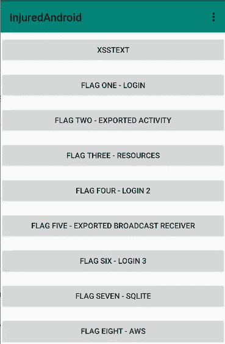

# 识别

我们感兴趣的是**标志六—登录 3** 。这是我们的 FlagSix 屏幕的样子，它有一个文本框和一个**提交**按钮。

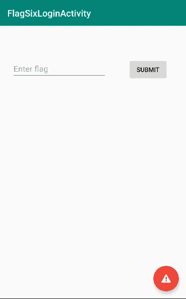

我已经尝试输入随机文本，并点击提交，但没有任何反应。我们的下一步是查看 java 源代码，以便理解该活动的功能。

让我们反编译 APK 来获取应用程序源代码。为了简单起见，我使用了 [MobSF](https://github.com/MobSF/Mobile-Security-Framework-MobSF) ，这使得任务变得容易多了。下面是《暴走族》中 APK 的简介。

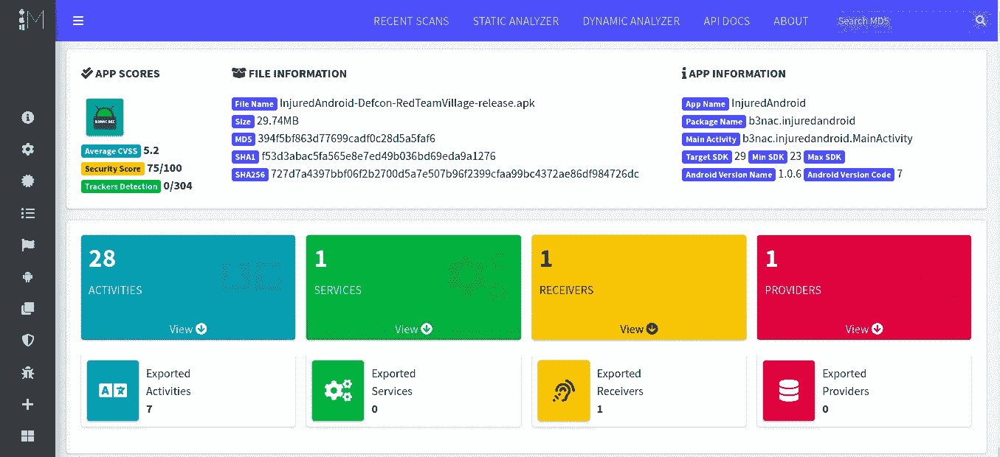

有一大堆[活动](https://www.tutorialspoint.com/android/android_acitivities.htm)要看。似乎是我们的目的地。

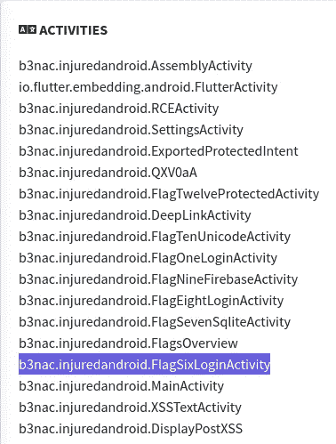

# 愿源代码(代码)与你同在

让我们看一下代码。关注`submitFlag()`法

在这里，我们可以清楚地看到 **submitFlag** 方法，点击**提交**按钮将调用该方法。它从文本框(editText3)中获取值，将其转换为字符串，并与`j.a("k3FElEG9lnoWbOateGhj5pX6QsXRNJKh///8Jxi8KXW7iDpk2xRxhQ==")`方法的输出进行比较。

`k3FElEG9lnoWbOateGhj5pX6QsXRNJKh///8Jxi8KXW7iDpk2xRxhQ==`是我们的加密文本。

这个应用程序使用了某种程度的混淆，我们需要确定什么是`j.a()`方法？我们包里有`b3nac/injuredandroid/j.java`级。

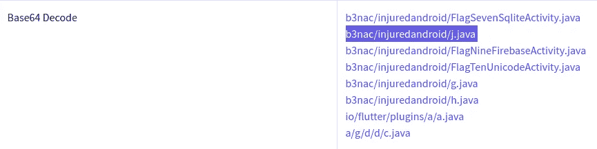

`a()`方法有以下代码，它是一种解密方法。从代码中我们可以清楚地看出使用了 [DES](https://en.wikipedia.org/wiki/Data_Encryption_Standard) 对称密钥算法。

祝贺第一个里程碑的实现！

下面的代码使用来自`f2002a`的值来生成密钥。

我们的下一个目标是找到钥匙，它一定在某个地方被编码了。

探险仍在继续..

类`j`定义了一个字节数组，它从`h.a()`方法中获取值。

`private static final byte[] f2002a = h.a();`

# h.java 有以下代码

方法`a()`返回一个键的字节数组，但在此之前，它正在解码一个 base64 字符串`Q2FwdHVyM1RoMXM=`

让我们解码找出真正的钥匙。

`echo Q2FwdHVyM1RoMXM= | base64 -d`

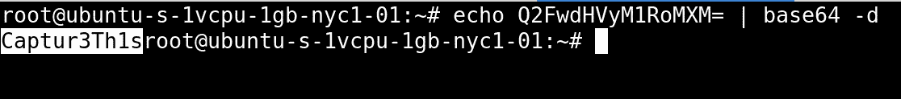

# 实现第二个里程碑

我们拿到了钥匙:`Captur3Th1s`

现在，可以使用这个密钥通过一些定制的 java 类或在线工具来解密密文。但是我们要做一个更简单的选择。

# 让我们在这里暂停一下

在测试一个应用程序时，有一些关键词可以快速帮助我们识别加密所用的类和算法。虽然当代码被混淆时会有点棘手。

## 关键词

加密、解密、加密、AES、DES、SecretKeyFactory、secretKey、Cipher、InvalidKeyException 等。

让我们在当前的 APK 中搜索这些关键字，看看我们是否真的到达了`j.java`文件。

## 数据加密标准

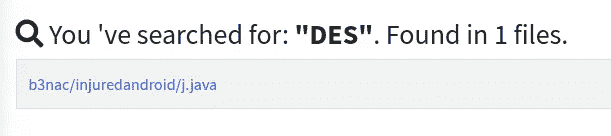

## SecretKeyFactory

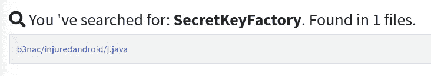

## InvalidKeyException

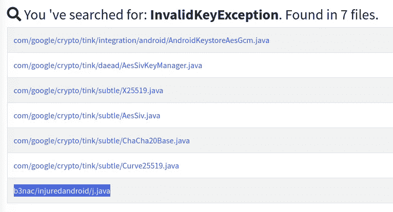

这就是我们如何快速识别负责加密的类。

# 回到我们的例子

我们掌握了解密方法。根据我们的理解，应用程序正在获取用户输入，并将其与解密后的值`k3FElEG9lnoWbOateGhj5pX6QsXRNJKh///8Jxi8KXW7iDpk2xRxhQ==`进行比较。

如果当应用程序比较值时，我们可以看到前面提到的密文的解密值是什么，会怎么样？是啊！！我们肯定能做到！

为了完成这项任务，我们将使用 [FRIDA](https://frida.re/) ，它是一个动态工具套件。使用 Frida，我们可以在运行时修改应用程序逻辑，它允许我们将脚本注入到正在运行的进程中。这是你的 android 测试武库中的必备工具包。

**总结:**我们将挂钩`j`类的解密方法`a()`，当应用程序试图比较字符串时，我们将打印纯文本值。

# 弗里达开始了

让我们快速看一下下面的 JS 代码，它将使用我们提供的值调用解密方法`a()`。我们构建了这个 JS 代码来覆盖解密方法。

## 解密. js

方法`a()`只需要一个参数，即要解密的密文。我们在`this.a()`方法中提供了密文，它将响应存储在字符串变量`ret`中。

## 是时候运行 Frida 脚本了。

`frida -U -f b3nac.injuredadnroid --no-pause -l decrypt.js`

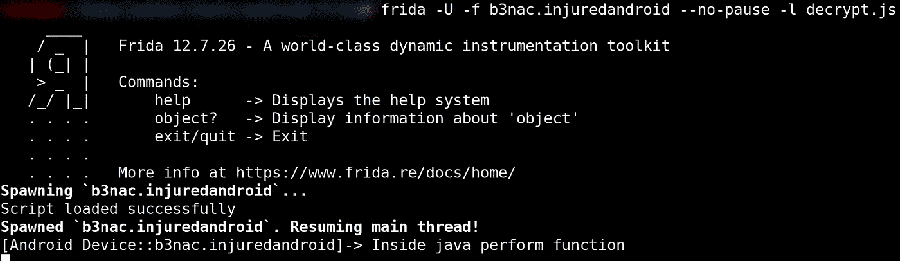

正如我们所见，Frida 脚本运行成功。这将在我们的模拟器中启动应用程序。

Frida 脚本覆盖了解密方法。当我们与 flag6 活动交互时，我们将看到它的效果。让我们开始第六号旗的活动。输入任意值并点击**提交**按钮。

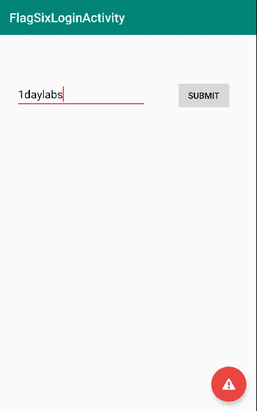

屏幕上没有发生任何活动，但是如果我们转到 Frida 控制台，我们将得到以下输出以及解密后的文本

`{This_Isn't_Where_I_Parked_My_Car}`

通过覆盖解密方法，我们成功地将密文解密为纯文本。

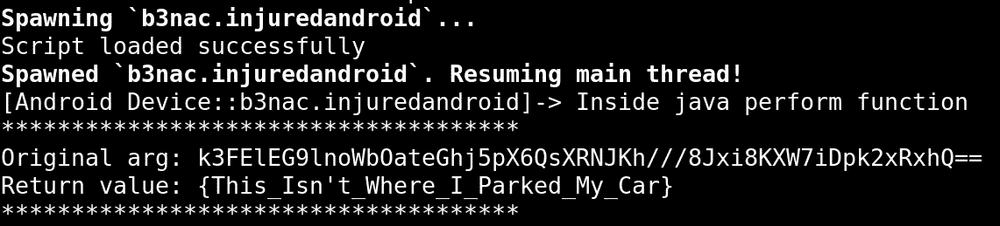

现在想象一下，如果这是一个真实的应用程序，那么您可以使用相同的技术在它被加密并发送到服务器之前注入您的有效负载。通过这种方式，我们绕过了应用程序中编写的加密逻辑，这是为了使应用程序不被篡改。

我喜欢写这篇文章，希望你喜欢阅读它。

**快乐黑客:-)**

# 参考

*   [https://github.com/B3nac/InjuredAndroid](https://github.com/B3nac/InjuredAndroid)
*   [https://github.com/MobSF/Mobile-Security-Framework-MobSF](https://github.com/MobSF/Mobile-Security-Framework-MobSF)
*   https://frida.re/docs/android/

推特:[@ jaimin _ gohel](https://twitter.com/jaimin_gohel)
LinkedIn:[@ jaimin-gohel-440 a4 a52](https://www.linkedin.com/in/jaimin-gohel-440a4a52)