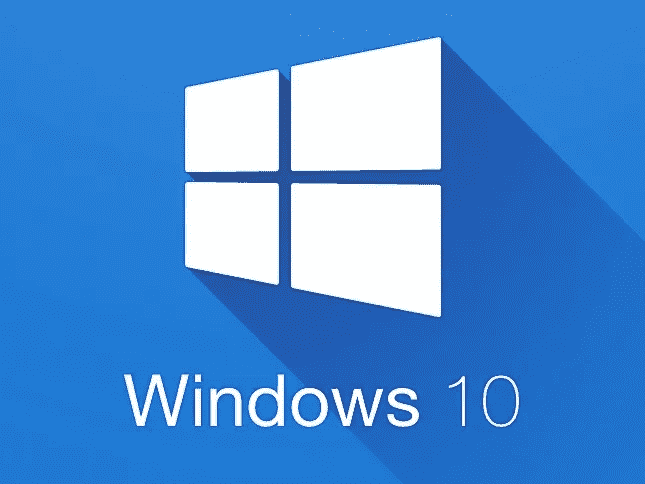
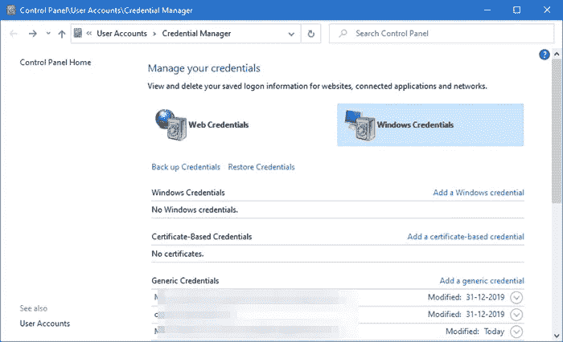
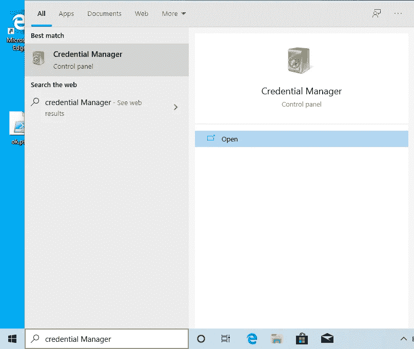
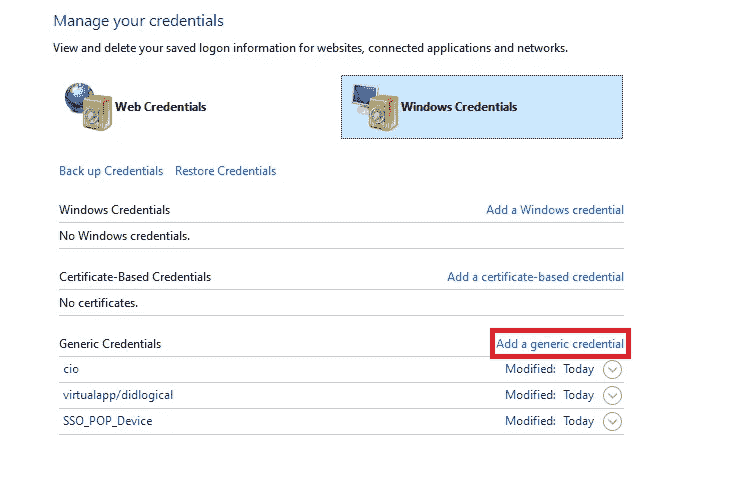
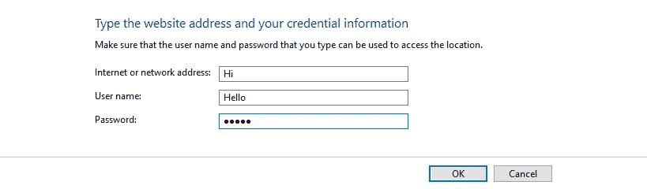
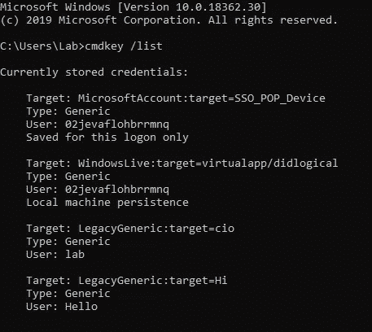
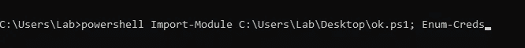
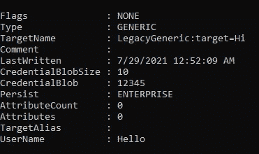
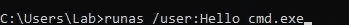

# 如何绕过 Windows 中的凭据管理器

> 原文：<https://infosecwriteups.com/how-to-bypass-the-credential-manager-in-windows-2ad7db8e9876?source=collection_archive---------4----------------------->

一种无需任何密码即可提升权限的方法。

[](https://blog.giotech.net/aggiornare-windows-10-senza-collegarsi-al-sito-della-microsoft/)

嗨伙计们！

最近我参加了一个关于 windows 权限提升的课程，今天我想向您展示一个非常酷的方法，您可以使用它来提升您的权限，而无需知道用户帐户的密码。

开始吧！

# Windows 凭据管理器

首先，如果你不知道什么是 windows 凭证管理器，它只是一个简单的预装在 windows 中的密码管理器，你可以保存用户和网站的凭证。

[](https://mitchproduction.com/come-aprire-e-utilizzare-gestione-credenziali-di-windows-in-windows-10-outlook/)

所以基本上你可以在 4 个不同的部分保存你的密码。

1.  Windows 使用的 windows 凭据。
2.  顾名思义，基于证书的凭证使用证书，但是它们很少使用。
3.  通用凭据。
4.  用于保存网站登录的 Web 凭据。

现在让我们看看如何保存我们的凭证。

打开搜索栏，键入**凭证管理器**。



现在，让我们尝试添加一个新凭据。



我们可以通过运行以下命令来确认凭据已保存。

```
cmdkey /list
```

> 注意: [cmdkey](https://docs.microsoft.com/en-us/previous-versions/windows/it-pro/windows-server-2012-r2-and-2012/cc754243(v=ws.11)) 是一个命令行工具，允许您创建、删除和列出保存的凭证。



完美，下一步就是下载这个帝国脚本了。

[主帝国项目/帝国 GitHub 的帝国/dumpcredstore . PS1](https://github.com/EmpireProject/Empire/blob/master/data/module_source/credentials/dumpCredStore.ps1)

该工具使用一组 windows32 APIs 来检索关于所有已保存凭据的信息。

如果你感兴趣的话，这里有这些 API 的文档的页面。

现在你所要做的就是运行这个命令。

```
powershell Import-module <File-Path> ; Enum-Creds
```



> 注意:有时您可能会得到一个错误，比如由于执行策略而无法执行 PowerShell 文件，为了避免这种情况，请在 cmd 中键入下面的命令。

```
powershell Set-ExecutionPolicy -Scope CurrentUser Unrestricted
```

最后，这是我们的密码🥳.



现在我们知道了那个用户的密码，我们需要做的就是运行命令 **runas** 以那个用户**的身份运行命令。**

```
runas /user:<USER> <YOUR_COMMANDS>
```

> 注意: [runas](https://docs.microsoft.com/en-us/previous-versions/windows/it-pro/windows-server-2012-r2-and-2012/cc771525(v=ws.11)) 用于运行具有不同权限的工具或命令，模拟其他用户。



希望你们今天学到了新东西。

祝你愉快，再见！