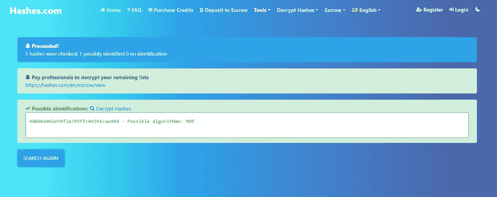
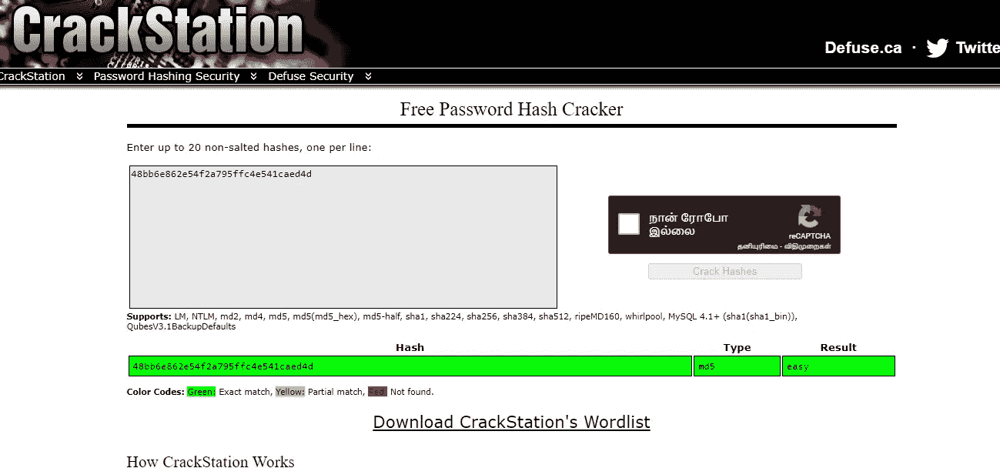
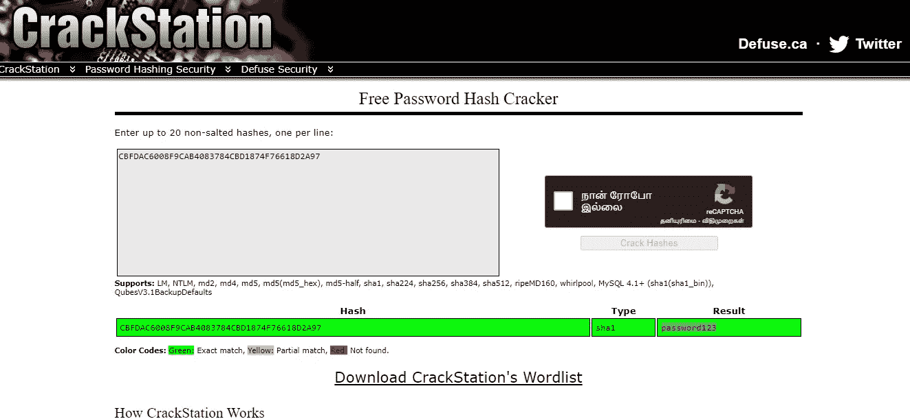
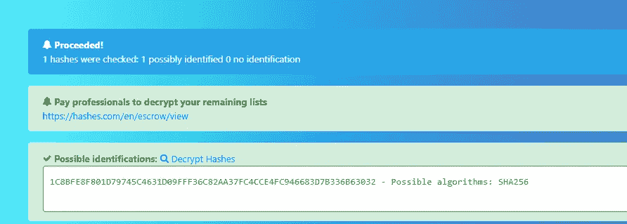
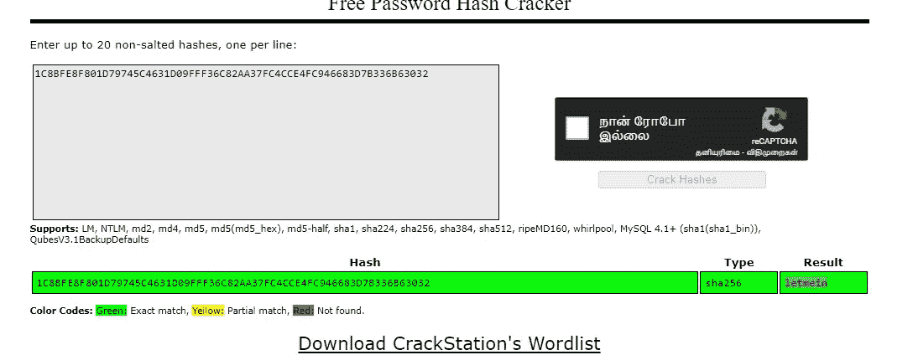
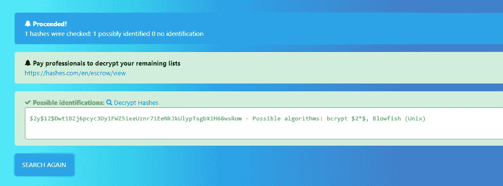
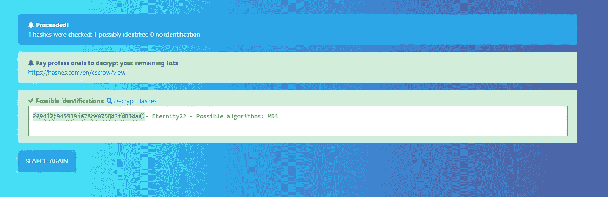
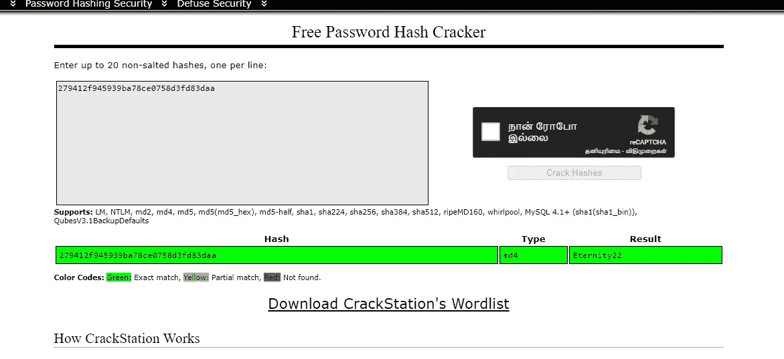
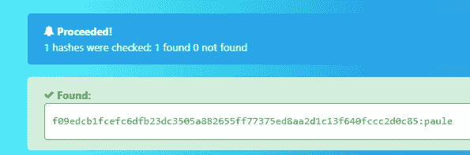
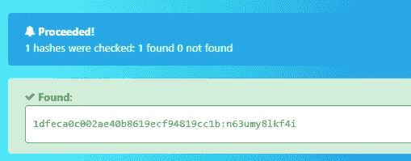

# 如何尝试破解哈希挑战

> 原文：<https://infosecwriteups.com/how-to-do-tryhackme-crack-the-hash-challenge-6557c31f5fab?source=collection_archive---------0----------------------->

## 破解散列的艺术——破解散列

欢迎神奇的黑客们来到这个博客，我们将进行**破解哈希** **TryHackMe** 演练。本演练基于如何执行破解散列的艺术。首先，我们要确定什么类型的散列，然后我们要破解散列。

破解散列

为了识别和破解哈希，我参考了一些网站。

1.  【https://hashes.com/en/decrypt/hash 
2.  [https://crackstation.net/](https://crackstation.net/)

或者 Kali Linux 中的一些内置工具

1.  ***哈希标识符***
2.  ***哈希卡特***

因此，让我们开始我们的演练如何破解散列。任务中给出的 hash 是***48 bb 6 e 862 e 54 F2 a 795 ffc 4 e 541 caed 4d***

md5 哈希已识别

这个网站显示 md5 哈希，然后我做了一些破解部分。

我去了 crackstation.net[**破解哈希。**](https://crackstation.net/)

下一个任务中给出的哈希是 CBF DAC 6008 F9 cab 4083784 CBD 1874 f 76618 d2a 97

通过辨认，我找到了 SHA1

哈希类型:SHA1

然后我又使用了破解站

得到结果:密码 123

哈希类型:SHA256

下一个任务哈希是***1c 8 bfe 8 f 801d 79745 c 4631d 09 fff 36 c 82 aa 37 fc 4c ce 4 fc 946683 d7b 336 b 63032***

密码是 ***letmein***

***$ 2y $ 12 $ dwt 1 bzj 6 pcyc 3d y1 fwz 5 ieeuznr 71 eenkjkulyptsgbx 1h 68 wsrom***成为下一个任务

在这个任务中，我们得到了 Bcrypt 散列，所以我们使用内置的 Kali Linux 工具 Hashcat 来解密这个散列

Bcrypt 的模式是 3200。

所以命令是

> **hashcat-m 3200 " \*$ 2y \ $ 12 \ $ dwt 1 bzj 6 pcyc 3d y1 fwz 5 ieeuznr 71 eenkjkulyptsgbx 1h 68 wsrom "……/…/…/rockyou.txt***

并且得到的密码是 **Bleh。**

下一个任务:**279412 f 945939 ba 78 ce 0758 D3 FD 83 DAA**

MD4 哈希类型

相应的密码是永久 22

下一个任务:哈希:f 09 edcb 1 FCE fc 6 DFB 23 DC 3505 a 882655 ff 77375 ed 8 aa 2d 1c 13 f 640 FCCC 2d 0 c 85

解决方案是:保利

下一步-任务:哈希:***1 dfec A0 c 002 AE 40 b 8619 ECF 94819 cc1b***

解决方案是: ***n63umy8lkf4i***

下一个任务:

> 哈希:$6$aReallyHardSalt$6WKUTqzq。uqqmrm 0 p/t 7m ppmbgnnzxpmax 4 bjm L9 be . cf i3/qxif . hsgps 41 bqmhsrhvxgmpdjs 6 xekzas 02 .
> 
> **盐:全硬盐**

识别哈希类型的命令:

> **hashid-m "/$ 6/$ areally hard salt/$ 6WKUTqzq。uqqmrm 0 p/t 7m ppmbgnnzxpmax 4 bjm L9 be . cf i3/qxif . hsgps 41 bqmhsrhvxgmpdjs 6 xekzas 02 . "**

*识别出的哈希是:SHA12 模式为 1800 的 crypt】*

要破解哈希:

> **hashcat-m 1800 "/$ 6/$ areally hard salt/$ 6WKUTqzq。uqqmrm 0 p/t 7m ppmbgnnzxpmax 4 bjm L9 be . cf i3/qxif . hsgps 41 bqmhsrhvxgmpdjs 6 xekzas 02 "/../…/../rockyou.txt**

密码是 waka99

下一个任务:

> ***e5d 8870 e5bdd 26602 cab 8 DBE 07 a 942 c 8669 e56d 6***
> 
> 识别哈希的命令:**hashid**-**m*e5d 8870 e 5 BDD 26602 cab 8 DBE 07 a 942 c 8669 e56d 6***

谁的散列类型是 SHA1 的

**然后继续破解杂凑:**

> ****hashcat-m 110*e5d 8870 e 5 BDD 26602 cab 8 DBE 07 a 942 c 8669 e 56d 6:tryhackme../../rockyou.txt*****

****

**感谢神奇的黑客们，希望你们投入宝贵的时间来阅读我的博客。如果你喜欢，请继续关注我，支持我更新博客。**

**要学习和实践道德黑客[点击](https://click.linksynergy.com/link?id=wm021Op9dCo&offerid=1060092.4584072&type=2&murl=https%3A%2F%2Fwww.udemy.com%2Fcourse%2Fcertified-ethical-hacker-v11-312-50-latest-2022-mock-exams%2F)这里**