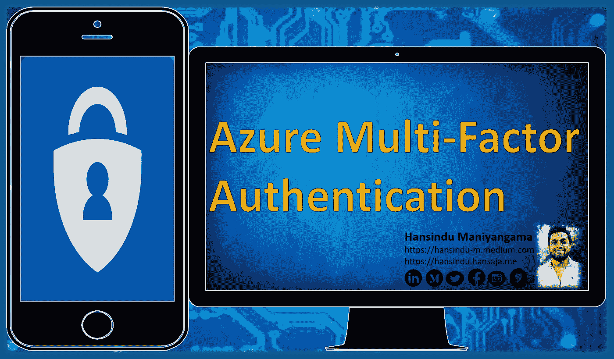
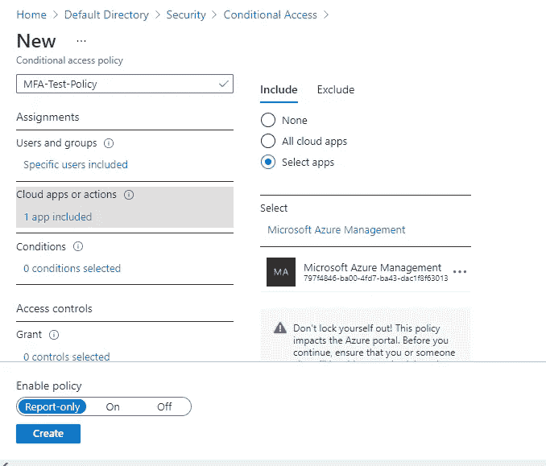
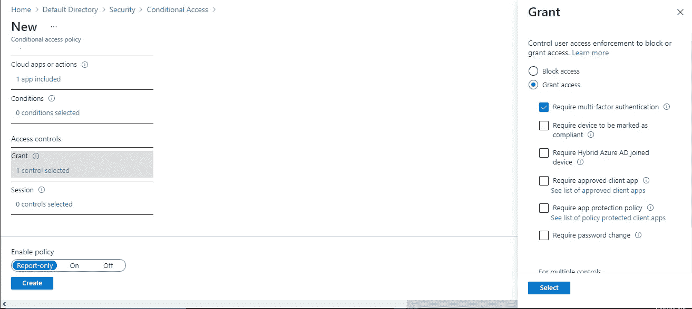
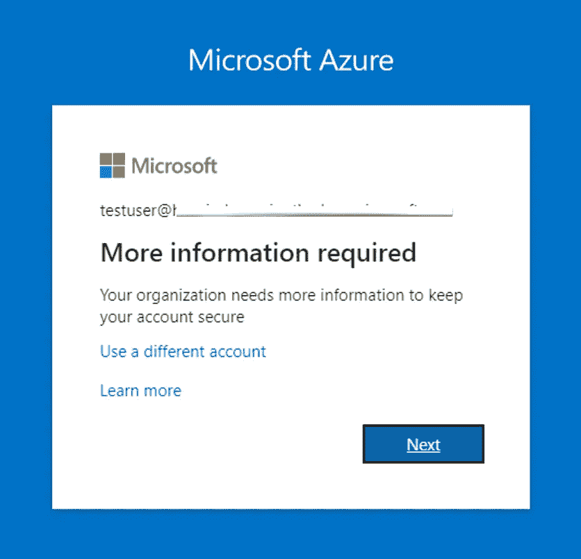
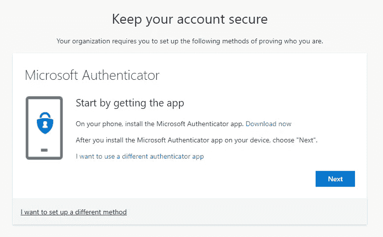
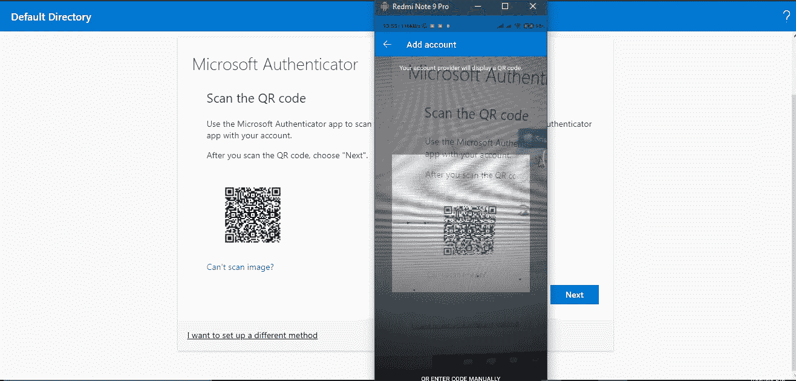
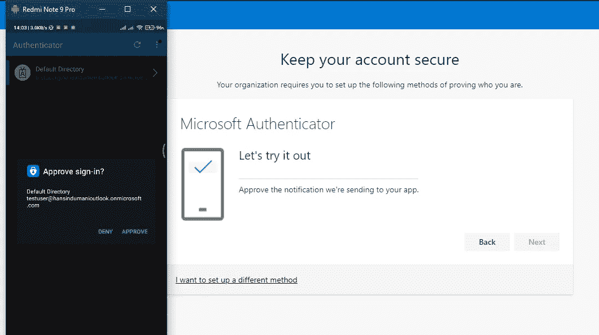
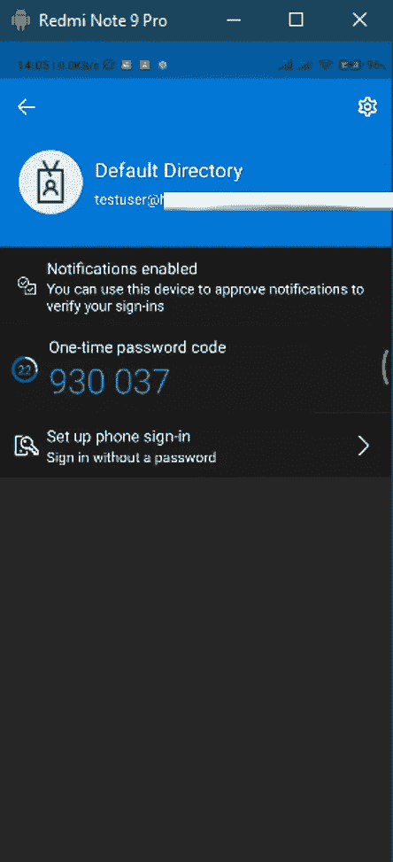

# 如何启用 Azure 多因素身份验证

> 原文：<https://infosecwriteups.com/how-to-enable-azure-multi-factor-authentication-7212dc7fdd4d?source=collection_archive---------1----------------------->

他的博客包含了如何使用 Azure AD 多重身份验证来保护用户登录事件的演练。

多因素身份认证(MFA)🔐是减少这些密码影响的完美方法。它不仅仅是密码，易于使用的挑战，但容易受到中间人和网络钓鱼攻击。

Azure AD 多因素身份验证和条件访问策略提供了在特定登录事件期间为用户启用 MFA 的灵活性。

## 📎你需要一些先决条件。

👉显然，你需要一个微软 Azure 账号。(具有全局管理员权限的帐户)
👉Azure 活动目录许可证
👉Azure MFA 许可证
👉安装在您手机上的微软认证应用
👉我们需要创建一个非管理员用户所属的组，比如“Test-Group”。(我将在这个组中测试 Azure AD 多因素身份验证-您可以为该组选择您喜欢的任何名称)

如果你没有 Azure 帐户或上述许可证，不要担心，你可以从[https://azure.microsoft.com/en-us/](https://azure.microsoft.com/en-us/)免费创建一个

## 📎在创建条件访问策略之前，我将展示如何在 Azure AD 中创建一个测试组

使用具有全局管理员权限的帐户登录[https://portal.azure.com](https://portal.azure.com)。搜索并选择 **Azure Active Directory** ，然后从左侧菜单中选择**组**选择+ *新建组*选项卡*。*
☞在**组下**类型选择**安全**。分配一个*组名*(这里我给了 ***测试组*** )。在成员类型
下选择*分配*选择**创建 来创建您的测试组。**

📌创建一个 ***测试用户*** ，并将该用户角色分配给上面创建的组

## 📎现在让我们创建一个条件访问策略

建议通过条件访问策略启用和使用 Azure AD 多因素身份验证。

使用具有全局管理员权限的帐户登录[https://portal.azure.com](https://portal.azure.com)。搜索并选择 **Azure Active Directory** ，然后从左侧菜单中选择**安全**。选择安全段下左侧的**条件接收**选项卡

这是 Azure AD 的功能，允许它创建启用或限制某些基于云的应用程序的策略。它既可以应用于用户，也可以应用于一组特定的组。

然后选择 *+新政策*标签
让我们给新的条件接收政策起一个*的名字*。(这里我给了***MFA-Test-Policy***)
☞在*分配*下，可以选择**用户和组**，然后选择**用户和组**单选按钮。
☞您可以勾选**用户和组**的复选框，然后选择浏览查看有哪些可用的组。我已经选择了先前配置的 ***测试组*** ，然后选择**选择**并选择**完成**将策略分配给该组。

## 📎现在，让我们根据新策略配置云应用和操作

现在选择**云应用或操作**。您可以选择将条件接收策略应用于所有云应用或选择应用。

在这里，我将对 Azure 门户强制执行这个策略。所以我希望用户在尝试登录 Azure 门户时使用多因素身份验证。所以，我选择微软 Azure 管理

选择*选择应用*单选按钮，然后选择**选择**，然后浏览可用的应用和登录事件。要应用选择应用程序，选择**选择**，然后**完成**。

我不会在这里设置任何条件。我们可以让应用程序决定是否执行这个策略，这取决于:
👉登录风险
👉设备平台
👉地点
👉客户端应用程序
👉设备状态

## 📎现在让我们配置访问控制

在这里，我将把访问控制配置为在 Azure 门户的登录事件期间需要 MFA。

进入**访问控制**，选择**授权**，选择*授权访问*单选按钮。然后选中复选框*要求多因素认证*。

作为最后一步；
☞在
☞上将**启用策略**切换到*，并选择**创建**以应用条件策略*

> 🎉**太好了，现在您已经成功创建了一个新的条件接收策略**

## 📎现在让我们测试 Azure AD 多因素身份验证。

打开一个新的浏览器窗口，浏览至[https://account.activedirectory.windowsazure.com](https://account.activedirectory.windowsazure.com)
以非管理用户身份登录。(我上面提到过——我已经创建了一个 ***测试——用户*** )
☞我们必须注册并使用 Azure AD 多重身份验证。现在你会得到一个新的提示，如下所示

现在它问我想登录哪个方法。我选择微软认证应用。因为推荐。

然后选择下一步

在我们的手机上，我们已经安装了 Microsoft Authenticator 应用程序来设置帐户。以下是步骤

👉从 android 的 play-store 或 iOS 设备的 apple-store 下载并在您的移动设备上安装 Microsoft Authenticator 应用程序。
👉打开应用程序并接受*条款和政策*。
👉然后你选择**添加账户**按钮。
👉选择*工作或学校户口*。
👉然后，您可以使用移动设备扫描仪在 windows 中扫描二维码。

👉然后是请求**批准登录**。当您批准提示信息时，在选择**完成**后，它将自动连接到 Microsoft Authenticator 应用程序。

📌在手机上你的默认目录里可以看到 *6 位数字*。如果你的代码不知何故遭到破坏，它将毫无用处，因为你可以看到它们每 30 秒就刷新一次。这是一个附加的安全功能。

✨Next 时间当用户试图登录时，它将只询问批准或拒绝的通知。这比密码简单又安全。

我希望你喜欢，也希望你能从我的 blog❤️中有所收获

谢谢大家所有的掌声和回应！

# 👉👉快乐黑客🎭！注意安全！👈👈