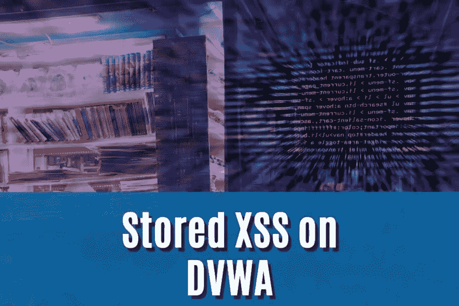
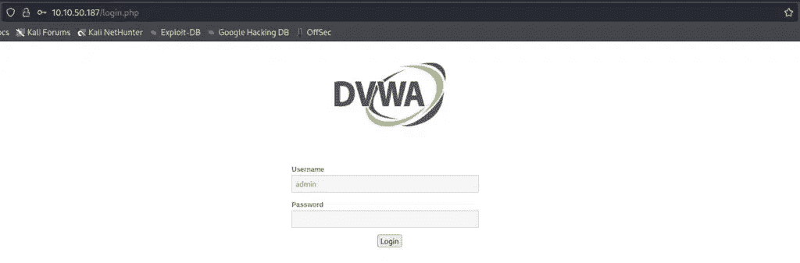
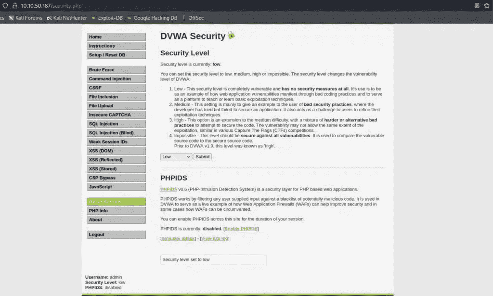
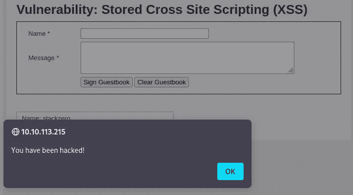
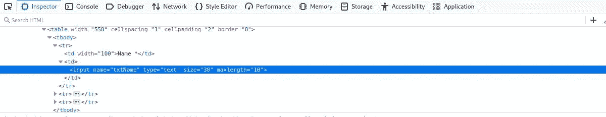
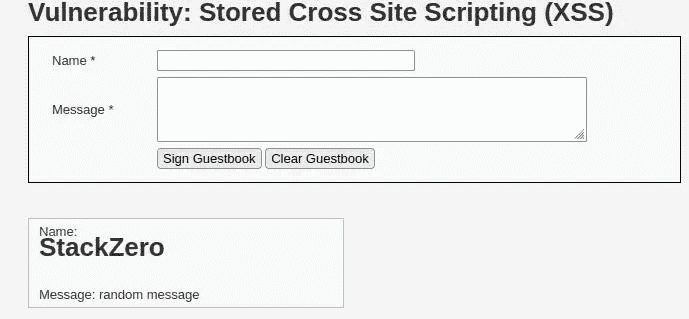

# 如何利用 DVWA 上存储的 XSS 漏洞？—堆栈零

> 原文：<https://infosecwriteups.com/how-to-exploit-a-stored-xss-vulnerability-on-dvwa-stackzero-1de6cc9545b9?source=collection_archive---------0----------------------->



# 介绍

嗨读者！又是一次演练，这次我想通过再次利用 [DVWA](https://github.com/digininja/DVWA) 来加强您对存储的 XSS 的实际理解。

我只是想预计，基本概念与我们在以前的文章中已经看到的[反映的 XSS](/reflected-xss-dvwa-an-exploit-with-real-world-consequences-stackzero-171cfb2d87d2) 相差不远。
然而，由于这种脆弱性的持续存在，它可能比 XSS 更加危险。
只是为了让你了解我所说的，在反射 XSS 的情况下，唯一的受害者是恶意 [URL](https://en.wikipedia.org/wiki/URL) 的接收者，相反，存储的 XSS 可以攻击每个访问被利用页面的人。

在我们进入存储 XSS 漏洞的世界之前，我建议您看一下我写的关于 XSS 的文章(按难度排序):

*   [跨站脚本的恐怖世界(XSS)(第一部分)](https://medium.com/codex/the-terrifying-world-of-cross-site-scripting-xss-part-1-stackzero-54be9cdc011a)
*   [跨站脚本的恐怖世界(XSS)(第二部分)](https://medium.com/@stackzero/the-terrifying-world-of-cross-site-scripting-xss-part-2-stackzero-cc7fa7e8dcbb)
*   [实践中的 XSS:如何在 web 应用中利用 XSS](https://medium.com/codex/xss-in-practice-how-to-exploit-xss-in-web-applications-walktrought-into-google-xss-game-c939f30005ea)
*   [反映了 XSS DVWA —一个具有真实世界后果的漏洞](/reflected-xss-dvwa-an-exploit-with-real-world-consequences-stackzero-171cfb2d87d2)
*   [如何利用 DVWA 上存储的 XSS 漏洞](/how-to-exploit-a-stored-xss-vulnerability-on-dvwa-stackzero-1de6cc9545b9)
*   [如何在 DVWA 上利用多姆 XSS](/how-to-exploit-dom-xss-on-dvwa-stackzero-c83a682ed7b7)

看完它们，理解我们要做的事情将是小菜一碟！

假设你有前面的知识，现在你应该对我们要做的事情很熟悉了。但是在开始利用之前，我们需要运行一个 [DVWA](https://github.com/digininja/DVWA) 的实例。

即使在这种情况下，我也将选择 [TryHackMe](https://tryhackme.com/room/dvwa) 机器，就像我在关于 [SQL 注入](/how-to-hack-with-sql-injection-attacks-dvwa-low-security-stackzero-9286d7d0dfd1)的教程(你可以在那里找到启动它的说明)和包括 [DVWA](https://github.com/digininja/DVWA) 机器的所有教程中已经做的那样。

所以再一次，像我们通常做的那样，让我们弄脏我们的手！

# 第一步。将 XSS 存储在低安全性的 DVWA 上

开始之前，我只想提醒您，默认凭据是:

*   **用户名**:管理员
*   **密码**:密码



安全级别默认设置为*不可能*，因此从左侧栏的设置中将其更改为*低*:



现在是时候点击左侧栏的 XSS(已存储)并开始利用低水平的 DVWA 了。

像往常一样，DVWA 中的低级别只是一种热身，所以我们可以尝试在文本框“消息”中键入基本的漏洞利用。
我们来写:

```
<script>alert('You have been hacked!');</script>
```

它完美地工作了，我们有了弹出菜单！



现在尝试重新加载页面，警告弹出窗口仍然存在，因为脚本存储在留言簿的评论中，这是与[反映的 XSS](/reflected-xss-dvwa-an-exploit-with-real-world-consequences-stackzero-171cfb2d87d2) 的真正区别！

我们可以把安全级别改成“中”，然后进行下一步！

# 第二步。以中等安全性将 XSS 存储在 DVWA 上

DVWA 的中等级别在我们的利用中引入了另一个困难。尝试我们在以前的水平似乎行不通。

我们也可以尝试我们在 DVWA 中的[反映 XSS 的中等水平中所做的，并尝试像这样玩大写字符:](/reflected-xss-dvwa-an-exploit-with-real-world-consequences-stackzero-171cfb2d87d2)

```
<SCRIPT>alert('You have been hacked!')</SCRIPT>
```

它不起作用，但为了理解发生了什么，如果一些标签可以逃脱过滤器，让我们尝试发送以下字符串作为消息:

```
<H1>Hello by StackZero </H1>
```

又一次失败的尝试，但是我们正在模拟黑盒攻击，我们无法读取 PHP 代码，所以在继续阅读之前，试着自己猜测我们的下一步行动！

我希望你能找到解决方案，但是万一你没有找到，不要担心，继续一起探索吧！

在尝试每一个漏洞之前，请记住我们有两个输入字段，我们也可以尝试利用“name”。

第一个明显的问题是对输入有限制，但幸运的是长度检查只在客户端进行。

如果您想避开它:检查元素(在 Firefox 上右键单击+ Inspect ),您应该会看到这个框:



现在，双击*“maxlength”*属性，您将能够修改并将其设置为一个更高的值(例如 100 ),使其包含我们的漏洞字符串。

键入随机消息和下面的字符串作为名称:

```
<SCRIPT>alert('You have been hacked!')</SCRIPT>
```

只需点击“签名留言簿”，看看结果..

成功了！结果正是我们所期望的:


对我们的能力充满信心，我们准备将安全级别改为“高”，并击败下一个也是最后一个级别！

# 第三步。高安全性地将 XSS 存储在 DVWA 上

最后，我们处于高安全级别，显然，有些事情已经发生了变化，我们之前所做的所有尝试都是徒劳的。

然而，我们可以注意到，如果我们:

*   增加名称的 *maxlength* 属性
*   类型`<h1>StackZero</h1>`
*   按下*在留言簿上签名*按钮

这是结果:



一眼看去，`<h1>`完全被服务器接受并反映在评论中，所以应用程序似乎只过滤了`<script>`标签。

我们现在有很多可能性，但对我来说，逃避这个特殊过滤器的最简单快捷的方法是通过``标签。

这个漏洞背后的想法是:

*   键入随机注释(该字段是必填的)
*   插入具有不存在的 src 值的图像
*   以这种方式将内联 javascript 插入到`onerror`属性中:

```

```

提交 XSS 漏洞后，页面重新加载…

嘭！我们击中目标了！


没有比我们在其他教程中看到的更多的东西，但是我确信这篇文章帮助你更像一个黑客一样思考。

# 结论

我希望这个教程能帮助你以一种实用的方式更好地理解被储存的 XSS，并且知道它的危险，即使是和它的小弟弟有关(XSS 反思)。

顺便说一下，XSS 是网络上最普遍的漏洞之一，所以为了掌握这些概念，我建议你:

*   仔细阅读介绍中链接的所有以前的教程
*   看看一些像[这个](https://portswigger.net/web-security/cross-site-scripting/cheat-sheet)这样的小抄，深刻理解其中的漏洞
*   尝试阅读导致 DVWA 漏洞的代码(右下角按钮“查看源代码”)
*   尝试构建并利用您个人易受攻击的应用程序

总之，记住一个真正的黑客永远不会停止学习，会从不同的角度看问题。
因此，在成为攻击者之后，试着扮演开发人员的角色，想象您的代码中哪里会出现漏洞，以及您如何修复它！

如果你喜欢这篇文章，请支持我，关注我的博客和我所有的社交资料。

*原载于 2022 年 9 月 24 日*[*【https://www.stackzero.net】*](https://www.stackzero.net/stored-xss-dvwa/)*。*

## 来自 Infosec 的报道:Infosec 每天都有很多内容，很难跟上。[加入我们的每周简讯](https://weekly.infosecwriteups.com/)以 5 篇文章、4 个线程、3 个视频、2 个 GitHub Repos 和工具以及 1 个工作提醒的形式免费获取所有最新的 Infosec 趋势！