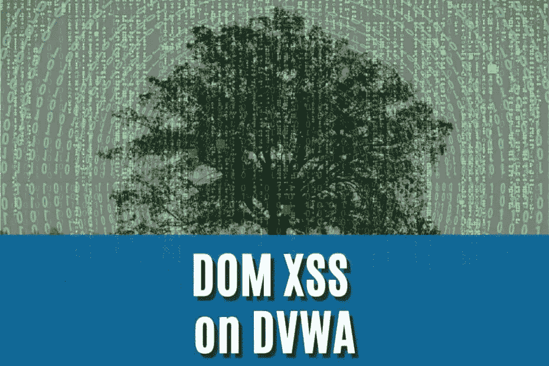
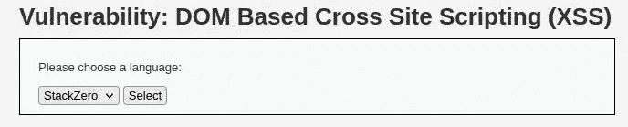
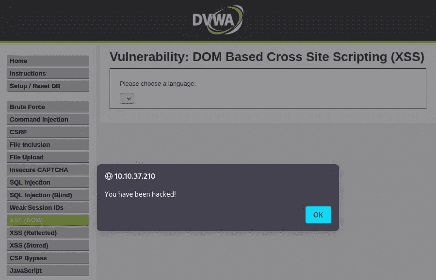

# 你如何在 DVWA-stack zero 上利用多姆·XSS

> 原文：<https://infosecwriteups.com/how-to-exploit-dom-xss-on-dvwa-stackzero-c83a682ed7b7?source=collection_archive---------3----------------------->



# 介绍

嗨黑客们！又一篇关于 XSS 的文章。这次我们将在 [DVWA](https://github.com/digininja/DVWA) 上看到多姆 This，以及对该漏洞的实际利用。

正如你可能已经猜到的，我特别提倡实践学习，在这种情况下，除了一些细节之外，与我们之前看到的没有太大的不同。

我还想解决这个具体的演练，只是因为在现实世界中，通常工作的漏洞和不工作的漏洞之间的区别只是一个小细节。

显然，在接下来的文章中，我将把之前文章中已经涉及的所有知识视为理所当然。
如果有任何差距，我建议您在继续之前阅读以下教程:

*   [跨站脚本的恐怖世界(XSS)(第一部分)](https://medium.com/codex/the-terrifying-world-of-cross-site-scripting-xss-part-1-stackzero-54be9cdc011a)
*   [跨站脚本的恐怖世界(XSS)(第二部分)](https://medium.com/@stackzero/the-terrifying-world-of-cross-site-scripting-xss-part-2-stackzero-cc7fa7e8dcbb)
*   [实践中的 XSS:如何在 web 应用中利用 XSS](https://medium.com/codex/xss-in-practice-how-to-exploit-xss-in-web-applications-walktrought-into-google-xss-game-c939f30005ea)
*   [反映了 XSS DVWA —一个具有真实世界后果的漏洞](/reflected-xss-dvwa-an-exploit-with-real-world-consequences-stackzero-171cfb2d87d2)
*   [如何利用 DVWA 上存储的 XSS 漏洞](/how-to-exploit-a-stored-xss-vulnerability-on-dvwa-stackzero-1de6cc9545b9)
*   [如何在 DVWA 上利用多姆 XSS](/how-to-exploit-dom-xss-on-dvwa-stackzero-c83a682ed7b7)

准备好了就可以准备你的 [DVWA](https://github.com/digininja/DVWA) 机器了(我用的是 [TryHackMe](https://tryhackme.com/room/dvwa) 上的那台)，如果你不知道怎么做，我在这篇文章里简单解释了一下:[如何用 SQL 注入攻击进行黑客攻击！DVWA 低保障](https://www.stackzero.net/how-to-hack-with-sql-injection-attacks-dvwa-low-security/)。

在这个快速介绍之后，我相信你会准备好动手实践所有的概念。

# 第一步。低安全性的 DVWA 上的多姆 XSS

初始设置后的第一步是使用默认凭据登录计算机:

*   **用户名** : admin
*   **密码**:密码


之后进入左侧菜单的设置，将安全性设置为低(记住默认安全性是*“不可能”*)。


每次需要更改安全级别时，我们都必须重复这个操作。

最后，初始准备已经结束，我们可以开始实际的利用！

到目前为止，我们应该知道第一关只是一种热身，就像在 [DVWA](https://github.com/digininja/DVWA) 中一样，所以让我们尝试一下基本的漏洞利用，看看结果吧！

为此，我们需要识别易受攻击的输入。
通过选择语言(例如英语)并点击*“选择”*按钮，URL 以这种方式改变(IP 地址取决于 [DVWA](https://github.com/digininja/DVWA) 实例):
`http://10.10.37.210/vulnerabilities/xss_d/?default=English`

因此，该值作为 GET 值被传递到查询字符串[中，这将是我们的目标。例如，试着用随机的东西替换那个值，就像这样:](https://en.wikipedia.org/wiki/Query_string)

`[http://10.10.37.210/vulnerabilities/xss_d/?default=StackZero](http://10.10.37.210/vulnerabilities/xss_d/?default=StackZero)`

我们可以看到，该参数反映在下拉菜单的默认项目中:



为了以防万一，我们试着检查一下下拉菜单的代码(在 Firefox 中右键+ Inspect(Q)):

```
<select name="default">
  <script>
    if (document.location.href.indexOf("default=") >= 0) {
      var lang = document.location.href.substring(document.location.href.indexOf("default=") + 8);
      document.write(" < option value = '" + lang + "' > " + decodeURI(lang) + " < /option>");
          document.write(" < option value = ''
            disabled = 'disabled' > -- -- < /option>");
          }
          document.write(" < option value = 'English' > English < /option>");
            document.write(" < option value = 'French' > French < /option>");
              document.write(" < option value = 'Spanish' > Spanish < /option>");
                document.write(" < option value = 'German' > German < /option>");
  </script>
  <option value="StackZero">StackZero</option>
  <option value="" disabled="disabled">----</option>
  <option value="English">English</option>
  <option value="French">French</option>
  <option value="Spanish">Spanish</option>
  <option value="German">German</option>
</select>
```

通过查看脚本，可以清楚地看到，默认值是使用函数`document.location.href.substring(document.location.href.indexOf("default=") + 8);`从 URL 获取的

“default=" + 8”的索引表示单词“default”的 7 个字符加上等号的一个字符之后的位置(记住，索引计数器从零开始计数)。

我们已经在[这篇文章](https://medium.com/@stackzero/the-terrifying-world-of-cross-site-scripting-xss-part-2-stackzero-cc7fa7e8dcbb)中看到了这种客户端的详细描述。

因此，我们可以通过在浏览器中键入以下 URL 来尝试用一个表示我们的基本漏洞的字符串来设置默认值:
`http://10.10.37.210/vulnerabilities/xss_d/?default=<script>alert('You have been hacked!');</script>`

exploit 成功了，所以我们可以进入下一关了！



# 第二步。多姆·XSS 在中等安全的 DVWA 上

我们处于中等水平，首先能做的就是尝试上一级的 exploit，但显然，这是行不通的。

因此，我们可以推断有某种服务器端过滤阻止了`<script>`标签。

在[在 DVWA](/reflected-xss-dvwa-an-exploit-with-real-world-consequences-stackzero-171cfb2d87d2) 上反映 XSS 的文章中，我们试图通过键入一些大写字符的标签来绕过过滤器，但在这种情况下，这将是无效的，我们应该想出更多。

通过检查下拉菜单，我们正在处理`select`和`option`标签，所以我们不能像过去那样放置一个图像并利用 *onerror* 事件(或者类似的事情)。

除了删除脚本标签，它似乎没有其他字符串处理例程，所以关闭选择标签并插入我们的漏洞似乎是一个非常好的主意。
在 [HTML](https://en.wikipedia.org/wiki/HTML) 中，[嵌入标签](https://www.w3schools.com/tags/tag_embed.asp)是一个外部资源的容器，所以我们将使用它来传递这个级别，并且我们将用这个值来设置我们的默认变量:

```
</select> <embed src="javascript:alert('You have been hacked')">
```

这样精心制作的 URL 将如下所示:

`http://10.10.37.210/vulnerabilities/xss_d/?default=</select> <embed src="javascript:alert('You have been hacked')">`

而且等级又过了！


如果你想探索更多的漏洞并在这里测试它们，你可以看看这个[备忘单](https://portswigger.net/web-security/cross-site-scripting/cheat-sheet)。

现在是时候进行了，所以将安全级别设置为“高”并跳到下一个级别！

# 第三步。多姆 XSS 在高安全性的 DVWA

最后，我们到了最后一关，你可以自己尝试前面所有的技巧，但很遗憾，这一次它们似乎不起作用了。

有一个过滤器比较难绕过，为了有个思路，这次可以稍微作弊一下，看看“查看源码”这样就能看到服务器的 PHP 了。
这是我们要绕过的过滤器:

```
<?php

// Is there any input?
if (array_key_exists("default", $_GET) && !is_null($_GET["default"])) {
    # White list the allowable languages
    switch ($_GET["default"]) {
        case "French":
        case "English":
        case "German":
        case "Spanish":
            # ok
            break;
        default:
            header("location: ?default=English");
            exit();
    }
} ?>
```

它只会接受一个预定义的声音，即使它似乎没有解决方案，我们仍然可以做一些事情。

在继续之前，我们需要知道浏览器是如何解释 URI 的:

> 查询组件由第一个问号(“？)字符，并以数字符号(" # ")字符或 URI 结束
> 
> [*RFC 3986*](https://www.rfc-editor.org/rfc/rfc3986) *第 3.4 节*

如果想了解更多，这是[环节](https://www.rfc-editor.org/rfc/rfc3986#section-3.4)。

所以浏览器发送给服务器一个查询字符串[什么在“？”和“#”但是它用它的 javascript 处理来自“default=" + 8”索引的子字符串(正如我们在第一步中看到的低安全级别)。](https://en.wikipedia.org/wiki/Query_string)

我们想将正确的[查询字符串](https://en.wikipedia.org/wiki/Query_string)发送到服务器，通过键入“#”终止它，然后插入我们的漏洞。

让我们看看如何做到这一点，然后讨论一下，这是我们的利用:

```
#<script>alert("You have been hacked");</script>
```

这是完整的恶意网址。

`http://10.10.173.217/vulnerabilities/xss_d/?default=English#<script>alert("You have been hacked );</script>`

但是这个精心制作的 URL 会发生什么呢？

服务器接收此 URL:

`[http://10.10.173.217/vulnerabilities/xss_d/?default=English](http://10.10.173.217/vulnerabilities/xss_d/?default=English)`

所以它不会触发过滤器，因为是正确的，服务器很高兴！

同时，浏览器会将这个字符串复制到它的 lang 变量中，然后反映到它的页面中:

`English#<script>alert("You have been hacked );</script>`

因此，如果我们检查元素，结果应该是这样的(我只报告了感兴趣的部分):

```
<option value="English#%3Cscript%3Ealert(%22You%20have%20been%20hacked%22);%3C/script%3E">English# <script>
      alert("You have been hacked");
    </script>
  </option>
  <option value="" disabled="disabled">----</option>
  <option value="English">English</option>
  <option value="French">French</option>
  <option value="Spanish">Spanish</option>
  <option value="German">German</option>
```

让我们连接到网址，看看结果！


它再次工作，所以我们完成了，甚至这一节是完整的！我们可以为自己感到骄傲！

# 结论

这种 XSS 不像其他类型的那样常见，但是知道这一点可以让你作为程序员避免许多错误，或者作为白帽黑客获得一些奖金。
我建议大家尽量多练习，掌握概念，让概念自然。网络上有很多挑战，你要准备好面对它们！

在以后的帖子中，我们将通过一些例子来看看这种漏洞有多危险，敬请关注！

我希望解释是详尽的，我很喜欢写这篇文章！

如果你喜欢这类文章，请继续关注我的博客和社交。
谢谢！

*原载于 2022 年 9 月 27 日 https://www.stackzero.net**T21*[。](https://www.stackzero.net/dom-xss-dvwa/)

## 来自 Infosec 的报道:Infosec 每天都有很多内容，很难跟上。[加入我们的每周简讯](https://weekly.infosecwriteups.com/)以 5 篇文章、4 条线索、3 个视频、2 个 GitHub Repos 和工具以及 1 个工作提醒的形式免费获取所有最新的 Infosec 趋势！