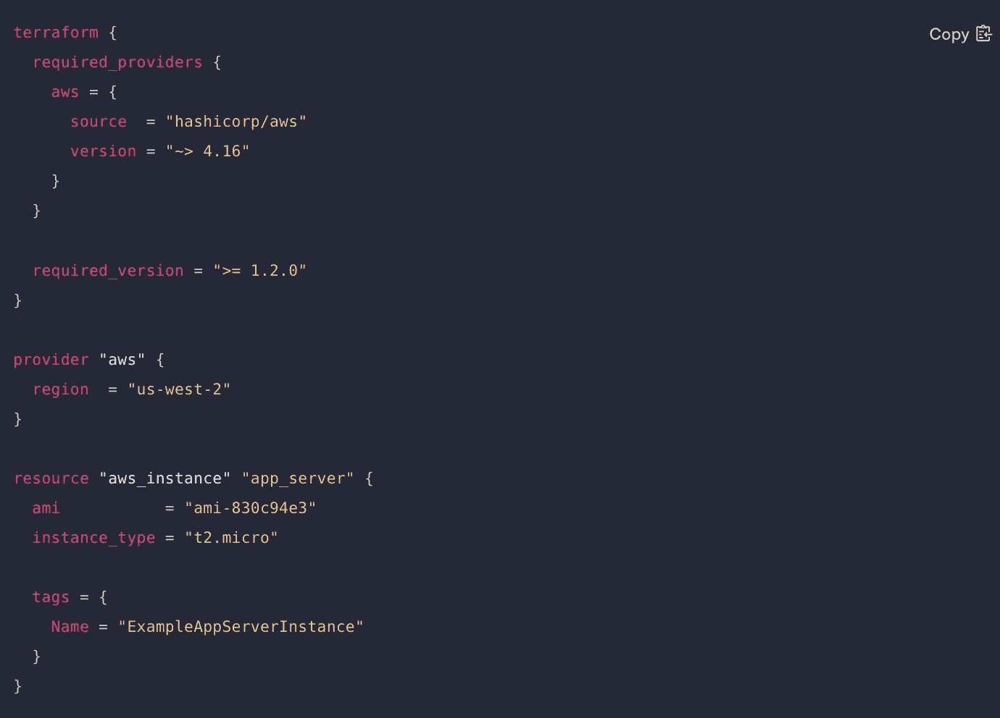
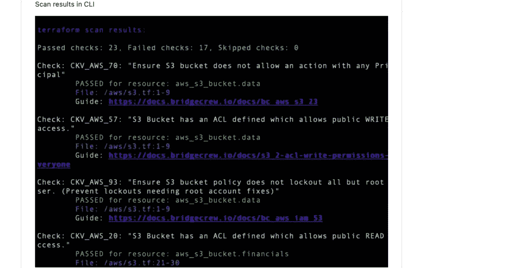
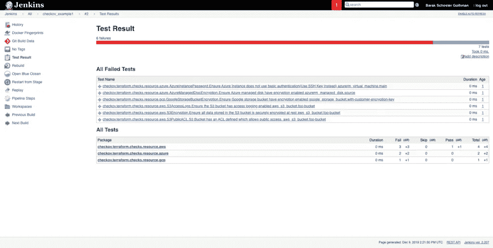
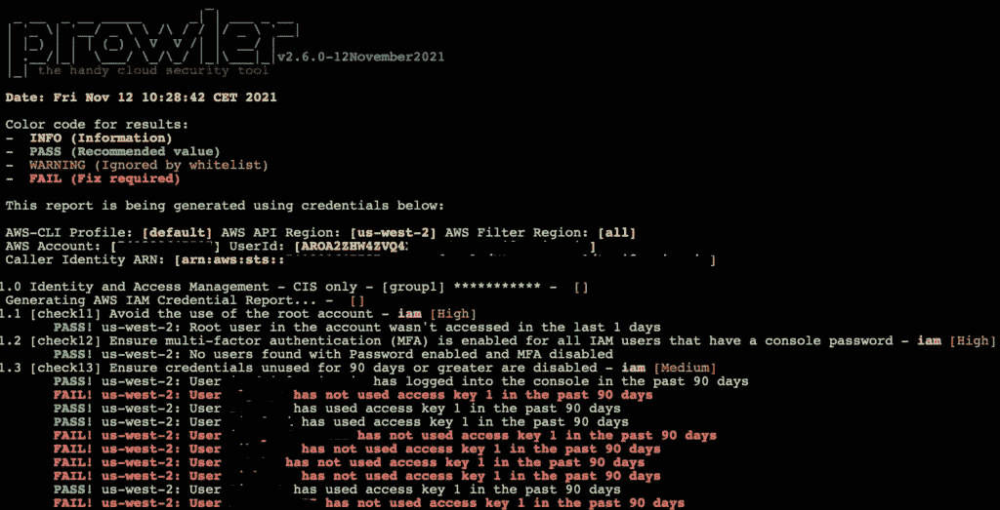

# 如何在没有工作的情况下获得云安全体验

> 原文：<https://infosecwriteups.com/how-to-get-cloud-security-experience-without-a-job-6ac56b0c52ab?source=collection_archive---------0----------------------->

## *在获得云安全工作之前获得梦寐以求的体验*


来源:作者

如果你一直在阅读我之前关于[云安全认证](https://taimurcloud123.medium.com/cloud-security-certification-path-for-2022-what-to-choose-eb537704ce8b)的文章，那么我反复提到的一点就是获得**云实践经验**的重要性。认证只能让你走到这一步，如果没有实际操作经验，你将在云安全职业生涯的早期面临挑战。然而，即使对于那些积极尝试获得云安全体验的人来说；下面是一个常见的问题:


来源:imgflip.com

与其等着雇主给你一个没有经验的机会，给你一份云安全工作，我列出了一些简单的步骤，你可以用它们来获得实践经验。

> ***如果您是云新手，请按顺序执行这些步骤，不要在没有完成上一步之前就跳过。***

如果你在任何一个步骤的技术细节上遇到困难，那么你可以通过互联网上的资料自己解决问题，不要放弃。如果您能够完成这些，那么您可以在您的简历中列出一些有价值的云安全经验！

# 第一步:注册一个免费层帐户

动手的一个关键起点是拥有一个**家庭实验室/沙箱**，在那里你可以体验云中的服务。值得庆幸的是，大多数主要提供商已经提供了相同的服务，因为他们希望用户在进入付费服务之前先试用他们的服务。谷歌云有一个[免费计划](https://console.cloud.google.com/freetrial/signup/tos)，给你大约**300**美元来花费和玩大约 90 天。类似地 [AWS 免费层](https://aws.amazon.com/free/)让您能够免费试用 AWS 服务，直到达到指定的限制。如果你关注这些服务，你可以很容易地创建一个云沙盒来玩。

> *出于以下示例的目的，我使用了 AWS，但是这些示例中的大多数将适用于任何云环境*

# 步骤 2:从基础设施即代码(IaC)开始

既然您已经有了云沙箱，是时候调配一些基础架构了，但不是通过简单的方式，即管理控制台。如果你在云中工作，那么代码是无法从**基础设施中逃脱的，因为这是你需要的最基本的技能之一。IaC 就像它的名字一样，基本上意味着您在代码模板中定义基础架构，然后由提供商处理并转换为云中的实际基础架构。**

**你能试着理解下面代码片段中发生的事情吗？**



来源:作者

IaC 使您能够实现适当的自动化，因为在适当的云环境中，没有人会通过管理界面供应数百台服务器，所有这些服务器都将使用像 Cloudformation 或 Terraform 这样的 IaC 模板。还有许多安全优势，如完全可见性、代码审查和不变性。如果你想了解更多关于 IaC 的信息，请点击这里查看我在《SACA 日报》上发表的文章。如果你是 IaC 的新手，这里有一些很棒的免费教程。

使用它们来部署服务器(ec2 实例)或创建 VPC，并确保在不再需要它们时销毁它们。第一次你会遇到很多问题，但不要放弃，因为它会教会你很多关于如何在云中配置基础设施的知识

# 步骤 3:下载 Jenkins 并创建一个管道

好了，现在你已经有了一个云沙箱，并且已经熟悉了一些 IaC 模板，现在是时候下载并安装 **Jenkins** 了。在云环境中，大多数代码都是通过管道传播的，了解这种情况的最佳方式是通过 Jenkins 构建自己的管道。

如果你不知道，那么 Jenkins 是一个在 DevOps 和 CI/CD 世界中广泛使用的开源工具。它是完全免费的，允许您构建部署代码的管道。了解如何通过 Jenkins 传播 IaC 模板，而不是手动传播。如果你不知道如何做同样的事情，有一些很棒的教程，我最喜欢的是这里的。

终于到了深入研究一些安全问题的时候了！

# 步骤 4:扫描您的 IaC 模板是否存在安全问题

好的，如果你已经做到了这一步，那么你现在已经有了一个通过管道在云中创建基础设施的管道，这是非常惊人的！

DevOps 和云携手并进，安全性是管道的主要关注点之一。我们现在需要在管道中引入一些安全检查来阻止不安全代码的传播，比如具有硬编码的访问密钥和秘密密钥的模板！

有许多商业和免费工具可用，我推荐的是 [**Checkov**](https://github.com/bridgecrewio/checkov) ，这是一个用于 IaC 的**静态代码分析工具，它可以检测不安全的模板，并让您知道是否有任何不安全的包或映像正在被使用。**

Checkov 可以从上面的 github repo 安装，你可以简单地将它指向一个 Iac 模板，让它在下面发挥它的魔力。



来源:作者

一旦您掌握了 Checkov，就应该将 Checkov 扫描与您之前创建的 Jenkins 管道集成起来。基本上，我们希望不安全的代码停止管道，并显示为失败。云在代码上运行，完成这一步将有助于积累您的云安全知识。Checkov 有一个简单的教程，教你如何做到这一点



来源:作者

# 步骤 5:对您的 AWS 帐户进行云安全评估

完善您的云安全体验的最重要的一步是对您的云环境进行全面审查。这不是你可以(或者愿意)手动完成的事情，但是好消息是市场上有很多免费的工具。如果你像我一样使用 AWS，那么最好的选择是 [Prowler](https://github.com/prowler-cloud/prowler) 。根据官方文件:

```
*Prowler* is an Open Source security tool to perform AWS security best practices assessments, audits, incident response, continuous monitoring, hardening and forensics readiness. **It contains more than 200 controls covering CIS, PCI-DSS, ISO27001, GDPR, HIPAA, FFIEC, SOC2, AWS FTR, ENS and custome security framework**
```

Prowler 可以轻松下载，并在您配置了所需的凭证后运行。在您的免费 AWS 帐户上运行它并查看结果



来源:作者

# 第 6 步:自愿体验云安全

恭喜你走到这一步！如果您已经做到这一步，那么您应该知道如何将基础架构作为代码进行部署，检查漏洞，并为世界上最受欢迎的云提供商进行完整的安全评估！

如果你想在等待你梦寐以求的云安全工作的同时获得更多的实践经验，那么我建议你在 [Fiverr](https://www.fiverr.com/) 或 [Upwork](https://www.upwork.com/) 上创建一个个人资料，并自愿以低成本进行云安全审查。

大多数公司，如非营利组织或小公司，负担不起全职安全团队的费用，他们会很乐意与您合作完成云安全审查。他们将受益于全面的安全审查，同时您可以将这一宝贵的经历添加到您的个人资料中。

> **我希望以上内容对您有所帮助，并祝您在云安全之旅中一切顺利。如果你觉得我还可以添加更多的东西，请告诉我！**


> *Taimur Ijlal 是一位* ***多次获奖的信息安全领导者*** *，在金融科技行业的网络安全和 IT 风险管理方面拥有 20 多年的国际经验。可以在*[*LinkedIn*](https://www.linkedin.com/in/taimurijlal/)*上或者在他的* [*博客*](https://cloudsec-guy.com/) *上连接 Taimur。他也有一个 YouTube 频道“* [*云安全专家*](https://www.youtube.com/c/CloudSecurityGuy) *”，他定期在上面发布关于云安全、人工智能和一般网络安全职业建议的帖子。*

[](https://taimurcloud123.medium.com/membership) [## 通过我的推荐链接加入 Medium-Taimur Ijlal

### 阅读 Taimur Ijlal(以及媒体上成千上万的其他作家)的每一个故事。您的会员费直接支持…

taimurcloud123.medium.com](https://taimurcloud123.medium.com/membership) 

## 来自 Infosec 的报道:Infosec 每天都有很多内容，很难跟上。[加入我们的每周简讯](https://weekly.infosecwriteups.com/)以 5 篇文章、4 个线程、3 个视频、2 个 Github Repos 和工具以及 1 个工作提醒的形式免费获取所有最新的 Infosec 趋势！