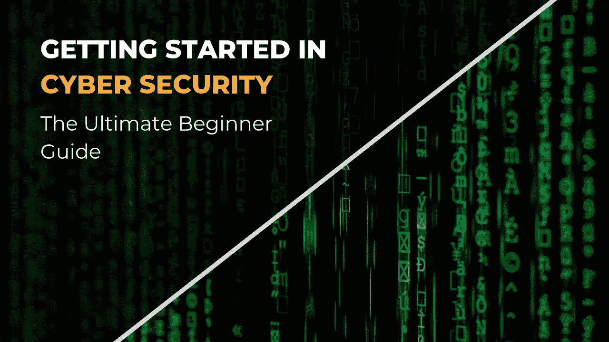

# 2022 年网络安全如何入门

> 原文：<https://infosecwriteups.com/how-to-get-started-in-cybersecurity-in-2022-e36bd5732da?source=collection_archive---------3----------------------->

## 这是为对学习网络安全感兴趣的初学者准备的路线图，他们没有该领域的适当知识，也没有人指导他们。

图片来源:[ceos3c.com](http://www.ceos3c.com)

嘿，伙计们，希望你们都过得很好。在开始之前，让我澄清重要的一点，这篇文章不是关于“如何成为一名网络安全专家”或“如何成为一名最高薪的道德黑客”或类似的东西。

这篇文章是为初学者和中级学习者写的，他们或者想在网络安全领域发展，或者对探索这个领域感兴趣。所以，现在让我们从首先了解这个领域开始写起。这篇文章中所写的一切完全是我的个人观点，其他网络安全专家和学习者可能会有不同的看法。

## *什么是网络安全？*

网络安全是保护硬件、软件和数据等互联网连接系统免受网络威胁。这种做法被个人和企业用来防止对数据中心和其他计算机化系统的未授权访问。
简而言之，网络安全就是保护计算机和其他电子设备、网络以及公司或组织的基础设施免受黑客和其他怀有不良意图的人的攻击。
我们主要保护设备免受网络攻击，并提高它们的安全性，这样它们就不能再使用相同的方法再次进行网络攻击。网络安全的主要目标是降低网络攻击的风险，防止系统、网络和技术遭到未经授权的利用。

## *我们为什么需要网络安全？*

现在，我想你们中的大多数人已经意识到了为什么我们需要网络安全的事实，但如果仍然有人对此没有清晰的认识或没有任何想法，不要担心，我会简单地解释一下。

我想你们都曾经听说过任何关于任何知名公司或组织遭受大型网络攻击的新闻。好，让我们通过一个例子来理解为什么我们需要网络安全。让我们假设一种情况，在这种情况的帮助下，我将解释为什么我们需要网络安全。有一个叫鲍勃的人在一家国际银行工作。一天，当 bob 来到办公室时，他发现了一个 256GB 的 Sandisk 笔驱动器，他认为他应该检查笔驱动器的数据，如果他在笔驱动器中发现任何关于他的信息，他会将笔驱动器归还给它的实际所有者。现在所发生的是 bob 到达他的办公室，将笔驱动器插入他桌子上的计算机系统。此事件发生一周后，许多员工的详细信息被披露，简而言之，一个包含客户和员工信息的数据库，包括他们的银行账户详细信息、信用卡和借记卡详细信息被泄露。现在你们谁能猜到那里会发生什么吗？

这很有可能是对该组织的预先策划的网络攻击，bob 发现 Pendrive，这不是意外，这是一次社会工程攻击，bob 是陷入陷阱的受害者。根据过去许多网络攻击的案例研究，我们可以很容易地猜测，bob 插入公司系统的 Pendrive 包含由黑客远程控制的，或者也是针对该网络攻击预先配置的。

*现在，你们中的许多人可能会想，网络安全在这里扮演着什么角色？*

在上述情况下，如果 Bob 对社会工程攻击和网络攻击有基本的了解，攻击应该是成功的，这直接证明 Bob 工作的公司没有采取任何安全措施，并且很可能没有一个良好的事件响应处理团队。如果他们的员工接受过任何网络意识培训，并且在他们的系统中安装了恶意软件和防病毒程序，并采取了其他安全措施，上述攻击应该会失败。

## 网络安全领域的工作趋势

网络安全是一个广阔的领域，从普通的服务台工作到在亚马逊或脸书这样的跨国公司担任安全研究员。如果我们认真谈论职业，网络安全领域有很多工作机会。根据许多知名机构的研究，预计全球将缺少超过 300 万个网络安全工作岗位。
所以，你可以认为，也许目前我们在网络上没有太多机会，但在未来，网络上会有很多机会。我将在以后写一篇更深入的文章，所以让我们进入下一个话题。

## 从哪里开始学习网络安全？

这个问题没有确切和完美的答案，因为每个人都是独一无二的，每个人都有不同的心态、不同的思维水平和不同的知识水平。现在让我们对这个话题有一个简单的了解，并在接下来的博客中对这个话题进行深入的分析。

在我看来，在开始学习网络安全的不同主题之前，您应该首先探索该领域。一旦你对这个领域有了基本的了解，选择你的目标或者你梦想的工作或者选择你到底想在这个领域做什么？

为了探索这个领域，我总是建议学习思科网络学院的“[网络安全简介](https://skillsforall.com/course/introduction-to-cybersecurity)”课程。

之所以建议您学习本课程，是因为这将让您通过创造性的学习，更好地理解网络攻击和网络安全的必要性。我太喜欢这门课了，尽管当时我对网络安全有很好的了解，而且这是一门初学者友好的免费课程，也是一门杰作。

一旦你完成了上述课程，阅读一些好的文章或文章，如 google dorks、osint 等。

查看本博客的下一部分，[如何在 2022 年开始网络安全(第二部分)](https://medium.com/@dheerajydv19/how-to-get-started-in-cybersecurity-in-2022-part-2-483f0ca0f9d8)

你可以关注我，了解我关于道德黑客和网络安全相关主题的文章，以及一些关于技术的主题，了解我用来节省时间和获得更好结果的技巧和诀窍。

今天到此为止，我们将在我接下来的博客中继续写这篇文章，请关注我，了解更多像这样令人惊奇和有趣的内容。