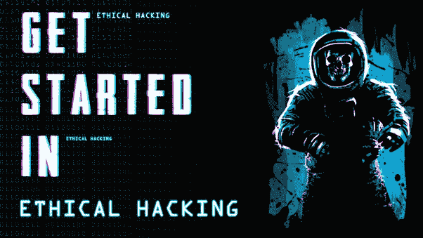
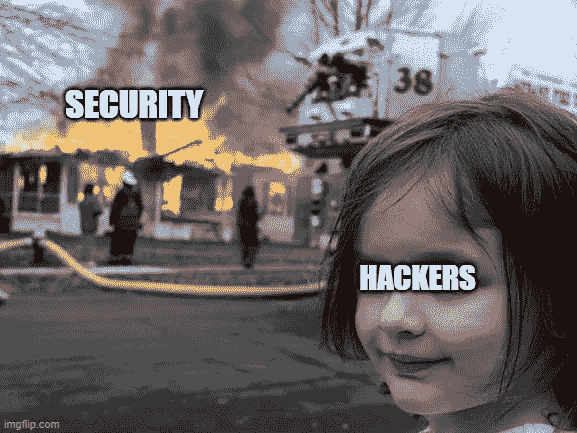
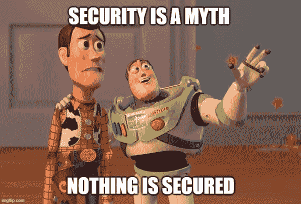
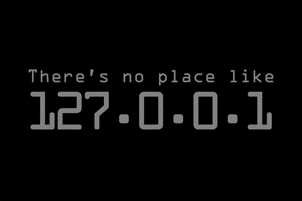

# 如何开始道德黑客

> 原文：<https://infosecwriteups.com/how-to-get-started-in-ethical-hacking-195b5f9a6e80?source=collection_archive---------1----------------------->

嘿，伙计们，在这个博客中，我将分享你们是如何开始道德黑客活动的(“Achi waali hacking”当地的印度术语)。所以让我们开始吧。

在了解如何开始道德黑客之前，让我们先了解什么是黑客，什么是黑客，什么是道德黑客，以及道德黑客做什么。

# 砍

对我来说，黑客攻击是试图渗透或进入任何数字服务，如计算机、物联网等，或者我们可以说，它是出于某种非法目的对计算机网络安全系统的未经授权的访问或控制。

# 黑客

人们过去常说，黑客是那些穿着连帽衫独自坐在黑暗房间里的又坏又丑的家伙，他们侵入某人的社交媒体账户或侵入银行服务器来提取资金。一般他们把黑客看做小偷。但我的朋友，这只是一个侧面的故事。

简单地说，如果你问什么是黑客，我的回答是那些做黑客的人被称为黑客。

黑客是发现并利用计算机系统和/或网络的弱点来获取访问权的人。黑客通常是拥有计算机安全知识的熟练计算机程序员。

一般来说，我们看到三种类型的黑客

●黑帽黑客或者你可以说坏人或者那些出于不良目的或者非法进行黑客活动的人。

●白帽黑客或道德黑客是那些在坏人之前进行黑客攻击的黑客，或者他们合法地进行黑客攻击，使你的服务免受坏人攻击。

●灰帽黑客这一类黑客为了个人利益入侵东西，他们不伤害任何人。

人们过去认为他们启用了 2FA，他们使用了强密码，现在他们是安全的，但是我的朋友。

现在我们来了解一下什么是道德黑客。

# 道德黑客

*道德黑客是一种绕过系统安全来识别网络中潜在的数据泄露和威胁的授权行为。拥有系统或网络的公司允许* [*网络安全专家*](https://www.simplilearn.com/cyber-security-expert-master-program-training-course) *进行此类活动，以测试系统的防御能力。因此，与恶意黑客不同，这个过程是有计划的、经过批准的，更重要的是合法的。或者简单地说，你可以合法地侵入东西或者通过侵入来保证安全。*

现在让我们了解如何开始道德黑客。

当人们开始从事道德黑客活动时，他们会思考，在这里他们犯了一个大错误，他们放弃了学业，投身于黑客活动。

首先完成你的高中教育，这是强制性的。然后选择数学作为你的高中教育科目。

# 选择数学的好处

## 我不太喜欢数学，但这将对你有很大帮助

●你更擅长学习复杂的东西。

●你增长了逻辑思维。

●你对自己的能力建立了信心。

●你培养了自己解决问题的技能

随着你的学业开始学习

-基本的计算机基础知识，打下坚实的基础。

-学习 Linux 和 Windows 操作系统基础知识

-学习至少一种脚本语言，这将帮助你使你的东西自动化。推荐你学习 python 或者 bash。

## 完成学业或高中教育后，你的第一步是打下坚实的基础。

# 道德黑客的技术技巧。

# 1)计算机知识

●计算机如何工作？

●什么是 bios(uefi/legacy)？

●什么是开机？

●如何安装操作系统？

●什么是文件系统？

● Fat32/NTFS/EXT2/3/4，互换，HFS+

●什么是主引导记录？

●什么是 32 位& 64 位系统？

●如何制作可启动的 Pendrive？

●学习基本和高级计算机技能

# 2)联网。

●什么是交换机、集线器、路由器、Modern？这是如何工作的？

●什么是拓扑？

●什么是链接节点？

●蓝曼&万是如何运作的？

●什么是互联网协议？

● Tcp、udp、ip

●什么是网络端口？

●网络安全基础

●无线安全基础

●什么是 Nat、dhcp、路由、dns、arp 子网划分？

●公共知识产权和私有知识产权的区别

ipv4 和 ipv6 的区别

●什么是 Mac 地址？

● OSI 模型

● TCP 三次握手

# 3)操作系统知识

●学习 Windows、Linux、Unix、Android 和 IOS

Linux 操作系统的高级知识

● Linux、Windows 和 mac 安全性

● Linux、Windows 和 mac 管理

●熟悉命令行界面。

# 4)编程

● Python、Ruby、Perl、Java、Bash

● Html、CSS、Javascript、PHP

● SQL/MySQL 或任何数据库语言

●发展你的编程技能

# 5)密码学和逆向工程。

密码学将在今天和未来的网络安全中扮演非常重要的角色。例如，加密所有种类和类型的数据将是至关重要的，尤其是当它与商业或公司及其客户相关时。

●什么是密码学？

●加密和解密到底是什么？

●什么是明文或明文？

●什么是密文？

●凯撒密码是什么？

●私钥和公钥的区别？

●什么是对称和非对称密钥系统？

# 6)虚拟化技术。

如果你用的是微软的 windows 操作系统，如果你没有覆盖它，没关系。你需要安装一个虚拟化软件将在你运行的电脑。VirtualBox 和 VMware 都是市场上非常流行的虚拟化软件，为您提供完整的安装指南，您可以观看此视频。劝你安装 Kali Linux 虚拟机一个月我会给你一个初学操作 Linux 的人要学习的命令。因此，最好的选择是一开始就使用虚拟化软件。

# 7)网络法律。

像任何法律一样，T2 网络法是为了帮助保护互联网上的人们和组织免受网络上的恶意者的攻击，并帮助维护秩序。如果有人违反了**网络法律**或规则，它允许另一个人或组织对该人采取行动或对他们进行处罚。

# 8)创造性思维。

你应该具备的素质和能力是什么？你的技术是最重要的。一个黑客高手最常用的知识是必须要保留的。一个好的黑客是能让自己跟上时代的人。部分是因为科技。这是成为精英黑客的必经之路。

# 9)解决问题的能力。

你在内心不断发展的技能应该在实践的基础上不断练习。你可以告诉你自己，你将召唤你的事物，因为它将变得清晰，你的概念也将到来。实践和观察你的思维能力会不断增强，这将使你在职业生涯中受益匪浅。你一定听说过“熟能生巧”这句话。

# 10)社会工程

社会工程是黑客们流行的策略，因为利用用户的弱点比发现网络或软件漏洞更容易。黑客通常会使用社会工程策略作为更大规模活动的第一步，以渗透到系统或网络中，窃取敏感数据或传播恶意软件。

# 印度道德黑客的范围。

据印度数据安全委员会称，网络安全市场有望增长至 350 亿美元。NASSCOM 的一份报告指出，在未来几年，美国至少需要 100 万名职业黑客。

# 一些资源

# 最佳认证

CCNA——思科认证网络助理。

RHCSA — [红帽认证系统管理员](https://www.redhat.com/en/services/certification/rhcsa)

CEH——认证道德黑客(欧盟委员会)

OSCP —攻击性安全认证专家

OSWE —攻击性安全网络专家

LPT——许可渗透测试仪

# 黑客最佳书籍。

黑客:剥削的艺术

网络应用黑客手册

渗透测试:黑客实践入门

黑客手册

社会工程:人类黑客的艺术

Metasploit:渗透测试人员指南

实用恶意软件分析:剖析恶意软件的实践指南

Shellcoder 手册:发现和利用安全漏洞

# 最佳英语 youtube 频道

[黑客先锋](https://www.youtube.com/channel/UC0ZTPkdxlAKf-V33tqXwi3Q)

[LiveOverflow](https://www.youtube.com/channel/UClcE-kVhqyiHCcjYwcpfj9w/)

[网络导师](https://www.youtube.com/channel/UC0ArlFuFYMpEewyRBzdLHiw)

约翰·哈蒙德

斯托克

[空字节](https://www.youtube.com/channel/UCgTNupxATBfWmfehv21ym-g)

[Ippsec](https://www.youtube.com/channel/UCa6eh7gCkpPo5XXUDfygQQA)

# 最佳北印度语 youtube 频道。

[Techchip](https://www.youtube.com/channel/UCYS9sTrPpcIVDxz2yVPbuLw)

[被咬的科技](https://www.youtube.com/channel/UC3PsooDxvFG0aEBe4JVtAbg)

[技术导航器](http://Technical Navigatorv)

[计算机专家萨克逊](http://Saksham the computer guy)

[艾山·辛格](https://www.youtube.com/channel/UCKzJMKDsKKCkmrn_XJJyvBA)。

# 黑客攻击的最佳工具

硬石膏

涅索斯

NMAP

Wireshark

Metasploit

Netcat

Acunetix

哈希卡特

社会工程师工具包

马尔特戈

开膛手约翰

# 在哪里练习

## *永远记住

DVWA 实验室

OWASP 实验室

黑客盒子

Vulnhub

特别感谢[rai Han Patel](https://www.instagram.com/the_techcraft/?hl=en)sir&Ramya Shahsir(古吉拉特法医科学大学)帮我评论这篇博客。

感谢大家阅读:)

快乐黑客；)

喜欢我的作品就支持我吧！给我买杯咖啡，在推特上关注我。

 [## impratikdabhi

### 嘿👋我刚刚在这里创建了一个页面。你现在可以给我买杯咖啡了！

www.buymeacoffee.com](https://www.buymeacoffee.com/impratikdabhi) 

网址:-[https://www.pratikdabhi.com/](https://www.pratikdabhi.com/)

insta gram:-[https://www.instagram.com/i.m.pratikdabhi](https://www.instagram.com/i.m.pratikdabhi/?hl=en)

推特:-[https://twitter.com/impratikdabhi](https://twitter.com/impratikdabhi?lang=en)

YouTube:-[https://www.youtube.com/impratikdabhi](https://www.youtube.com/impratikdabhi)