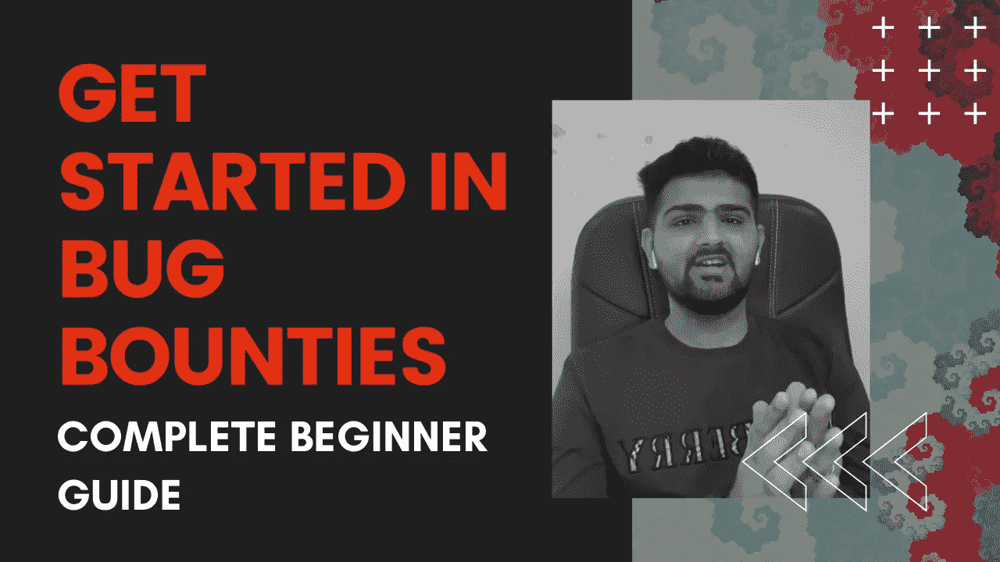

# 如何开始进入 Bug Bounty |完全初学者指南

> 原文：<https://infosecwriteups.com/how-to-get-started-into-bug-bounty-1be52b3064e0?source=collection_archive---------0----------------------->

大家好，在许多关于 Bug Bounty 相关主题的请求和问题之后，比如如何开始，如何击败重复，在读了几本书之后该做什么，如何做一个伟大的报告。我在这里更新了我的博客，并回答了所有这样的问题。我从基本的先决条件开始，到技巧和实验以及报告写作技巧。我还附上了一些我个人推荐的技巧以及如何写出好的报告。希望你们都喜欢。

# 什么是 Bug 赏金？

如果你去谷歌巴巴搜索什么是虫子赏金，你会得到:

以负责任的方式识别计算机程序或系统中的错误或漏洞并报告错误和漏洞的人员可获得的奖励。

# 学什么？

*   互联网，HTTP，TCP/IP
*   建立工作关系网
*   命令行
*   Linux 操作系统
*   网络技术，javaScript，PHP，Java
*   至少 1 种编程语言(Python/C/JAVA/Ruby..)
*   Owasp 前十名

# 选择你的道路:

*   网页测试
*   Android 应用程序测试
*   IOS 应用程序测试

# 书籍:

# 对于 Web:

*   网络应用黑客手册
*   网络黑客 101
*   掌握现代网络笔测试
*   Bug 赏金剧本
*   真实世界的臭虫狩猎
*   OWASP 测试指南。

# 对于移动设备:

*   移动应用黑客手册

# YouTube 频道:英语

[+]Nahamsec

 [## 纳哈姆塞

### Nahamsec 为任何对 web 应用程序黑客感兴趣的人创建教育黑客视频，重点是 bug…

www.youtube.com](https://www.youtube.com/channel/UCCZDt7MuC3Hzs6IH4xODLBw) 

[+]STK

 [## STK

### 黑客将攻击创造者将创造支持我的工作:加入我的 Patreon！https://www.patreon.com/stokfredrik…

www.youtube.com](https://www.youtube.com/channel/UCQN2DsjnYH60SFBIA6IkNwg) 

[+]zseano

 [## 泽亚诺

### 嘿，我是肖恩，又名@zseano。我是一个自学成才的黑客&也是程序员。我经营一个叫 BugBountyHunter.com 的网站…

www.youtube.com](https://www.youtube.com/channel/UCCUFgj-52_ryvpQUacylRpg) 

[+]黑客

[https://www.youtube.com/channel/UC0ZTPkdxlAKf-V33tqXwi3Q](https://www.youtube.com/channel/UC0ZTPkdxlAKf-V33tqXwi3Q)

[+]网络导师

 [## 网络导师

### 我的职业是黑客，但这个频道会时不时地包含各种课程甚至跑题的东西。

www.youtube.com](https://www.youtube.com/channel/UC0ArlFuFYMpEewyRBzdLHiw) 

[+]InsiderPhD

 [## 哲学博士

### 克兰菲尔德大学的博士(国防和安全)学生使用自然语言处理调查内部威胁。学士学位在…

www.youtube.com](https://www.youtube.com/channel/UCPiN9NPjIer8Do9gUFxKv7A) 

[+]法拉·哈瓦

 [## 法拉·哈瓦

### 嗨！欢迎来到我的频道。加入我，因为我每天都在学习新的东西，并分享有用的资源，因为我在我的…

www.youtube.com](https://www.youtube.com/channel/UCq9IyPMXiwD8yBFHkxmN8zg) 

[+]codingo

 [## codingo

### 关于信息安全的教学视频，以及前 20 名漏洞猎人、前渗透测试者和现在的漏洞奖金…

www.youtube.com](https://www.youtube.com/channel/UCUfO02gdMDXgOJWdv_jiLMg) 

[+]XSS 鼠

 [## XSS 鼠

### 大家好！我是全职爸爸，也是兼职昆虫赏金猎人。我的日常工作主要是 QA/QC，但我的心在…

www.youtube.com](https://www.youtube.com/channel/UCjBhClJ59W4hfUly51i11hg) 

[+]克里斯蒂·弗拉德

 [## 克里斯蒂·弗拉德

### 网络安全分析师| OSCP _ _ _ _ _ _ _ _ _ _ _ _ _ _ _ _ _ _ _ _ _ _ _ _ _ _ _ _ _ _ _ _ _ _ _ _ _ _ _ _ _ _ _ _ _ _ _ _ _ 免责声明:如果你从事渗透…

www.youtube.com](https://www.youtube.com/user/cristivlad25) 

[+]哈克卢克

 [## 哈克卢克

### 爸爸，老公，电脑黑客，生活黑客，成长狂热者。

www.youtube.com](https://www.youtube.com/channel/UCCzvz8jsulXm27Cd6k3vzyg) 

[+]黑客攻击简化

 [## 黑客简化版

### 想了解黑客和网络安全吗？你来对地方了。

www.youtube.com](https://www.youtube.com/channel/UCARsgS1stRbRgh99E63Q3ng) 

[+]Bugcrowd

 [## Bugcrowd

### 通过 Bugcrowd 的官方 YouTube 频道了解更多关于安全性、测试人员和 bug 赏金的信息。Bugcrowd 提供…

www.youtube.com](https://www.youtube.com/channel/UCo1NHk_bgbAbDBc4JinrXww) 

[+]Hackerone

 [## 哈克龙

### HackerOne 是头号黑客支持的安全平台，帮助组织找到并修复关键漏洞…

www.youtube.com](https://www.youtube.com/channel/UCsgzmECky2Q9lQMWzDwMhYw) 

[+]黑客计划

 [## 黑客入侵

### Hacksplained =黑客解释！Hacksplained 在这里为您提供实用的黑客指导，以便…

www.youtube.com](https://www.youtube.com/c/Hacksplained/videos) 

[+]组

 [## RogueSMG

### 让我们开始吧👨‍💻

www.youtube.com](https://www.youtube.com/channel/UC855OCrjl7C3elK8VfEZoHw) 

# YouTube 频道:印地语

[+]bited tech

 [## 被咬的技术

### 这是来自印度的安西·班娜妮。我是一个有抱负的道德黑客和技术的学习者，并试图分享我…

www.youtube.com](https://www.youtube.com/channel/UC3PsooDxvFG0aEBe4JVtAbg) 

[+]技术导航器

 [## 技术导航员

### 嘿，伙计们，欢迎来到“技术导航员”,我叫尼泰什·辛格。我是 RHCSA，认证道德黑客(CEH)，网络…

www.youtube.com](https://www.youtube.com/channel/UClPH8tL-fWX1rqTTegkTNZw) 

# 在推特上关注这些人

[+]nahamsec

[https://twitter.com/NahamSec](https://twitter.com/NahamSec)

[+]唐文杰·哈德克斯

https://twitter.com/jhaddix

[+]zseano

【https://twitter.com/zseano 

[+]TomNomNom

[https://twitter.com/TomNomNom](https://twitter.com/TomNomNom)

[+]stokfredrik

[https://twitter.com/stokfredrik](https://twitter.com/stokfredrik)

[+]Jensec

[https://twitter.com/_jensec](https://twitter.com/_jensec)

[+]网络导师

[https://twitter.com/thecybermentor](https://twitter.com/thecybermentor)

[+]Harsh Jaiswal

[https://twitter.com/rootxharsh](https://twitter.com/rootxharsh)

[+]Rahul Maini

[https://twitter.com/iamnoooob](https://twitter.com/iamnoooob)

[+]阿迪蒂亚·申德

[https://twitter.com/adityashende17](https://twitter.com/adityashende17)

[+]Harsh Bothra

[https://twitter.com/harshbothra_](https://twitter.com/harshbothra_)

# 报道、文章、博客:

[+]Intigriti 错误字节

 [## bugbytes 档案— Intigriti

### Bug Bytes 是由 bug bounty 社区成员策划的每周时事通讯。第一系列由 Mariem 策划…

blog.intigriti.com](https://blog.intigriti.com/category/bugbytes/) 

[+]中等(信息安全报道)

 [## 信息安全报道

### 收集了世界上最好的黑客的文章，主题从 bug 奖金和 CTF 到 vulnhub…

medium.com](https://medium.com/bugbountywriteup) 

[+]HackerOne 黑客活动

 [## 哈克龙

### 编辑描述

hackerone.com](https://hackerone.com/hacktivity) 

[+]Pentesterland

 [## 主页

### 编辑描述

彭特斯.兰](https://pentester.land/) 

[+]应用安全安全工作簿

 [## 应用安全安全工作手册

### 这里有一些关于应用程序安全性的资源，这项工作仍在进行中，将很快完成…

info.ninadmathpati.com](https://info.ninadmathpati.com/) 

[+] [如何挂载](https://github.com/KathanP19/HowToHunt)

 [## 凯瑟琳 19/HowToHunt

### 一些教程和事情做，而狩猎特定的漏洞。注意:您可以通过以下方式帮助我完成此列表…

github.com](https://github.com/KathanP19/HowToHunt) 

# 练习:

像从未赢过一样练习，像从未输过一样表演。！

# 学习资源:

# 测试实验室:

*   bWAPP
*   Webgoat
*   波特斯威格学院

 [## 网络安全学院:PortSwigger 提供的免费在线培训

### 推动您的职业生涯灵活学习向专家学习网络安全学院是一个免费的在线培训中心，面向…

portswigger.net](https://portswigger.net/web-security) 

*   彭斯特实验室

 [## PentesterLab:学习 Web 渗透测试:正确的方法

### 有了 PentesterLab PRO，您可以随时随地学习。我们为您提供入门课程以及…

pentesterlab.com](https://pentesterlab.com/) 

*   BugBountyHunter

 [## 了解 web 应用程序漏洞以及如何在 bug bounty 程序中找到它们

### 让你的学习更上一层楼，像专业的 bug 赏金猎人一样学习黑客。利用我们的会员资格…

bugbountyhunter.com](https://bugbountyhunter.com/) 

*   彭斯特学院

 [## Pentester 学院:在线学习 Pentesting

### 你的课程是最好的实践培训之一。我看过 Vivek 在一个会议上的现场演示，而且…

www.pentesteracademy.com](https://www.pentesteracademy.com/) 

*   TryHackme

 [## 网络安全培训

### TryHackMe 是一个学习网络安全的在线平台，使用动手练习和实验室！

tryhackme.com](https://tryhackme.com/) 

*   黑掉这个盒子

 [## 侵入测试实验室

### Hack The Box 为您的安全团队提供了丰富的信息和经验。培训您的员工或寻找新的…

www.hackthebox.eu](https://www.hackthebox.eu/) 

# 工具:

*   硬石膏
*   Nmap
*   污垢克星
*   Sqlmap
*   Netcat
*   OwaspZap
*   Ffuf
*   项目发现

# 臭虫奖励计划的类型:

*   只有名人堂
*   名人堂及欣赏证书
*   带赠品的 HoF 只有赠品
*   慷慨的名人堂
*   只有赏金

# Bug 赏金平台

# 臭虫奖励计划:

*   开放注册
*   哈克龙
*   Bugcrowd
*   防黑客
*   Bugbountyjp
*   因蒂格里蒂
*   打开 Bug 赏金

# 基于邀请的平台:

*   塞纳克
*   日惹

# 要记住的要点

明智地选择(最初，不要考虑奖金)

为狩猎选择一只臭虫

穷举搜索

不总是直截了当

# 报告编写/Bug 提交:

*   创建描述性报告。
*   遵循负责任的披露政策。
*   创建概念证明和重现步骤

# 报告的样本格式:

*   漏洞名称
*   漏洞描述
*   易受攻击的 URL
*   有效载荷
*   复制的步骤
*   影响
*   减轻

# 漏洞优先级:

*   P1-关键:导致权限从非特权提升到管理员或允许远程代码执行、财务盗窃等的漏洞。
*   P2-高:影响软件安全性并影响其支持的流程的漏洞。
*   P3-中等:影响多个用户，需要很少或不需要用户交互就能触发的漏洞。
*   P4-低:影响单一用户并需要交互或重要先决条件才能触发(MitM)的漏洞。
*   P5-信息:功能中不可利用的漏洞。设计上的漏洞或被认为是客户可接受的业务风险。

# 使用谷歌呆子寻找更多的程序

*   inurl:“bug bounty”和 intext:“€”和 inurl:/security
*   intext:bounty inurl:/security
*   英特尔:“BugBounty”和英特尔:“BTC”和英特尔:“奖励”
*   intext:"BugBounty "和 inurl:"/bounty "和 intext:"reward

# 至理名言:

*   耐心是关键，需要多年来掌握，不要一夜成名
*   不要指望有人会把什么都喂给你。
*   信心
*   不总是为了赏金
*   学到很多。
*   不会一开始就发现，不要失去希望
*   保持专注
*   靠自己
*   与信息安全世界保持同步

感谢大家的阅读:)

快乐黑客；)

喜欢我的作品就支持我吧！给我买杯咖啡，在 T2 的推特上关注我。

 [## impratikdabhi

### 嘿，👋我刚刚在这里创建了一个页面。你现在可以给我买杯咖啡了！

www.buymeacoffee.com](https://www.buymeacoffee.com/impratikdabhi) 

网址:-【https://www.pratikdabhi.com/ 

insta gram:-[https://www.instagram.com/i.m.pratikdabhi](https://www.instagram.com/i.m.pratikdabhi/?hl=en)

推特:-[https://twitter.com/impratikdabhi](https://twitter.com/impratikdabhi?lang=en)

YouTube:-[https://www.youtube.com/impratikdabhi](https://www.youtube.com/impratikdabhi)