# 如何入侵:来自黑客盒子的堡垒

> 原文：<https://infosecwriteups.com/how-to-hack-bastion-from-hackthebox-729cd2317c6e?source=collection_archive---------1----------------------->

## 我的 OSCP 认证之旅


堡垒

# 介绍

欢迎阅读我在 Medium 上的第二篇文章。今天我们将看看黑客盒子里的堡垒。在我看来，这是一个相当现实的盒子，它给我们带来了很多乐趣。这篇文章将与我的第一篇文章相似，因为我将提供更多关于这个盒子的信息，以及为什么它容易受到攻击。但是，下面的文章不会给出我将使用的不同工具的太多信息。你可以在我的 [**系列的第一篇**](https://medium.com/@marvingerlach/hackthebox-popcorn-f1ace3de846d) 中查找。您可以在 Kali 提供的工具中找到备忘单和有用的信息。这会节省一些时间。所以让我们开始吧:

# 设置

在我们开始之前，对我的设置说几句话:

*   虚拟机上的 Kali Linux
*   [Tilix](https://github.com/gnunn1/tilix) :一个面向 Linux 的分块终端仿真器
*   记笔记的樱桃树，我强烈推荐来自[詹姆斯霍尔](https://411hall.github.io/OSCP-Preparation/)的模板

# 列举

今天，我们将从 HackTheBox 了解 Bastion，因此，请启动并运行您的 VPN。

首先，让我们从枚举开始，以便获得尽可能多的关于机器的信息。第一步是使用 nmap。我的 nmap 方法如下:

```
nmap -A -oA nmap 10.10.10.134
```

这种扫描设置运行非常快，并显示重要的结果。我们可以使用以下命令查看我们的扫描:

```
less nmap.nmap
```

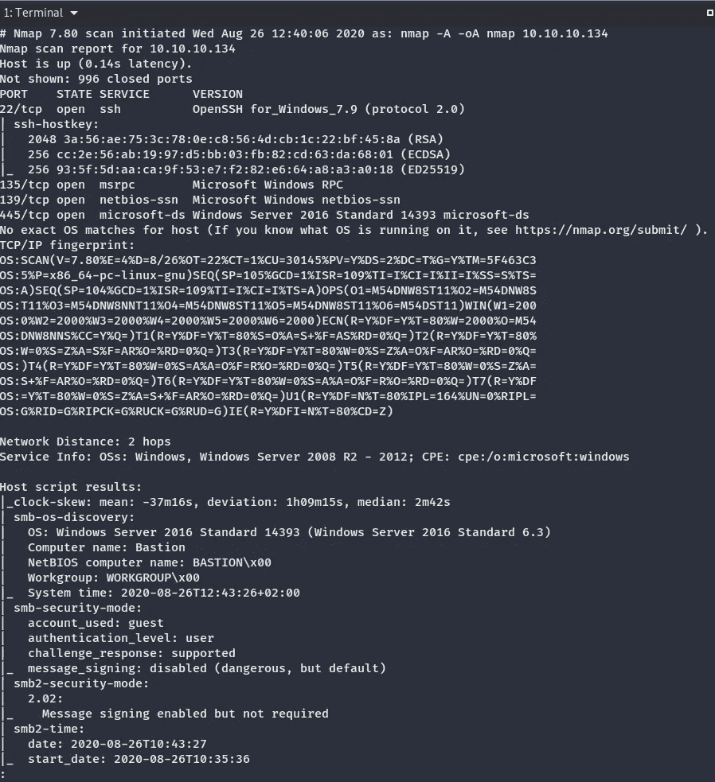

Nmap 端口扫描

# 调查的结果

Cherry Tree 中有一些有趣的发现需要记录下来，这些发现也将记录在 pentest 报告中:

*   端口 22 是开放的，这是 ssh。系统使用 OpenSSH for windows。大多数 Unix 系统使用 OpenSSH，而不是 Windows 系统。
*   端口 135 上的远程过程调用
*   端口 139 (NetBios)和端口 445 上的 SMB
*   没有网络服务器在运行，这很奇怪
*   Nmap 给了我们更多关于这个系统的信息:这是一个 Windows server 2016，计算机名是 Bastion

我会仔细看看中小企业。有时 SMB 上有匿名访问，但是 OpenSSH 上几乎总是有某种认证。

电脑的名字好像很可疑。如果你不知道:堡垒是防御工事的一部分，例如城堡。它的主要目的是保护城堡免受攻击者的攻击。这种技术也在 IT 中使用。堡垒主机是网络上的一台计算机，专门设计和配置来抵御攻击。计算机通常托管单个应用程序，例如代理服务器，并且移除或限制所有其他服务以减少对计算机的威胁。

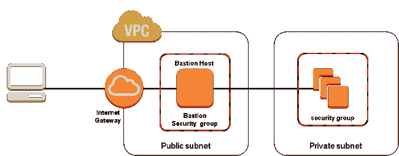

堡垒主机

Henrik Sylvester Pedersen 写了一篇关于这个主题的很好的文章，他在文章中解释说堡垒主机真的没有存在的必要。

# 回到黑客

每当 445 端口(SMB)打开时，我喜欢使用一个叫做 smbclient 的工具。它是中小企业/CIFS 共享的控制台客户端。它还允许访问共享，而不必将它们装载到文件系统上。smbclient 最初是作为测试和调试工具设计的，现在也变成了一个通用 shell，其命令集可以与 FTP 相媲美。要检查系统中的共享，我们将使用以下命令:

```
smbclient -L //10.10.10.134
```

L 列出了股份。我只是按了工作组密码上的回车键，让它空着。结果如下:

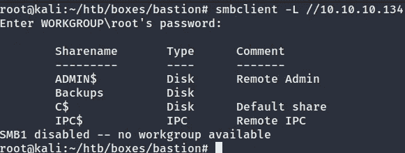

SMB 客户端

ADMIN $ C $和 IPC$都是所有默认共享。备份是一个独特的共享。我喜欢在还没有挂载的情况下查看共享。这也可以使用 smbclient 来完成:

```
smbclient //10.10.10.134/backups
```

我们现在在 SMB 中，使用“ls”命令，我们可以列出备份共享中的所有文件。

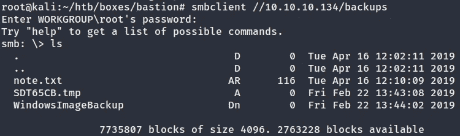

备份共享中的文件

note.txt 看起来很有意思。为了阅读它，我们首先必须使用“get”命令将它下载到我们的机器上:

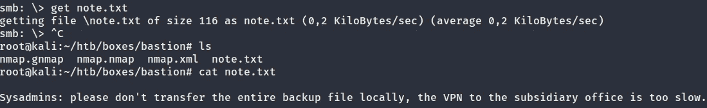

系统管理员注释

感谢您的注意，系统管理员。现在我们知道不应该在本地传输备份文件。

# 增加

下一步是装载备份共享。首先，我们将使用以下命令创建一个新目录:

```
mkdir /mnt/smb
```

“mkdir”代表 make 目录，“mnt”代表 mount，“smb”显然代表 SMB。

然后，我们将使用以下命令将其挂载到新目录中:

```
mount -t cifs //10.10.10.134/Backups /mnt/smb
```

“-t”代表类型，类型为 cifs，因为正在使用 Windows。然后，我们将指定 IP 地址、我们想要装载的共享以及我们新创建的目录/mnt/smb。

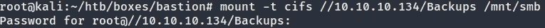

装载备份共享

只需输入根密码。

如果我们键入“ls /mnt/smb ”,我们可以看到这些文件:

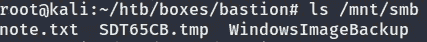

文件

我们已经签出了 note.txt，所以让我们使用“ls”命令来仔细看看 WindowsImageBackup 目录:

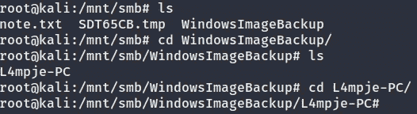

WindowsImageBackup

我们可以看到来自“L4mpje-PC”的备份。我又四处看了看，找到了一个电脑备份文件夹:

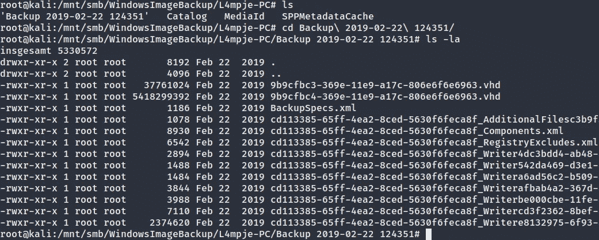

备份目录中的文件

“ls -la”命令向我们显示所有文件，甚至是隐藏的文件。两个。vhd 文件看起来很有趣。“Vhd”代表虚拟硬盘。我们可以安装到。vhd 文件使用命令“guestmount”。您必须首先使用以下命令安装它:

```
apt install libguestfs-tools
```

在我们安装这两个之前。vhw 文件，我们应该先创建一个新目录:

```
mkdir /mnt/vhd
```

现在，我们可以使用以下命令挂载这两个文件:

```
guestmount --add 9b9cfbc3–369e-11e9-a17c-806e6f6e6963.vhd -inspector -ro -v /mnt/vhd
```

和

```
guestmount --add 9b9cfbc4–369e-11e9-a17c-806e6f6e6963.vhd -inspector -ro -v /mnt/vhd
```

— add 指定 vhd 文件，— inspector 检查磁盘以查找操作系统并装载文件系统，就像它们将被装载在真实的虚拟机上一样，-ro 代表只读，-v 代表详细模式。之后，我们只需要指定我们的目录/mnt/vhd。装载可能需要几分钟。如果这是一个真正的 pentest 或 OSCP 考试，我会继续寻找漏洞，并进一步列举。

现在，我们可以进入目录，使用以下命令检查文件:

```
cd /mnt/vhd
ls
```

这是结果:

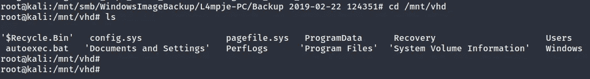

挂载的目录

我们显然是在 Windows C:/驱动器中。稍微找了一下，找到一个名为“Users”的目录，里面有一个用户叫“L4mpje”。桌面上和 documents directoy 中的文件总是非常有趣，所以让我们使用这个命令来查找一些文件:

```
find Desktop/ Downloads/ Documents/ -ls
```

遗憾的是，我们没有发现什么太有趣的东西:

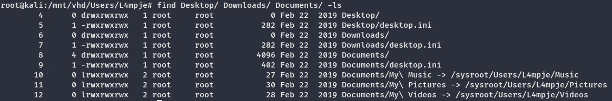

在桌面上查找文件、文档、下载

# 密码

我们可以尝试做的一件事是提取这个用户的密码。为此，我们必须进入/Windows/System32/config 目录:

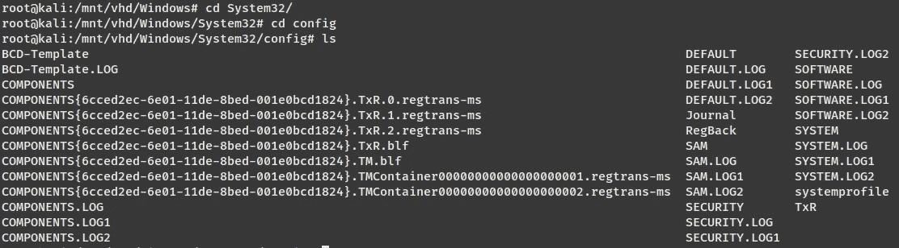

系统 32/配置

两个有趣的文件是“SAM”和“SYSTEM”。“SAM”文件是安全帐户管理器，它包含登录名和密码散列。用户密码以散列格式存储在注册表配置单元中，作为 LM 散列或 NTLM 散列。“系统”文件包含启动时已经需要的 Windows 设置，例如通过驱动程序和服务。

如果我在域控制器上，我还会获取“ntds.dit”文件，这是 Active Directory 数据库文件。有了这三个文件，我就能够解密广告数据库。但是现在，让我们使用这个命令将这两个文件复制到我们的 linux 机器上:

```
cp SAM SYSTEM /root/htb/boxes/bastion
```

“cp”代表复制，然后我们必须指定我们想要复制的文件和位置。

我决定在我的机器上创建一个新的目录来保持有序:

```
mkdir dump
```

将文件移动到这个位置也很容易:

```
mv SAM SYSTEM /dump
```

我们现在要做的就是将 cd 放入目录，并从 SAM 文件中转储密码散列。有几种方法可以做到这一点。有一个非常酷的 python 脚本叫做“ [SecretsDump](https://github.com/SecureAuthCorp/impacket/blob/master/examples/secretsdump.py) ”。您可以从 github 页面克隆它，但是 Kali linux 已经安装了它。该命令如下所示:

```
impacket-secretsdump -sam SAM -system SYSTEM local
```

脚本运行得非常快，给了我们这些结果:

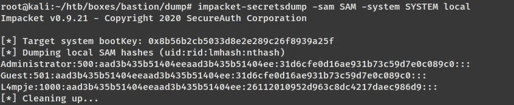

来自 SAM 文件的解密哈希

NTLM 哈希“31 D6 cf E0 d 16 AE 931 b 73 c 59d 7 E0 c 089 c 0”是一个空白/空密码。LM 哈希“aad3b 435 b 51404 eeaad3b 435 b 51404 ee”也是如此。这可能意味着管理员帐户被禁用。然而，我们从用户“L4mpje”那里获得了 NTLM 散列。我们来试着解密一下:

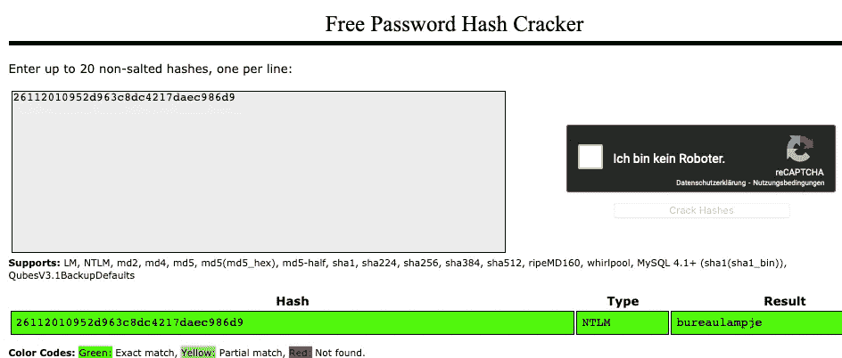

NTLM 哈希破解

我使用了一个随机的 hash cracker，几秒钟后我得到了被破解的 hash，也就是“bureaulampje”。我在 Cherry Tree 中写下了凭证“l4mpje:bureaulampje ”,并尝试使用这些凭证通过 ssh 进行连接:

```
ssh l4mpje@10.10.10.134
```

我立即获得了访问权限:

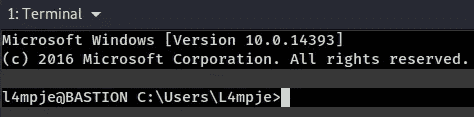

用户 L4mpje

出于本文的考虑，我将继续获取 user.txt，然后转到特权提升部分来获取 root.txt。

如果我们进入用户目录，我们将找到我们的用户“L4mpje”。user.txt 应该在他的桌面上:

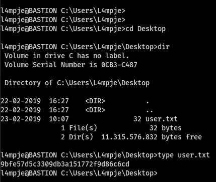

User.txt

我找了很长时间，查看了备份、日志和程序文件目录。我发现了一个有趣的应用程序，名为“mRemoteNG”:


姆雷莫滕

# 姆雷莫滕

这是一个用于 Windows 的开源、多协议、远程连接管理器。堡垒主机通常被用作带有远程管理工具的跳转主机，因此它们可以访问其他机器。

有一篇关于这个话题的有趣的[博文](https://hackersvanguard.com/mremoteng-insecure-password-storage/)。基本上，mRemoteNG 使用不安全的方法来存储密码，并可以在评估或比赛期间提供大量有效的凭证。密码的位置在 C:\ Users \ AppData \ Roaming \ mRemoteNG 中。AppData 是一个隐藏目录，所以你必须使用命令“cd /a”。

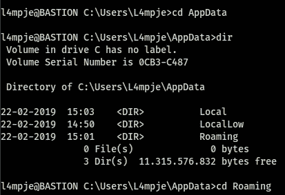

姆雷莫滕

连接配置文件名为 confCons.xml:

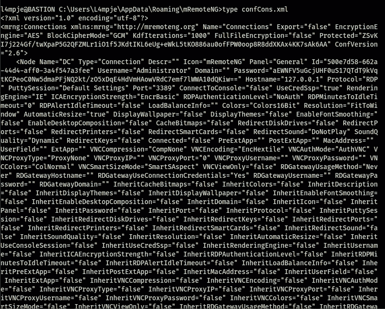

confCons.xml

使用“type”命令，我们可以打印出配置文件的内容。我们可以看到管理员密码“aewnfv 5 ugcjuhf 0 us 17 qtdt 9 kvqtkcpeoc 0 NW 5 dmapfjnq 2 kt/zo5 xdqe 4 hdvmhaowvrdc 7 emf 7 lwwa 10 dqkiw = =”

有一个很酷的 [python 脚本](https://github.com/haseebT/mRemoteNG-Decrypt)，你可以从 github 克隆它来解密管理员密码。该命令如下所示:

```
python3 mremoteng_decrypt.py -s aEWNFV5uGcjUHF0uS17QTdT9kVqtKCPeoC0Nw5dmaPFjNQ2kt/zO5xDqE4HdVmHAowVRdC7emf7lWWA10dQKiw==
```

密码是“thXLHM96BeKL0ER2”。

我们现在可以使用 ssh 连接到管理员帐户:

```
ssh administrator@10.10.10.134
```

现在获取 admin.txt 非常容易:

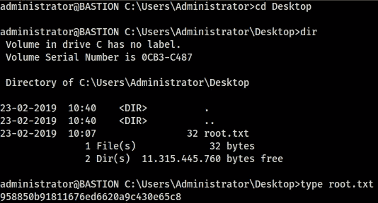

管理. txt

# 摘要

这真是一个有趣的盒子！快速回顾导致我们拥有这台机器的所有漏洞:

由于匿名登录 SMB，我们可以访问备份目录。没有密码的访客身份验证不是一个好主意，尤其是如果有一个包含敏感信息的目录。之后，我们得到了用户 L4mpje 的 NTLM 密码哈希。这是一个非常弱的密码，所以只需要几秒钟就可以解密。始终使用安全的密码。最佳做法是使用至少 12 个字符长的密码，包括数字和特殊字符。多因素身份认证也是一种很好的应对措施。然后我们使用 mRemoteNG 应用程序获取管理员密码。使用具有已知漏洞的应用程序并不明智，尤其是当它存储的密码具有弱散列时。所有这些因素导致我们获得了管理员权限。请继续关注我的系列文章的第三部分。