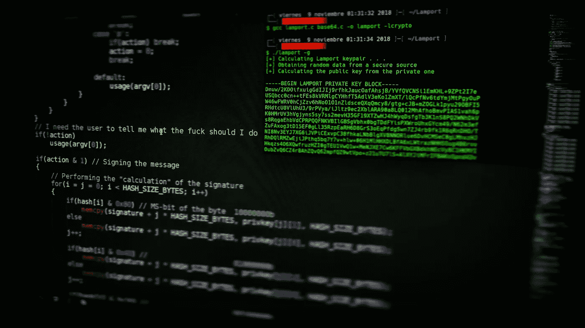
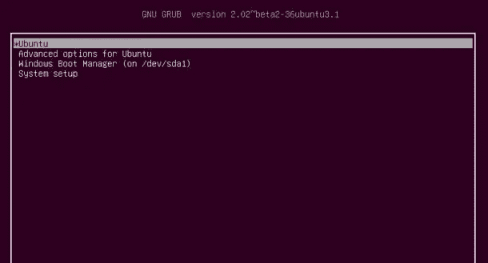

# 无凭证入侵 Linux 系统:一步一步指南

> 原文：<https://infosecwriteups.com/how-to-hack-into-a-linux-machine-4fd2384a8700?source=collection_archive---------3----------------------->

了解如何在不使用任何工具或程序的情况下访问锁定的基于 Linux 的操作系统。这篇文章解释了利用 Linux 引导过程并获得对根用户和系统上所有文件的访问权的方法。发现三种方法，包括**引导进入恢复模式**、**中断 initramfs 进程**、**覆盖默认初始化参数**。对于那些忘记密码或参加白帽黑客比赛的人来说是完美的。



为了能够理解我们将如何获得对系统的访问，我们需要了解一点关于基于 Linux 的发行版是如何引导的。

# Linux 引导过程

有很多资源，可能比我解释得更好，但我仍然会简要地介绍不同的阶段，以便您可以更好地理解我们将在哪里利用该系统。

*   当你按下电源按钮时，首先发生的是 ***CPU* 从闪存**加载 *boot/UEFI* 固件
*   **引导固件然后** **读取** [***主引导记录(MBR)***](https://en.wikipedia.org/wiki/Master_boot_record) 这是您硬盘上的第一个扇区 *(512 字节)*并验证磁盘签名，该签名用于识别我们正在引导的驱动器
*   之后， **boot 固件将 bootloader 加载到 *RAM* 中并执行**。重要的是要认识到**引导加载程序运行在 *RAM*** 中，因此任何改变都不会在引导之间持续。
*   **在这个阶段，我们将利用系统，因为我们将修改 initramfs 用户空间帮助程序加载根文件系统的参数，并误导它让我们访问系统。对于进一步的步骤，假设我们还没有调整系统**
*   由于根文件系统可能位于软件 *RAID* 卷、 *LVM* 、 *NFS* 或加密分区上，我们需要某种方式来正确配置系统，以便能够应对如此多的不同方式来挂载真正的根文件系统。因此 b **ootloader 将内核和临时根文件系统(有时称为** [**早期用户空间**](https://en.wikipedia.org/wiki/Linux_startup_process#Early_user_space) **)加载到 *RAM*** 中。

> 💡**内核也称为** [**Linux 内核**](https://en.wikipedia.org/wiki/Linux_kernel) **是计算机硬件与其进程之间的核心接口。**

*   内核试图从它的前几个数据块中**确定磁盘映像**(存储您的文件系统的文件)**的格式，这可以导致要挂载的***initrd****或 ***initramfs*** 类型的临时文件系统( *initramfs* 是 *initrd* 的后继)。***
*   **Initramfs* 用于尽可能多地替换以前内核在引导过程中执行的功能，例如**硬件检测、内核模块加载和设备发现，这些都是挂载真正的根文件系统所必需的**。*
*   ****Initramfs* 然后挂载根文件系统**并使用**参数运行`***/sbin/init***`脚本，我们将调整/利用***
*   **Init* 脚本运行许多不同的模块来在您的系统上设置服务，但最后还有提示您输入凭证的登录程序 *(lightdm)**

*关于启动过程就讲这么多。让我们更详细地看看我们将利用的阶段。*

# *引导装载程序*

*在这个例子中，我们将专门研究 [*GRUB2*](https://en.wikipedia.org/wiki/GNU_GRUB) ，但是您的系统也可能使用 [*rEFInd*](https://en.wikipedia.org/wiki/REFInd) ， [*systemd-boot*](https://en.wikipedia.org/wiki/Systemd-boot) ， [*coreboot*](https://en.wikipedia.org/wiki/Coreboot) ，[*syslinux*](https://wiki.syslinux.org/wiki/index.php?title=SYSLINUX)boot loader。你可能以前见过它，但是在 Ubuntu 系统上，引导装载器界面看起来像这样:*

**

*引导装载程序*

*它是在启动时出现的屏幕，提示您选择要启动的操作系统。如果你的系统上没有多个操作系统，这并不完全必要，但是如果你在打开电脑后立即按住`***Shift Key***`键，你仍然可以强制系统打开它。*

*好了，现在这是足够的背景，让我们利用它！我们将从最简单的开始，但并不总是可行的。*

# *引导进入恢复模式*

*在第二行顶部的图像上，您可以看到`***Advanced options***` **。**点击并选择一个恢复模式选项。您的系统将引导到一个 shell 中，以 root 用户身份登录。简单，你完了！*

> *💡**恢复模式通常被添加到操作系统中，以防您忘记密码，它使您能够重新访问您的文件系统。***

*这种方法的缺点是**引导** **进入恢复模式** **在所有发行版**上不可用，因为它可能被禁用。同样在恢复模式下，一些发行版在给你访问权限之前可能仍然会要求你输入根密码——所以你实际上什么也没得到。这就把我们带到了接下来的两个方法，它们通常在大多数 Linux 发行版上都可以使用。*

# *通过 initramfs 访问*

*这个方法需要你稍微邪恶一点。基本上你要做的是**改变根文件系统的位置， *initramfs* 试图挂载，这样它就找不到它了**。因此，您的系统最终会卡在 initramfs CLI 终端中，在这里您不仅拥有 root 权限，而且还可以**从正确的位置手动挂载根文件系统**并访问它。*

*重启你的系统，一旦你进入 GRUB2 界面，点击`***e***` 作为你想要访问的操作系统选项的编辑。这将为您打开一个简单的脚本。找到以 **linux** 开头的行，并更改参数`***root=***`的值，该参数告诉内核在哪里找到要挂载的真正的根文件系统(只需将其更改为不存在的文件系统，因为目标是防止内核找到它)。现在按下`***Ctrl + x***`，一分钟后，在 *initramfs* 临时文件系统中会弹出一个命令提示符，显示 root 权限。*

*这样，您就可以在系统上做任何您想做的事情。因为我们正在讨论访问系统根文件系统，所以我们可以做以下事情:*

```
***mkdir mnt/rootfs_mountpoint** # Create mountpoint for root
**mount /dev/<disk-X>** **mnt/rootfs_mountpoint** # Mount the disk with the file system*
```

*您可能会对这种方法感到满意，但我们实际上可以更容易地侵入系统。让我们看一看。*

# *覆盖默认的初始化参数*

*最后一种方法不会欺骗系统，只是覆盖它的默认参数。与之前一样，重启电脑，点击`***e***` 按钮，打开操作系统选项文件。然后在与根参数相同的行中添加一个名为 init 的附加参数，并将其设置为`***/bin/bash***`，如下所示:*

```
*linux ...root=... **init=/bin/bash***
```

*然后点击`***Ctrl + x***`，这将引导系统进入 bash 终端，让您像以前一样完全控制系统。*

# *如何防止这种情况？*

*你可以通过使用 **SecureBoot** 来减轻这种行为，但这可能是一个全新的帖子，所以我不会详细介绍。*

*这个帖子就说到这里，希望你觉得有趣。关注我了解更多信息。*

> *感谢阅读！😎如果你喜欢这篇文章，点击下面的按钮👏*
> 
> *对我来说意义重大，也有助于其他人了解这个故事。在[Linkedin](https://www.linkedin.com/in/teodor-janez-podobnik/)|[Twitter](https://twitter.com/TeodorJanez)上打招呼*
> 
> *要不要开始读 Medium 上的独家故事？使用此[推荐链接](https://medium.com/@tp4348/membership)🔗*
> 
> *如果你喜欢我的帖子，你可以[给我买个热狗](https://www.buymeacoffee.com/tp4348)🌭*
> 
> *你是一个热情的工程师，但缺乏能力来编写引人注目和鼓舞人心的技术内容吗？雇用我做升级工作🛠️*
> 
> *在 Teodor J. Podobnik，@dorkamotorka 上查看我的其他内容，并关注我的更多内容，干杯！*

## *来自 Infosec 的报道:Infosec 每天都有很多内容，很难跟上。[加入我们的每周简讯](https://weekly.infosecwriteups.com/)以 5 篇文章、4 个线程、3 个视频、2 个 GitHub Repos 和工具以及 1 个工作提醒的形式免费获取所有最新的 Infosec 趋势！*