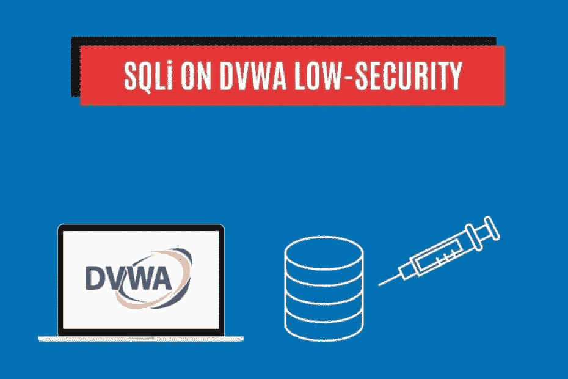
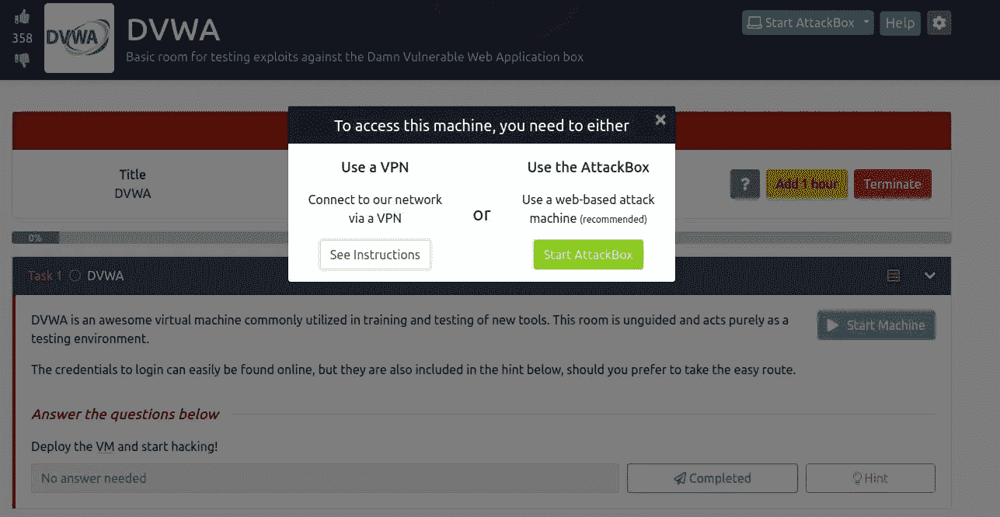
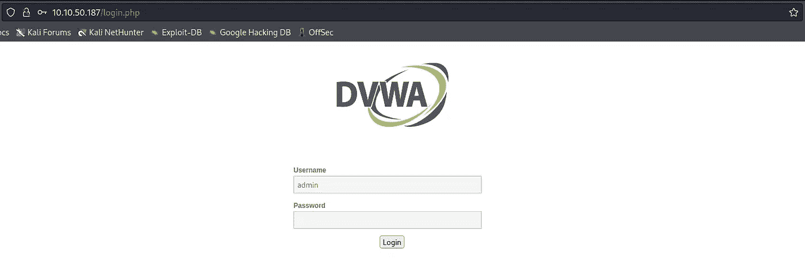
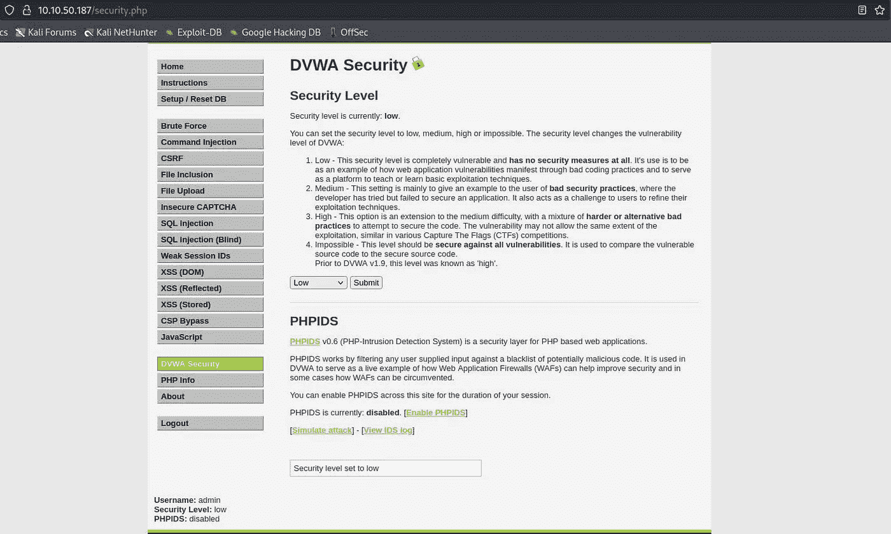
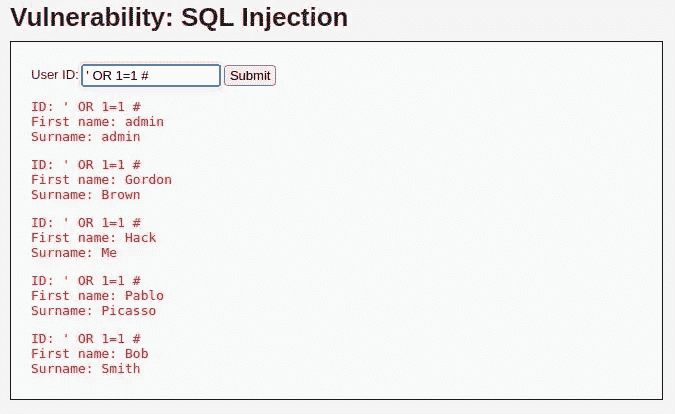
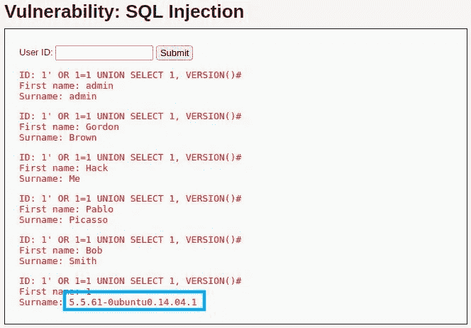
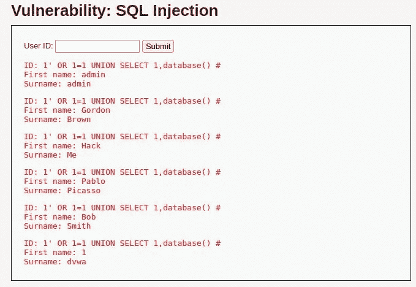
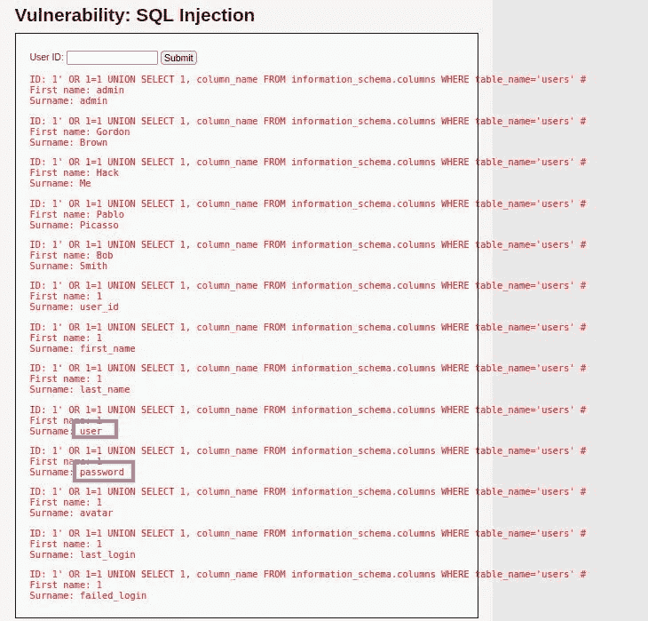
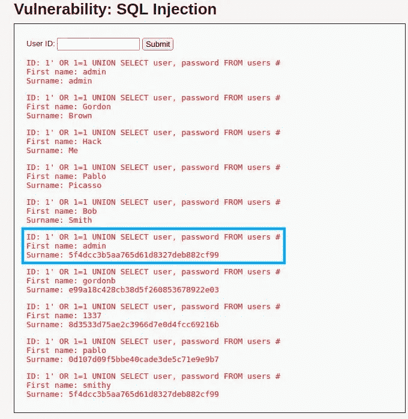
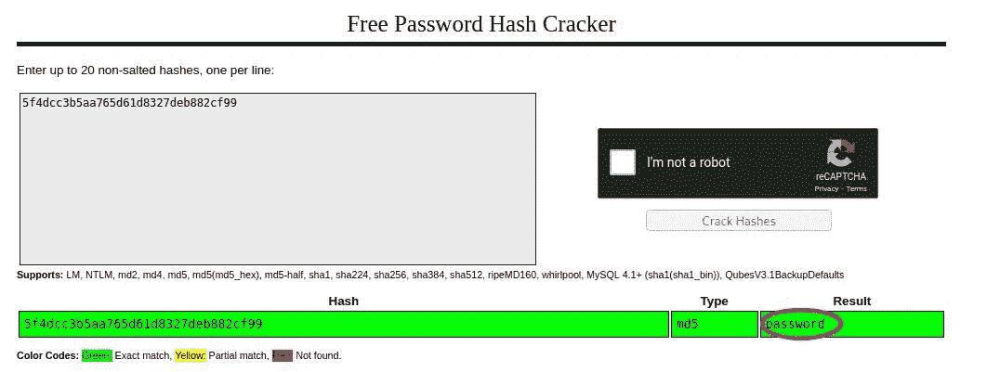

# 如何用 SQL 注入攻击进行黑客攻击！DVWA 低安全性—堆栈零

> 原文：<https://infosecwriteups.com/how-to-hack-with-sql-injection-attacks-dvwa-low-security-stackzero-9286d7d0dfd1?source=collection_archive---------0----------------------->



# 介绍

SQL 注入是一种代码注入技术，它利用了应用程序数据库层中存在的安全漏洞。当错误地过滤用户输入中嵌入在 SQL 语句中的字符串转义字符，或者用户输入不是强类型且意外执行时，就会出现此漏洞。这可能会让攻击者执行意外的 SQL 命令，从而危及数据库的安全。
你可以在本文中找到该漏洞的详细描述: [SQL 注入:你需要知道的事情](https://medium.com/codex/sql-injection-what-you-need-to-know-stackzero-abc80bc1ea5e)。
在本教程中，我们将利用该死的易受攻击的 Web 应用程序(DVWA)上的一个 SQL 注入漏洞。

通常，攻击者有不同的工具来完成他的任务，例如:

*   [**嗝组曲**](https://portswigger.net/burp/communitydownload)
*   [**SQLMap**](https://sqlmap.org/)

顺便说一下，这两个是最有名的，在本教程中我们不需要它们。

这里列出了所有关于 SQL 注入的文章，以便快速浏览:

# 带内 SQL 注入

*   [SQL 注入:您需要了解的内容](https://medium.com/codex/sql-injection-what-you-need-to-know-stackzero-abc80bc1ea5e)
*   [通过黑客攻击易受攻击的应用程序，在实践中学习 SQL 注入！](https://medium.com/bugbountywriteup/learn-sql-injection-in-practice-by-hacking-vulnerable-application-stackzero-ef7931c72aec)
*   [如何用 SQL 注入攻击进行黑客攻击！DVWA 低安全性](https://medium.com/bugbountywriteup/how-to-hack-with-sql-injection-attacks-dvwa-low-security-stackzero-9286d7d0dfd1)
*   [黑客用 SQL 注入攻击！DVWA 中等安全性](/hack-with-sql-injection-attacks-dvwa-medium-security-stackzero-d4af0a9a5f9)
*   [黑客用 SQL 注入攻击！DVWA 高安全性](/hack-with-sql-injection-attacks-dvwa-high-security-stackzero-713638840515)

# 盲人 SQL 注入

*   [打嗝组曲？不用了，谢谢！用 Python 实现 DVWA 中的盲 SQLi(第 1 部分)](/how-i-exploited-blind-sqli-without-using-any-tool-stackzero-396e831ecbdf)
*   [打嗝组曲？不用了，谢谢！用 Python 实现 DVWA 中的盲 SQLi(第 2 部分)](/burp-suite-no-thanks-blind-sqli-in-dvwa-with-python-part-2-stackzero-a5c0acf431dc)
*   [打嗝组曲？不用了，谢谢！用 Python 实现 DVWA 中的盲 SQLi(第 3 部分)](/burp-suite-no-thanks-blind-sqli-in-dvwa-with-python-part-3-stackzero-911545003f01)

# 为 SQL 注入准备 DVWA

我们有不同的选择来建立我们的实验室，但我总是喜欢更快的一个，所以我建议你不要从 [Vulnhub](https://www.vulnhub.com/) 安装我们的机器，而是从 [TryHackMe](https://tryhackme.com/room/dvwa) 获得 DVWA 机器。
此时，你可以只运行攻击箱或者运行你的[卡利机](https://medium.com/@stackzero/how-to-install-kali-linux-on-virtualbox-in-a-few-minutes-stackzero-37fb019261cb)。

如果你像我一样使用你的 Kali 机器:

*   启动机器
*   打开你的 Kali 虚拟机，按照说明运行你的 VPN。
*   将您的浏览器连接到给定的 IP



如果一切正常，您应该会看到登录页面，在这里您必须插入凭证并进入:

*   用户名:**管理员**
*   密码:**密码**



在我们开始之前，我们需要确保我们的 DVWA 安全设置为低。
这可以通过转到 DVWA 安全选项卡并从下拉菜单中选择低来完成。



现在我们已经配置了安全设置，我们可以继续利用 SQL 注入了！

# 针对 DVWA 低安全性的 SQL 注入:什么 DBMS？

我们已经准备好测试我们对 DVWA 的 SQL 注入攻击。第一步是从左边的菜单中选择“SQL 注入”。

本文中我们已经看到的概念我就不深入了:[通过黑客攻击易受攻击的应用在实践中学习 SQL 注入！](/learn-sql-injection-in-practice-by-hacking-vulnerable-application-stackzero-ef7931c72aec)

让我们尝试将以下输入传递给表单，只是为了检查漏洞是否存在:

```
' OR 1=1 #
```

这就是结果:



它起作用了，所以我们确认了漏洞的存在！

另一个吸引眼球的是标签；暗示 DBMS 可能是 MySQL。

但是我们想做好每一件事，而且我们已经知道如何验证我们的假设。
正如我们已经看到的[这里的](/learn-sql-injection-in-practice-by-hacking-vulnerable-application-stackzero-ef7931c72aec)，第一步是知道我们的查询中涉及到多少字段。
这一次，不同于我以前所做的，我将使用“**按**排序”技术。
作为刷新，我们需要在查询中追加一个 ORDER BY 子句，并设置字段的索引；当索引不存在时，这意味着我们超出了范围，并且字段的数量比该索引少一个。

我们的查询应该如下所示:

```
... ORDER BY <NUMBER> #
```

其中我们必须用一个递增的索引替换“<number>”，直到我们得到一个错误。</number>

因此，让我们尝试传递以下字符串作为输入:

```
1' ORDER BY 1 # 
1' ORDER BY 2 # 
1' ORDER BY 3 #
```

当我们尝试使用“index=3”时，服务器会引发一个错误，并显示以下消息:

```
Unknown column '3' in 'order clause'
```

这意味着该查询涉及两个字段，当我们试图使用 UNION SELECT 查询获取附加信息时，这将很有帮助。

我们可以通过键入以下命令来检查我们对 DBMS 的假设:

```
1' OR 1=1 UNION SELECT 1, VERSION()#
```

函数“ [VERSION](https://dev.mysql.com/doc/refman/8.0/en/information-functions.html#function_version) ”来自 MySQL，显示“VERSION”系统变量。
因此，在点击“提交”并得到下图中的结果后，我们知道 DBMS 是 MySQL。



在最后一行中，我们还获得了正在运行的 DBMS 的版本:5.5.61。

# DVWA 低安全性的 SQL 注入:获取模式信息

现在是获取关于模式的信息的时候了，此时我们知道:

*   数据库管理系统是 MySQL 5.5.61
*   该查询涉及两个字段

这一步是可选的，但是我们不想被太多的结果所迷惑，所以我更喜欢获取当前的数据库名称，以便我们可以在下一步中过滤结果:

```
1' OR 1=1 UNION SELECT 1,DATABASE() #
```

即使在这种情况下，“[数据库](https://dev.mysql.com/doc/refman/8.0/en/information-functions.html#function_database)”是一个 MySQL 函数，它返回当前数据库的名称，所以这将是我们的结果:



显然，我们在最后一行寻找的名字是 *"dvwa"* ！

现在，我们可以继续使用这个查询来检索表名(注意，仅仅通过数据库的名称，我们就可以过滤掉这么多干扰):

```
1' OR 1=1 UNION SELECT 1,table_name FROM information_schema.tables WHERE table_type='base table' AND table_schema='dvwa' #
```

结果非常容易理解，尤其是结果末尾的“用户”表，似乎对我们的工作很有意思。


最后，我们需要知道目标表的列名。

检索该信息的过程与我们之前使用的过程相同，让我们编写查询:

```
1' OR 1=1 UNION SELECT 1, column_name FROM information_schema.columns WHERE table_name='users' #
```

该查询将向我们显示表“users”中所有列的名称。如果许多表的模式具有相同的名称，您可以添加一个子句来指定 table_schema。



突出显示的字段是我们在最后阶段感兴趣的字段。

到这一点，我们有我们需要的一切来执行我们的攻击！

# 用于 DVWA 低安全性的 SQL 注入:检索凭据

我打赌你已经知道我们要做什么，无论如何，为了清楚起见，我将向你展示完整的过程。

我们将要编写的查询应该检索字段**用户**和**密码:**

```
1' OR 1=1 UNION SELECT user, password FROM users #
```

提交“漏洞”后，我们在“*用户*”表中获得所有凭证的列表:



更有希望的是方块内的那个(可能它们是管理员帐户的凭证)，反正这次也是，和上一个教程一样，密码不是以纯文本保存的，所以我们还需要一个步骤来破解它。

因此，正如我们在之前的教程中已经做的那样，让我们将找到的密码复制粘贴到 [CrackStation](https://crackstation.net/) 的文本区域，然后求解验证码并查看结果！



我们完了！用户名是“ *admin* ”，密码是“*密码*”，不是最安全的组合，但是我们找到了！

# 结论

这篇关于 SQL 注入和低安全设置的 DVWA 的文章非常简单，但我希望它尽可能具有教育意义。这种实践会让你更有信心在渗透测试或 bug 搜索过程中处理更复杂的场景。无论如何，这篇文章不会是关于 SQL 注入的最后一篇文章，所以如果你对争论感兴趣，请继续关注 StackZero！

*原载于 2022 年 8 月 16 日 https://www.stackzero.net**[*。*](https://www.stackzero.net/how-to-hack-with-sql-injection-attacks-dvwa-low-security/)*

**来自 Infosec 的报道:Infosec 上每天都会出现很多难以跟上的内容。* [***加入我们的每周简讯***](https://weekly.infosecwriteups.com/) *以 5 篇文章、4 个线程、3 个视频、2 个 Github Repos 和工具以及 1 个工作提醒的形式免费获取所有最新的 Infosec 趋势！**