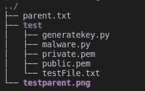
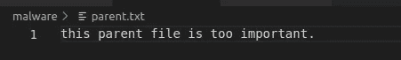
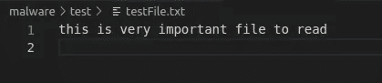
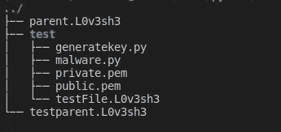
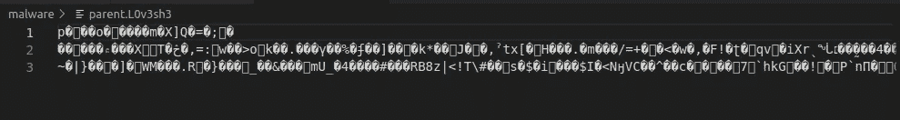
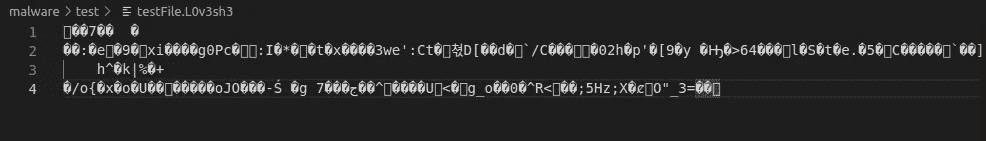

# 如何用 Python 制作勒索软件

> 原文：<https://infosecwriteups.com/how-to-make-a-ransomware-with-python-c4764f2014cf?source=collection_archive---------0----------------------->

**免责声明:**
本教程只是出于教育目的，不要试图破坏除你之外的任何计算机。如果你试图制作真正的勒索软件，你就违反了法律，你会坐牢的。

今天我将向你解释如何制作勒索软件，以及如何使用 python 语言。

## **什么是勒索软件？**

它就像其他恶意软件或计算机病毒，但只有一个目的，加密你的数据，为你制造赎金。你的数据是用非对称加密加密的，病毒只是用公钥加密。有一个私钥可以解密你的数据，但是你知道攻击者不会把私钥附加到病毒上。

## 准备制作勒索软件

在你建立一个程序之前，你必须知道它将会是什么，它将会做什么。这是我的清单，你可以用你自己的清单。

1.  该计划应该是一个可执行文件和图标像一个文档文件。
2.  程序必须用公钥加密数据
3.  加密后程序必须删除原文件，用“ **.L0v3sh3** ”更改加密文件扩展名，哈哈。我喜欢这个扩展
4.  该程序必须显示一个带有倒计时定时器的弹出消息。

我写过关于我们需要什么来构建勒索软件的文章。如果你想要更多的解释，就看看我的上一篇文章。

[](https://python.plainenglish.io/encrypt-message-with-python-using-asymmetric-encryption-82e3810d349d) [## 使用非对称加密使用 Python 加密消息

### 关于如何用 Python 使用非对称加密来加密消息的指南。

python .平原英语. io](https://python.plainenglish.io/encrypt-message-with-python-using-asymmetric-encryption-82e3810d349d) [](https://python.plainenglish.io/upgrade-my-python-file-organizer-script-with-advanced-features-229d8a14802e) [## 使用懒人的 Python 文件管理器脚本在智能手机上组织文件

### 我的 Python 文件管理器脚本的升级，具有在智能手机上组织文件的高级功能。

python .平原英语. io](https://python.plainenglish.io/upgrade-my-python-file-organizer-script-with-advanced-features-229d8a14802e) [](https://python.plainenglish.io/organize-files-with-lazy-man-and-python-1521ec482a70) [## 使用 Python 以懒人的方式组织文件

### 用 Python 轻松组织文件。

python .平原英语. io](https://python.plainenglish.io/organize-files-with-lazy-man-and-python-1521ec482a70) 

## 开发程序

**步骤 1 —生成私有&公钥**

在上一篇文章中，我解释了如何制作一个 python 程序来生成私钥和公钥。


文件列表

运行完 genKey.py 后，有两个文件， **private.pem** 和 **public.pem** 。
安全保存您的 private.pem。

**步骤 2——对公钥进行编码**

编码的主要目的是使公钥难以被静态恶意软件分析识别。
因此，我用 **base64** 对公钥进行编码，并将其附加到我的代码中。

在 python 脚本中，您可以使用以下脚本:

```
import base64code = "aGkgZnJpZW5kcywgdGhpcyBpcyBiYXNlNjQgZW5jb2Rpbmc=" 
print(base64.b64decode(code))
```

因此，您可以对您的私钥进行编码，然后在 python 脚本中对其进行解码。

```
import base64with open('public.pem', 'rb') as f:
    public = f.read()print(base64.b64encode(public))
```

**第 3 步—加密目录中某些文件的 python 脚本**

我从上一篇关于用 python 组织文件的文章中得到的想法。

```
def scanRecurse(baseDir):
    for entry in os.scandir(baseDir):
        if entry.is_file():
            yield entry
        else:
            yield from scanRecurse(entry.path)
```

上面的函数是一个递归函数，用于扫描目录并获得一堆列出路径的文件。然后，我们使用加密功能，并运行它与我们的文件列表之前。下面是测试函数，以确保该函数正常工作。

对于解密函数，您可以使用我之前的脚本。

[https://gist . githubusercontent . com/febimudiyanto/fb00a 34415 b 73 e 74 CD 088 dfcaed 6 e 340/raw/55 bbea 86 CFF 300 e 294 e 8952 DD 30 e 19662 f 5f 4908/decrypt file . py](https://gist.githubusercontent.com/febimudiyanto/fb00a34415b73e74cd088dfcaed6e340/raw/55bbea86cff300e294e8952dd30e19662f5f4908/decryptFile.py)

**让我们扫描文件，加密，然后改变扩展名。**

为了测试，我想用这个程序的父目录来扫描和加密这个脚本。

以下是我运行恶意软件前的目录:



运行恶意软件前我的目录



parent.txt 的内容



testFile.txt 的内容

以下是我运行恶意软件后的目录:



运行程序后 parent.txt 的内容



运行程序后 testFile.txt 的内容

我们能够制作一个加密文件和改变文件扩展名的 python 程序。

**步骤 4——加密完成后的倒计时和消息**

只要复制我的脚本，并将其粘贴到恶意软件脚本的结尾。

**最后一步——用 auto-py-to-exe 构建一个可执行文件**

我不能向你解释更多，但你可以阅读这篇文章，[https://dev . to/eshloron/how-to-convert-py-to-exe-step-by-step-guide-3c fi](https://dev.to/eshleron/how-to-convert-py-to-exe-step-by-step-guide-3cfi)

那是非常详细的解释。

## 奖金

这是我的完整脚本，只是复制它，但不要忘记理解你写的东西。

[](https://github.com/febimudiyanto/python-project/tree/main/simple-ransomware) [## python-project/simple-ransomware at main febimudiyanto/python-project

### semua 项目 python。通过在 GitHub 上创建一个帐户，为 febimudiyanto/python 项目开发做出贡献。

github.com](https://github.com/febimudiyanto/python-project/tree/main/simple-ransomware) 

## 启动勒索软件


测试运行勒索软件

抱歉，我在倒计时计时器:D 的错别字

## 结论

这是一个可怕的项目，对不对？
执行程序时要小心，确保更改了目录，并在虚拟机/实验室中尝试。

用我的程序你可以逆向修改，解密 **.L0v3sh3** 文件。只需改变加密功能与解密与一些逻辑。

为了缓解这种情况，该勒索软件从未信任过该文件。如果您使用 Windows 作为操作系统，请始终打开扩展视图，以便您可以区分哪个可执行文件或文档文件。

感谢阅读。

## 更新—2022 年 11 月 27 日

如果搜索解密加密文件，请看我上面的 github(在奖金环节)。
我还放了私钥和公钥，还有 **decryptor.py** 让你更方便。

Infosec Writeups 团队刚刚完成了我们的第一次虚拟网络安全会议和网络活动。我们有 16 位出色的演讲者，他们主持了非常有价值和鼓舞人心的会议。要查看演讲者和主题列表，请点击此处。

[](https://iwcon.live/) [## IWCon2022 — Infosec 书面报告虚拟会议

### 与世界上最优秀的信息安全专家建立联系。了解网络安全专家如何取得成功。将新技能添加到您的…

iwcon.live](https://iwcon.live/)