# 如何轻松制作我们自己的 CTF 挑战赛？

> 原文：<https://infosecwriteups.com/how-to-make-our-own-ctf-challenge-with-ease-6b15f76865b5?source=collection_archive---------0----------------------->

嗨，信息安全的人们，希望你们健康！我刚刚有足够的时间来写一个关于我真正想写的主题的博客，“你也可以创建自己的 CTF 挑战赛”，但我把这个名字改成了现在的名字，因为它听起来没有现在的博客名字那么有趣/酷。到目前为止，这将是我迄今为止最好的博客，如果你真的想在创造挑战时看到创造者的心态，我鼓励你阅读博客直到结束，以学习如何创造…


好吧，根据我在类似 **TryHackMe** 、 **HackTheBox** 、 **VulnHub** 的平台上玩 CTF 的个人经验，我真的很喜欢玩它们，但我的心态是破解/破坏它们，然后继续前进，直到我在**Linux**/**windows**box 中获得 **root** / **管理员**权限。但是这种突破性的东西是令人兴奋的，直到我开始做一个我自己的盒子，相信我，当你自己创造东西时，你的视角会改变。当你试图分解事物时，你倾向于用新的眼光、新的大脑看待事物，并有更广阔的思维方式。

我一直在想，创造者是如何创造盒子的？他们如何知道什么样的配置使一个盒子容易受到攻击？我怎么才能做出我的呢？流程是怎样的？所以我开始研究这个。到目前为止，我一直在做这个盒子，所以我不介意和你们分享这个方法。虽然，这个博客不会专注于创建一个有 **X** 漏洞的盒子，但只是给出一个关于盒子创建的想法。如果你对制作盒子更感兴趣，做你的研究，了解你要做什么，然后开始制作。而且在这篇博客的最后，我还会给你提供笔记(以防后面有人忘记步骤，就像我每次都忘记一样)！

让我们快速看一下这篇博客的内容:

*   在 VirtualBox 中创建虚拟机
*   Ubuntu 服务器安装
*   盒子创建
*   出口设备
*   笔记

此外，在开始创建一个盒子之前，我们需要一个 kali linux 和一个我们将要使用的 ubuntu server 20.04。

我对 box 的见解已经够多了，让我们开始制作一个吧(我真心希望你会感到兴奋)。

**注意:我将在虚拟盒子上制作这个盒子，因为。虚拟盒支持 ova 文件。如果你们愿意，可以在 VMWare 上做一个盒子(我已经做好了)。**

先从访问 [Ubuntu](https://ubuntu.com/download/server) 网站下载 Ubuntu Server 20.04 镜像开始，

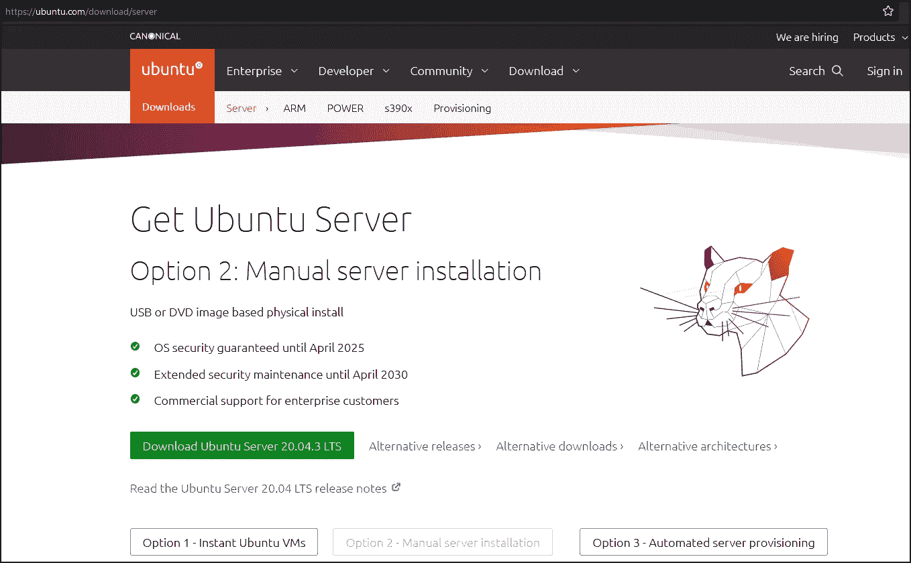

点击绿色按钮下载 Ubuntu Server 20.04 镜像

下载完成后，我们必须在虚拟箱中创建新的虚拟机。我将展示如何创建新的虚拟机(以防有人不知道如何创建新的虚拟机)。

# 创建虚拟机

*   单击“新建”按钮打开一个对话框。键入新虚拟机的名称。由于我打算安装 Ubuntu Server 20.04，所以我将它命名为 **Ubuntu Server** ，

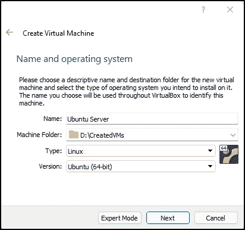

*   点击**下一个**。我们看到了一个**内存大小**窗口。内存大小取决于您的主机内存大小(我已将其设置为 1gb，如果您想要更多，您可以根据您的系统规格自由添加)，

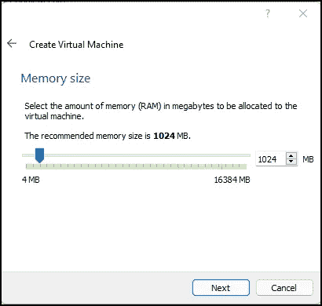

*   点击**下一个**。接受默认的“立即创建虚拟硬盘”，

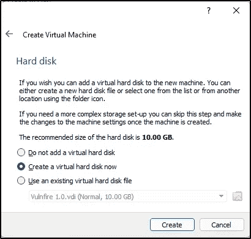

*   点击**创建**。继续接受默认的“VDI”驱动器文件类型，

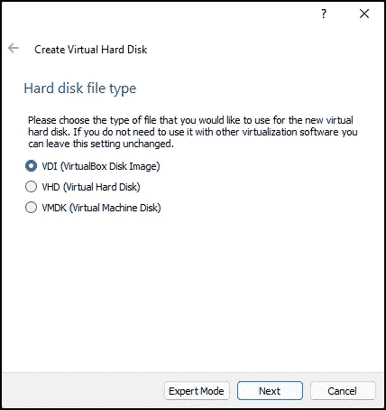

*   点击**下一个**。动态分配物理硬盘，


*   点击下一个的**。这将为我们创建新的虚拟机。现在，选择我们新创建的机器并点击虚拟框上的**设置**图标。**

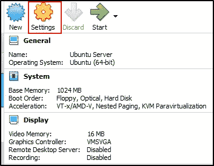

*   将打开虚拟机设置。从那里，导航到**网络**选项卡并选择 **NAT 网络**(如果你不知道如何创建，请参考这篇关于[如何在 VirtualBox](https://www.techbeatly.com/how-to-create-and-use-natnetwork-in-virtualbox/) 中创建和使用 NAT 网络的文章)。


*   点击**确定**。我们的虚拟机现在已经创建好了。让我们点击绿色箭头**开始**按钮开始。然后它会要求选择 iso，导航到您下载 iso 文件的文件夹/目录并选择它。然后点击**选择**按钮。这样，我们的 Ubuntu 服务器就可以启动了。

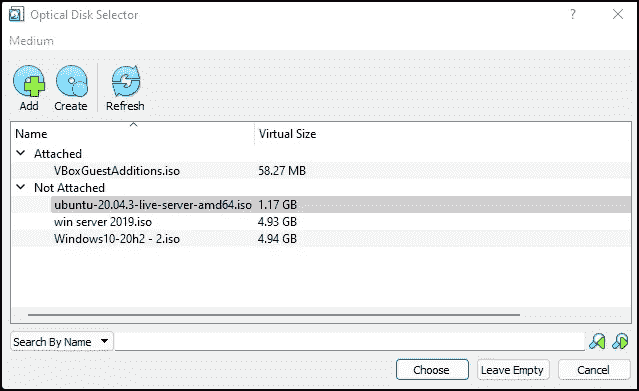

# Ubuntu 服务器安装

现在，我们将继续安装 Ubuntu 服务器。因此，当服务器启动时，我们将首先看到这个窗口，其中需要选择一种语言。让我们从英语开始。

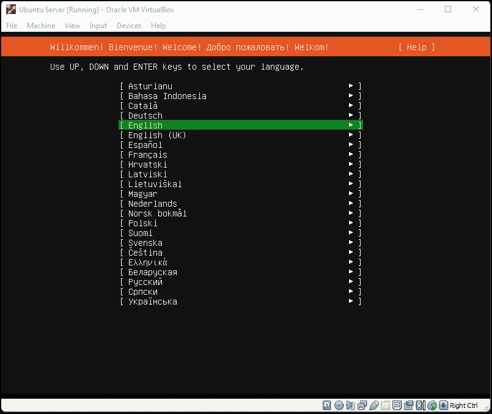

*   按下回车键，我们将看到安装程序更新可用。但是让我们继续不更新它，

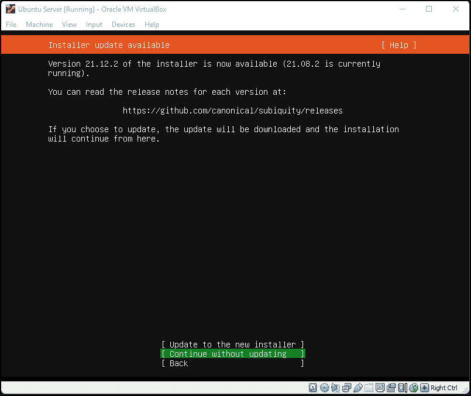

*   按回车键，下一步将是键盘配置。让它保持原样，

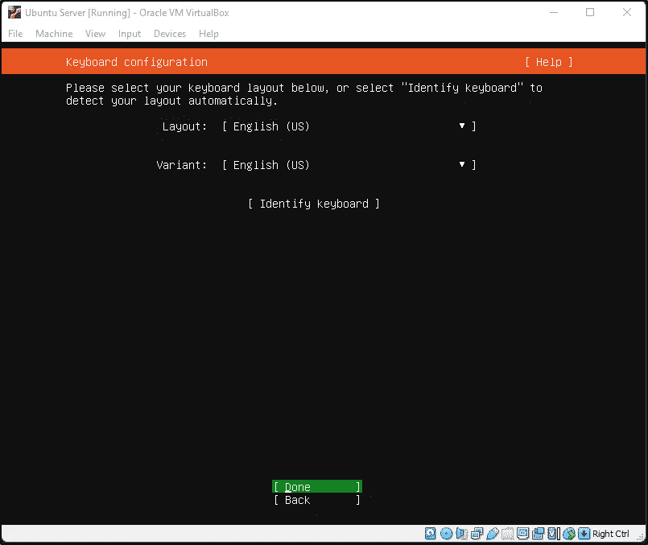

*   按回车键，我们将看到网络连接窗口。所以让服务器使用 DHCP 为机器自动分配 IP 地址，

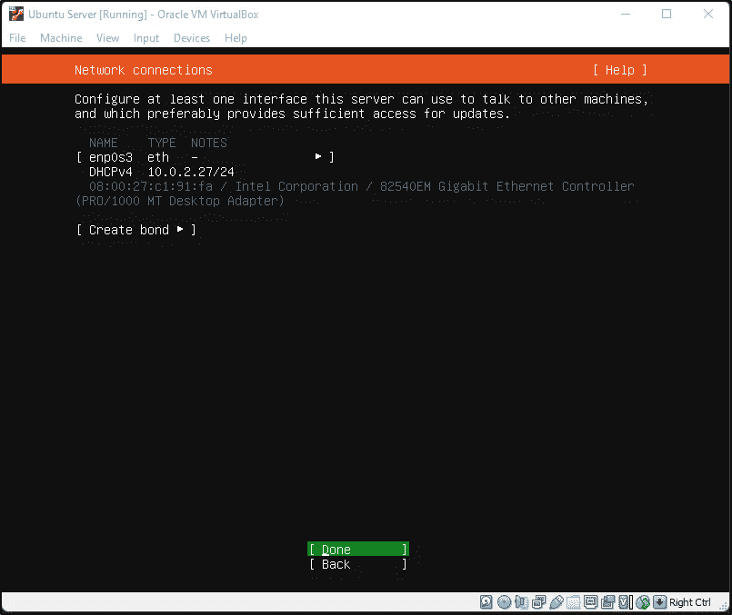

*   按回车键，现在我们将看到配置代理，但我们将按回车键跳过它。

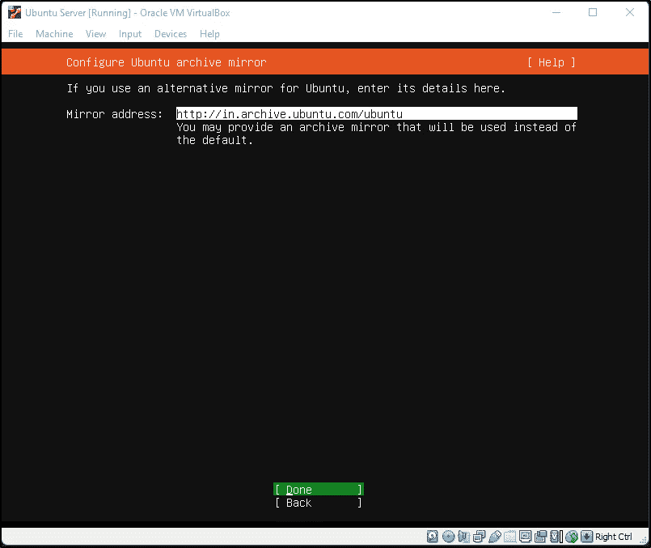

*   现在，我们将看到存储配置。我们将为我们的盒子使用整个磁盘，

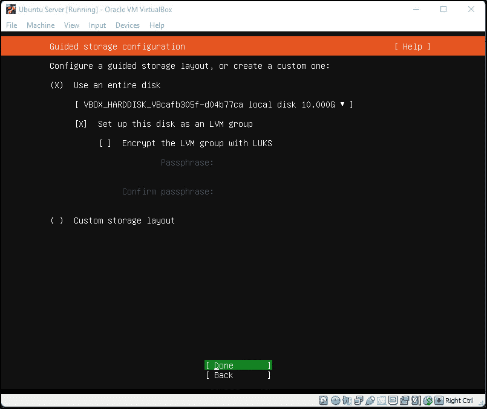

*   选择存储布局后，按 enter 键，

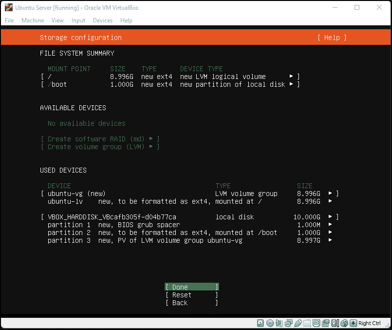

*   我们不必在这里进行更改，所以再次按 enter 键，

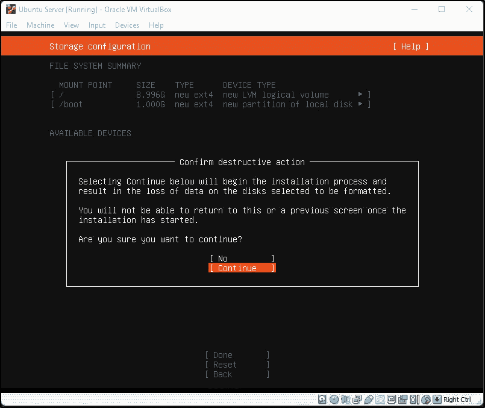

*   它将提示一个确认框并开始安装。开始**继续**。然后，它会要求输入设备名称和用户名及其对应的密码，所以让我们创建一个，

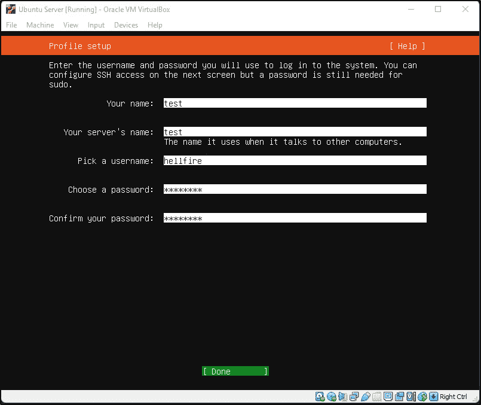

我已经输入了**主机名**(服务器名称)作为**测试**和**用户名** & **密码**作为**地狱火**。

*   输入名称、用户名和密码后，按回车键。然后它会问我们是否要安装 **OpenSSH 服务器**，既然我们想安装，那么我们将通过将光标移到该区域并按下 ***空格键*** 来选择它。

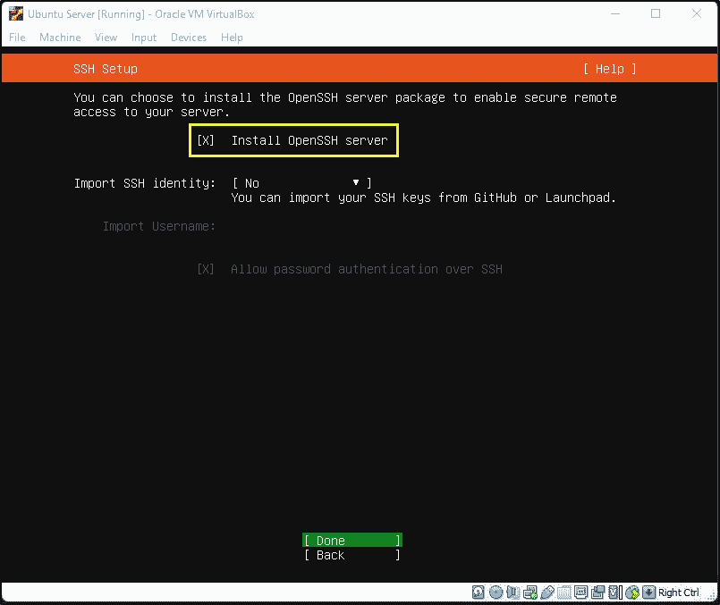

*   按回车键，它会要求我们安装快照功能，让我们跳过这些，


*   最后一次按回车键完成配置，ubuntu 将开始安装过程，

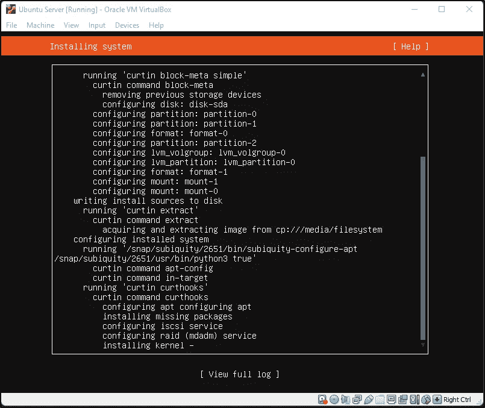

达到这一点后，您将会看到一个选项**现在重启**。继续重新启动这台机器，现在我们的机器准备好了。

# 盒子创建

现在我们已经完成了 ubuntu 服务器的安装，让我们快速开始创建盒子的过程(我知道你们中的一些人已经很兴奋了，我也是)。我们现在可以使用我们拥有的凭证(在我的例子中是 hellfire:hellfire)登录到服务器。让我们看看信息，

```
id
whoami
hostname
```

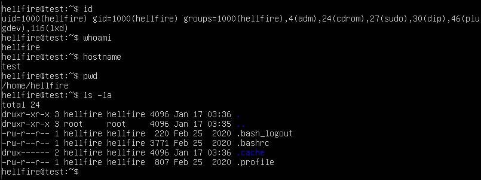

`id`命令会显示地狱火用户的 ID，`whoami`命令会显示我们当前的身份，`hostname`命令会显示系统的名称。发出`ls -la`命令，我们可以看到目录内容(目前没有什么有用的)。

现在，为了执行一些主要任务，我们需要 root 用户访问权限，为此，我们首先启用 root 用户登录，

```
sudo -i passwd root
su root
id
```

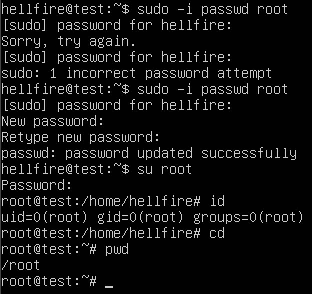

第一个命令`sudo -i passwd root`通过要求我们设置 root 用户密码来启用 root 用户登录。第二个命令`su root`帮助我们切换到 root 用户，而`id`命令检查 root 用户的 ID。

现在我们在根用户目录中，让我们创建根用户标志，

```
echo 'root_flag' | md5sum > root.txt
ls -la 
chmod 600 root.txt
ls -la
```

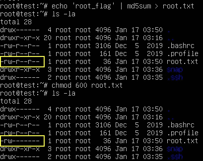

第一个命令`echo ‘root_flag’ | md5sum > root.txt`回显 **root_flag** 字符串，并且[将其管道](https://www.geeksforgeeks.org/piping-in-unix-or-linux/)到 [md5sum](https://www.geeksforgeeks.org/md5sum-linux-command/) 命令中，以生成一个字母数字值，该值被直接导入到 **root.txt** 文件中。发出`ls -la`，我们可以看到我们的 root.txt 文件已创建，但对 **others** 和 **groups** 也有读取权限(我们需要取消这些权限，因为您不希望低级用户读取 root 用户文件的信息)。因此，为了取消其他人和组的读取权限，第三个命令`chmod 600 root.txt`帮助我们(文件分别具有值为**4–2–1**的 **r-w-x** 权限)，并确保除了根用户之外没有其他人可以读取该标志。再次发出`ls -la`，我们可以清楚地看到文件权限发生了变化。

要验证低级别用户是否可以读取该标志，只需键入`exit`命令，并尝试以低级别用户(在我的例子中是地狱火)的身份读取 root.txt 文件，我们可以看到**权限被拒绝**消息，该消息验证除了 root 用户之外没有人可以读取 root.txt 文件。

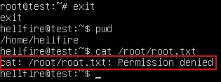

我们在这里很好。(:

现在，让我们使用`su root`命令再次切换回 root 用户，并为低级用户创建标志。

```
echo 'user_flag' | md5sum > /home/hellfire/user.txt
ls -la
chown hellfire:hellfire user.txt && chmod 660 user.txt
ls -la
```

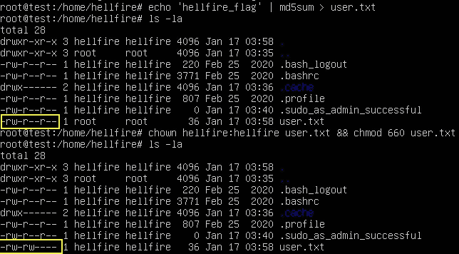

第一个命令`echo ‘user_flag’ | md5sum > /home/user/user.txt`帮助我们创建了用户标志。发出`ls -la`命令查看 user.txt 文件的权限，我们可以看到**组**和**组**可以读取 user.txt 文件。所以在这里，我们可以做的是，我们可以让这个文件归 hellfire 用户所有，并更改其权限，以便只有所有者和组成员可以读取这个 user.txt 文件。我们可以通过组合两个命令`chown hellfire:hellfire user.txt && chmod 600 user.txt`来完成这两个任务，因为该命令只有在第一个命令正确时才有效(这是因为 **& &** 操作符)。再次发出`ls -la`，我们可以看到我们的文件现在归地狱火所有，并且拥有合适的权限。

继续进行有趣的事情，比如配置 FTP 服务器、apache2 服务器、openssh 服务器等。现在我们已经完成了创建标志的工作，让我们开始真正的工作。要通过此服务器上的任何端口启用流量，我们需要 ufw ( [**简单防火墙**](https://www.linux.com/training-tutorials/introduction-uncomplicated-firewall-ufw/) )工具。让我们把它安装在我们的服务器上，

```
apt install ufw
ufw status
ufw enable
ufw status
```

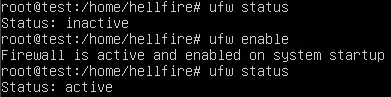

第一个`apt install ufw`命令在我们的服务器上安装简单的防火墙。第二个`ufw status`命令检查防火墙的状态，看它是活动的还是不活动的。第三个`ufw enable`命令启用/启动防火墙，第四个命令再次检查防火墙的状态(现在是活动的)。

下载并设置了简单的防火墙后，让我们安装 FTP 服务器，

```
apt install vsftpd
cp /etc/vsftpd.conf /etc/vsftpd.conf.orig
nano /etc/vsftpd.conf
```

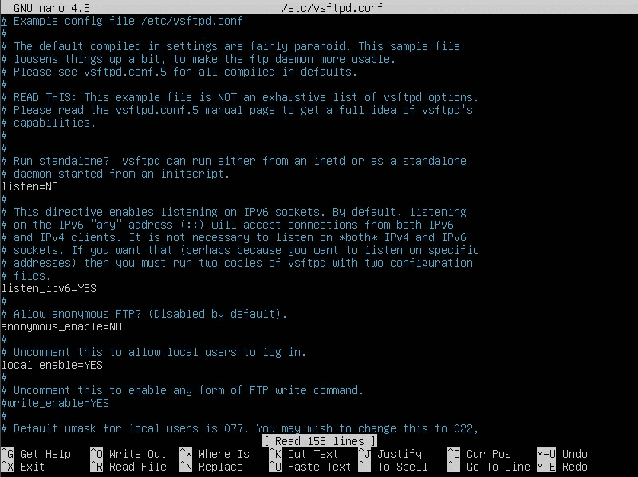

第一个`apt install vsftpd`命令在我们的机器上安装 vsftpd 服务器。第二个`cp /etc/vsftpd.conf /etc/vsftpd.conf.orig`命令对 vsftpd.conf 文件的配置进行备份。第三个`nano /etc/vsftpd.conf`命令打开文本编辑器来编辑 vsftpd.conf 文件。

现在，我们都喜欢在解决 CTFs 时启用匿名用户登录，因为它使我们的工作更容易，对吗？我们将配置相同的匿名用户访问我们的 FTP 服务器(耶！).由于我们的配置文件已经在运行，我们必须对这个文件进行修改。要让匿名用户登录 ftp，

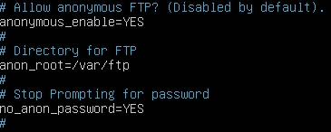

我们将匿名登录从**否**更改为**是**，因为这将允许匿名用户登录 FTP。接下来，我们为`/var/ftp`中的 **ftp** 定义了一个目录。最后，我们禁用了匿名用户的登录密码；这将做的是，当一个匿名用户试图登录，ftp 不会要求密码，而认证。

现在我们已经完成了 vsftpd.conf 配置，让我们也在终端上烘焙一些东西，

```
cd /var
mkdir ftp
chown nobody:nogroup ftp/
cd ftp && echo 'Hello Hellfire' > file.txt && chown nobody:nogroup file.txt
```

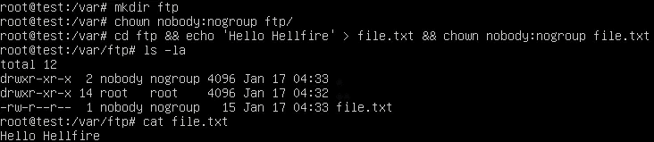

好了，我们将使用第一个命令导航到`/var`目录，然后使用第二个命令，我们将创建一个名为 **ftp** 的目录。创建目录后，让我们变点魔法，好吗？首先，让我们使用`chown nobody:nogroup ftp`命令将这个 ftp 目录的名称改为`nobody:nogroup`。阅读更多关于[无名小卒](https://askubuntu.com/questions/329714/what-is-the-purpose-of-the-nobody-user)群。唉，我们首先导航到我们创建的目录，创建一个名为 **file.txt** 的文件，内容为“Hello Hellfire”，然后更改文件 **file.txt** 的所有权。发出`ls -la`命令后，我们可以看到文件权限是按照我们想要的方式设置的。

我们完成了这项工作，现在剩下的就是为 ftp 启用流量，

```
ufw allow 20/tcp
ufw allow 21/tcp
ufw status
```

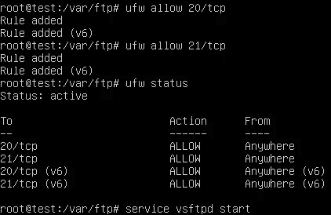

上述两个命令`ufw allow 20/tcp`和`ufw allow 21/tcp`将允许流量从这两个端口流出。阅读更多关于[为什么 FTP 使用 2 个端口](https://stackoverflow.com/questions/626823/in-protocol-design-why-would-you-ever-use-2-ports)的信息。再次检查防火墙状态以验证防火墙是否允许这些端口。

在这里，我们现在将使用 kali 机器来访问 ftp 服务，

```
ftp 10.0.2.27
get file.txt
```

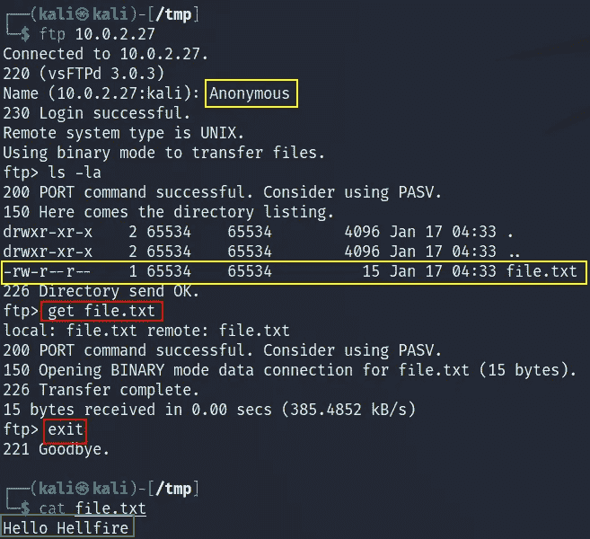

好了，使用第一个`ftp 10.0.2.27`命令，我们使用安装在 kali 机器上的 ftp 客户端连接到 ftp 服务，向它提供 ubuntu 服务器的 IP 地址。然后它会提示我们登录，所以提供**匿名**用户名并按回车键，但它不会提示我们输入密码(还记得我们在 **vsftpd.conf** 文件中禁用密码提示吗？)我们将直接登录。我们可以列出目录内容，看到有一个名为 **file.txt** 的文件(我们之前创建的)。然后，我们将使用`get file.txt`命令下载这个文件到我们的本地系统，然后从这个服务器下载`exit`。读取 **file.txt** 的内容会显示我们的 FTP 服务工作正常！！

现在，来到 Webserver 部分，apache2 没有安装在 ubuntu server 20.04 中，所以我必须手动安装，但这真的很容易。我们只需要输入下面的命令，

```
sudo apt update
sudo apt install apache2
```

第一个命令更新系统中已安装的包，第二个命令将在我们的 ubuntu 上实际安装 apache2 服务器。

现在，如果我们在浏览器中访问 [http://10.0.2.27](http://10.0.2.27) ，我们将看到 Ubuntu 的默认网页(这意味着我们的 web 服务器已经启动并运行)，

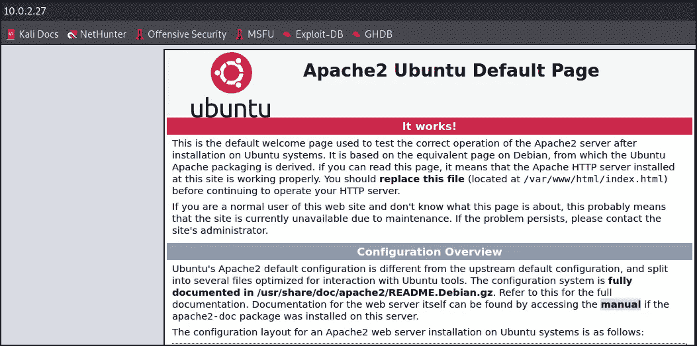

现在我们知道我们的 web 服务器已经启动并运行了，让我们在我们的系统上安装 PHP 语言，让它变得更有趣！要在我们的系统上安装 PHP，我们首先需要在我们的 ubuntu 系统上添加存储库，

```
apt install software-properties-common
add-apt-repository ppa:ondrej/php
```

第一个命令允许轻松管理分布。你可以在[软件-通用-属性](https://askubuntu.com/questions/1000118/what-is-software-properties-common)上阅读更多信息。第二个命令实际上是在 ubuntu 系统上添加了 **ondrej PHP** 库。如果你现在想知道 ondrej 是什么？下面是截图的样子，


截图来自谷歌

现在，我们需要再发出两个命令来在我们的系统上安装 php，

```
apt update
apt install -y php7.4
```

像往常一样，第一个命令将更新我们系统中的包，第二个命令将在我们的系统上安装 PHP7.4。

我希望你现在还在跟踪我。正如你现在所想的，我要打多少字，记录多少东西，因为在组织它们之前，它们只是分散的，让我的思维模式写一篇关于这个主题的文章(我知道这将是一篇很长的文章)，并不容易，但我真的很喜欢它，所以对我来说很重要！！此外，如果你需要休息，你可以喝水，通过向后滚动来放松你的肩膀，放松你的脖子和脊柱，并再次开始创作过程！((:

好了，现在我们已经在系统上安装了 PHP7.4，我们将首先创建一个测试 PHP 文件，看看它是否工作。我将继续讲述 php 最基本的代码，

```
echo '<?php phpinfo(); ?>' > test.php
ls -la
chown -R www-data:www-data /var/www/html
ls -la
```

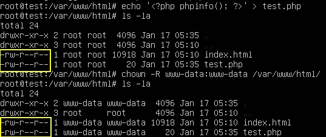

通过第一条命令，我们将把基本的 php 代码(包含一个 **phpinfo()** 函数，用于输出大量关于 PHP 安装的信息，并可用于识别安装和配置问题)重定向到 test.php 文件中。然后查看目录的内容，我们看到这两个文件都拥有根用户所有权，因为我们知道 webserver 中的文件应该拥有 [www-data user](https://askubuntu.com/questions/873839/what-is-the-www-data-user) 的所有权(想象一下这样一种情况:webserver 受到威胁，拥有根用户所有权的文件将导致整个系统受到威胁)。所以我们会将`/var/www/html`目录中所有文件的所有权都更改为 www-data 用户(webserver 的根目录！).再次查看目录的内容，现在我们可以看到文件拥有 www-data 用户所有权！

我们都准备好了！让我们导航到 [http://10.0.2.27/test.php，](http://10.0.2.27/test.php,)我们可以看到 php 信息页面，

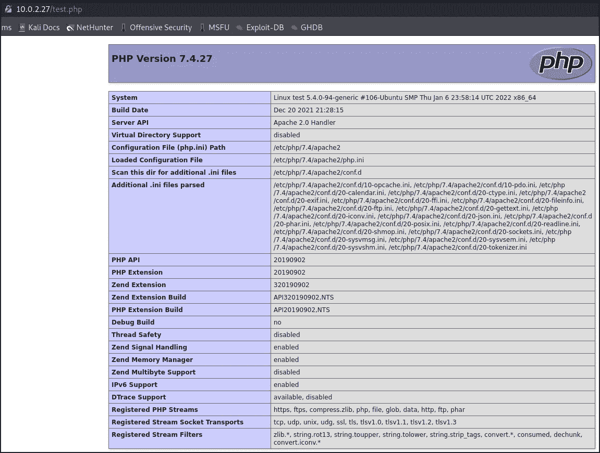

我们可以看到这个页面，因为这个 test.php 文件存在于`/var/www/html`目录中，我们不能从浏览动作中看到这个目录之外的任何文件。所以我们都准备好了！！我不会在这台机器上实现[命令注入](https://www.imperva.com/learn/application-security/command-injection/)漏洞或者 [LFI](https://www.acunetix.com/blog/articles/local-file-inclusion-lfi/) 漏洞。正如我已经提到的，这个博客只是每个想开发/创建一个盒子但不知道如何开始的人的一个基础，你明白我的意思。但是，我强烈建议您到此为止，至少尝试对那些提到的漏洞做一些研究(这两个只是其中的一小部分！！)并尝试自己实现。玩它，直到它开始工作，然后*你会看到奇迹*。

好了，我们已经完成了 FTP 服务器和 Web 服务器的设置，现在剩下的就是设置 SSH 服务器了。首先检查系统上安装的 ssh 版本，

```
sshd --version
```


这个命令检查系统上安装的 ssh 的版本，或者检查它是否安装在系统上。阅读更多关于 SSHD 的信息。

既然已经安装了，让我们继续从端口 22(SSH 服务的默认端口)启用流量，

```
ufw allow ssh
ufw status
```

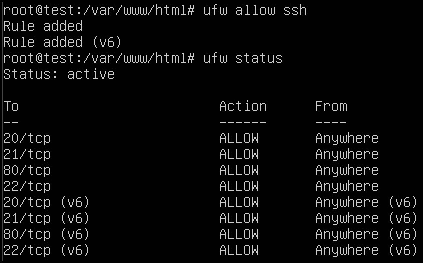

第一个命令将允许来自端口 22 的流量，第二个命令将检查防火墙的状态，我们可以看到我们的规则被正确添加。我们配置 SSH 服务器的工作已经完成。

让我们尝试在 kali box 上使用 ssh 客户端访问 **hellfire** 用户，

```
ssh kali@10.0.2.27
```

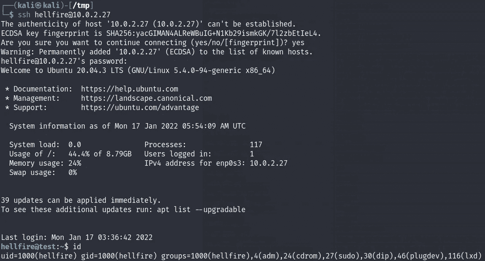

SSH 客户端将提示我们输入用户密码，提供密码，我们就可以登录了！所以这意味着我们的用户也可以通过 ssh 登录(HURRAYYY)。现在，我鼓励你尝试创建 2-3 个用户，并尝试自己登录，以获得开发者的感觉(即使是一点点！)或者您甚至可以为您的用户配置 **SSH 基于密钥的认证**(试试吧！这真的很有趣，相信我！).

# 出口设备

现在，这将是一个简单的过程，因为你只需要将你的系统导出到一个. ova 文件，你可以通过互联网或者你的黑客朋友发送到 pwn。现在关闭你的 ubuntu 系统，因为我们需要导出它。现在，按照下面的步骤导出系统，

*   文件→导出设备→要导出的虚拟机(选择您刚配置的 ubuntu 机器)→设备设置(格式应为 Open Virtualization Format 1.0，然后用所需的名称和位置保存文件。让复选框保持原样)→完成！！！！

# 笔记

附注:这里是我忘记附在博客末尾的注释，

```
## Change root user password
- sudo -i passwd root## Switch to root user
- su root## add root user flag
- echo 'root_flag' | md5sum > /root/root.txt
- chmod 600 /root/root.txt## add user flag
- echo 'user_flag' | md5sum > /home/user/user.txt
- chmod 660 /home/user/user.txt### You can create other users like testuser1, testuser2
- adduser testuser1
- adduser testuser2## Install uncomplicated firewall (ufw)
- apt install ufw
- ufw enable
- ufw status## Install FTP server
- apt install vsftpd
- cp /etc/vsftpd.conf /etc/vsftpd.conf.orig  #(use sudo before the command if not root)### add these lines in the /etc/vsftpd.conf file:
- anonymous_enable=YES         #Allow anonymous login FTP (Disabled by Default)                                             
- anon_root=/var/ftp           #Directory for FTP                                             
- no_anon_password=YES         #Stop prompting password-> save file and exit.- mkdir /var/ftp          #Now make a ftp directory in /var                                                  
- chown nobody:nogroup ftp/ #changing owner of ftp dirctory to nobody:nogroup                                                
- cd ftp; touch file.txt; chown nobody:nogroup file.txt   #change directory; create a new file; assign new permissions
- ufw allow 20/tcp; ufw allow 21/tcp     #allow ftp traffic for tcp port 20,21### enable vsftpd service
- sudo service vsftp start     #enable vsftp service                                              
- service vsftpd start         #if running as root-> Now login as anonymous user on ftp user and see that there will be a file named file.txt present.## Configure Apache HTTP server
- ufw allow http (or)
- ufw allow 80/tcp       #allow ftp traffic for tcp port 80                                                   
- ufw status             #check status of firewall                                                   
- apt update             #update packages before installing apache2                                                  
- apt install apache2    #install apache2 on server### install PHP
- apt install software-properties-common    #configure repository on system                                
- add-apt-repository ppa:ondrej/ppa         #adding ondrej php repo on ubuntu system                                
- apt update                                #update packages before installing                                
- apt install -y php7.4                     #install php7.4 on ubuntu system-> Navigate to [http://$IP](/$IP) and you will be presented with Apache2 Ubuntu Default Page. Now to create a test.php page, do:- echo '<?php phpinfo(); ?>' > test.php         #simple php page to run on web pages                                
- chown -R www-data:www-data /var/www/html      #webserver files must belong to user and group www-data:www-data not the root:root user-> Now visit [http://$IP/test.php](http://$IP/test.php) and you'll presented with PHP info page. From there you can set RCE if you want.## Configure SSH
- sshd --version        #check if openssh is installed by checking it's version                                                    
- ufw allow ssh (or)
- ufw allow 22/tcp      #allow ftp traffic for tcp port 22-> Now test if you can login as testuser1/testuser2/root user via ssh service.## Export the VM to an OVA format- Now after machine is tested and working as intented we can export it into OVA format in Virtual Box.
- Go into:
---- File > Export Appliance
---- Then select your vulnerable machine in this case mine is Ubuntu 20.04 Server 
---- Choose Open Virtualization Format 1.0
---- Name the file you want to save
---- Click 'Export'=> You just made your first CTF box.
```

那么，你现在感觉如何，你这个了不起的**黑客+创造者**？写这篇博客花了我很多时间，老实说，花了我大约 9-10 个小时。我希望这个博客将成为你们中一些正在尝试/思考创造一个盒子的人的一个起点。随着你在玩 CTF 时获得经验，你最终会开始知道如何在机器上实现 X 漏洞，但这并不意味着你会成为在机器上实现它们的专家，但事实是，在机器上实现需要耐心和研究。就像我做研究一样，我从来没有认真想过有一天我会做一个盒子(这是我过去的梦想)，但你知道，就是这样。我(和我的朋友)花了两个半月的时间来创造这个盒子。我所有的压力，研究各种事情的困难，这个博客是所有的总结。

当我写这篇博客的时候，这里的时间是凌晨 3 点 33 分，我真的很累，所以我现在要放下笔了。好了，朋友们，好好照顾自己，保持水分，保持健康，我们很快会再见的。再见。日安。(: