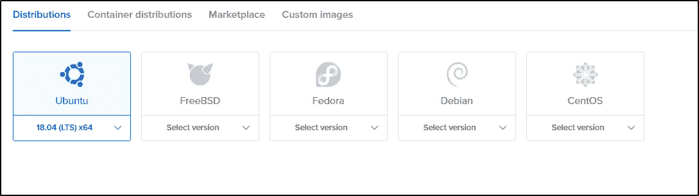
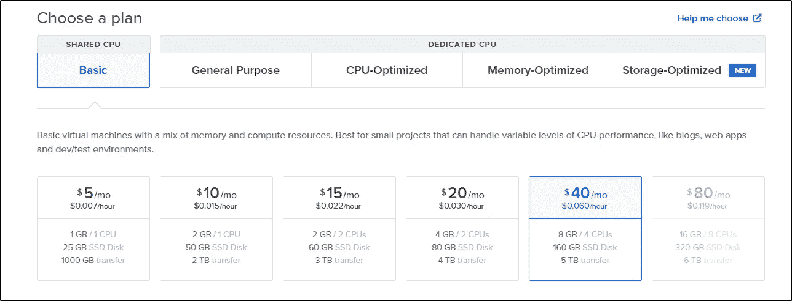
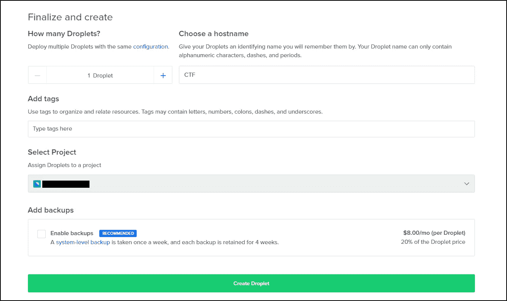
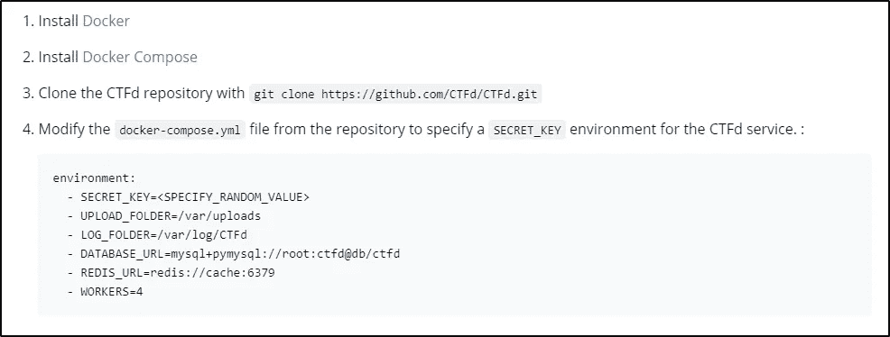
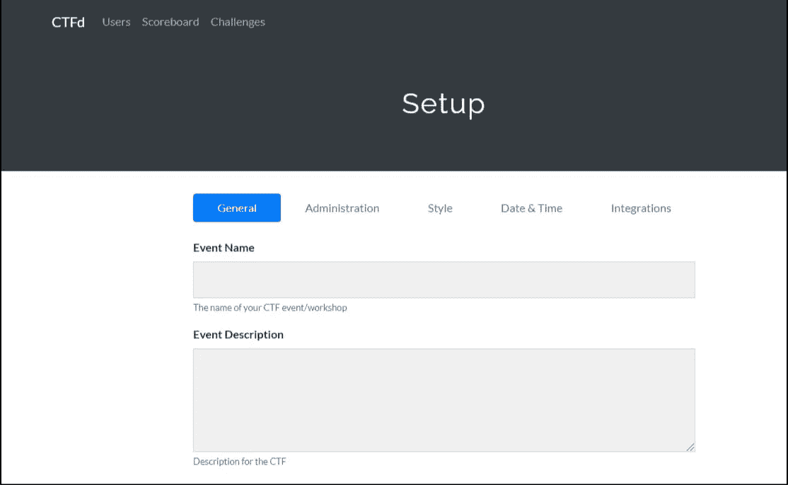

# 如何在 CTFd 上免费组织一次 CTF？

> 原文：<https://infosecwriteups.com/how-to-organize-a-ctf-on-ctfd-for-free-6077d34b0c9b?source=collection_archive---------1----------------------->

嘿，欢迎来到我的第一个博客。我们将会知道，如何免费组织一个 ctf。

> 数字海洋向每个新用户一次性提供 100 美元的免费信用。

[数字海洋](https://www.digitalocean.com/)

我们将使用这些积分来举办我们的 ctf。

> 注意:只有当你有信用卡、国际借记卡或贝宝账户时，你才能获得积分。


照片由[靶](https://unsplash.com/@arget?utm_source=unsplash&utm_medium=referral&utm_content=creditCopyText)在 [Unsplash](/s/photos/hacking?utm_source=unsplash&utm_medium=referral&utm_content=creditCopyText) 上拍摄

创建帐户后，进入主页，点击开始使用 Droplet。


在这之后，你会得到一个选择操作系统的选项。我会选择 Ubuntu 18.4 (LTS) x64。会将其配置为:

*   8 GB/ 4 个 CPU
*   5 TB 传输
*   160 GB 固态硬盘



选择计划后，选择一个数据中心区域。现在，为 root 用户创建一个密码。



然后，点击创建液滴选项。你会得到你的 IP 地址，一旦都做了。

现在用 ssh 登录到机器。

> 用户名:root 密码:

`apt update && apt upgrade`

一旦更新和升级完成。我们必须安装**docker**&**docker-compose**。

`apt install docker docker-compose`

完成了吗？请访问 ctfd 部署(文档)页面继续。

[CTFd 文件](https://docs.ctfd.io/docs/deployment/)



现在输入`tmux`打开 tmux 会话。首先克隆 ctfd repo&然后继续。

```
git clone [https://github.com/CTFd/CTFd.gi](https://github.com/CTFd/CTFd.git)t
```

移动到 CTFd 目录并打开 **docker-compose.yml** 文件。这里，我们必须更新 workers 的密钥&(这样它就可以处理负载。)

进行更改后，保存并退出 docker-compose.yml 文件。并键入`docker-compose up`。它会启动你的 ctfd。这可能需要几分钟时间。全部完成👍



现在，访问 [cloudflare](https://www.cloudflare.com/) 网站，添加您的免费计划网站【基本】。网站添加成功后，在 DNS 管理中添加一条记录，如下所示:

> 类型:名称: <subdomain>IPv4 地址:</subdomain>

省省吧。现在访问您的子域网站，用其他配置设置您的管理员帐户。

现在坐下来享受吧😉