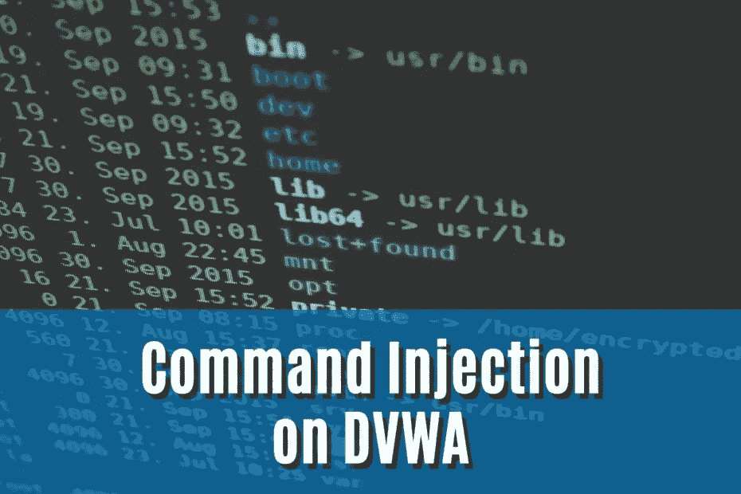
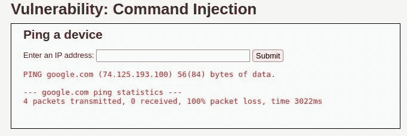
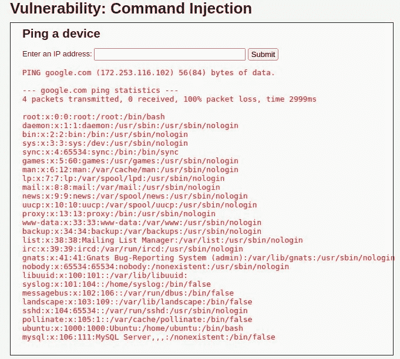
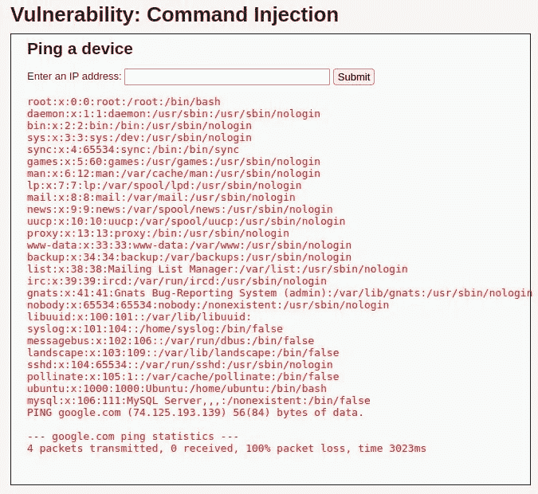
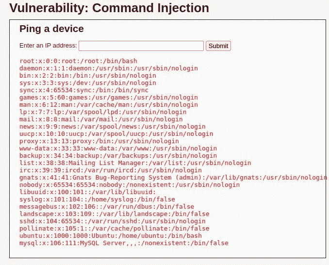

# 如何对有抱负的黑客进行命令注入攻击(DVWA)！—堆栈零

> 原文：<https://infosecwriteups.com/how-to-perform-command-injection-attacks-dvwa-for-aspiring-hackers-stackzero-c9d521c6f934?source=collection_archive---------0----------------------->



# 介绍

嗨读者！在这篇文章中，我想告诉你如何通过使用[命令注入](/what-is-command-injection-and-how-to-exploit-it-stackzero-ac7643bc492)攻击来攻击 [DVWA](https://github.com/digininja/DVWA) 。

命令注入是最容易理解的攻击之一，然而，从实用的角度来看，并没有太多的在线教程涉及这个主题。
像往常一样，我想尽我最大的努力来解释，以便让你能够毫无问题地找到这种类型的 bug。

因此，让我们通过在 [TryHackMe](https://tryhackme.com/room/dvwa) 上运行我们的 [Kali VM](https://medium.com/@stackzero/how-to-install-kali-linux-on-virtualbox-in-a-few-minutes-stackzero-37fb019261cb) 和 [DVWA](https://github.com/digininja/DVWA) 机器来弄脏我们的手。

如果你不知道如何运行 [DVWA](https://github.com/digininja/DVWA) ，可以看看本文中[的专用段落。](/what-is-command-injection-and-how-to-exploit-it-stackzero-ac7643bc492)

我已经展示了如何将漏洞转化为任意文件上传和反向外壳，因此在本文中，我将只关注如何绕过过滤器。
这里的目标是显示 */etc/passwd* 文件的内容。

# 命令注入的备忘单

通常，易受操作系统命令注入攻击的应用程序会接受未经净化或设计不良的过滤器的输入。为了在 [DVWA](https://github.com/digininja/DVWA) 中运行我们的漏洞，我们想要做的是了解如何在我们的 Linux 终端中执行更多的命令。

如果你有任何疑问，我邀请你在继续之前阅读这篇文章。

因此，让我们看看对我们的“链接”目标有用的操作符的最小列表(操作符和命令之间的空格是可选的):

*   **“与”运算符(& ):** 在后台运行一个命令，作为副作用，它声明第一个命令(后台的那个)的结束和第二个命令的开始。
*   **分号运算符(；):**分隔两个命令，并允许它们像在两行上一样运行。
*   **管道操作符(|):** 第一个命令的输出成为第二个命令的输入。
*   **OR 运算符(||):** 仅当第一个命令失败时才执行第二个命令。
*   **AND 运算符(& & ):** 只有在第一条命令成功后**才会执行第二条命令。**
*   **反斜线运算符(`):**反斜线内的每个命令都在外部命令之前进行计算。

# 步骤 1:命令注入 DVWA 低安全性

很容易想象，我们应该首先使用凭证登录到机器:

*   用户名:**管理员**
*   密码:**密码**


成功登录后，我们可以在左侧栏中将安全级别设置为“低”。


如果你看过我的[之前的教程](/what-is-command-injection-and-how-to-exploit-it-stackzero-ac7643bc492)，这没什么新鲜的，我们可以从实际攻击开始了。

让我们点击左侧边栏菜单中的菜单项“命令注入”。

我们在登陆的页面中有一个输入字段，如果我们尝试提交一个随机的域，比如“google.com ”,输出与 ping 命令的输出完全相同。



所以我们可以猜测服务器执行类似这样的东西:

```
ping <INPUT>
```

如果没有适当的净化，它将允许我们操纵输入，然后连接许多命令，或者至少应该这样。

在我们做出假设后，我们应该交叉手指，然后尝试输入:

```
google.com; cat /etc/passwd
```

我们很幸运，输出正是我们从一个易受攻击的应用程序中所期望的:



做得好，现在将安全级别设置为“中”，然后跳到第二步。

# 步骤 2:命令注入 DVWA 中等安全性

在设置了中等安全级别后，我们之前的漏洞似乎不太管用了，但是我们上面有我们的小抄！
我们可以通过枚举链接操作符来尝试，希望得到一个糟糕的输入检查！

因此，让我们像这样尝试使用&运算符:

```
google.com& cat /etc/passwd
```

提交后得到的输出是:



所以我们的命令注入攻击设法通过了中等安全的 DVWA 的过滤器！

# 步骤 3:命令注入 DVWA 高安全性

最后，我们在具有高安全级别的 [DVWA](https://github.com/digininja/DVWA) ，并且我们准备好执行我们的命令注入攻击！

我可以预见，这个级别的目的是向我们展示，即使是稍微复杂一点的过滤器也可能包含某种类型的打印错误。

通常，我们看不到后端代码，解决方案是通过列举所有的可能性。
在这种情况下，我们的目标是理解这个过程，而不是在猜测过程中浪费时间，所以我们会稍微作弊。

我将通过使用右下角的按钮“查看源代码”来查看代码，特别要注意下面列出的过滤器。

```
// Set blacklist 
$substitutions = array( 
    '&' => '', 
    ';' => '', 
    '| ' => '', 
    '-' => '', 
    '$' => '', 
    '(' => '', 
    ')' => '', 
    '`' => '', 
    '||' => '', 
); 
// Remove any of the charactars in the array (blacklist). 
$target = str_replace( array_keys( $substitutions ), $substitutions, $target );
```

管道运算符后面跟一个空格，我们知道它是可选的。
因此，过滤器不会在没有空格的情况下替换管道运算符，例如，通过以如下方式链接命令:

```
google.com|cat /etc/passwd
```

所以试试我们的利用方式吧！我们击中目标了！



最后，这一关已经完成，你正在更好地理解的路上，也许会从一些 bug 奖励计划中获得奖励。

# 结论

这个演练只是加强了我们在[上一篇文章](/what-is-command-injection-and-how-to-exploit-it-stackzero-ac7643bc492)中学到的概念，在那篇文章中我解释了这样的漏洞是如何的危险。

Web 应用程序安全性非常有趣，也非常有价值，所以如果你喜欢这篇文章，我建议你读一下什么是 [OWASP 十大](https://medium.com/@stackzero/owasp-top-10-breaches-of-2021-what-you-need-to-know-stackzero-63fa0d262bb5)。

我很荣幸能与您一起踏上学习 web 应用程序安全性的旅程。我希望您能欣赏我的文章的实用方法，如果答案是肯定的，也请看看:

*   [XSS](https://medium.com/codex/the-terrifying-world-of-cross-site-scripting-xss-part-1-stackzero-54be9cdc011a)
*   [SQL 注入](https://medium.com/codex/sql-injection-what-you-need-to-know-stackzero-abc80bc1ea5e)

请不要忘记关注我的工作，我希望很快见到你！新文章来了！

*原载于 2022 年 9 月 12 日 https://www.stackzero.net*[](https://www.stackzero.net/command-injection-dvwa/)**。**

## *来自 Infosec 的报道:Infosec 每天都有很多内容，很难跟上。[加入我们的每周简讯](https://weekly.infosecwriteups.com/)以 5 篇文章、4 个线程、3 个视频、2 个 Github Repos 和工具以及 1 个工作提醒的形式免费获取所有最新的 Infosec 趋势！*