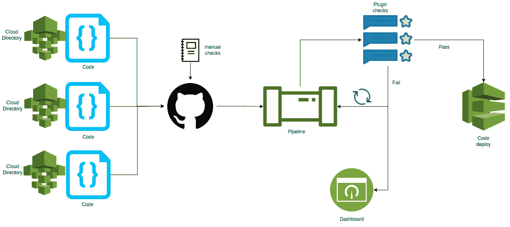

# 如何堵塞常见的供应链漏洞

> 原文：<https://infosecwriteups.com/how-to-plug-common-supply-chain-vulnerabilities-3f7daadd4a7e?source=collection_archive---------7----------------------->


由[植村明德](https://unsplash.com/@a_uem?utm_source=unsplash&utm_medium=referral&utm_content=creditCopyText)在 [Unsplash](https://unsplash.com/s/photos/chains?utm_source=unsplash&utm_medium=referral&utm_content=creditCopyText) 上拍摄的照片

从软件开发生命周期(SDLC)的角度来看，安全性是企业最重要的方面，因为安全漏洞会给面向用户的大型组织带来风险。因此，企业投入大量资金，将软件安全放在首位。

作为一个以隐私为中心的企业或团队，整体上可以增加额外的好处。客户重视企业正在构建和增强的软件安全特性，就像重视可用性一样。但是，要实现这个里程碑，需要仔细考虑 SDLC 安全最佳实践和准则的严格含义。

SDLC 包含安全检查点，以保护整个系统及其数据的机密性、可用性和完整性。SDLC 与 OWASP 软件成熟度模型(OWASP SAMM)相结合，有助于制定和实施企业范围的应用程序安全性战略路线图。

# 什么是软件供应链？

软件供应链是一个规程，包括团队(内部和外部)、方法、工具和最佳实践，用于将软件工件从设计带到部署。

最近，大多数创新和颠覆性的服务和数字体验都是由远程团队使用开源软件开发的。

开源库以其闪亮的特性吸引开发人员，使工程师能够通过缩短上市时间和降低成本来加快开发。

但是随着时间的推移，由于缺乏对源代码和功能发布的控制，随着补丁的出现，使用开源软件会出现缺陷和复杂性，并且它们还会带来[开源供应链攻击](https://www.mend.io/resources/blog/software-supply-chain-attacks/)的风险。

带有硬编码秘密的未充分开发的代码和松散架构的基础设施容易受到频繁的攻击。

# 最常见的漏洞

[软件漏洞](https://owasp.org/www-community/vulnerabilities/)在各级组织中普遍存在。新兴公司更有可能成为这种攻击的受害者，因为它们在紧迫的期限内专注于向市场推出新功能。不幸的是，这些曝光并没有成为头条新闻来引起科技界的注意。我们来讨论几个流传最广、影响最大的历史事件。

网络安全管理软件产品遇袭的爆炸性新闻一度震动了科技界。这一事件成为安全措施不足的危险的一个极好的例子。

当一名实习生未能设置复杂的密码时，灾难就发生了。攻击者使用一种称为密码喷射的方法，通过弱密码组合侵入网络安全管理软件产品系统，并设法通过后门将恶意软件推送到所有相关企业。供应链攻击是基于身份的，它更新了网络安全管理软件产品更新服务器。

在系统上实施强密码策略并增加安全层(如 MFA)可以避免灾难。

类似的事件发生在越南政府认证机构。攻击者绕过网站防火墙，将额外的安装程序文件插入 VGCA 安装程序应用程序，这是 VGCA 为数字签名服务提供的面向客户的应用程序。

整个活动是成功的，因为攻击者在网站设计中发现了一个缺口，因为整体设计有一点缺陷。通过严格的防火墙限制、访问控制和特权许可，后门攻击是可以避免的。

关于漏洞如何削弱系统的另一个例子，让我们看看比特币。如果服务提供商未能维持安全准则，比特币很容易暴露和被盗。

比特币钱包 Copay 遭受了供应链攻击，因为一个托管比特币钱包的移动应用程序出现了漏洞。架构中的 bug 来自开源 Javascript 工具节点包管理器(NPM)的包漏洞。这个被窃听的版本被公开，并允许黑客修改应用程序以加载重构代码并获得对 JS 库的访问权。

在版本控制和部署管道中，可以使用漏洞扫描工具检测并修复该缺陷。

# 管理软件供应链的移动部件

遵循可靠文档、网络安全、风险补救和管理最佳实践的清晰蓝图消除了潜在的漏洞并增强了软件供应链的安全性。组织必须采用“设计安全”工程原则和左移策略来建立全面的 DevSecOps 工具链。



图片作者[作者](https://www.linkedin.com/in/jayachandra-sekhar-reddy/)

# 阶段 1:安全编码素养

首先，企业应该采用专门的安全和风险管理学习和发展计划。随着开发团队急于提高他们的技术技能，企业应该共享的一个共同目标是帮助开发人员成为安全冠军。

需要应用程序漏洞评估和安全课程来使工程师与业务目标保持一致。

# 阶段 2:威胁建模

在开发和运营跟上之前识别安全风险是至关重要的。此阶段确保整体设计和开发策略符合组织的安全标准。

[威胁建模](https://owasp.org/www-community/Threat_Modeling)为组织提供了一种结构化的方法，用于在开发的早期阶段识别、分析、评估和减轻风险。威胁模型通过允许开发人员和架构师从攻击者的角度考虑问题，允许他们规划和设计安全系统，展示了关于安全性的承诺。

```
<?xml version="1.0" encoding="utf-8"?>
<KnowledgeBase xmlns:xsi="http://www.w3.org/2001/XMLSchema-instance" xmlns:xsd="http://www.w3.org/2001/XMLSchema">
 <Manifest name="Basic threat modelling design" id="5d3b996b-bac2-8cf6-3b39-617bb67bf042" version="4.1.0.11" author="TwC MSEC" />
 <ThreatMetaData>
   <IsPriorityUsed>true</IsPriorityUsed>
   <IsStatusUsed>false</IsStatusUsed>
   <PropertiesMetaData>
     <ThreatMetaDatum>
       <Name>Title</Name>
       <Label>Title</Label>
       <HideFromUI>false</HideFromUI>
       <Values>
         <Value />
       </Values>
       <Id>5d3b996b-bac2-8cf6-3b39-617bb67bf042</Id>
       <AttributeType>0</AttributeType>
     </ThreatMetaDatum>
     <ThreatMetaDatum>
       <Name>UserThreatShortDescription</Name>
       <Label>Short Description</Label>
       <HideFromUI>true</HideFromUI>
       <Values>
         <Value>Threat modeling is critical and mandate phase in secure software development</Value>
       </Values>
       <Id>ac0f9ea8-aed5-4d95-4ce9-6787124d7b48</Id>
       <AttributeType>1</AttributeType>
     </ThreatMetaDatum>
     <ThreatMetaDatum>
       <Name>UserThreatDescription</Name>
       <Label>Description</Label>
       <HideFromUI>false</HideFromUI>
       <Values>
         <Value />
       </Values>
       <Id>5d3b996b-bac2-8cf6-3b39-617bb67bf042</Id>
       <AttributeType>0</AttributeType>
     </ThreatMetaDatum>
     <ThreatMetaDatum>
       <Name>Priority</Name>
       <Label>Priority</Label>
       <HideFromUI>true</HideFromUI>
       <Values>
         <Value>High</Value>
         <Value>Medium</Value>
         <Value>Low</Value>
       </Values>
       <Description>Priority</Description>
       <Id>ac0f9ea8-aed5-4d95-4ce9-617bb67bf042</Id>
       <AttributeType>1</AttributeType>
     </ThreatMetaDatum>
   </PropertiesMetaData>
 </ThreatMetaData>
 <GenericElements>
   <ElementType>
     <Name>Threat modeling Process</Name>
     <ID>GE.P</ID>
     <Description>General approach to define a threat model</Description>
     <ParentElement>ROOT</ParentElement>
     <Image>Image_ref</Image>
     <Hidden>false</Hidden>
     <Representation>Ellipse</Representation>
     <StrokeThickness>0</StrokeThickness>
     <ImageLocation>Centered</ImageLocation>
     <Attributes>
       <Attribute>
         <Id>002864b3-9a4e-4d21-8a4d-8aea1d2e3056</Id>
         <IsInherited>false</IsInherited>
         <IsOverrided>false</IsOverrided>
         <Name>codeType</Name>
         <DisplayName>Code Type</DisplayName>
         <Mode>Dynamic</Mode>
         <Type>List</Type>
         <Inheritance>Virtual</Inheritance>
         <AttributeValues>
           <Value>Not Selected</Value>
           <Value>Managed</Value>
           <Value>Unmanaged</Value>
         </AttributeValues>
       </Attribute>
     </Attributes>
   </ElementType>
 </StandardElements>
 </KnowledgeBase>
```

# 阶段 3:代码审查

代码应该由同行强制进行代码评审。启用间接和电子邮件传递评审允许开发团队在开发的早期阶段检测 bug 和缺陷。

即使经过仔细的考虑和手工的努力，延迟和漏洞遗漏也可能出现在代码中。最常见的缺失包括是否有任何缺失的编程构造，整体代码是否符合安全标准，以及代码是否通过了 lint 和类型提示检查。

工具辅助的代码审查不容易出错，并且避免了漏洞风险。GitHub 可以证明是一个可靠而高效的工具，可以随时随地进行代码审计和代码审查，版本控制是一个额外的优势。

# 阶段 4:通过自动化工具进行扫描

在合并到主模块之前，自动化代码审查是非常重要的。未能通过预定义的检查突出了代码中的问题，并为开发人员重构和保护整个代码库提供了一个反馈循环。

WhiteSource for developers、Codacy 和 Codecov 是通过 GitHub marketplace 提供的自动化审查工具，可以快速集成到您的代码库中并达到技术堆栈要求。这些工具使用左移方法对所有现有的 GitHub Repos 进行开源扫描和索引。

# 阶段 5:静态代码扫描和安全性测试

在构建和部署阶段，自动化代码调试和审查，同时跳过通过管道的执行可能是富有成效的。高级管道自动化工具，如 Jenkins，加载了大量代码审查插件。

静态[代码审查](https://docs.github.com/en/code-security/code-scanning/automatically-scanning-your-code-for-vulnerabilities-and-errors/about-code-scanning)插件，比如 FindBugs，通过运行预定义的检查和逻辑来执行代码审查和分析，返回一个输出文件。Jenkins 可以解析作业的输出文件，突出显示错误，并列出遇到的警告，方法是在代码的目录级别采用自上而下的方法，并以图形方式显示总体分析的详细摘要。

**代码示例:**

```
trigger:
 branches:
   include:
   - feature
   - main
 paths:
   include:
   - src/*
   - tests/*

pool:
 Image: 'centos/latest'

jobs:
- job: codereview
 displayName: review and report

 steps:

 - checkout: self
   lfs: true

 - task: UsePythonVersion@0
   displayName: 'Set Python version to 3.9'
   inputs:
     versionSpec: '3.9'

 - script: pip3 install --user -r requirements.txt
   displayName: 'Installing required dependencies'

 - script: |
     python -m behave --junitxml=./validation_test-checks.xml
   displayName: 'Running behave tests'

 - task: PublishBehaveResults@1
   displayName: 'bumping out behave test results'
   condition: passOrFail()
   inputs:
     testResultsFiles: '**/validation_test-*.xml'
     testRunTitle: 'Publish behave test results for Python $(python.version)'
```

# 结论

软件供应链漏洞是不可避免的猛兽。如果被忽视，它们会导致整个系统瘫痪，影响业务和声誉。SDLC 包含许多技术和工具集，使安全性成为软件旅程的主要里程碑。

整个开发阶段必须遵循上面强调的阶段，从安全素养、威胁建模、同行代码审查、自动化代码检查、静态代码扫描和安全测试开始。

## 来自 Infosec 的报道:Infosec 每天都有很多内容，很难跟上。[加入我们的每周简讯](https://weekly.infosecwriteups.com/)以 5 篇文章、4 条线索、3 个视频、2 个 GitHub Repos 和工具以及 1 个工作提醒的形式免费获取所有最新的 Infosec 趋势！