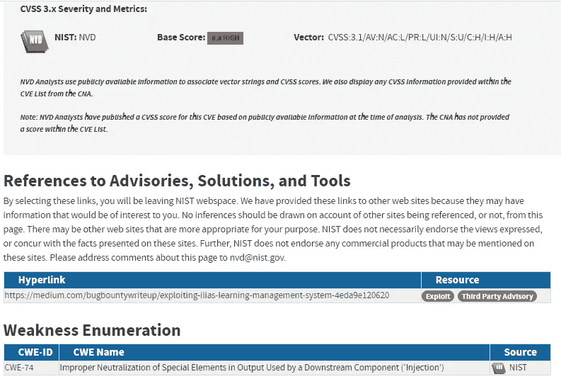
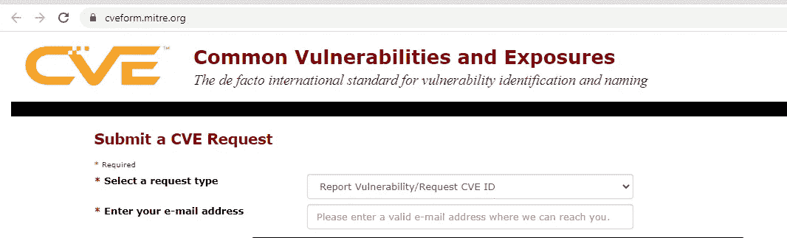
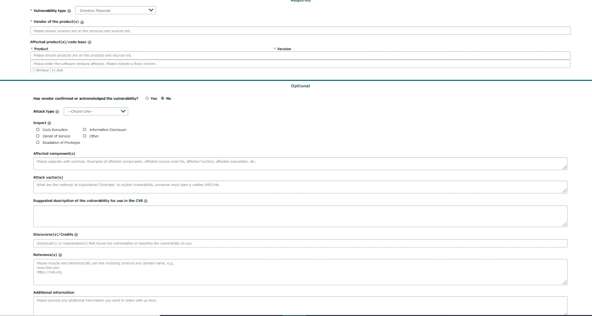

# 如何注册并发布针对您的可怕漏洞的 CVE

> 原文：<https://infosecwriteups.com/how-to-register-and-publish-a-cve-for-your-awesome-vulnerability-e68a6a5f748f?source=collection_archive---------2----------------------->

资料来源:cve.mitre.org

常见的漏洞和暴露允许安全社区查看与当前产品版本相关的问题，并查看它们是否需要升级，以及提供类似“CVE-2020–25268”的上下文，这是 Ilias 学习管理系统上的 RCE 漏洞。如果你搜索一下，你会看到这里有一个链接"[https://nvd.nist.gov/vuln/detail/CVE-2020–25268](https://nvd.nist.gov/vuln/detail/CVE-2020–25268)"，可以找到很多关于 CVSS 分数、建议、概念验证、描述等有用的信息。

我希望我们都能同意，拥有 CVE 很酷，然而不是所有的 CVE 人生而平等。以及描述 CVE 严重性的 CVSS 分数有时可能相当无用，因为多个得分低的漏洞可能被链接在一起，产生一个关键的 10/10，并且没有办法在当前模型中展示这一点。

# 你怎么注册一个呢？

你只需要去 https://cveform.mitre.org 的[注册你的 CVE 就可以了，是吗？](https://cveform.mitre.org)

资料来源:cveform.mitre.org

不完全是。首先，有一大堆你需要填写的东西。

为了帮助你，这里有一份很棒的资料。

"[http://CVE project . github . io/docs/content/key-details-phrasing . pdf](http://cveproject.github.io/docs/content/key-details-phrasing.pdf)"

本质上，它为你提供了编写 CVE 所需的所有模板。

完成网络表单后，您将收到 CVE 已注册的确认信息，您将获得类似 CVE 年号(CVE-2020–25268)的号码。问题本身不会被公布，直到你给他们发送一个漏洞的出版物，所以在那之前，你可以与供应商沟通以解决问题。如果在您选择的时间范围内收到回复，供应商可以发布，如果没有，您可以自己发布。

## 重要的

我强烈建议不要在没有多次尝试与供应商建立联系并确保供应商确实了解漏洞的情况下自行发布。这是至关重要的，CVE 的目的是帮助改善安全，而不是削弱它。

祝你注册和发布 CVE 好运！