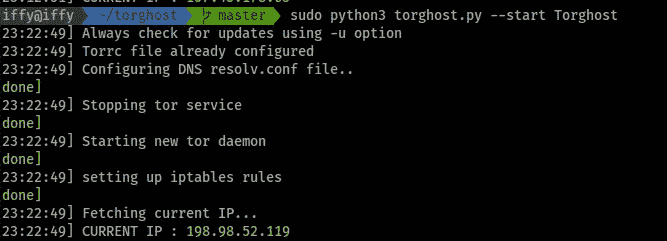

# 如何在 Kali Linux 或者 Linux Arch 中通过 TOR 路由所有流量😜不使用 TOR 浏览器

> 原文：<https://infosecwriteups.com/how-to-route-all-your-traffics-through-tor-in-kali-linux-may-be-linux-arch-without-using-tor-a33b41a75da4?source=collection_archive---------0----------------------->


嘿伙计们，我很高兴再次回到灵媒。(嗯嗯！我知道没人在乎😂)

无论如何，我希望你们在这种情况下都是安全的，做得很好😃。

现在让我们直奔主题。最近我浏览了几个关于 GitHub 库的东西，发现它们很有趣，我忍不住与你们分享我的发现。希望你会喜欢。

## 所以让我们开始吧…

几天前，当我厌倦了同样的例行公事😔在我的生活中，刚刚开始学习一些隐藏的秘密 *GitHub 使用呆子*。(我会在另一个博客上分享👐如果你坚持的话😬).当时我发现了一个名为 **TorGhost** 的资源库(这个名字吸引我点击了这个名字😃).然后我发现了令人难以置信的东西。在某种程度上，我可以想象一些工具，可以将我们所有的流量重定向到 tor 网络，也就是说，我们可以不使用 tor 浏览器访问 Tor 网络😍(做一个 InfoSec 研究员 Bughunter 难道不是 c00l？).最重要的部分是这个工具是用 **Python3 ❤️编写的。之后，我仔细阅读了自述文件中的每一条信息。然后也查看了源代码(开始一个新手不太了解它😐).然后开始在我的本地机器上克隆存储库，然后开始构建它(我将向您展示如何一步一步地设置工具)，然后出现了一些问题，幸运的是，花了一个小时解决了这些问题，并了解了一些不是由工具而是由我的系统本身引起的依赖性错误😣。**

# 让我们建造它…


照片由 [Goh Rhy Yan](https://unsplash.com/@gohrhyyan?utm_source=medium&utm_medium=referral) 在 [Unsplash](https://unsplash.com?utm_source=medium&utm_medium=referral) 上拍摄

去仓库:[https://github.com/SusmithKrishnan/torghost](https://github.com/SusmithKrishnan/torghost)

> 等等，抱歉打断你…我必须这么做…向你大呼一声 [Susmith Krishnan](https://medium.com/u/478ff64d893f) 创造了这么棒的工具，自从我踏入信息安全领域以来，我一直在寻找它*🌎。我认为库**应该得到阅读这篇博客的每个人的一颗星** *⭐️* 。*

克隆存储库并安装它:

```
$ git clone [https://github.com/SusmithKrishnan/torghost.git](https://github.com/SusmithKrishnan/torghost.git)$ cd torghost # go inside the downloaded directory$ chmod +x build.sh$ ./build.sh
```

现在一些有线与 Kali Linux 最新更新，我甚至不知道为什么它打破了安装后很少的东西。但是不要担心避免您只需要检查一次 requests(pip3)模块是否安装在您的系统上。

```
$ pip3 install requests
```

现在我们可以走了🔥：

在下载存储库中运行 torghost python 文件:

```
$ sudo python3 torghost.py --start Torghost
```

*   —启动以启动服务
*   — stop 用于停止服务

当您运行它时，您会看到这样的屏幕:



运行程序

现在你会得到新的 IP。每次你运行这个程序，你都会得到一个新的😜。现在，您所有的流量都将通过 TOR 网络。

要停止这种情况，请执行以下命令:


停止程序

现在你将得到由你的 ISP 提供的真实 IP😐。

现在让我们来看如何利用它的要点:如果你是一名**bug 赏金猎人**或**信息安全研究员**，那么你最好知道这将如何帮助你实现你的目标🔴。

> PS:这完全是为了教育目的，如果你滥用它，网络法会保护你的*😎*


[ev](https://unsplash.com/@ev?utm_source=medium&utm_medium=referral) 在 [Unsplash](https://unsplash.com?utm_source=medium&utm_medium=referral) 上拍摄的照片

## 建议:在 Arch Linux 上使用，体验更好。

希望你们都喜欢这篇最小的文章，我想邀请所有 python 爱好者参与这个很酷的项目，让它更好地服务于❤️.社区
我们很快会在另一篇有趣的博客中再见。谢谢你的时间💜

> 我希望得到你的反馈。在推特上给我发短信。