# 如何在 Linux 上设置 BurpSuite

> 原文：<https://infosecwriteups.com/how-to-setup-burpsuite-on-linux-350d17780fdb?source=collection_archive---------0----------------------->

BurpSuite 是一个用于测试 Web 应用程序的集成平台，它允许我们拦截数据和 Web 应用程序，它用于教授/学习/练习/拦截在客户端和服务器之间传输的数据包，我们甚至可以通过 BurpSuite 进行暴力攻击。一旦你成为网络应用测试专家，你就可以购买高级版本。


硬石膏

在这个教程中，我在 Firefox 中使用了 foxy 代理插件，如果你愿意，你可以使用任何代理，甚至可以设置手动代理。

## 步骤 1 :-打开 Firefox


火狐浏览器

## 步骤 2 :-安装福克西代理

FoxyProxy 是一个先进的代理管理工具，它完全取代了 Firefox 有限的代理功能。

```
Search for Foxy Proxy 
Click on Addon Link 
Install Foxy Proxy Standard after installing you can see it on the toolbar.
```

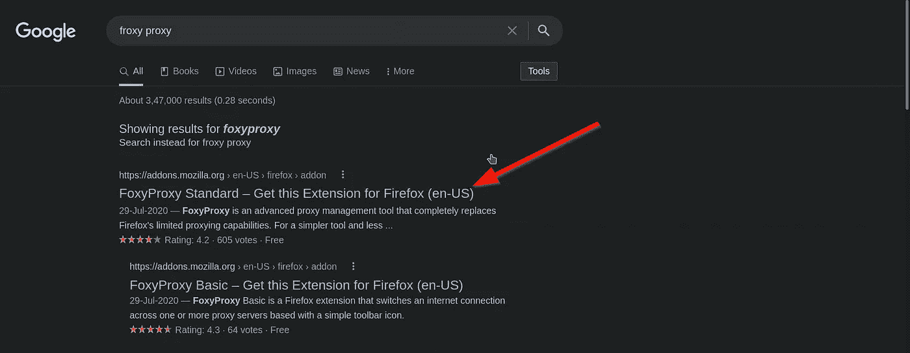

福克西代理

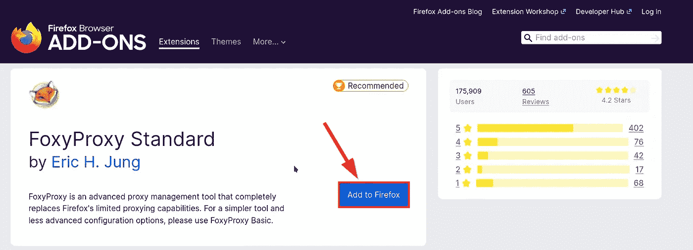

插件

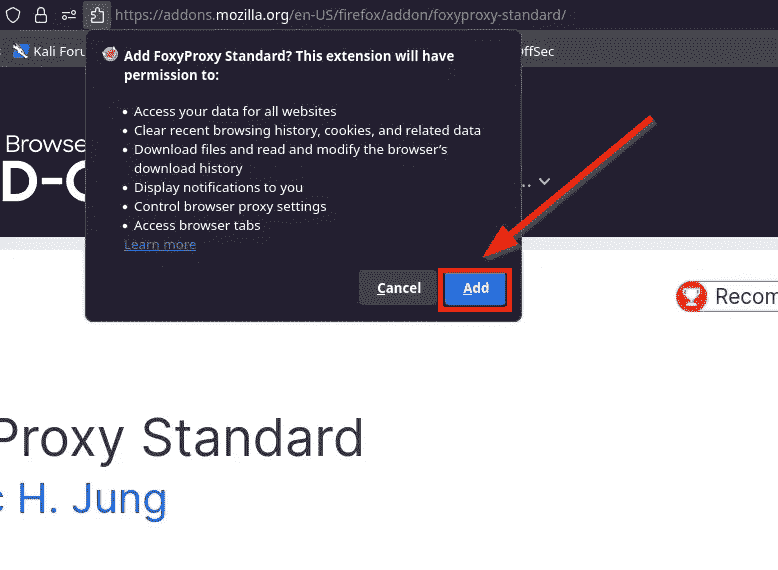

添加到扩展


工具栏上的福克西代理

## 步骤 3 :-设置 Burpsuite

```
Open BurpSuite
Create Temporary Project by Clicking Next
Click Start Burp
Go to Proxy Tab
Go to Options subtab in Proxy Tab
Note down the IP Address and Port
```


硬石膏

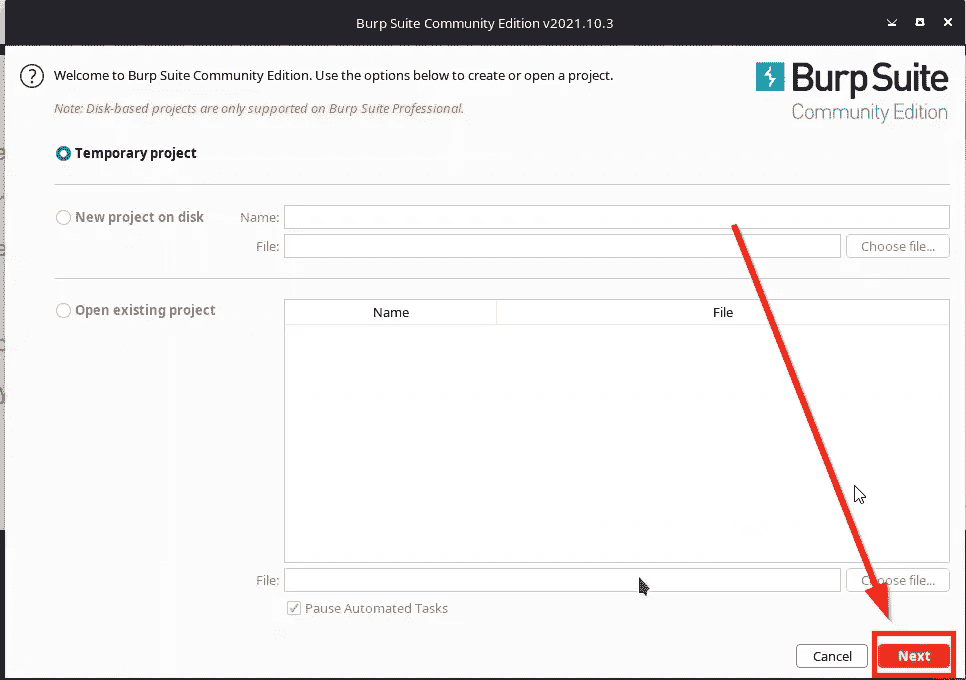

开始临时项目

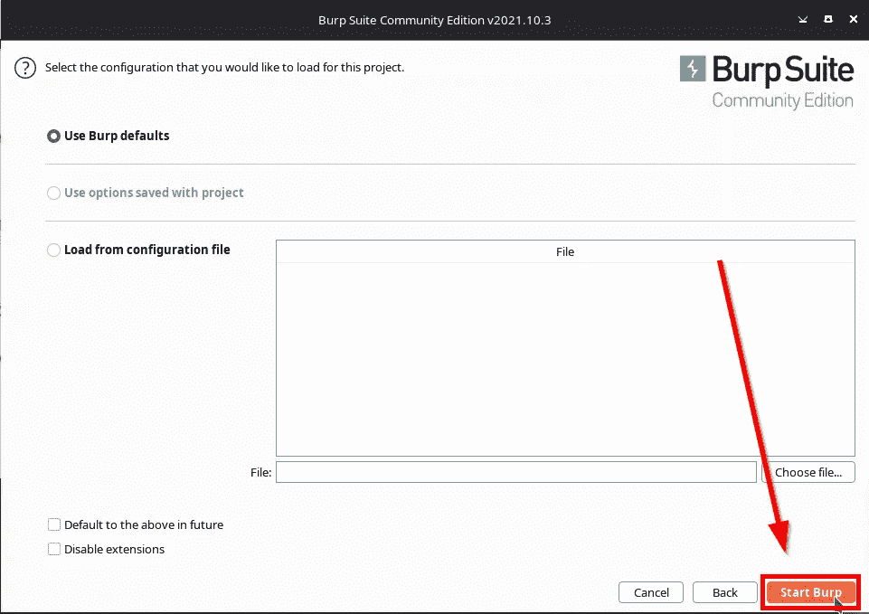

开始打嗝

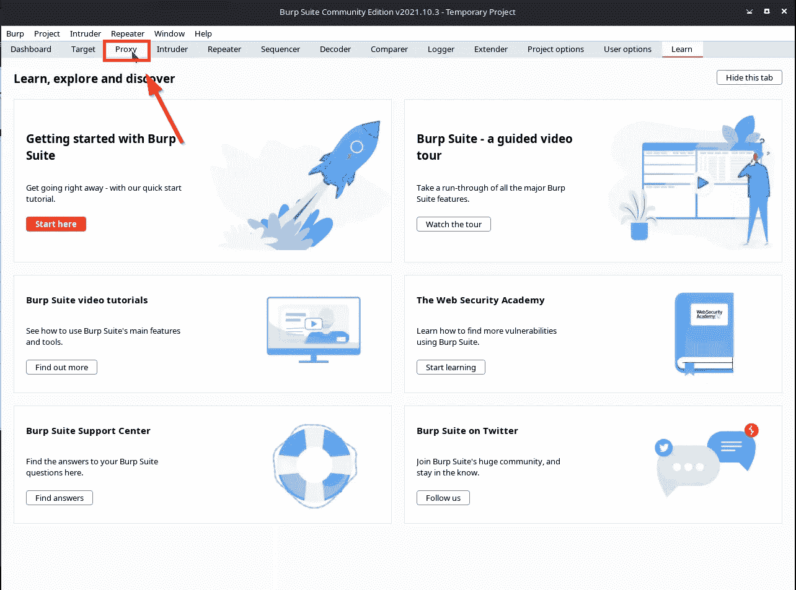

代理选项卡

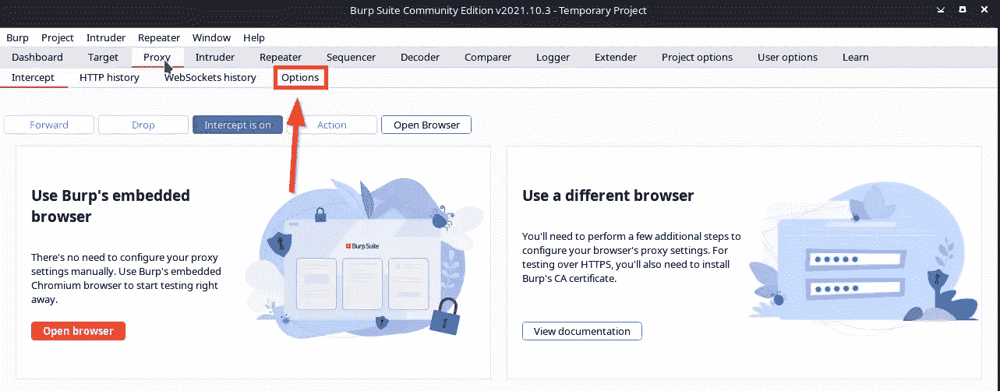

选项子选项卡

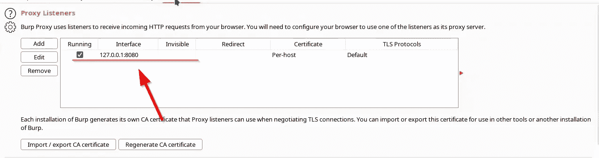

记下 IP 和端口

## 步骤 4 :-配置代理

```
Click on Foxy Proxy Icon on toolbar in Firefox
Click option
Click Add
Give Title
Set Proxy Type to 'HTTP'
Fill above IP Adress from Burpsuite in Ip Address section
Fill above Port from Burpsuite in Port section
Click Save
```

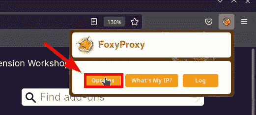

福克西代理期权

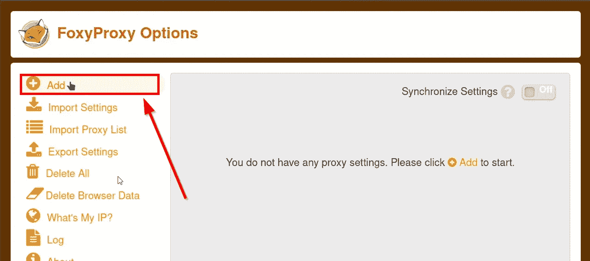

添加代理

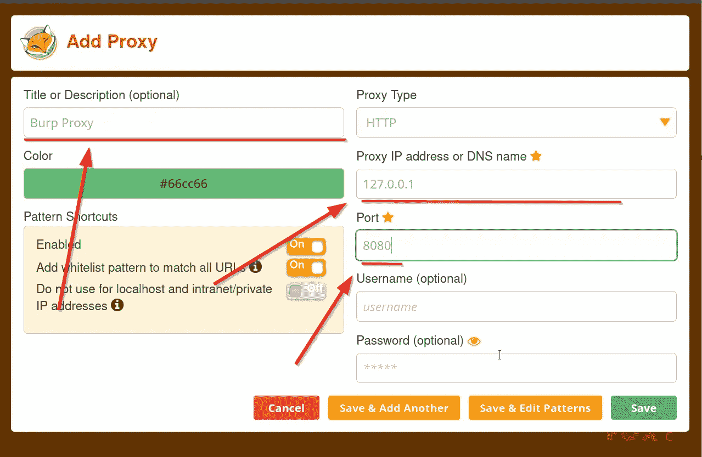

填写必填字段

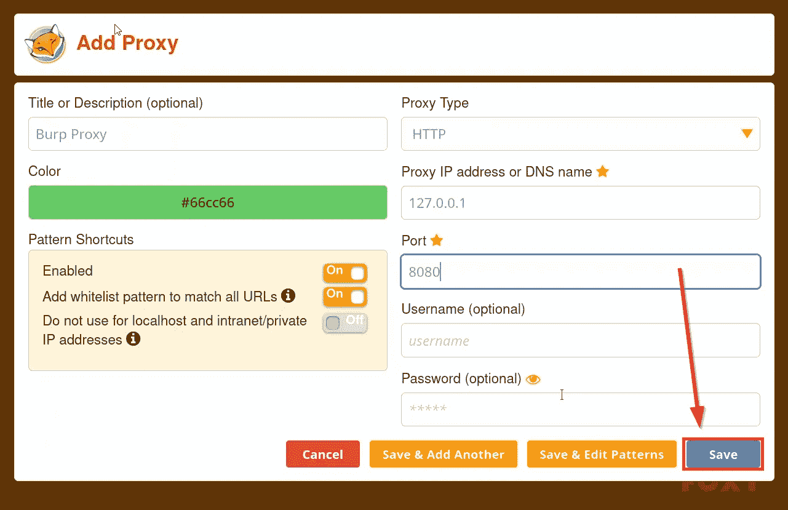

保存代理

## 步骤 5 :-设置证书

```
In Browser Go to [http://{Above](/{Above) IP}:{Port}
Click on 'Get CA Certificate'
Save the file
Go to Settings
Go to Privacy and Security Tab
Go to Certificates Section
Click View Cerificate
Click on Import
Select the Certificate in popup
Click Ok
```

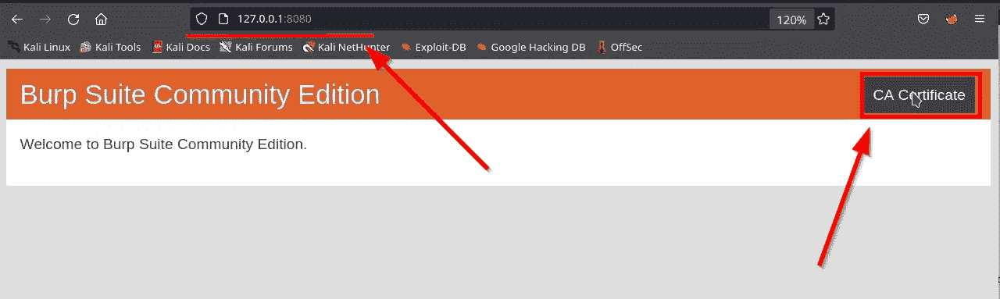

下载证书

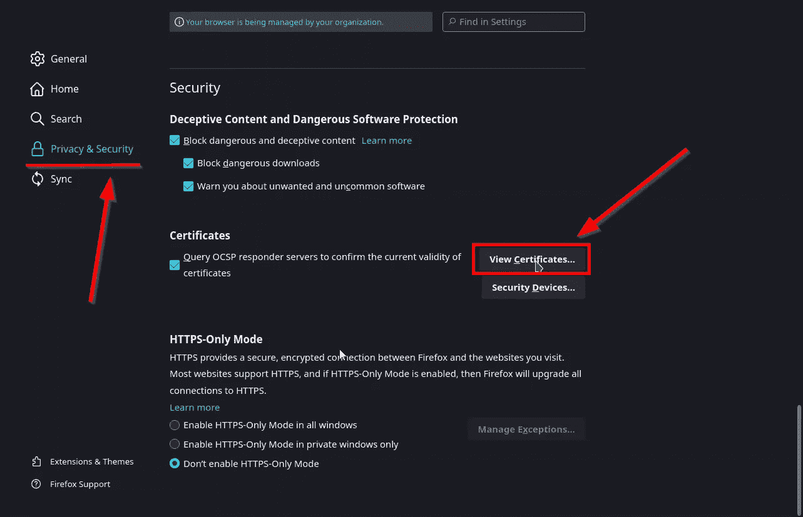

证书

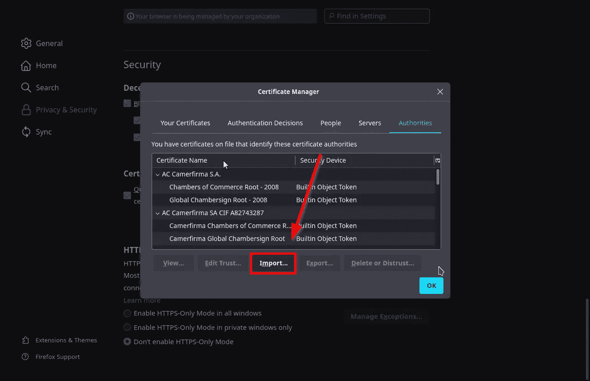

进口执照

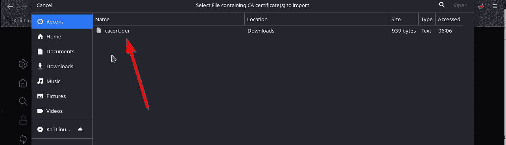

选择证书

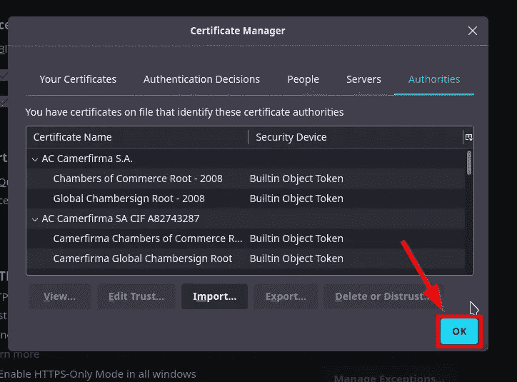

现在你可以测试它了

```
Click on Foxy Proxy Icon on toolbar
Select the profile with your given title
Go to BurpSuite
Go to Proxy tab
Go to Intercept subtab
Click on 'Intercept is off' to turn on intercept
Go to Browser
Search Target
Go back to Burpsuite and chek if there is any request
```


选择代理

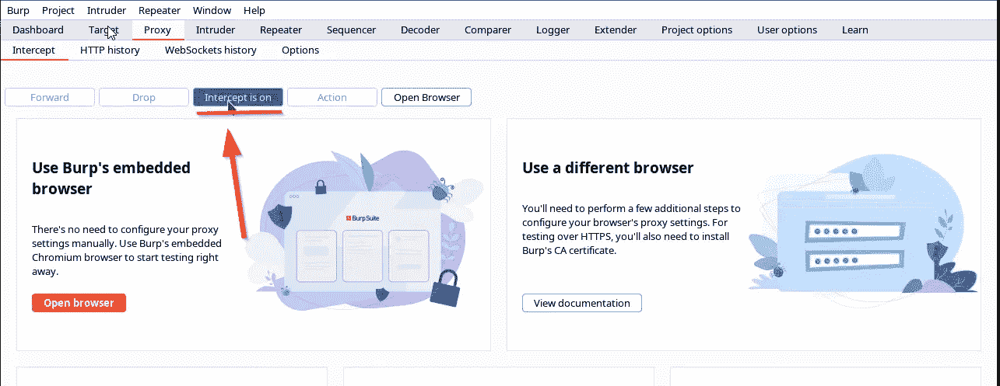

打开截取

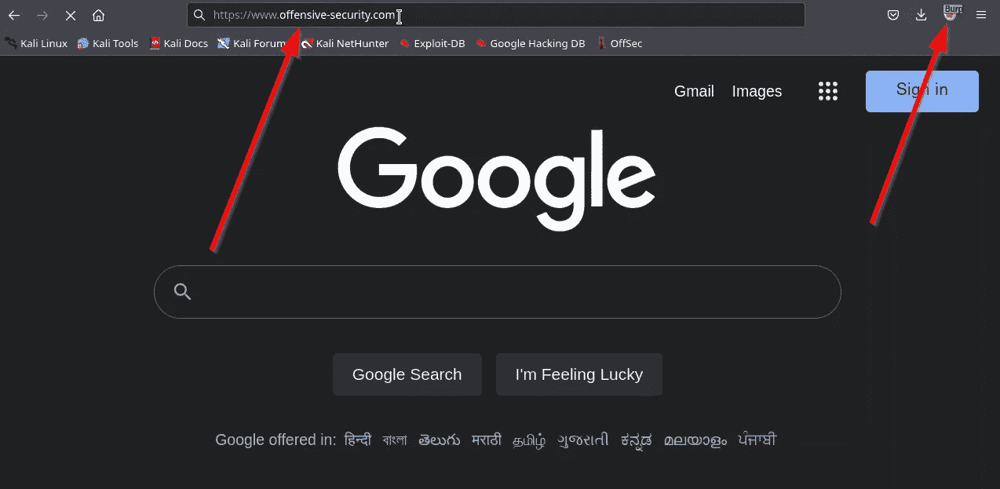

转到目标

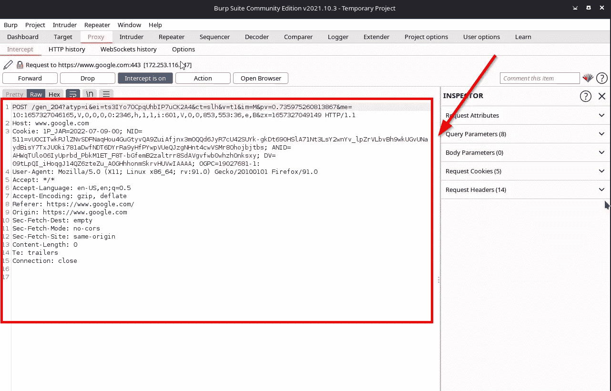

参见请求

恭喜你！🎉您终于为 Web 应用程序测试设置了您的 Burpsuite。

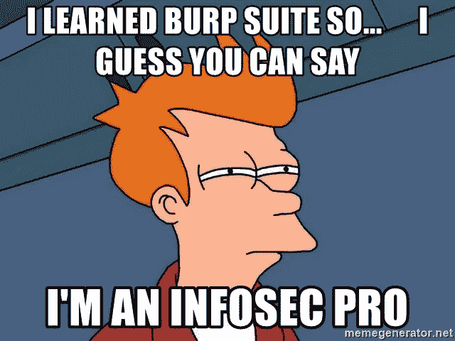

今日迷因

来自 Infosec 的报道:Infosec 上每天都会出现很多难以跟上的内容。 [***加入我们的每周简讯***](https://weekly.infosecwriteups.com/) *以 5 篇文章、4 个线程、3 个视频、2 个 Github Repos 和工具以及 1 个工作提醒的形式免费获取所有最新的 Infosec 趋势！*