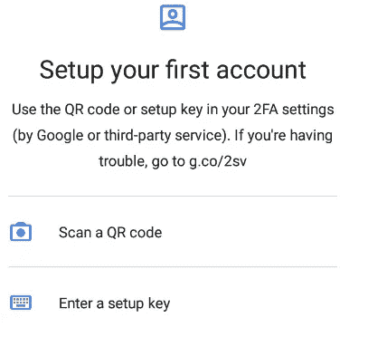
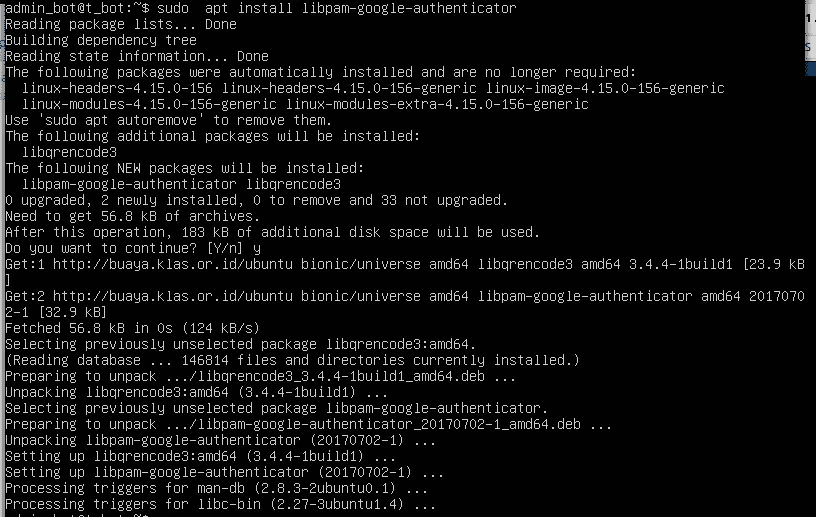
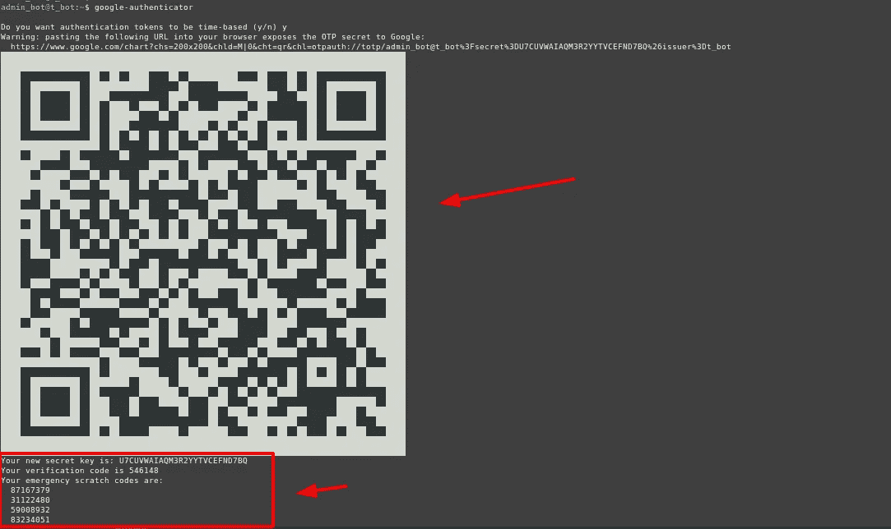
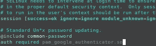
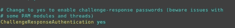
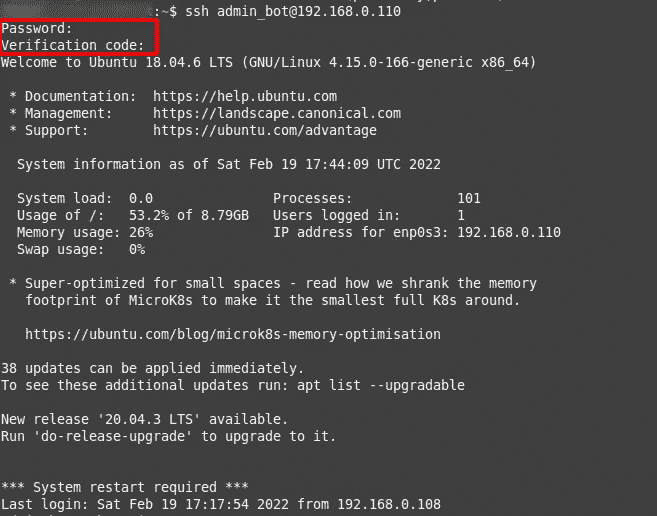
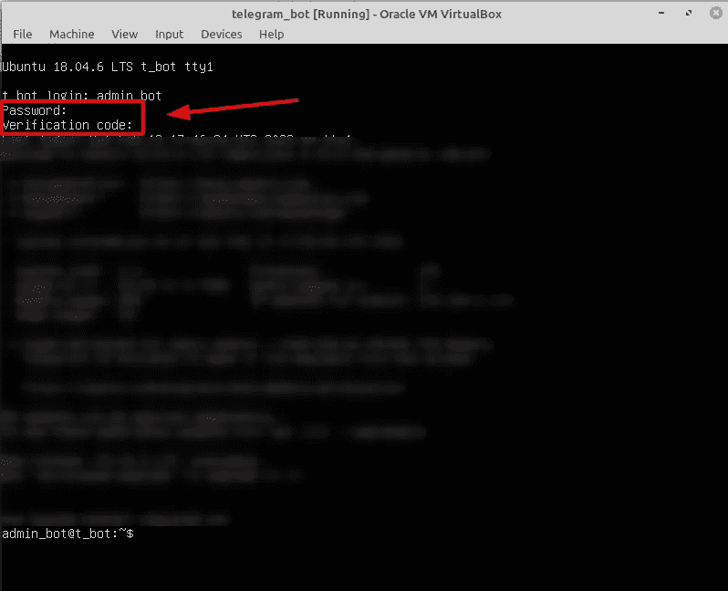
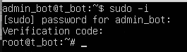
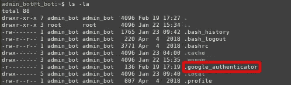
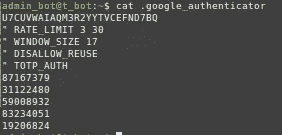

# 如何为 Linux 机器设置 MFA

> 原文：<https://infosecwriteups.com/how-to-setup-mfa-for-linux-machine-8b6e3294a5e0?source=collection_archive---------0----------------------->

## 在 Linux 机器上设置 google 认证器的指南


[杰森·登特](https://unsplash.com/@jdent?utm_source=medium&utm_medium=referral)在 [Unsplash](https://unsplash.com?utm_source=medium&utm_medium=referral) 上的照片

有时，当你登录到一个系统，你必须输入密码，个人识别码或密钥。这种方法只是提供了一个因素认证你知道什么，你有什么或你是什么。如今，仅用一个因素认证就能让你的系统变得不安全。最好的方法是使用多因素认证(MFA ),这与您在进行网上银行交易或使用密码和认证程序登录您的工作帐户时必须输入密码和令牌是一样的。

【Linux 机器怎么样？
你的 Linux 机器用 MFA 吗？

如果你的答案是**否**，并且你对如何在 Linux 机器上设置 MFA 感兴趣，这篇文章适合你。

在本教程中，我将介绍在 Linux 中使用 MFA 登录的三种方式的设置。宋承宪
2。控制台
3。须藤

## 设置 Google 认证器 PAM 模块

首先，在你的智能手机上安装谷歌认证器。



智能手机中的谷歌认证器

其次，将 Google Authenticator PAM 模块安装到您的 Linux 机器中。此时此刻，我使用的是 virtualbox 中的 Ubuntu 18.02 服务器来完成本教程。

为了方便起见，我建议您对您的机器使用 ssh。

```
sudo apt install libpam-google-authenticator
```



正在安装 google 验证器 PAM 模块

然后运行下面的命令并回答问题。

```
google-authenticator
```

二维码会出现在你的终端上，所以只要扫描二维码，在你的谷歌认证器(在你的智能手机上)中添加一个帐户。



安全地保存您的紧急暂存代码，因为如果您丢失了您的 google 认证器，您可以使用此代码找回它。

## 使用 MFA 设置 SSH 登录

使用以下脚本在文件`/etc/pam.d/sshd` 的最后一行添加新行:

```
auth required pam_google_authenticator.so **nullok**
```

如果你想强制每个用户在这个系统上使用 MFA，只需删除 **nullok** 。



接下来，配置`/etc/ssh/sshd_config`并确保该行具有 **yes** 值。

```
ChallengeResponseAuthentication yes
```



最后，重新启动 sshd 服务，

```
sudo service sshd restart
```

它的工作，然后你会提示输入密码和验证码。



## 使用 MFA 设置控制台登录

在文件`/etc/pam.d/common-session` 的最后一行添加新的一行，用下面这个脚本:

```
auth required pam_google_authenticator.so **nullok**
```

和我之前说的一样，如果你想强迫每个用户在这个系统上使用 MFA，只需删除 **nullok** 。


然后保存文件配置，并尝试从控制台注销，然后再次尝试登录。
我在智能手机里提示输入谷歌认证器的密码和验证码。



## 用 MFA 设置 Sudo

与之前相同，只是在不同的文件中，在文件`/etc/pam.d/common-auth` 的最后一行添加新行，脚本如下:

```
auth required pam_google_authenticator.so **nullok**
```

当你尝试命令 sudo 时，会提示你输入密码和验证码。



## 警告！！！

你必须处理好你的**。google_authenticator** 文件，因为这个文件包含你的主验证码，会绕过你的 google authenticator。



## 结论

MFA for Linux 是为了提高系统中的安全设置。
防止攻击者仅凭您的密码进入您的系统。但是，如果您有大量的服务器，您必须考虑认证器和紧急暂存代码。

感谢阅读。

*参考*:
[*https://www.redhat.com/sysadmin/mfa-linux*](https://www.redhat.com/sysadmin/mfa-linux)[*https://www.youtube.com/watch?v=wrx2cm3qDNI*](https://www.youtube.com/watch?v=wrx2cm3qDNI)

[](https://python.plainenglish.io/execute-command-to-many-servers-with-python-675ac4b9730c) [## 使用 Python 对许多服务器执行命令

### 使用 Python 对多个服务器运行命令的指南。

python .平原英语. io](https://python.plainenglish.io/execute-command-to-many-servers-with-python-675ac4b9730c) 

# 🔈 🔈Infosec Writeups 正在组织其首次虚拟会议和网络活动。如果你对信息安全感兴趣，这是最酷的地方，有 16 个令人难以置信的演讲者和 10 多个小时充满力量的讨论会议。[查看更多详情并在此注册。](https://iwcon.live/)

[](https://iwcon.live/) [## IWCon2022 - Infosec 书面报告虚拟会议

### 与世界上最优秀的信息安全专家建立联系。了解网络安全专家如何取得成功。将新技能添加到您的…

iwcon.live](https://iwcon.live/)