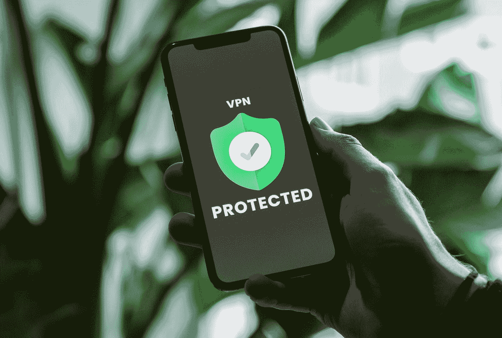
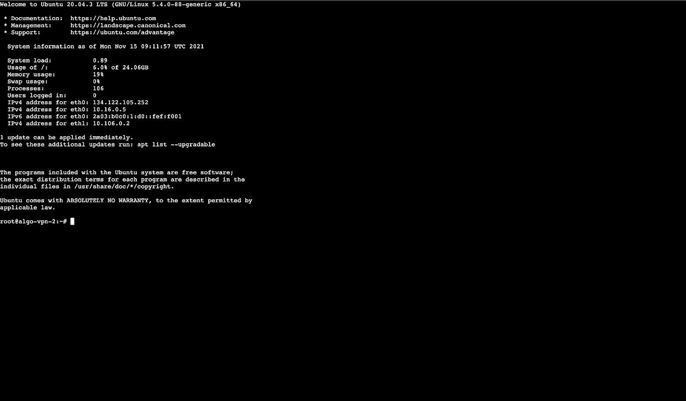
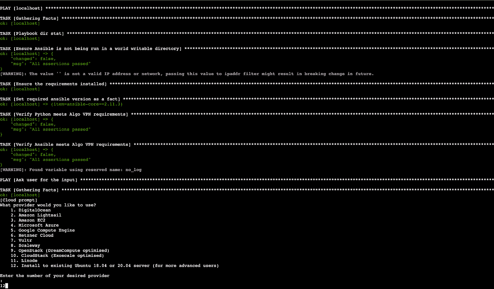
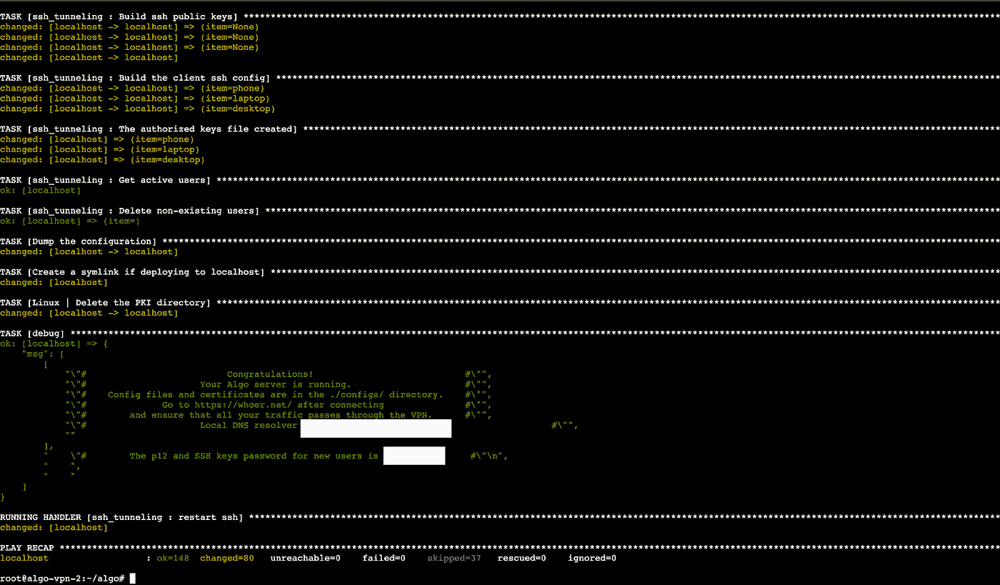
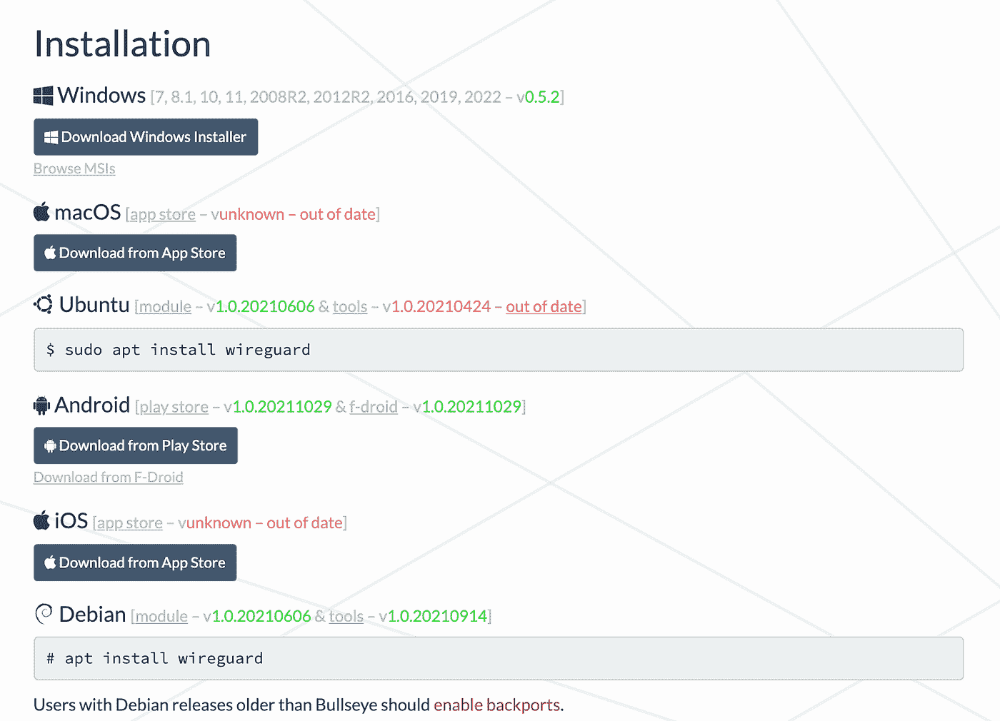
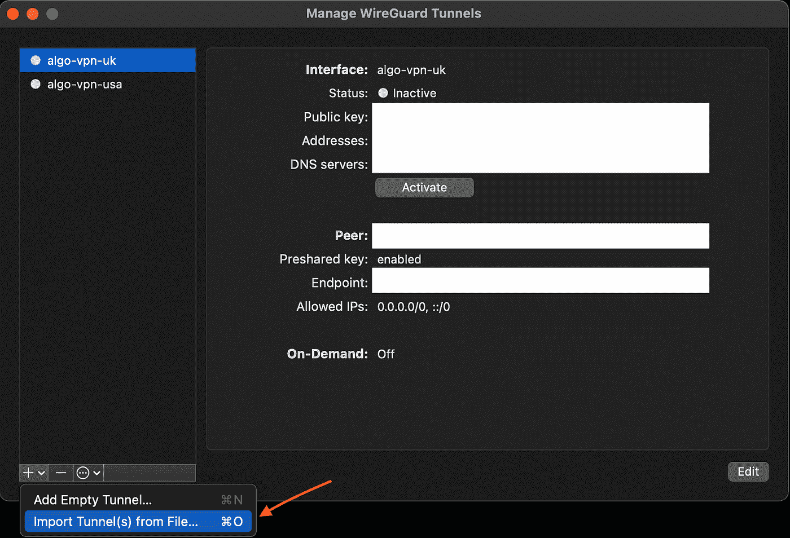
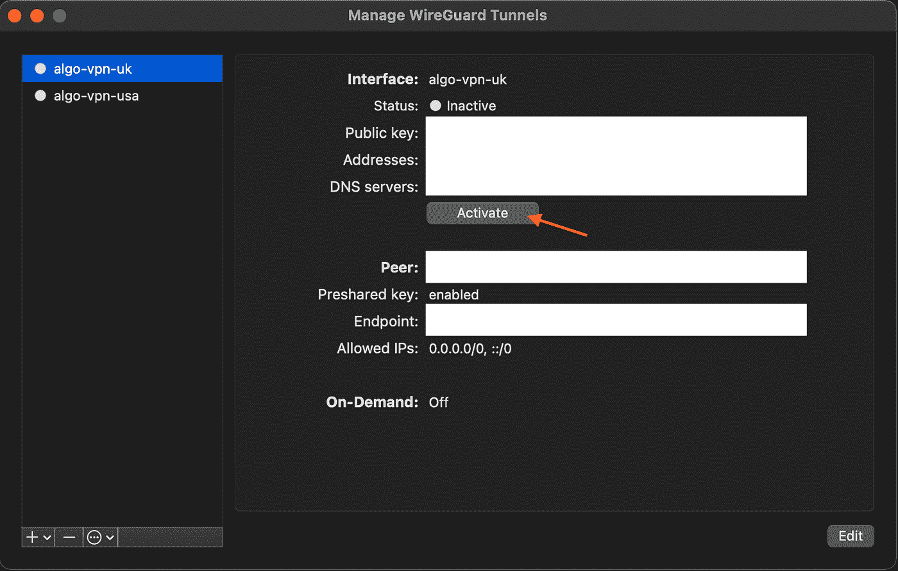
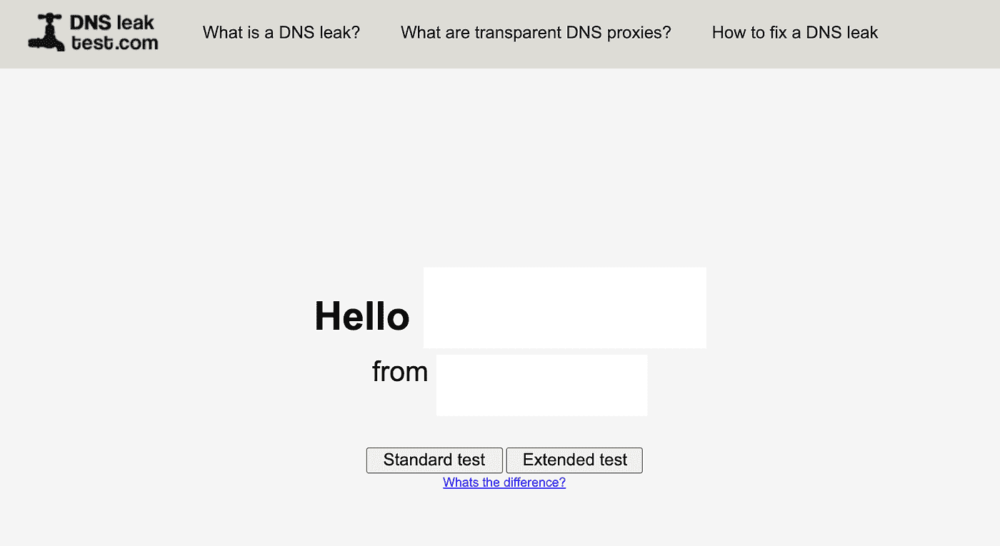

# 如何设置自己的安全 VPN 服务器？WireGuard 协议

> 原文：<https://infosecwriteups.com/how-to-setup-your-own-secure-vpn-server-ft-wireguard-protocol-9ddb18077bcc?source=collection_archive---------1----------------------->



在 [Unsplash](https://unsplash.com?utm_source=medium&utm_medium=referral) 上[privesics](https://unsplash.com/@privecstasy?utm_source=medium&utm_medium=referral)拍摄的照片

# 介绍

我们可以使用为自托管 VPN 服务设计的 [**Algo VPN**](https://trailofbits.github.io/algo/) 等开源软件包，用很少的编程知识建立自己的远程访问 VPN 服务器。目前从协议角度来看， [**WireGuard**](https://www.wireguard.com/) 确实是一个不错的选择。这是一种开源的 VPN 协议，因比类似技术更快、更容易配置、更安全而广受赞誉。最近除了 NordVPN 和 Mozilla VPNProtonVPN 也将其作为所有客户的默认协议。

Algo VPN 是一组**可行的**脚本，由**位尾**的人设计，用于简化个人 **IPSec** 和 **WireGuard VPN** 的设置。它易于部署，仅依赖于现代协议和密码，并提供合理的安全默认值。此外，它可以与常见的云提供商合作，并且不需要在大多数设备上安装客户端软件。


这是一个包含三个部分的完整教程，所以让我们尽快开始吧！

# **设置(服务器)**

设置您自己的安全 VPN 的步骤如下:

**第一步。**打开要部署 VPN 的 Ubuntu/Linux VPS 服务器的命令行控制台。对于本教程，我使用的是数字海洋上的一滴(5 美元/月)。



**第二步。更新和升级所有的软件包**

```
**>> sudo apt-get update -y && apt-get upgrade -y**
```

**第三步。**安装 python 和 ansible。

```
**>> sudo apt install -y — no-install-recommends python3-virtualenv**
```

**步骤四。**通过克隆 GitHub 库下载 Algo VPN

```
**>> git clone** [**https://github.com/trailofbits/algo**](https://github.com/trailofbits/algo)
```

**步骤五。**将目录更改为/algo 并安装。属国

```
**>> cd algo****>> python3 -m virtualenv — python=”$(command -v python3)” .env && source .env/bin/activate && python3 -m pip install -U pip virtualenv && python3 -m pip install -r requirements.txt**
```

**第六步。**编辑 config.cfg 文件，为将要使用 VPN 的用户设置用户名:

```
**>> nano config.cfg**
```

默认情况下，您的配置文件将有三个用户:

```
**users:
- phone
- laptop
- desktop**
```

您可以对此进行更改以匹配您的用户，或者添加具有相同格式的其他用户以满足您的偏好。请确保在这里添加尽可能多的用户，即使他们只是占位符，因为以后添加他们不太安全。

> **注意:** WireGuard 将监听 51820/UDP。如果您的网络阻止了这个端口，您可能需要更改到另一个端口。请注意，53/UDP (DNS)在某些移动数据网络上被阻止。)

此外，启用**无人值守重启**选项以获得额外的安全性。某些更新需要重新启动才能生效，但您的 Algo 服务器不会自动重新启动，除非您将“enabled”从“false”更改为“true ”,在这种情况下，如果需要，将在 Algo 服务器时区中指定的时间(如 HH: MM)重新启动。默认时区是 UTC。

您可以在配置文件中间的某个地方找到它。它应该是这样的:

```
**unattended_reboot:
enabled: true
time: 06:00**
```

保留所有其他配置的默认设置，或者根据使用情况进行修改。完成后，按 **Ctrl + O** 保存，按 **Ctrl + X** 退出。

现在，使用以下配置选项部署 Algo VPN:

**您希望使用哪家提供商？输入您想要的提供商的号码**

> 安装程序将提示您选择一个提供商，并提供各种流行的选项。我们将安装到现有的 Ubuntu 18.04 或 20.04 服务器上。

```
**>> 12**
```



**您想要 macOS/iOS 客户端在连接到蜂窝网络时启用“按需连接”吗？**

> “按需连接”功能允许系统在连接到蜂窝网络时自动启动或停止 VPN 连接。根据您的使用案例选择:

```
**>> y** (if yes) OR **N** (if no)
```

**您想要 macOS/iOS 客户端在连接到 Wi-Fi 时启用“按需连接”吗？**

> “按需连接”功能允许系统在连接到 Wi-Fi 时自动启动或停止 VPN 连接。根据您的使用案例选择:

```
**>> y** (if yes) OR **N** (if no)
```

**列出 macOS/iOS 客户端不应使用“按需连接”的任何受信任 Wi-Fi 网络的名称**

> 如果有的话，以逗号分隔值的形式输入名称，否则留空并按**键输入**

**是否要保留密钥(PKI)？**

> 此功能使您能够在设置完成后将用户添加到配置中。但是，这样做不太安全，所以最好只在初始配置过程中添加它们。

```
**>> y**
```

您要在此 VPN 服务器上启用 DNS 广告拦截吗？

> 此功能让您决定是否希望您的个人 VPN 阻止广告并增强您的隐私。您可以决定是在 VPN 级别拦截广告，还是在每台设备上单独配置广告拦截。虽然 DNS 广告拦截简化了这一过程，但如果你想在连接的情况下查看特定网站上的广告，也很难关闭。建议启用 DNS 广告拦截。

```
**>> y**
```

您希望每个用户都有自己的 SSH 隧道帐户吗？

```
**>> y** (if yes) OR **N** (if no)
```

**输入您的服务器的 IP 地址:**

> 输入 **localhost** ，因为我们正在 VPS 服务器上进行本地安装，然后按**键进入**

**输入您服务器的公共 IP 地址或域名:**

> 输入您的 VPS 服务器的 **IP 地址**，您可以在您的提供商的控制面板中找到，然后按 **Enter**

您现在可以等待 Algo VPN 安装完成。这可能需要一点时间，取决于您的规格和其他因素。一旦完成，它将为新用户显示一条**祝贺**消息以及 P12 和 SSH 密钥密码。一定要把钥匙抄下来，以便以后使用。



> **注意:**建议定期销毁该服务器，并从头创建一个新的。这不仅会更改服务器的 IP 地址，还会确保您运行的是最新版本的 VPN 软件及其依赖项。不幸的是，这样做之后，您需要重新导入 VPN 配置细节，以匹配新服务器的 IP 地址和证书。

# 设置(客户端)

现在，下一步是配置 VPN 客户端，即将要连接到您的服务器的设备。根据操作系统的不同，该过程略有不同，但通常涉及到在 macOS、Android、iOS 或 Windows 上下载客户端。

**第一步。**根据客户端的操作系统，到[https://www.wireguard.com/install/](https://www.wireguard.com/install/)下载 **WireGuard 客户端**。



**步骤二。**取回。conf 文件和 QR 码。png 文件通过 SFTP 使用以下命令集:

```
**>> sftp remote_username@server_ip_or_hostname****>> sftp > get filename.zip**
```

**第三步。**如果你在 Windows 或 macOS 上使用 WireGuard，只需将它指向**。通过**从文件导入隧道…** 按钮，将配置文件**保存在 wireguard 子目录中。如果您在 Android 或 iOS 上使用 WireGuard，只需扫描的**二维码**。会议文件。



**步骤四。**完成后，按**激活**打开 VPN。



# 确认

在依靠这种新的 VPN 来保护您与恶意基础设施的交互之前，请确保它隐藏了您的来源的必要方面。如果工作正常，远程主机应该看到您的 VPN 服务器的 IP 地址，而不是您的 VPN 客户端的 IP 地址。类似地，您的 DNS 流量应该通过 VPN 隧道，隐藏您的客户端本地配置的 DNS 服务器。应该执行以下测试来衡量 VPN 连接的安全性和隐私性:

**IP 地址测试**

到[https://whoer.net/](https://whoer.net/)比较激活 VPN 连接前后的 IP 地址信息。如果没有区别，并且即使在激活 VPN 后客户端 IP 仍然暴露，则测试失败。

**DNS 泄漏测试**

一旦连接上，你可以前往 https://dnsleaktest.com/的[并选择扩展测试来确保你的 DNS 没有泄漏。您应该看到您的 DNS 提供商为 CloudFlare，带有您使用 VPN 服务选择的服务器的 IP 地址和位置。如果客户端的原始 IP 地址和位置显示在 DNS 泄漏测试中，那么您有一个泄漏和测试失败。](https://dnsleaktest.com/)

如果您在 Windows 上有 DNS 泄漏，您可以通过在 CMD 中运行以下命令来修复它:

```
**>> netsh teredo set state disabled**
```



**WebRTC 测试**

现在，对于第三个和更一般的测试，访问[https://ipleak.net/](https://ipleak.net/)并检查 Web RTC 检测部分，以确保客户端的 IP 地址没有泄漏。

**网速测试**

(可选)访问[https://fast.com/](https://fast.com/)检查并比较激活 VPN 前后的网速。

# 结论

在浏览或连接互联网时使用 VPN 通常被认为是一种很好的安全做法。但是在这个“隐私虚无主义”的时代，我们能在多大程度上信任被大公司收购的最受欢迎的免费和付费 VPN 服务，这些大公司有可能轻易拦截我们的互联网流量？许多 VPN 服务可能已经修改了他们的登录策略，以适应他们的经济利益，因此，我们有必要建立自己的安全 VPN 服务器来保护我们在互联网上的隐私。你怎么想呢?您将继续使用您当前的 VPN 订阅还是切换到您自己自制的 Algo VPN？请在下面的评论区告诉我。

希望你喜欢这个教程，并学到一些新的东西，将赶上你在下一个！保重，拍手拍手拍手:)

> *支持我*[*https://www.buymeacoffee.com/djrobin17*](https://www.buymeacoffee.com/djrobin17)

# **参考文献**

[是时候停止为 VPN 付费了](https://www.nytimes.com/2021/10/06/technology/personaltech/are-vpns-worth-it.html)

[我如何在 15 分钟内做好自己的 VPN 服务器](https://techcrunch.com/2017/04/09/how-i-made-my-own-vpn-server-in-15-minutes/)

[如何在数字海洋云中部署自己的 Algo VPN 服务器](https://zeltser.com/deploy-algo-vpn-digital-ocean/)