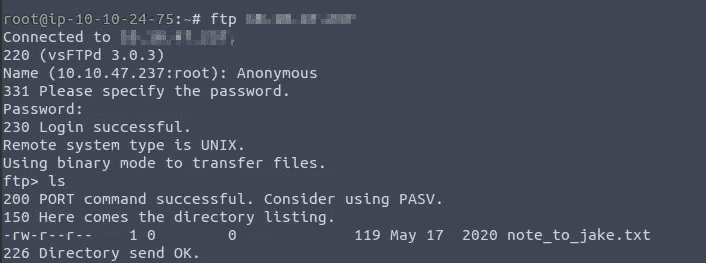
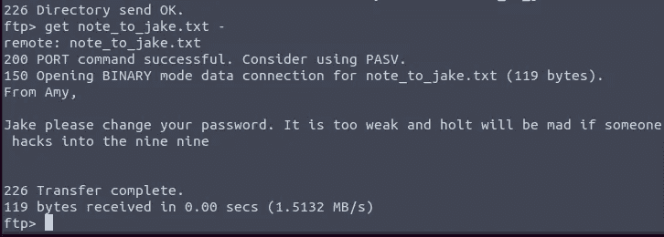
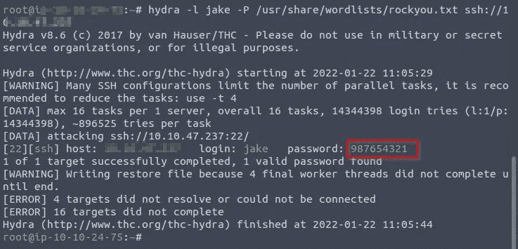
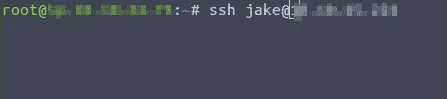
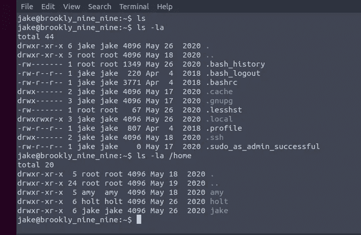
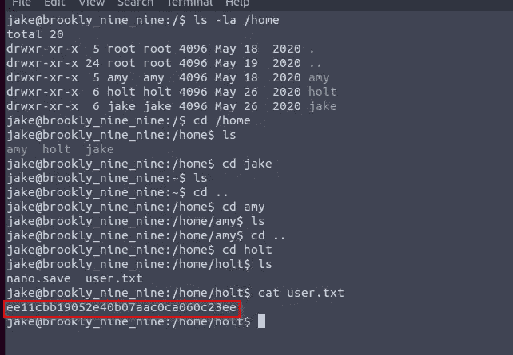
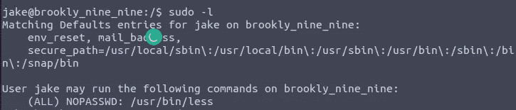
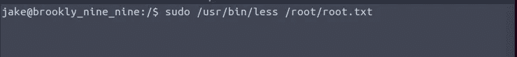
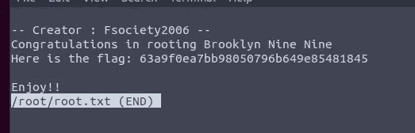

# 如何解决布鲁克林九九 TryHackme 演练

> 原文：<https://infosecwriteups.com/how-to-solve-brooklyn-nine-nine-tryhackme-walkthrough-b0a6e4e2e534?source=collection_archive---------1----------------------->

## CTF 之旅

欢迎回来神奇黑客我在 Tryhackme(布鲁克林九九)上想出了另一个好玩有趣的话题演练。

让我们进入主题，部署后，我像往常一样开始扫描目标，寻找任何有用的信息。

我扫描目标时发现 FTP 端口打开了。所以我尝试了 FTP 匿名登录。

我试着用 FTP 登录，成功了。

我查看了 FTP 接入的文本文件。

我用九头蛇蛮力破解了密码。我用 ssh 登录了它。

在我导航到 holt 目录后，我发现了一个用户标志。

接下来，我开始寻找根旗。

我键入 sudo -l 进行 root 登录访问。

终于懂了。

🔈 🔈Infosec Writeups 正在组织其首次虚拟会议和网络活动。如果你对信息安全感兴趣，这是最酷的地方，有 16 个令人难以置信的演讲者和 10 多个小时充满力量的讨论会议。 [**查看更多详情并在此注册。**](https://iwcon.live/)

 [## IWCon2022 - Infosec 书面报告虚拟会议

### 与世界上最优秀的信息安全专家建立联系。了解网络安全专家如何取得成功。将新技能添加到您的…

iwcon.live](https://iwcon.live/)