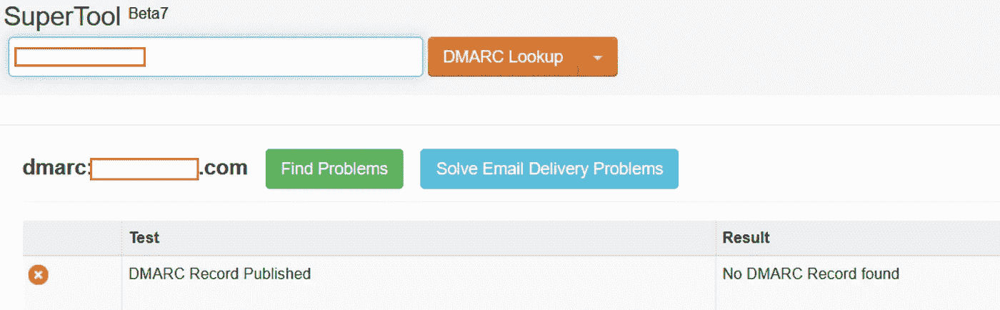
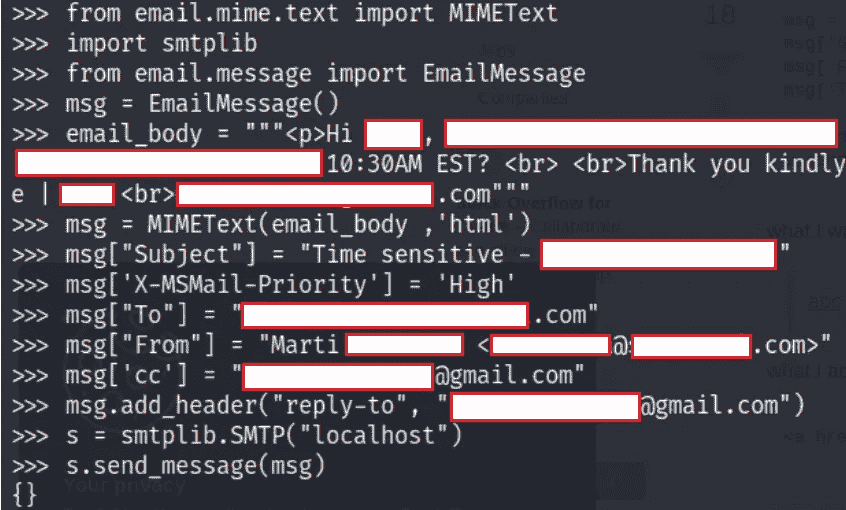
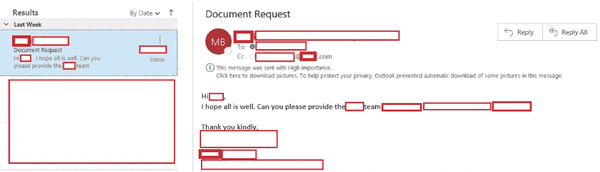

# 如何恶搞邮件？(DMARC、SPF 和网络钓鱼)

> 原文：<https://infosecwriteups.com/how-to-spoof-e-mails-dmarc-spf-and-phishing-5184c10679a0?source=collection_archive---------1----------------------->

***注意:对这些截图进行清理是为了保护相关利益方的身份。***

在我最近的学习中，我发现错过 DMARC 政策不是一件可以掉以轻心的事情。如果您的组织没有实现这一点，我强烈建议您这样做。DMARC(基于域的消息身份验证、报告和一致性)负责确保您组织的域不会被欺骗来伪造恶意消息。

更多关于 DMARC 的信息:【https://dmarc.org/ 

下面是一步一步的教程，教我如何向我的客户发送假冒的钓鱼邮件。**请注意**为了获得更高的成功几率，如果客户端配置了 [SPF](https://www.dmarcanalyzer.com/spf/) (发件人策略框架)软策略或无策略，则最好使用此网络钓鱼。否则，它可能只是去垃圾邮件。使用 [SPF 检查器](https://www.dmarcanalyzer.com/spf/checker/)确定该策略是否在目标域上配置。

1.  您必须查明域目标是否配置了 DMARC 策略。为了做到这一点，你可以简单地使用一个网站，如 [MXtoolbox](https://mxtoolbox.com/dmarc.aspx?gclid=CjwKCAiAxJSPBhAoEiwAeO_fP1e82z8tWZbGR9-94MOzqetFa5BgVwc8qhK0jzaOYF0Zk3fbfVRiuxoCGIQQAvD_BwE)

2.在您可以从 Kali 发送电子邮件之前，您必须安装 sendmail。您可以通过使用以下命令来完成此操作:***sudo apt-get install sendmail***

3.使用 **systemctl** 启动 sendmail 服务

4.精心制作你的电子邮件。这里，我使用的是 python3——所以在您的 Linux 终端上，键入“python 3”。下面是我的一封欺骗性网络钓鱼电子邮件的例子，它请求发送一份敏感文档。

我们来分析一下。

*   首先我们导入必要的**库**
*   接下来，我们将一个**消息**变量声明为“EmailMessage”。
*   **邮件正文**是邮件的内容
*   然后，我们设置 **MIMEText** ，以便呈现包含在电子邮件内容中的 HTML 标签
*   然后你设置邮件的主题
*   **优先级**是可选的，但这就是显示"！"表示紧急的手势
*   **Msg["To"]** =您的目标
*   **msg["From"]** =您想要欺骗或冒充的电子邮件
*   **抄送** ' =当目标点击“全部回复”时抄送的电子邮件
*   **回复** ' =目标点击“回复”时将回复的电子邮件(您可以在此使用自己的电子邮件)。如果你想让它看起来不那么明显，我建议不要用这个。如果您不使用这个，您的最佳选择是让目标“全部回复”——在这种情况下，受害者和您都将收到回复(因为 CC 参数)。如果受害者说“嘿，我从来没有发过这个”，这将会引起怀疑，但到了那个时候，你已经有了你所要求的临时帐户或文件。
*   将 SMTP 服务器设置为“localhost”(如果使用 sendmail，则为默认值)
*   发送消息

消息发送后，需要几分钟才能送达目标。就我而言，我在成功发布后收到了以下电子邮件。

如果你问我，我会说这是非常可怕的攻击向量。看不见 DMARC 和 SPF 政策会有多危险？

**影响**:攻击者可能会利用这一攻击媒介向您的客户或公司内的其他员工发送电子邮件。此行为可能会对组织的财务、声誉和运营产生负面影响。