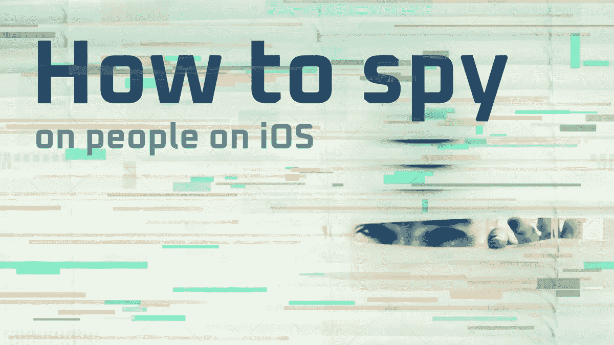
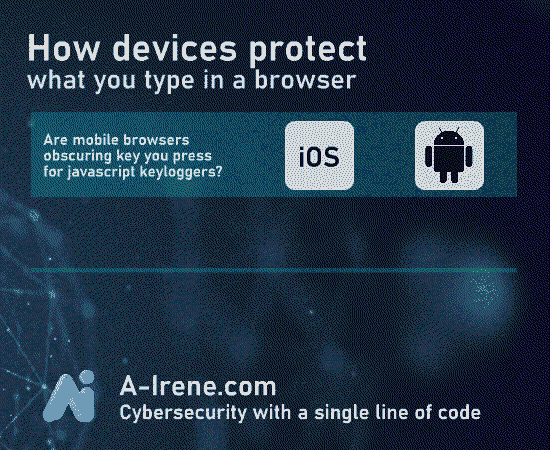
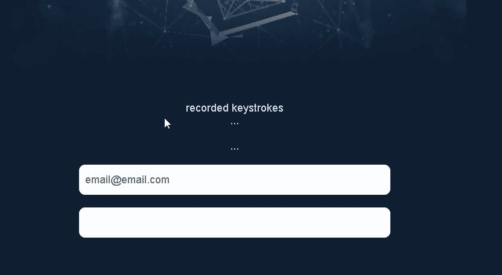
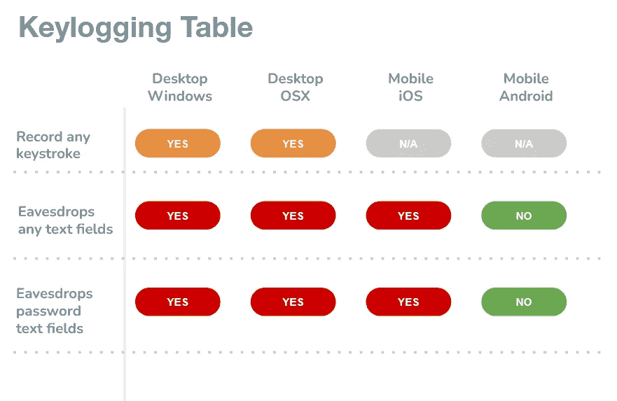

# 如何在 iOS 上窥探人

> 原文：<https://infosecwriteups.com/how-to-spy-on-people-on-ios-516651069844?source=collection_archive---------2----------------------->

## iOS 浏览器对待键盘记录程序的怪异行为。

如何在浏览器中使用键盘记录器来监视他人

# **TL；博士:**

**如何在 iOS(而非 Android)这样的操作系统中方便地运行键盘记录器**；在这篇文章中，我描述并测试了使窃听变得更加容易的“特性”。

# **免责声明**

这篇文章不是鼓励非法活动，而是警告普通观众当前互联网浏览器的严重缺陷，主要是在 iOS 和桌面设备上。我们还没有在最近的 Android 设备(浏览器)上发现这样的缺陷。

a-irene.com——初创企业将网络安全民主化

# **谁是“我们”？**

这篇文章是为我们的网络安全项目而写的——A-Irene.com**——用一行代码实现**安全和异常检测**——就像**易于设置为 Google Analytics 一样。****

**我们正在测试我们的遥测插件——允许我们的客户发现机器人、流量异常或骗子。**

**在这个过程中，我发现了许多代表浏览器的奇怪行为，这些行为不应该被允许，也没有任何解释。
让我解释一下。**

****

**键盘记录器可以看到你在任何地方按键，而他们不应该**

# **什么是键盘记录？**

**键盘记录是一种活动，其中脚本或设备**记录您按下**或敲击键盘的按键，目的是将其存储或发送到服务器上。**

**它有多种形式——从诊断到恶意代码，窃取你的密码和偷听你的谈话。**

**写这篇文章的原因是我们担心现代浏览器的安全状况。**

**虽然出于合理的原因收集击键不成问题，但保留使击键记录插件脚本更容易的特性是一种不好的做法。**

# ****我们的发现****

**我们已经测试了脚本对你的击键的访问是多么有限或者无限。简而言之——监视你是多么容易。**

**原来 **Android 通过模糊键码(我们不知道哪个键被按下了)来保护用户免受这种做法的影响，**。浏览器扩展、插件或恶意脚本无法访问键码，它返回“**未定义”**，这让我们非常高兴。只有事件被认可，没有在 Android 上的细节。**

****iOS 是一个不同的故事** —我们可以从任何地方窃听所有的关键操作，包括密码文本字段。就像打字一样简单:**

****document . addevent listener(" keydown "，spy)；****

**一行代码就足以窃听你。然后“间谍”功能就可以收集你的所有活动。我不得不说这很吓人。**

**你可以在桌面浏览器上体验到同样的行为。【Windows 和 MacOS 都没有通过我们的测试。**

****

**桌面和 iOS 免费提供所有关于击键的信息。照片:pexels.com**

# **谁能真正窃听你？**

****有几个类别**像网站本身——包括它使用的所有脚本——还有第三方插件(像谷歌分析、hotjar、facebook pixel、newrelic)和许多其他分析工具。**

**此外，目前所有活跃的**浏览器扩展**可以记录你输入的一切，包括密码。这真的很可怕，因为我们并不总是记录当前到底在运行什么，以及它的长期表现如何。**

****

**谁可以看到您的信息**

# **关于我**

**Marcin Rybicki，前游戏开发者，算法爱好者。
我正与我的联合创始人 Rafa 合作一个名为 A-Irene 的雄心勃勃的项目，这是一个无人监管、易于操作的基于机器学习的异常检测项目。**

**[**我的 LinkedIn**](https://www.linkedin.com/in/marcin-rybicki-qa/)**

## **来自 Infosec 的报道:Infosec 每天都有很多内容，很难跟上。[加入我们的每周简讯](https://weekly.infosecwriteups.com/)以 5 篇文章、4 个线程、3 个视频、2 个 GitHub Repos 和工具以及 1 个工作提醒的形式免费获取所有最新的 Infosec 趋势！**